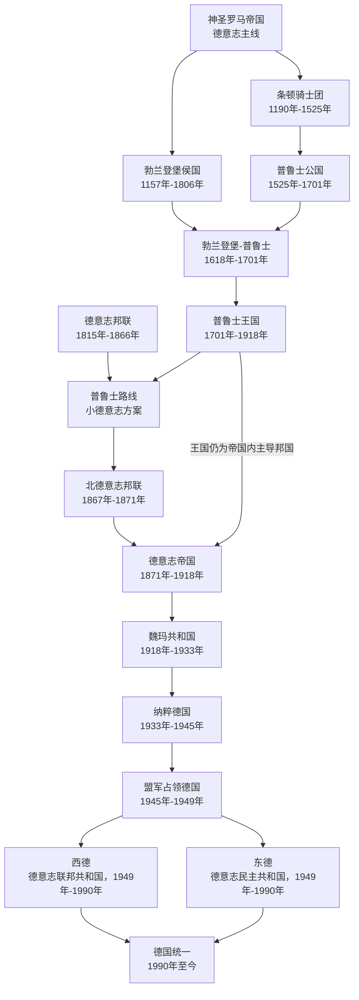

# 德国历史

这里放置普鲁士主导的德国国家史主线。德国分支有一条重要的普鲁士形成线：勃兰登堡侯国与条顿骑士团、普鲁士公国等东部领地逐渐汇合，形成勃兰登堡-普鲁士和普鲁士王国。普鲁士王国在德意志邦联中击败奥地利路线后，推动北德意志邦联和1871年的德意志帝国，随后进入现代德国国家史。

| 顺序 | 阶段 | 时间 | 简要概括 |
| --- | --- | --- | --- |
| 前史 | [神圣罗马帝国](/%E4%BA%BA%E6%96%87%E7%A7%91%E5%AD%A6/%E5%8E%86%E5%8F%B2-%E5%A4%96%E5%9B%BD/%E6%AC%A7%E6%B4%B2/%E5%BE%B7%E6%84%8F%E5%BF%97/%E7%A5%9E%E5%9C%A3%E7%BD%97%E9%A9%AC%E5%B8%9D%E5%9B%BD/README.md) | 962年-1806年 | 德意志诸侯体系和普鲁士形成线的共同背景。 |
| 前史 | [德意志邦联](/%E4%BA%BA%E6%96%87%E7%A7%91%E5%AD%A6/%E5%8E%86%E5%8F%B2-%E5%A4%96%E5%9B%BD/%E6%AC%A7%E6%B4%B2/%E5%BE%B7%E6%84%8F%E5%BF%97/%E5%BE%B7%E6%84%8F%E5%BF%97%E9%82%A6%E8%81%94.md) | 1815年-1866年 | 德国国家统一前的共同政治框架。 |
| 1 | [勃兰登堡侯国](/%E4%BA%BA%E6%96%87%E7%A7%91%E5%AD%A6/%E5%8E%86%E5%8F%B2-%E5%A4%96%E5%9B%BD/%E6%AC%A7%E6%B4%B2/%E5%BE%B7%E6%84%8F%E5%BF%97/%E5%BE%B7%E5%9B%BD/%E5%8B%83%E5%85%B0%E7%99%BB%E5%A0%A1%E4%BE%AF%E5%9B%BD.md) | 1157年-1806年 | 普鲁士国家形成线中的西部核心。 |
| 2 | [条顿骑士团](/%E4%BA%BA%E6%96%87%E7%A7%91%E5%AD%A6/%E5%8E%86%E5%8F%B2-%E5%A4%96%E5%9B%BD/%E6%AC%A7%E6%B4%B2/%E5%BE%B7%E6%84%8F%E5%BF%97/%E5%BE%B7%E5%9B%BD/%E6%9D%A1%E9%A1%BF%E9%AA%91%E5%A3%AB%E5%9B%A2.md) | 1190年-1525年 | 普鲁士地区早期政治军事力量之一。 |
| 3 | [普鲁士公国](/%E4%BA%BA%E6%96%87%E7%A7%91%E5%AD%A6/%E5%8E%86%E5%8F%B2-%E5%A4%96%E5%9B%BD/%E6%AC%A7%E6%B4%B2/%E5%BE%B7%E6%84%8F%E5%BF%97/%E5%BE%B7%E5%9B%BD/%E6%99%AE%E9%B2%81%E5%A3%AB%E5%85%AC%E5%9B%BD.md) | 1525年-1701年 | 条顿骑士团国家世俗化后的普鲁士政权。 |
| 4 | [勃兰登堡-普鲁士](/%E4%BA%BA%E6%96%87%E7%A7%91%E5%AD%A6/%E5%8E%86%E5%8F%B2-%E5%A4%96%E5%9B%BD/%E6%AC%A7%E6%B4%B2/%E5%BE%B7%E6%84%8F%E5%BF%97/%E5%BE%B7%E5%9B%BD/%E5%8B%83%E5%85%B0%E7%99%BB%E5%A0%A1-%E6%99%AE%E9%B2%81%E5%A3%AB.md) | 1618年-1701年 | 勃兰登堡与普鲁士公国的联合，是普鲁士王国的直接前身。 |
| 5 | [普鲁士王国](/%E4%BA%BA%E6%96%87%E7%A7%91%E5%AD%A6/%E5%8E%86%E5%8F%B2-%E5%A4%96%E5%9B%BD/%E6%AC%A7%E6%B4%B2/%E5%BE%B7%E6%84%8F%E5%BF%97/%E5%BE%B7%E5%9B%BD/%E6%99%AE%E9%B2%81%E5%A3%AB%E7%8E%8B%E5%9B%BD.md) | 1701年-1918年 | 德国统一进程中的主导国家。 |
| 6 | [北德意志邦联](/%E4%BA%BA%E6%96%87%E7%A7%91%E5%AD%A6/%E5%8E%86%E5%8F%B2-%E5%A4%96%E5%9B%BD/%E6%AC%A7%E6%B4%B2/%E5%BE%B7%E6%84%8F%E5%BF%97/%E5%BE%B7%E5%9B%BD/%E5%8C%97%E5%BE%B7%E6%84%8F%E5%BF%97%E9%82%A6%E8%81%94.md) | 1867年-1871年 | 普鲁士主导的北部德意志国家联盟，是德意志帝国的直接前身。 |
| 7 | [德意志帝国](/%E4%BA%BA%E6%96%87%E7%A7%91%E5%AD%A6/%E5%8E%86%E5%8F%B2-%E5%A4%96%E5%9B%BD/%E6%AC%A7%E6%B4%B2/%E5%BE%B7%E6%84%8F%E5%BF%97/%E5%BE%B7%E5%9B%BD/%E5%BE%B7%E6%84%8F%E5%BF%97%E5%B8%9D%E5%9B%BD.md) | 1871年-1918年 | 普鲁士主导完成统一后建立的联邦制帝国，包含25个成员邦和阿尔萨斯-洛林帝国直辖领。 |
| 8 | [魏玛共和国](/%E4%BA%BA%E6%96%87%E7%A7%91%E5%AD%A6/%E5%8E%86%E5%8F%B2-%E5%A4%96%E5%9B%BD/%E6%AC%A7%E6%B4%B2/%E5%BE%B7%E6%84%8F%E5%BF%97/%E5%BE%B7%E5%9B%BD/%E9%AD%8F%E7%8E%9B%E5%85%B1%E5%92%8C%E5%9B%BD.md) | 1918年-1933年 | 德国战后建立的共和国。 |
| 9 | [纳粹德国](/%E4%BA%BA%E6%96%87%E7%A7%91%E5%AD%A6/%E5%8E%86%E5%8F%B2-%E5%A4%96%E5%9B%BD/%E6%AC%A7%E6%B4%B2/%E5%BE%B7%E6%84%8F%E5%BF%97/%E5%BE%B7%E5%9B%BD/%E7%BA%B3%E7%B2%B9%E5%BE%B7%E5%9B%BD.md) | 1933年-1945年 | 纳粹党统治时期，最终以第二次世界大战失败告终。 |
| 10 | [盟军占领德国](/%E4%BA%BA%E6%96%87%E7%A7%91%E5%AD%A6/%E5%8E%86%E5%8F%B2-%E5%A4%96%E5%9B%BD/%E6%AC%A7%E6%B4%B2/%E5%BE%B7%E6%84%8F%E5%BF%97/%E5%BE%B7%E5%9B%BD/%E7%9B%9F%E5%86%9B%E5%8D%A0%E9%A2%86%E5%BE%B7%E5%9B%BD.md) | 1945年-1949年 | 战后德国被盟军分区占领。 |
| 11 | [东德西德](/%E4%BA%BA%E6%96%87%E7%A7%91%E5%AD%A6/%E5%8E%86%E5%8F%B2-%E5%A4%96%E5%9B%BD/%E6%AC%A7%E6%B4%B2/%E5%BE%B7%E6%84%8F%E5%BF%97/%E5%BE%B7%E5%9B%BD/%E4%B8%9C%E5%BE%B7%E8%A5%BF%E5%BE%B7.md) | 1949年-1990年 | 冷战中的西德和东德两个德国并存。 |
| 12 | [德国统一](/%E4%BA%BA%E6%96%87%E7%A7%91%E5%AD%A6/%E5%8E%86%E5%8F%B2-%E5%A4%96%E5%9B%BD/%E6%AC%A7%E6%B4%B2/%E5%BE%B7%E6%84%8F%E5%BF%97/%E5%BE%B7%E5%9B%BD/%E5%BE%B7%E5%9B%BD%E7%BB%9F%E4%B8%80.md) | 1990年至今 | 1990年两德统一，形成今天的德国。 |
