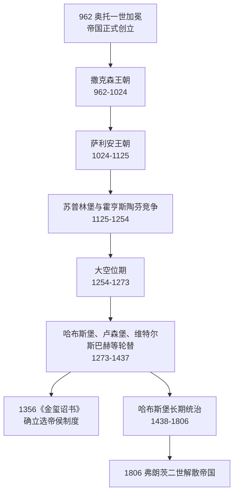

# 神圣罗马帝国

神圣罗马帝国是中世纪到近代早期中欧以德意志地区为核心的复合型帝国，通常以962年奥托一世被教皇加冕为皇帝作为正式开端，以1806年弗朗茨二世解散帝国为终点。它名义上延续罗马帝国与基督教皇帝传统，但实际政治结构长期依赖德意志诸侯、教会领地、自由城市和皇帝家族之间的权力平衡。

## 核心脉络

| 主题 | 概括 |
| --- | --- |
| 时间 | 962-1806。 |
| 地域核心 | 德意志地区，并长期牵涉意大利、波希米亚、奥地利等地区。 |
| 政治性质 | 皇帝、诸侯、教会领地和城市共同构成的松散复合体，不是近代意义上的中央集权国家。 |
| 皇帝来源 | 前期经历撒克森、萨利安、霍亨斯陶芬、卢森堡等家族；1438年后长期由哈布斯堡掌握。 |
| 选举机制 | 皇帝/德意志国王由选帝侯选出，1356年查理四世《金玺诏书》确立七大选帝侯制度。 |
| 终结 | 1806年，弗朗茨二世解散神圣罗马帝国，并以奥地利皇帝身份延续哈布斯堡统治。 |

## 目录导航

- [德意志国王与皇帝对照表](/%E4%BA%BA%E6%96%87%E7%A7%91%E5%AD%A6/%E5%8E%86%E5%8F%B2-%E5%A4%96%E5%9B%BD/%E6%AC%A7%E6%B4%B2/%E5%BE%B7%E6%84%8F%E5%BF%97/%E7%A5%9E%E5%9C%A3%E7%BD%97%E9%A9%AC%E5%B8%9D%E5%9B%BD/%E5%BE%B7%E6%84%8F%E5%BF%97%E5%9B%BD%E7%8E%8B%E4%B8%8E%E7%9A%87%E5%B8%9D%E5%AF%B9%E7%85%A7%E8%A1%A8.md)：按年代整理962-1806年的德意志国王、皇帝加冕情况、家族与备注。
- [选帝侯](/%E4%BA%BA%E6%96%87%E7%A7%91%E5%AD%A6/%E5%8E%86%E5%8F%B2-%E5%A4%96%E5%9B%BD/%E6%AC%A7%E6%B4%B2/%E5%BE%B7%E6%84%8F%E5%BF%97/%E7%A5%9E%E5%9C%A3%E7%BD%97%E9%A9%AC%E5%B8%9D%E5%9B%BD/%E9%80%89%E5%B8%9D%E4%BE%AF.md)：说明神圣罗马帝国中负责选举国王/皇帝的七大选侯及其宗教、世俗构成。
- [神圣罗马帝国的邦国](/%E4%BA%BA%E6%96%87%E7%A7%91%E5%AD%A6/%E5%8E%86%E5%8F%B2-%E5%A4%96%E5%9B%BD/%E6%AC%A7%E6%B4%B2/%E5%BE%B7%E6%84%8F%E5%BF%97/%E7%A5%9E%E5%9C%A3%E7%BD%97%E9%A9%AC%E5%B8%9D%E5%9B%BD/%E7%A5%9E%E5%9C%A3%E7%BD%97%E9%A9%AC%E5%B8%9D%E5%9B%BD%E7%9A%84%E9%82%A6%E5%9B%BD.md)：整理帝国内亲王国、伯国、公国、采邑主教区、帝国自由市等复合邦国体系。

## 时间线概览

## 阅读建议

1. 先读本页，抓住神圣罗马帝国的性质：它是中欧复合型政治秩序，而不是单一民族国家。
2. 再读[德意志国王与皇帝对照表](/%E4%BA%BA%E6%96%87%E7%A7%91%E5%AD%A6/%E5%8E%86%E5%8F%B2-%E5%A4%96%E5%9B%BD/%E6%AC%A7%E6%B4%B2/%E5%BE%B7%E6%84%8F%E5%BF%97/%E7%A5%9E%E5%9C%A3%E7%BD%97%E9%A9%AC%E5%B8%9D%E5%9B%BD/%E5%BE%B7%E6%84%8F%E5%BF%97%E5%9B%BD%E7%8E%8B%E4%B8%8E%E7%9A%87%E5%B8%9D%E5%AF%B9%E7%85%A7%E8%A1%A8.md)，按王朝和家族变化看帝位传承。
3. 最后读[选帝侯](/%E4%BA%BA%E6%96%87%E7%A7%91%E5%AD%A6/%E5%8E%86%E5%8F%B2-%E5%A4%96%E5%9B%BD/%E6%AC%A7%E6%B4%B2/%E5%BE%B7%E6%84%8F%E5%BF%97/%E7%A5%9E%E5%9C%A3%E7%BD%97%E9%A9%AC%E5%B8%9D%E5%9B%BD/%E9%80%89%E5%B8%9D%E4%BE%AF.md)，理解皇帝为什么需要被选出，以及诸侯权力如何限制帝国中央化。
