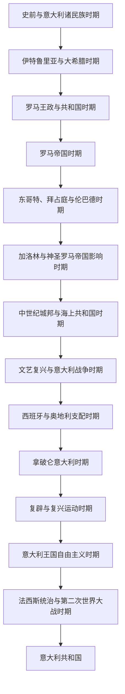

# 意大利历史

## 历史主线

意大利历史的主线可以概括为：意大利半岛先后经历史前族群、伊特鲁里亚和希腊殖民城邦，再由罗马统一半岛并扩张为地中海帝国；西罗马灭亡后，半岛长期在日耳曼王国、拜占庭、教皇国、神圣罗马帝国、城邦和外国王朝之间分裂；中世纪城邦和文艺复兴塑造了欧洲文化高峰，但政治上长期受法国、西班牙、奥地利等大国干预；19世纪复兴运动完成民族统一，1861年形成意大利王国，二战后转为共和国。

## 名称辨析：意大利、罗马、现代意大利

| 名称 | 大致使用阶段 | 含义 | 与意大利史的关系 |
|---|---|---|---|
| 意大利 / Italia | 古罗马时期已用于半岛概念；含义随时代扩大 | 最初可指半岛部分区域，罗马扩张后逐渐指整个意大利半岛 | 在古代更多是地理和行政区域概念，不等同于现代民族国家。 |
| 罗马 | 前753年传统建城后至西罗马灭亡，后来也作为罗马法、教会和帝国传统延续 | 既是城市，也是共和国、帝国和文明传统的中心 | 罗马统一意大利，但罗马帝国远超意大利本土；不能把“罗马帝国”简单等同于“意大利国家”。 |
| 意大利王国 / 意大利共和国 | 1861年以后 | 现代意义上的统一意大利国家 | 1861年王国成立是现代意大利国家的起点；1946年公投后改为共和国。 |

简化记忆：古代“意大利”先是半岛地理概念，罗马是统一半岛并扩张为帝国的政治中心；西罗马灭亡后半岛长期分裂，直到1861年才形成现代统一意大利国家。

## 通史引用说明

意大利目录保留半岛视角和现代意大利国家形成主线；但若主题本身属于更大的欧洲通史，应优先阅读对应通史页：

| 意大利阶段 | 更适合展开的通史主题 | 本目录保留重点 |
|---|---|---|
| 伊特鲁里亚与大希腊时期 | [古希腊](/%E4%BA%BA%E6%96%87%E7%A7%91%E5%AD%A6/%E5%8E%86%E5%8F%B2-%E5%A4%96%E5%9B%BD/%E6%AC%A7%E6%B4%B2/_%E9%80%9A%E5%8F%B2/%E5%8F%A4%E5%B8%8C%E8%85%8A/README.md)、[古罗马](/%E4%BA%BA%E6%96%87%E7%A7%91%E5%AD%A6/%E5%8E%86%E5%8F%B2-%E5%A4%96%E5%9B%BD/%E6%AC%A7%E6%B4%B2/_%E9%80%9A%E5%8F%B2/%E5%8F%A4%E7%BD%97%E9%A9%AC/README.md) | 伊特鲁里亚、大希腊和本土部族如何影响罗马兴起。 |
| 罗马王政与共和国时期 | [古罗马](/%E4%BA%BA%E6%96%87%E7%A7%91%E5%AD%A6/%E5%8E%86%E5%8F%B2-%E5%A4%96%E5%9B%BD/%E6%AC%A7%E6%B4%B2/_%E9%80%9A%E5%8F%B2/%E5%8F%A4%E7%BD%97%E9%A9%AC/README.md) | 罗马统一意大利半岛，并把半岛纳入罗马政治共同体。 |
| 罗马帝国时期 | [罗马帝国](/%E4%BA%BA%E6%96%87%E7%A7%91%E5%AD%A6/%E5%8E%86%E5%8F%B2-%E5%A4%96%E5%9B%BD/%E6%AC%A7%E6%B4%B2/_%E9%80%9A%E5%8F%B2/%E5%8F%A4%E7%BD%97%E9%A9%AC/%E7%BD%97%E9%A9%AC%E5%B8%9D%E5%9B%BD.md) | 意大利从帝国核心到西罗马晚期政治中心之一的变化。 |
| 东哥特、拜占庭与伦巴德时期 | [后罗马时代的日耳曼诸国](/%E4%BA%BA%E6%96%87%E7%A7%91%E5%AD%A6/%E5%8E%86%E5%8F%B2-%E5%A4%96%E5%9B%BD/%E6%AC%A7%E6%B4%B2/_%E9%80%9A%E5%8F%B2/%E5%90%8E%E7%BD%97%E9%A9%AC%E6%97%B6%E4%BB%A3%E7%9A%84%E6%97%A5%E8%80%B3%E6%9B%BC%E8%AF%B8%E5%9B%BD/README.md)、[东罗马帝国与拜占庭帝国](/%E4%BA%BA%E6%96%87%E7%A7%91%E5%AD%A6/%E5%8E%86%E5%8F%B2-%E5%A4%96%E5%9B%BD/%E6%AC%A7%E6%B4%B2/_%E9%80%9A%E5%8F%B2/%E5%8F%A4%E7%BD%97%E9%A9%AC/%E4%B8%9C%E7%BD%97%E9%A9%AC%E5%B8%9D%E5%9B%BD%E4%B8%8E%E6%8B%9C%E5%8D%A0%E5%BA%AD%E5%B8%9D%E5%9B%BD.md) | 西罗马灭亡后半岛分裂格局如何形成。 |
| 加洛林与神圣罗马帝国影响时期 | [法兰克王国](/%E4%BA%BA%E6%96%87%E7%A7%91%E5%AD%A6/%E5%8E%86%E5%8F%B2-%E5%A4%96%E5%9B%BD/%E6%AC%A7%E6%B4%B2/_%E9%80%9A%E5%8F%B2/%E5%90%8E%E7%BD%97%E9%A9%AC%E6%97%B6%E4%BB%A3%E7%9A%84%E6%97%A5%E8%80%B3%E6%9B%BC%E8%AF%B8%E5%9B%BD/%E6%B3%95%E5%85%B0%E5%85%8B%E7%8E%8B%E5%9B%BD/README.md)、[神圣罗马帝国](/%E4%BA%BA%E6%96%87%E7%A7%91%E5%AD%A6/%E5%8E%86%E5%8F%B2-%E5%A4%96%E5%9B%BD/%E6%AC%A7%E6%B4%B2/%E5%BE%B7%E6%84%8F%E5%BF%97/%E7%A5%9E%E5%9C%A3%E7%BD%97%E9%A9%AC%E5%B8%9D%E5%9B%BD/README.md) | 北中意大利、教皇国和帝国权力如何交织。 |

## 按时间排序的时期导航

| 顺序 | 名称 | 时间 | 简要概括 |
|---|---|---|---|
| 1 | [史前与意大利诸民族时期](/%E4%BA%BA%E6%96%87%E7%A7%91%E5%AD%A6/%E5%8E%86%E5%8F%B2-%E5%A4%96%E5%9B%BD/%E6%AC%A7%E6%B4%B2/%E6%84%8F%E5%A4%A7%E5%88%A9/%E5%8F%B2%E5%89%8D%E4%B8%8E%E6%84%8F%E5%A4%A7%E5%88%A9%E8%AF%B8%E6%B0%91%E6%97%8F%E6%97%B6%E6%9C%9F.md) | 约前85万年-前8世纪 | 从旧石器时代人类活动、农业扩散到印欧语族意大利诸民族形成，构成罗马兴起前的半岛族群背景。 |
| 2 | [伊特鲁里亚与大希腊时期](/%E4%BA%BA%E6%96%87%E7%A7%91%E5%AD%A6/%E5%8E%86%E5%8F%B2-%E5%A4%96%E5%9B%BD/%E6%AC%A7%E6%B4%B2/%E6%84%8F%E5%A4%A7%E5%88%A9/%E4%BC%8A%E7%89%B9%E9%B2%81%E9%87%8C%E4%BA%9A%E4%B8%8E%E5%A4%A7%E5%B8%8C%E8%85%8A%E6%97%B6%E6%9C%9F.md) | 约前8世纪-前3世纪 | 伊特鲁里亚、大希腊和本土部族并存；细节参照古希腊、古罗马通史，本目录强调其对罗马兴起的半岛背景。 |
| 3 | [罗马王政与共和国时期](/%E4%BA%BA%E6%96%87%E7%A7%91%E5%AD%A6/%E5%8E%86%E5%8F%B2-%E5%A4%96%E5%9B%BD/%E6%AC%A7%E6%B4%B2/%E6%84%8F%E5%A4%A7%E5%88%A9/%E7%BD%97%E9%A9%AC%E7%8E%8B%E6%94%BF%E4%B8%8E%E5%85%B1%E5%92%8C%E5%9B%BD%E6%97%B6%E6%9C%9F.md) | 前753年-前27年 | 罗马共和国细节归入古罗马通史，本目录强调罗马如何统一意大利半岛并整合盟邦。 |
| 4 | [罗马帝国时期](/%E4%BA%BA%E6%96%87%E7%A7%91%E5%AD%A6/%E5%8E%86%E5%8F%B2-%E5%A4%96%E5%9B%BD/%E6%AC%A7%E6%B4%B2/%E6%84%8F%E5%A4%A7%E5%88%A9/%E7%BD%97%E9%A9%AC%E5%B8%9D%E5%9B%BD%E6%97%B6%E6%9C%9F.md) | 前27年-476年 | 罗马帝国细节归入古罗马通史，本目录强调意大利从帝国核心到西罗马终结的地位变化。 |
| 5 | [东哥特、拜占庭与伦巴德时期](/%E4%BA%BA%E6%96%87%E7%A7%91%E5%AD%A6/%E5%8E%86%E5%8F%B2-%E5%A4%96%E5%9B%BD/%E6%AC%A7%E6%B4%B2/%E6%84%8F%E5%A4%A7%E5%88%A9/%E4%B8%9C%E5%93%A5%E7%89%B9%E3%80%81%E6%8B%9C%E5%8D%A0%E5%BA%AD%E4%B8%8E%E4%BC%A6%E5%B7%B4%E5%BE%B7%E6%97%B6%E6%9C%9F.md) | 476年-774年 | 东哥特、拜占庭和伦巴德细节归入后罗马日耳曼诸国与拜占庭通史，本目录强调意大利半岛分裂加深。 |
| 6 | [加洛林与神圣罗马帝国影响时期](/%E4%BA%BA%E6%96%87%E7%A7%91%E5%AD%A6/%E5%8E%86%E5%8F%B2-%E5%A4%96%E5%9B%BD/%E6%AC%A7%E6%B4%B2/%E6%84%8F%E5%A4%A7%E5%88%A9/%E5%8A%A0%E6%B4%9B%E6%9E%97%E4%B8%8E%E7%A5%9E%E5%9C%A3%E7%BD%97%E9%A9%AC%E5%B8%9D%E5%9B%BD%E5%BD%B1%E5%93%8D%E6%97%B6%E6%9C%9F.md) | 774年-11世纪 | 法兰克和神圣罗马帝国细节归入通史，本目录强调北中意大利、教皇国和地方诸侯的并立。 |
| 7 | [中世纪城邦与海上共和国时期](/%E4%BA%BA%E6%96%87%E7%A7%91%E5%AD%A6/%E5%8E%86%E5%8F%B2-%E5%A4%96%E5%9B%BD/%E6%AC%A7%E6%B4%B2/%E6%84%8F%E5%A4%A7%E5%88%A9/%E4%B8%AD%E4%B8%96%E7%BA%AA%E5%9F%8E%E9%82%A6%E4%B8%8E%E6%B5%B7%E4%B8%8A%E5%85%B1%E5%92%8C%E5%9B%BD%E6%97%B6%E6%9C%9F.md) | 11世纪-15世纪 | 威尼斯、热那亚、佛罗伦萨、米兰等城邦兴起，商业金融、自治政治和海上贸易塑造中世纪意大利。 |
| 8 | [文艺复兴与意大利战争时期](/%E4%BA%BA%E6%96%87%E7%A7%91%E5%AD%A6/%E5%8E%86%E5%8F%B2-%E5%A4%96%E5%9B%BD/%E6%AC%A7%E6%B4%B2/%E6%84%8F%E5%A4%A7%E5%88%A9/%E6%96%87%E8%89%BA%E5%A4%8D%E5%85%B4%E4%B8%8E%E6%84%8F%E5%A4%A7%E5%88%A9%E6%88%98%E4%BA%89%E6%97%B6%E6%9C%9F.md) | 14世纪-1559年 | 文艺复兴在意大利城邦中兴起，但法国、西班牙和神圣罗马帝国的意大利战争削弱半岛独立格局。 |
| 9 | [西班牙与奥地利支配时期](/%E4%BA%BA%E6%96%87%E7%A7%91%E5%AD%A6/%E5%8E%86%E5%8F%B2-%E5%A4%96%E5%9B%BD/%E6%AC%A7%E6%B4%B2/%E6%84%8F%E5%A4%A7%E5%88%A9/%E8%A5%BF%E7%8F%AD%E7%89%99%E4%B8%8E%E5%A5%A5%E5%9C%B0%E5%88%A9%E6%94%AF%E9%85%8D%E6%97%B6%E6%9C%9F.md) | 1559年-1796年 | 卡托-康布雷西和约后，西班牙哈布斯堡支配意大利大部；18世纪奥地利哈布斯堡影响增强。 |
| 10 | [拿破仑意大利时期](/%E4%BA%BA%E6%96%87%E7%A7%91%E5%AD%A6/%E5%8E%86%E5%8F%B2-%E5%A4%96%E5%9B%BD/%E6%AC%A7%E6%B4%B2/%E6%84%8F%E5%A4%A7%E5%88%A9/%E6%8B%BF%E7%A0%B4%E4%BB%91%E6%84%8F%E5%A4%A7%E5%88%A9%E6%97%B6%E6%9C%9F.md) | 1796年-1815年 | 法国革命军和拿破仑重组意大利半岛，建立姊妹共和国、意大利王国和行政改革，刺激民族意识。 |
| 11 | [复辟与复兴运动时期](/%E4%BA%BA%E6%96%87%E7%A7%91%E5%AD%A6/%E5%8E%86%E5%8F%B2-%E5%A4%96%E5%9B%BD/%E6%AC%A7%E6%B4%B2/%E6%84%8F%E5%A4%A7%E5%88%A9/%E5%A4%8D%E8%BE%9F%E4%B8%8E%E5%A4%8D%E5%85%B4%E8%BF%90%E5%8A%A8%E6%97%B6%E6%9C%9F.md) | 1815年-1861年 | 维也纳体系恢复旧政权，但秘密社团、民族主义和撒丁王国扩张推动意大利统一。 |
| 12 | [意大利王国自由主义时期](/%E4%BA%BA%E6%96%87%E7%A7%91%E5%AD%A6/%E5%8E%86%E5%8F%B2-%E5%A4%96%E5%9B%BD/%E6%AC%A7%E6%B4%B2/%E6%84%8F%E5%A4%A7%E5%88%A9/%E6%84%8F%E5%A4%A7%E5%88%A9%E7%8E%8B%E5%9B%BD%E8%87%AA%E7%94%B1%E4%B8%BB%E4%B9%89%E6%97%B6%E6%9C%9F.md) | 1861年-1922年 | 意大利王国完成统一并建立宪政君主制，经历南北差异、工业化、殖民扩张和一战。 |
| 13 | [法西斯统治与第二次世界大战时期](/%E4%BA%BA%E6%96%87%E7%A7%91%E5%AD%A6/%E5%8E%86%E5%8F%B2-%E5%A4%96%E5%9B%BD/%E6%AC%A7%E6%B4%B2/%E6%84%8F%E5%A4%A7%E5%88%A9/%E6%B3%95%E8%A5%BF%E6%96%AF%E7%BB%9F%E6%B2%BB%E4%B8%8E%E7%AC%AC%E4%BA%8C%E6%AC%A1%E4%B8%96%E7%95%8C%E5%A4%A7%E6%88%98%E6%97%B6%E6%9C%9F.md) | 1922年-1945年 | 墨索里尼建立法西斯独裁，发动侵略战争并与纳粹德国结盟，战败后王国合法性崩溃。 |
| 14 | [意大利共和国](/%E4%BA%BA%E6%96%87%E7%A7%91%E5%AD%A6/%E5%8E%86%E5%8F%B2-%E5%A4%96%E5%9B%BD/%E6%AC%A7%E6%B4%B2/%E6%84%8F%E5%A4%A7%E5%88%A9/%E6%84%8F%E5%A4%A7%E5%88%A9%E5%85%B1%E5%92%8C%E5%9B%BD.md) | 1946年至今 | 1946年公投废除君主制，意大利共和国在战后重建、欧洲一体化、政党转型和区域差异中发展。 |

## 重要转折与时间节点

| 时间 | 事件 | 所处时期 | 意义 |
|---|---|---|---|
| 前753年传统纪年 | 罗马建城 | [罗马王政与共和国时期](/%E4%BA%BA%E6%96%87%E7%A7%91%E5%AD%A6/%E5%8E%86%E5%8F%B2-%E5%A4%96%E5%9B%BD/%E6%AC%A7%E6%B4%B2/%E6%84%8F%E5%A4%A7%E5%88%A9/%E7%BD%97%E9%A9%AC%E7%8E%8B%E6%94%BF%E4%B8%8E%E5%85%B1%E5%92%8C%E5%9B%BD%E6%97%B6%E6%9C%9F.md) | 罗马从拉丁城邦起步，后来成为统一意大利和地中海世界的核心。 |
| 前509年 | 罗马共和国建立 | [罗马王政与共和国时期](/%E4%BA%BA%E6%96%87%E7%A7%91%E5%AD%A6/%E5%8E%86%E5%8F%B2-%E5%A4%96%E5%9B%BD/%E6%AC%A7%E6%B4%B2/%E6%84%8F%E5%A4%A7%E5%88%A9/%E7%BD%97%E9%A9%AC%E7%8E%8B%E6%94%BF%E4%B8%8E%E5%85%B1%E5%92%8C%E5%9B%BD%E6%97%B6%E6%9C%9F.md) | 贵族共和国和公民军事体制推动罗马扩张。 |
| 前27年 | 奥古斯都建立元首制 | [罗马帝国时期](/%E4%BA%BA%E6%96%87%E7%A7%91%E5%AD%A6/%E5%8E%86%E5%8F%B2-%E5%A4%96%E5%9B%BD/%E6%AC%A7%E6%B4%B2/%E6%84%8F%E5%A4%A7%E5%88%A9/%E7%BD%97%E9%A9%AC%E5%B8%9D%E5%9B%BD%E6%97%B6%E6%9C%9F.md) | 罗马从共和国转向帝国，意大利成为帝国核心地区。 |
| 476年 | 西罗马帝国终结 | [东哥特、拜占庭与伦巴德时期](/%E4%BA%BA%E6%96%87%E7%A7%91%E5%AD%A6/%E5%8E%86%E5%8F%B2-%E5%A4%96%E5%9B%BD/%E6%AC%A7%E6%B4%B2/%E6%84%8F%E5%A4%A7%E5%88%A9/%E4%B8%9C%E5%93%A5%E7%89%B9%E3%80%81%E6%8B%9C%E5%8D%A0%E5%BA%AD%E4%B8%8E%E4%BC%A6%E5%B7%B4%E5%BE%B7%E6%97%B6%E6%9C%9F.md) | 意大利进入后罗马和早期中世纪分裂格局。 |
| 774年 | 查理曼征服伦巴德 | [加洛林与神圣罗马帝国影响时期](/%E4%BA%BA%E6%96%87%E7%A7%91%E5%AD%A6/%E5%8E%86%E5%8F%B2-%E5%A4%96%E5%9B%BD/%E6%AC%A7%E6%B4%B2/%E6%84%8F%E5%A4%A7%E5%88%A9/%E5%8A%A0%E6%B4%9B%E6%9E%97%E4%B8%8E%E7%A5%9E%E5%9C%A3%E7%BD%97%E9%A9%AC%E5%B8%9D%E5%9B%BD%E5%BD%B1%E5%93%8D%E6%97%B6%E6%9C%9F.md) | 北中意大利进入加洛林和帝国秩序，教皇国地位上升。 |
| 11-15世纪 | 城邦和海上共和国兴起 | [中世纪城邦与海上共和国时期](/%E4%BA%BA%E6%96%87%E7%A7%91%E5%AD%A6/%E5%8E%86%E5%8F%B2-%E5%A4%96%E5%9B%BD/%E6%AC%A7%E6%B4%B2/%E6%84%8F%E5%A4%A7%E5%88%A9/%E4%B8%AD%E4%B8%96%E7%BA%AA%E5%9F%8E%E9%82%A6%E4%B8%8E%E6%B5%B7%E4%B8%8A%E5%85%B1%E5%92%8C%E5%9B%BD%E6%97%B6%E6%9C%9F.md) | 商业金融、自治政治和海上贸易推动意大利城市繁荣。 |
| 14-16世纪 | 意大利文艺复兴 | [文艺复兴与意大利战争时期](/%E4%BA%BA%E6%96%87%E7%A7%91%E5%AD%A6/%E5%8E%86%E5%8F%B2-%E5%A4%96%E5%9B%BD/%E6%AC%A7%E6%B4%B2/%E6%84%8F%E5%A4%A7%E5%88%A9/%E6%96%87%E8%89%BA%E5%A4%8D%E5%85%B4%E4%B8%8E%E6%84%8F%E5%A4%A7%E5%88%A9%E6%88%98%E4%BA%89%E6%97%B6%E6%9C%9F.md) | 意大利成为欧洲人文主义、艺术和科学复兴中心。 |
| 1559年 | 意大利战争结束 | [西班牙与奥地利支配时期](/%E4%BA%BA%E6%96%87%E7%A7%91%E5%AD%A6/%E5%8E%86%E5%8F%B2-%E5%A4%96%E5%9B%BD/%E6%AC%A7%E6%B4%B2/%E6%84%8F%E5%A4%A7%E5%88%A9/%E8%A5%BF%E7%8F%AD%E7%89%99%E4%B8%8E%E5%A5%A5%E5%9C%B0%E5%88%A9%E6%94%AF%E9%85%8D%E6%97%B6%E6%9C%9F.md) | 半岛独立均势破裂，西班牙和后来的奥地利影响增强。 |
| 1796年 | 拿破仑入侵意大利 | [拿破仑意大利时期](/%E4%BA%BA%E6%96%87%E7%A7%91%E5%AD%A6/%E5%8E%86%E5%8F%B2-%E5%A4%96%E5%9B%BD/%E6%AC%A7%E6%B4%B2/%E6%84%8F%E5%A4%A7%E5%88%A9/%E6%8B%BF%E7%A0%B4%E4%BB%91%E6%84%8F%E5%A4%A7%E5%88%A9%E6%97%B6%E6%9C%9F.md) | 法国革命制度冲击旧秩序，并刺激意大利民族意识。 |
| 1861年 | 意大利王国成立 | [意大利王国自由主义时期](/%E4%BA%BA%E6%96%87%E7%A7%91%E5%AD%A6/%E5%8E%86%E5%8F%B2-%E5%A4%96%E5%9B%BD/%E6%AC%A7%E6%B4%B2/%E6%84%8F%E5%A4%A7%E5%88%A9/%E6%84%8F%E5%A4%A7%E5%88%A9%E7%8E%8B%E5%9B%BD%E8%87%AA%E7%94%B1%E4%B8%BB%E4%B9%89%E6%97%B6%E6%9C%9F.md) | 现代统一意大利国家形成。 |
| 1922年 | 墨索里尼上台 | [法西斯统治与第二次世界大战时期](/%E4%BA%BA%E6%96%87%E7%A7%91%E5%AD%A6/%E5%8E%86%E5%8F%B2-%E5%A4%96%E5%9B%BD/%E6%AC%A7%E6%B4%B2/%E6%84%8F%E5%A4%A7%E5%88%A9/%E6%B3%95%E8%A5%BF%E6%96%AF%E7%BB%9F%E6%B2%BB%E4%B8%8E%E7%AC%AC%E4%BA%8C%E6%AC%A1%E4%B8%96%E7%95%8C%E5%A4%A7%E6%88%98%E6%97%B6%E6%9C%9F.md) | 自由主义王国转向法西斯独裁。 |
| 1946年 | 共和国公投 | [意大利共和国](/%E4%BA%BA%E6%96%87%E7%A7%91%E5%AD%A6/%E5%8E%86%E5%8F%B2-%E5%A4%96%E5%9B%BD/%E6%AC%A7%E6%B4%B2/%E6%84%8F%E5%A4%A7%E5%88%A9/%E6%84%8F%E5%A4%A7%E5%88%A9%E5%85%B1%E5%92%8C%E5%9B%BD.md) | 废除君主制，战后共和国建立。 |
