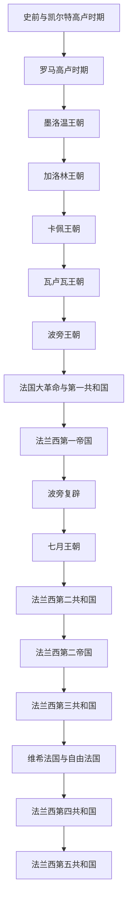

# 法国历史

## 历史主线

法国历史的主线可以概括为：高卢部落社会被罗马帝国整合，西罗马瓦解后由法兰克王国承接；西法兰克逐渐演化为中世纪法兰西王国；卡佩、瓦卢瓦、波旁三大王朝持续强化王权和领土整合；1789年大革命后，法国在共和国、帝国和君主立宪之间多次摆动，最终形成以第五共和国为核心的现代法国。

## 名称辨析：法兰克、西法兰克、法兰西

| 名称 | 大致使用阶段 | 含义 | 与法国史的关系 |
|---|---|---|---|
| 法兰克 | 3世纪以后作为日耳曼部族名称出现；486年-843年通常用于墨洛温、加洛林法兰克王国 | 最初是莱茵河下游一带的日耳曼部族联盟，后来成为统治高卢、日耳曼和意大利部分地区的法兰克王国 / 法兰克帝国 | 这一阶段还不是“法国”民族国家，而是横跨今日法国、德国、低地国家和意大利北部的法兰克政治共同体。 |
| 西法兰克 | 843年《凡尔登条约》后至10-12世纪逐渐过渡 | 查理曼帝国分裂后的西部王国，拉丁文常称 West Francia / Francia occidentalis | 西法兰克覆盖今日法国核心地区，是法兰西王国的直接前身；987年卡佩王朝仍可理解为“西法兰克王国中的王权更替”。 |
| 法兰西 | 987年卡佩王朝后逐渐成型；12-13世纪以后“法兰西王国”称呼更稳定 | 从西法兰克演变出的中世纪法国王国，王室核心在法兰西岛，后来逐步整合法国各地 | 不是某一年突然改名，而是政治中心、王室称号和领土认同长期转化；到腓力二世时期，王权扩张和“法兰西国王 / 法兰西王国”用法更加明确。 |

简化记忆：486年以后是法兰克王国主线；843年帝国三分后，法国方向称西法兰克；987年卡佩王朝开启后逐渐从“西法兰克”过渡为“法兰西王国”。

## 按时间排序的时期导航

| 顺序 | 名称 | 时间 | 简要概括 |
|---|---|---|---|
| 1 | [史前与凯尔特高卢时期](/%E4%BA%BA%E6%96%87%E7%A7%91%E5%AD%A6/%E5%8E%86%E5%8F%B2-%E5%A4%96%E5%9B%BD/%E6%AC%A7%E6%B4%B2/%E6%B3%95%E5%9B%BD/%E5%8F%B2%E5%89%8D%E4%B8%8E%E5%87%AF%E5%B0%94%E7%89%B9%E9%AB%98%E5%8D%A2%E6%97%B6%E6%9C%9F.md) | 约前180万年-前52年 | 从旧石器时代遗存、农业扩散到凯尔特高卢部落社会，形成罗马征服前法国地域的族群与地域基础。 |
| 2 | [罗马高卢时期](/%E4%BA%BA%E6%96%87%E7%A7%91%E5%AD%A6/%E5%8E%86%E5%8F%B2-%E5%A4%96%E5%9B%BD/%E6%AC%A7%E6%B4%B2/%E6%B3%95%E5%9B%BD/%E7%BD%97%E9%A9%AC%E9%AB%98%E5%8D%A2%E6%97%B6%E6%9C%9F.md) | 前52年-486年 | 凯撒征服高卢后，罗马在高卢建立行省、城市、道路和拉丁文化，后期受基督教传播与日耳曼迁徙冲击。 |
| 3 | [墨洛温王朝](/%E4%BA%BA%E6%96%87%E7%A7%91%E5%AD%A6/%E5%8E%86%E5%8F%B2-%E5%A4%96%E5%9B%BD/%E6%AC%A7%E6%B4%B2/%E6%B3%95%E5%9B%BD/%E5%A2%A8%E6%B4%9B%E6%B8%A9%E7%8E%8B%E6%9C%9D.md) | 486年-751年 | 克洛维建立法兰克王国并皈依天主教，王国反复分割，宫相权力上升，最终被加洛林家族取代。 |
| 4 | [加洛林王朝](/%E4%BA%BA%E6%96%87%E7%A7%91%E5%AD%A6/%E5%8E%86%E5%8F%B2-%E5%A4%96%E5%9B%BD/%E6%AC%A7%E6%B4%B2/%E6%B3%95%E5%9B%BD/%E5%8A%A0%E6%B4%9B%E6%9E%97%E7%8E%8B%E6%9C%9D.md) | 751年-987年 | 丕平篡立后，查理曼建立西欧帝国；843年《凡尔登条约》分出西法兰克，成为法国王国的重要前身。 |
| 5 | [卡佩王朝](/%E4%BA%BA%E6%96%87%E7%A7%91%E5%AD%A6/%E5%8E%86%E5%8F%B2-%E5%A4%96%E5%9B%BD/%E6%AC%A7%E6%B4%B2/%E6%B3%95%E5%9B%BD/%E5%8D%A1%E4%BD%A9%E7%8E%8B%E6%9C%9D.md) | 987年-1328年 | 雨果·卡佩建立卡佩王朝，王室从法兰西岛逐步扩张，王权、行政、司法和巴黎中心地位不断强化。 |
| 6 | [瓦卢瓦王朝](/%E4%BA%BA%E6%96%87%E7%A7%91%E5%AD%A6/%E5%8E%86%E5%8F%B2-%E5%A4%96%E5%9B%BD/%E6%AC%A7%E6%B4%B2/%E6%B3%95%E5%9B%BD/%E7%93%A6%E5%8D%A2%E7%93%A6%E7%8E%8B%E6%9C%9D.md) | 1328年-1589年 | 瓦卢瓦支系继承王位，经历百年战争、法国统一加强、意大利战争和宗教战争，最终由波旁王朝继承。 |
| 7 | [波旁王朝](/%E4%BA%BA%E6%96%87%E7%A7%91%E5%AD%A6/%E5%8E%86%E5%8F%B2-%E5%A4%96%E5%9B%BD/%E6%AC%A7%E6%B4%B2/%E6%B3%95%E5%9B%BD/%E6%B3%A2%E6%97%81%E7%8E%8B%E6%9C%9D.md) | 1589年-1792年 | 亨利四世开创波旁统治，法国形成绝对君主制和欧洲强国地位，路易十六时期财政危机引发大革命。 |
| 8 | [法国大革命与第一共和国](/%E4%BA%BA%E6%96%87%E7%A7%91%E5%AD%A6/%E5%8E%86%E5%8F%B2-%E5%A4%96%E5%9B%BD/%E6%AC%A7%E6%B4%B2/%E6%B3%95%E5%9B%BD/%E6%B3%95%E5%9B%BD%E5%A4%A7%E9%9D%A9%E5%91%BD%E4%B8%8E%E7%AC%AC%E4%B8%80%E5%85%B1%E5%92%8C%E5%9B%BD.md) | 1789年-1804年 | 三级会议、攻占巴士底狱、废除封建特权和王政，经历国民公会、督政府、执政府，最终拿破仑称帝。 |
| 9 | [法兰西第一帝国](/%E4%BA%BA%E6%96%87%E7%A7%91%E5%AD%A6/%E5%8E%86%E5%8F%B2-%E5%A4%96%E5%9B%BD/%E6%AC%A7%E6%B4%B2/%E6%B3%95%E5%9B%BD/%E6%B3%95%E5%85%B0%E8%A5%BF%E7%AC%AC%E4%B8%80%E5%B8%9D%E5%9B%BD.md) | 1804年-1814年；1815年 | 拿破仑建立帝国，以《拿破仑法典》和大陆战争重塑欧洲秩序，滑铁卢后终结。 |
| 10 | [波旁复辟](/%E4%BA%BA%E6%96%87%E7%A7%91%E5%AD%A6/%E5%8E%86%E5%8F%B2-%E5%A4%96%E5%9B%BD/%E6%AC%A7%E6%B4%B2/%E6%B3%95%E5%9B%BD/%E6%B3%A2%E6%97%81%E5%A4%8D%E8%BE%9F.md) | 1814年-1830年 | 路易十八与查理十世复辟君主制，在革命遗产与旧制度复兴之间摇摆，七月革命后被推翻。 |
| 11 | [七月王朝](/%E4%BA%BA%E6%96%87%E7%A7%91%E5%AD%A6/%E5%8E%86%E5%8F%B2-%E5%A4%96%E5%9B%BD/%E6%AC%A7%E6%B4%B2/%E6%B3%95%E5%9B%BD/%E4%B8%83%E6%9C%88%E7%8E%8B%E6%9C%9D.md) | 1830年-1848年 | 奥尔良支系路易-菲利普建立自由派君主制，依赖资产阶级政治联盟，1848年革命中倒台。 |
| 12 | [法兰西第二共和国](/%E4%BA%BA%E6%96%87%E7%A7%91%E5%AD%A6/%E5%8E%86%E5%8F%B2-%E5%A4%96%E5%9B%BD/%E6%AC%A7%E6%B4%B2/%E6%B3%95%E5%9B%BD/%E6%B3%95%E5%85%B0%E8%A5%BF%E7%AC%AC%E4%BA%8C%E5%85%B1%E5%92%8C%E5%9B%BD.md) | 1848年-1852年 | 二月革命后成立共和国，实行男性普选；路易-拿破仑当选总统后发动政变并称帝。 |
| 13 | [法兰西第二帝国](/%E4%BA%BA%E6%96%87%E7%A7%91%E5%AD%A6/%E5%8E%86%E5%8F%B2-%E5%A4%96%E5%9B%BD/%E6%AC%A7%E6%B4%B2/%E6%B3%95%E5%9B%BD/%E6%B3%95%E5%85%B0%E8%A5%BF%E7%AC%AC%E4%BA%8C%E5%B8%9D%E5%9B%BD.md) | 1852年-1870年 | 拿破仑三世实行威权现代化并推动巴黎改造和工业化，普法战争失败导致帝国崩溃。 |
| 14 | [法兰西第三共和国](/%E4%BA%BA%E6%96%87%E7%A7%91%E5%AD%A6/%E5%8E%86%E5%8F%B2-%E5%A4%96%E5%9B%BD/%E6%AC%A7%E6%B4%B2/%E6%B3%95%E5%9B%BD/%E6%B3%95%E5%85%B0%E8%A5%BF%E7%AC%AC%E4%B8%89%E5%85%B1%E5%92%8C%E5%9B%BD.md) | 1870年-1940年 | 普法战争后建立共和国，经历巴黎公社、共和制度稳定、殖民扩张、两次世界大战，1940年被德国击败。 |
| 15 | [维希法国与自由法国](/%E4%BA%BA%E6%96%87%E7%A7%91%E5%AD%A6/%E5%8E%86%E5%8F%B2-%E5%A4%96%E5%9B%BD/%E6%AC%A7%E6%B4%B2/%E6%B3%95%E5%9B%BD/%E7%BB%B4%E5%B8%8C%E6%B3%95%E5%9B%BD%E4%B8%8E%E8%87%AA%E7%94%B1%E6%B3%95%E5%9B%BD.md) | 1940年-1944年 | 法国战败后分裂为维希政权、德占区和戴高乐领导的自由法国，抵抗运动与盟军解放重建国家合法性。 |
| 16 | [法兰西第四共和国](/%E4%BA%BA%E6%96%87%E7%A7%91%E5%AD%A6/%E5%8E%86%E5%8F%B2-%E5%A4%96%E5%9B%BD/%E6%AC%A7%E6%B4%B2/%E6%B3%95%E5%9B%BD/%E6%B3%95%E5%85%B0%E8%A5%BF%E7%AC%AC%E5%9B%9B%E5%85%B1%E5%92%8C%E5%9B%BD.md) | 1946年-1958年 | 战后重建和福利国家扩展，但议会制政府不稳、殖民战争尤其阿尔及利亚危机导致体制崩溃。 |
| 17 | [法兰西第五共和国](/%E4%BA%BA%E6%96%87%E7%A7%91%E5%AD%A6/%E5%8E%86%E5%8F%B2-%E5%A4%96%E5%9B%BD/%E6%AC%A7%E6%B4%B2/%E6%B3%95%E5%9B%BD/%E6%B3%95%E5%85%B0%E8%A5%BF%E7%AC%AC%E4%BA%94%E5%85%B1%E5%92%8C%E5%9B%BD.md) | 1958年至今 | 戴高乐建立半总统制共和国，总统权力增强，法国完成去殖民化并在欧洲一体化中保持大国角色。 |

## 重要转折与时间节点

| 时间 | 事件 | 所处时期 | 意义 |
|---|---|---|---|
| 前52年 | 阿莱西亚战役后罗马征服高卢 | [罗马高卢时期](/%E4%BA%BA%E6%96%87%E7%A7%91%E5%AD%A6/%E5%8E%86%E5%8F%B2-%E5%A4%96%E5%9B%BD/%E6%AC%A7%E6%B4%B2/%E6%B3%95%E5%9B%BD/%E7%BD%97%E9%A9%AC%E9%AB%98%E5%8D%A2%E6%97%B6%E6%9C%9F.md) | 高卢纳入罗马世界，拉丁文化、城市和道路体系影响深远。 |
| 486年 | 克洛维击败苏瓦松罗马残余政权 | [墨洛温王朝](/%E4%BA%BA%E6%96%87%E7%A7%91%E5%AD%A6/%E5%8E%86%E5%8F%B2-%E5%A4%96%E5%9B%BD/%E6%AC%A7%E6%B4%B2/%E6%B3%95%E5%9B%BD/%E5%A2%A8%E6%B4%9B%E6%B8%A9%E7%8E%8B%E6%9C%9D.md) | 法兰克王国取得北高卢核心地位。 |
| 800年 | 查理曼加冕皇帝 | [加洛林王朝](/%E4%BA%BA%E6%96%87%E7%A7%91%E5%AD%A6/%E5%8E%86%E5%8F%B2-%E5%A4%96%E5%9B%BD/%E6%AC%A7%E6%B4%B2/%E6%B3%95%E5%9B%BD/%E5%8A%A0%E6%B4%9B%E6%9E%97%E7%8E%8B%E6%9C%9D.md) | 法兰克王国达到帝国高度，奠定中世纪西欧秩序想象。 |
| 843年 | 《凡尔登条约》 | [加洛林王朝](/%E4%BA%BA%E6%96%87%E7%A7%91%E5%AD%A6/%E5%8E%86%E5%8F%B2-%E5%A4%96%E5%9B%BD/%E6%AC%A7%E6%B4%B2/%E6%B3%95%E5%9B%BD/%E5%8A%A0%E6%B4%9B%E6%9E%97%E7%8E%8B%E6%9C%9D.md) | 西法兰克成为法国国家形成的重要前身。 |
| 987年 | 雨果·卡佩即位 | [卡佩王朝](/%E4%BA%BA%E6%96%87%E7%A7%91%E5%AD%A6/%E5%8E%86%E5%8F%B2-%E5%A4%96%E5%9B%BD/%E6%AC%A7%E6%B4%B2/%E6%B3%95%E5%9B%BD/%E5%8D%A1%E4%BD%A9%E7%8E%8B%E6%9C%9D.md) | 卡佩王朝开端，法国王权主线形成。 |
| 1337-1453年 | 百年战争 | [瓦卢瓦王朝](/%E4%BA%BA%E6%96%87%E7%A7%91%E5%AD%A6/%E5%8E%86%E5%8F%B2-%E5%A4%96%E5%9B%BD/%E6%AC%A7%E6%B4%B2/%E6%B3%95%E5%9B%BD/%E7%93%A6%E5%8D%A2%E7%93%A6%E7%8E%8B%E6%9C%9D.md) | 推动法国王权、财政军事和民族意识发展。 |
| 1589年 | 亨利四世继位 | [波旁王朝](/%E4%BA%BA%E6%96%87%E7%A7%91%E5%AD%A6/%E5%8E%86%E5%8F%B2-%E5%A4%96%E5%9B%BD/%E6%AC%A7%E6%B4%B2/%E6%B3%95%E5%9B%BD/%E6%B3%A2%E6%97%81%E7%8E%8B%E6%9C%9D.md) | 波旁王朝开始，宗教战争走向终结。 |
| 1789年 | 法国大革命爆发 | [法国大革命与第一共和国](/%E4%BA%BA%E6%96%87%E7%A7%91%E5%AD%A6/%E5%8E%86%E5%8F%B2-%E5%A4%96%E5%9B%BD/%E6%AC%A7%E6%B4%B2/%E6%B3%95%E5%9B%BD/%E6%B3%95%E5%9B%BD%E5%A4%A7%E9%9D%A9%E5%91%BD%E4%B8%8E%E7%AC%AC%E4%B8%80%E5%85%B1%E5%92%8C%E5%9B%BD.md) | 旧制度崩溃，现代公民、宪法和革命政治兴起。 |
| 1804年 | 拿破仑称帝 | [法兰西第一帝国](/%E4%BA%BA%E6%96%87%E7%A7%91%E5%AD%A6/%E5%8E%86%E5%8F%B2-%E5%A4%96%E5%9B%BD/%E6%AC%A7%E6%B4%B2/%E6%B3%95%E5%9B%BD/%E6%B3%95%E5%85%B0%E8%A5%BF%E7%AC%AC%E4%B8%80%E5%B8%9D%E5%9B%BD.md) | 革命成果与帝国扩张结合，法国制度影响欧洲。 |
| 1870年 | 第三共和国建立 | [法兰西第三共和国](/%E4%BA%BA%E6%96%87%E7%A7%91%E5%AD%A6/%E5%8E%86%E5%8F%B2-%E5%A4%96%E5%9B%BD/%E6%AC%A7%E6%B4%B2/%E6%B3%95%E5%9B%BD/%E6%B3%95%E5%85%B0%E8%A5%BF%E7%AC%AC%E4%B8%89%E5%85%B1%E5%92%8C%E5%9B%BD.md) | 法国最终长期转向共和制度。 |
| 1940年 | 法国战败与维希政权建立 | [维希法国与自由法国](/%E4%BA%BA%E6%96%87%E7%A7%91%E5%AD%A6/%E5%8E%86%E5%8F%B2-%E5%A4%96%E5%9B%BD/%E6%AC%A7%E6%B4%B2/%E6%B3%95%E5%9B%BD/%E7%BB%B4%E5%B8%8C%E6%B3%95%E5%9B%BD%E4%B8%8E%E8%87%AA%E7%94%B1%E6%B3%95%E5%9B%BD.md) | 法国国家合法性分裂，抵抗运动与战后重建成为新基础。 |
| 1958年 | 第五共和国建立 | [法兰西第五共和国](/%E4%BA%BA%E6%96%87%E7%A7%91%E5%AD%A6/%E5%8E%86%E5%8F%B2-%E5%A4%96%E5%9B%BD/%E6%AC%A7%E6%B4%B2/%E6%B3%95%E5%9B%BD/%E6%B3%95%E5%85%B0%E8%A5%BF%E7%AC%AC%E4%BA%94%E5%85%B1%E5%92%8C%E5%9B%BD.md) | 半总统制确立，现代法国政治制度成型。 |
