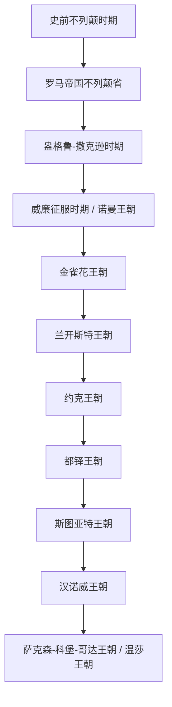

# 英国历史

| 顺序 | 名称 | 时间 | 简要概括 |
|---|---|---|---|
| 1 | [史前不列颠时期](%E4%BA%BA%E6%96%87%E7%A7%91%E5%AD%A6/%E5%8E%86%E5%8F%B2-%E5%A4%96%E5%9B%BD/%E8%8B%B1%E5%9B%BD/%E5%8F%B2%E5%89%8D%E4%B8%8D%E5%88%97%E9%A2%A0%E6%97%B6%E6%9C%9F.md) | 约前8000年-公元43年 | 从中石器、新石器、青铜器、铁器时代到凯尔特语族部落社会。 |
| 2 | [罗马帝国不列颠省](%E4%BA%BA%E6%96%87%E7%A7%91%E5%AD%A6/%E5%8E%86%E5%8F%B2-%E5%A4%96%E5%9B%BD/%E8%8B%B1%E5%9B%BD/%E7%BD%97%E9%A9%AC%E5%B8%9D%E5%9B%BD%E4%B8%8D%E5%88%97%E9%A2%A0%E7%9C%81.md) | 43年-410年前后 | 罗马征服不列颠南部，建立行省并推动罗马化。 |
| 3 | [盎格鲁-撒克逊时期](%E4%BA%BA%E6%96%87%E7%A7%91%E5%AD%A6/%E5%8E%86%E5%8F%B2-%E5%A4%96%E5%9B%BD/%E8%8B%B1%E5%9B%BD/%E7%9B%8E%E6%A0%BC%E9%B2%81-%E6%92%92%E5%85%8B%E9%80%8A%E6%97%B6%E6%9C%9F.md) | 5世纪-1066年 | 日耳曼诸王国形成、七国并立，威塞克斯推动英格兰统一，并经历丹麦统治。 |
| 4 | [威廉征服时期](%E4%BA%BA%E6%96%87%E7%A7%91%E5%AD%A6/%E5%8E%86%E5%8F%B2-%E5%A4%96%E5%9B%BD/%E8%8B%B1%E5%9B%BD/%E5%A8%81%E5%BB%89%E5%BE%81%E6%9C%8D%E6%97%B6%E6%9C%9F.md) | 1066年-1154年 | 诺曼征服后，诺曼贵族成为统治阶层，英格兰封建秩序重塑。 |
| 5 | [金雀花王朝](%E4%BA%BA%E6%96%87%E7%A7%91%E5%AD%A6/%E5%8E%86%E5%8F%B2-%E5%A4%96%E5%9B%BD/%E8%8B%B1%E5%9B%BD/%E9%87%91%E9%9B%80%E8%8A%B1%E7%8E%8B%E6%9C%9D.md) | 1154年-1399年 | 英格兰普通法、议会传统和对法战争深刻发展。 |
| 6 | [兰开斯特王朝](%E4%BA%BA%E6%96%87%E7%A7%91%E5%AD%A6/%E5%8E%86%E5%8F%B2-%E5%A4%96%E5%9B%BD/%E8%8B%B1%E5%9B%BD/%E5%85%B0%E5%BC%80%E6%96%AF%E7%89%B9%E7%8E%8B%E6%9C%9D.md) | 1399年-1461年；1470年-1471年 | 金雀花支系夺位形成，后与约克王朝爆发玫瑰战争。 |
| 7 | [约克王朝](%E4%BA%BA%E6%96%87%E7%A7%91%E5%AD%A6/%E5%8E%86%E5%8F%B2-%E5%A4%96%E5%9B%BD/%E8%8B%B1%E5%9B%BD/%E7%BA%A6%E5%85%8B%E7%8E%8B%E6%9C%9D.md) | 1461年-1470年；1471年-1485年 | 玫瑰战争中的约克派王朝，最终被都铎取代。 |
| 8 | [都铎王朝](%E4%BA%BA%E6%96%87%E7%A7%91%E5%AD%A6/%E5%8E%86%E5%8F%B2-%E5%A4%96%E5%9B%BD/%E8%8B%B1%E5%9B%BD/%E9%83%BD%E9%93%8E%E7%8E%8B%E6%9C%9D.md) | 1485年-1603年 | 结束玫瑰战争，推动英格兰宗教改革和王权强化。 |
| 9 | [斯图亚特王朝](%E4%BA%BA%E6%96%87%E7%A7%91%E5%AD%A6/%E5%8E%86%E5%8F%B2-%E5%A4%96%E5%9B%BD/%E8%8B%B1%E5%9B%BD/%E6%96%AF%E5%9B%BE%E4%BA%9A%E7%89%B9%E7%8E%8B%E6%9C%9D.md) | 1603年-1714年 | 英格兰与苏格兰共主，经历内战、共和、复辟、光荣革命和1707年合并。 |
| 10 | [汉诺威王朝](%E4%BA%BA%E6%96%87%E7%A7%91%E5%AD%A6/%E5%8E%86%E5%8F%B2-%E5%A4%96%E5%9B%BD/%E8%8B%B1%E5%9B%BD/%E6%B1%89%E8%AF%BA%E5%A8%81%E7%8E%8B%E6%9C%9D.md) | 1714年-1901年 | 新教继承确立，内阁制发展，英国走向工业化和帝国扩张。 |
| 11 | [温莎王朝](%E4%BA%BA%E6%96%87%E7%A7%91%E5%AD%A6/%E5%8E%86%E5%8F%B2-%E5%A4%96%E5%9B%BD/%E8%8B%B1%E5%9B%BD/%E6%B8%A9%E8%8E%8E%E7%8E%8B%E6%9C%9D.md) | 1901年至今 | 萨克森-科堡-哥达王朝在1917年更名温莎，英国从帝国走向现代英联邦。 |

## 重要转折与时间节点

| 时间 | 事件 | 所处时期 / 王朝 | 相关君主 | 意义 |
|---|---|---|---|---|
| 1066年 | 威廉征服 | [威廉征服时期](%E4%BA%BA%E6%96%87%E7%A7%91%E5%AD%A6/%E5%8E%86%E5%8F%B2-%E5%A4%96%E5%9B%BD/%E8%8B%B1%E5%9B%BD/%E5%A8%81%E5%BB%89%E5%BE%81%E6%9C%8D%E6%97%B6%E6%9C%9F.md) / 诺曼王朝 | 哈罗德二世；威廉一世 | 诺曼贵族取代盎格鲁-撒克逊统治集团，英格兰封建秩序、土地结构和语言文化发生深刻变化。 |
| 1215年 | 《大宪章》 | [金雀花王朝](%E4%BA%BA%E6%96%87%E7%A7%91%E5%AD%A6/%E5%8E%86%E5%8F%B2-%E5%A4%96%E5%9B%BD/%E8%8B%B1%E5%9B%BD/%E9%87%91%E9%9B%80%E8%8A%B1%E7%8E%8B%E6%9C%9D.md) | 约翰王 | 贵族迫使国王承认王权受法律和封建权利约束，成为英国限制王权传统的重要源头。 |
| 1265年 | 孟福尔议会 | [金雀花王朝](%E4%BA%BA%E6%96%87%E7%A7%91%E5%AD%A6/%E5%8E%86%E5%8F%B2-%E5%A4%96%E5%9B%BD/%E8%8B%B1%E5%9B%BD/%E9%87%91%E9%9B%80%E8%8A%B1%E7%8E%8B%E6%9C%9D.md) | 亨利三世 | 西门·德·孟福尔召集包含骑士和市民代表的议会，是英格兰议会代表制度发展的关键节点。 |
| 1295年 | 模范议会 | [金雀花王朝](%E4%BA%BA%E6%96%87%E7%A7%91%E5%AD%A6/%E5%8E%86%E5%8F%B2-%E5%A4%96%E5%9B%BD/%E8%8B%B1%E5%9B%BD/%E9%87%91%E9%9B%80%E8%8A%B1%E7%8E%8B%E6%9C%9D.md) | 爱德华一世 | 进一步确立贵族、教士、骑士和市民代表共同参与的议会模式，成为后来议会制度的重要基础。 |
| 1490年代-17世纪 | 大航海与海外扩张起步 | [都铎王朝](%E4%BA%BA%E6%96%87%E7%A7%91%E5%AD%A6/%E5%8E%86%E5%8F%B2-%E5%A4%96%E5%9B%BD/%E8%8B%B1%E5%9B%BD/%E9%83%BD%E9%93%8E%E7%8E%8B%E6%9C%9D.md) 至 [斯图亚特王朝](%E4%BA%BA%E6%96%87%E7%A7%91%E5%AD%A6/%E5%8E%86%E5%8F%B2-%E5%A4%96%E5%9B%BD/%E8%8B%B1%E5%9B%BD/%E6%96%AF%E5%9B%BE%E4%BA%9A%E7%89%B9%E7%8E%8B%E6%9C%9D.md) | 亨利七世、伊丽莎白一世、詹姆斯一世 | 约翰·卡伯特航行、海上贸易、殖民公司和北美殖民据点开启英格兰海外扩张。 |
| 1534年 | 英格兰宗教改革 | [都铎王朝](%E4%BA%BA%E6%96%87%E7%A7%91%E5%AD%A6/%E5%8E%86%E5%8F%B2-%E5%A4%96%E5%9B%BD/%E8%8B%B1%E5%9B%BD/%E9%83%BD%E9%93%8E%E7%8E%8B%E6%9C%9D.md) | 亨利八世 | 《至尊法案》确立国王为英格兰教会最高首脑，英格兰脱离罗马教廷控制。 |
| 1588年 | 击败西班牙无敌舰队 | [都铎王朝](%E4%BA%BA%E6%96%87%E7%A7%91%E5%AD%A6/%E5%8E%86%E5%8F%B2-%E5%A4%96%E5%9B%BD/%E8%8B%B1%E5%9B%BD/%E9%83%BD%E9%93%8E%E7%8E%8B%E6%9C%9D.md) | 伊丽莎白一世 | 英格兰海上地位上升，西班牙海权优势受到冲击，为后续海外扩张提供象征性转折。 |
| 1642年-1649年 | 英国内战 / 资产阶级革命 | [斯图亚特王朝](%E4%BA%BA%E6%96%87%E7%A7%91%E5%AD%A6/%E5%8E%86%E5%8F%B2-%E5%A4%96%E5%9B%BD/%E8%8B%B1%E5%9B%BD/%E6%96%AF%E5%9B%BE%E4%BA%9A%E7%89%B9%E7%8E%8B%E6%9C%9D.md) | 查理一世 | 国王与议会冲突激化为内战，查理一世被处决，王政中断，英格兰进入共和与护国公时期。 |
| 1660年 | 王政复辟 | [斯图亚特王朝](%E4%BA%BA%E6%96%87%E7%A7%91%E5%AD%A6/%E5%8E%86%E5%8F%B2-%E5%A4%96%E5%9B%BD/%E8%8B%B1%E5%9B%BD/%E6%96%AF%E5%9B%BE%E4%BA%9A%E7%89%B9%E7%8E%8B%E6%9C%9D.md) | 查理二世 | 共和和护国公时期结束，斯图亚特王朝复辟，但王权与议会关系已无法回到内战前状态。 |
| 1688年 | 光荣革命 | [斯图亚特王朝](%E4%BA%BA%E6%96%87%E7%A7%91%E5%AD%A6/%E5%8E%86%E5%8F%B2-%E5%A4%96%E5%9B%BD/%E8%8B%B1%E5%9B%BD/%E6%96%AF%E5%9B%BE%E4%BA%9A%E7%89%B9%E7%8E%8B%E6%9C%9D.md) | 詹姆斯二世；威廉三世；玛丽二世 | 詹姆斯二世被逐，威廉三世和玛丽二世入主，议会对王位继承和王权边界的控制显著加强。 |
| 1689年 | 《权利法案》与君主立宪确立 | [斯图亚特王朝](%E4%BA%BA%E6%96%87%E7%A7%91%E5%AD%A6/%E5%8E%86%E5%8F%B2-%E5%A4%96%E5%9B%BD/%E8%8B%B1%E5%9B%BD/%E6%96%AF%E5%9B%BE%E4%BA%9A%E7%89%B9%E7%8E%8B%E6%9C%9D.md) | 威廉三世；玛丽二世 | 限制君主权力，确认议会权利，是英国君主立宪制确立的核心节点。 |
| 1707年 | 英格兰与苏格兰合并 | [斯图亚特王朝](%E4%BA%BA%E6%96%87%E7%A7%91%E5%AD%A6/%E5%8E%86%E5%8F%B2-%E5%A4%96%E5%9B%BD/%E8%8B%B1%E5%9B%BD/%E6%96%AF%E5%9B%BE%E4%BA%9A%E7%89%B9%E7%8E%8B%E6%9C%9D.md) | 安妮女王 | 《联合法案》形成大不列颠王国，英格兰和苏格兰由共主关系转为单一联合王国。 |
| 1707年以后，18-19世纪扩张 | 大英帝国形成与扩张 | [斯图亚特王朝](%E4%BA%BA%E6%96%87%E7%A7%91%E5%AD%A6/%E5%8E%86%E5%8F%B2-%E5%A4%96%E5%9B%BD/%E8%8B%B1%E5%9B%BD/%E6%96%AF%E5%9B%BE%E4%BA%9A%E7%89%B9%E7%8E%8B%E6%9C%9D.md) 后期至 [汉诺威王朝](%E4%BA%BA%E6%96%87%E7%A7%91%E5%AD%A6/%E5%8E%86%E5%8F%B2-%E5%A4%96%E5%9B%BD/%E8%8B%B1%E5%9B%BD/%E6%B1%89%E8%AF%BA%E5%A8%81%E7%8E%8B%E6%9C%9D.md) | 安妮女王、乔治三世、维多利亚女王 | 1707年“大不列颠”成为国家名义基础；18-19世纪通过海军、贸易、殖民和工业实力扩张为全球帝国。 |
| 18世纪中期-19世纪 | 工业革命 | [汉诺威王朝](%E4%BA%BA%E6%96%87%E7%A7%91%E5%AD%A6/%E5%8E%86%E5%8F%B2-%E5%A4%96%E5%9B%BD/%E8%8B%B1%E5%9B%BD/%E6%B1%89%E8%AF%BA%E5%A8%81%E7%8E%8B%E6%9C%9D.md) | 乔治二世、乔治三世、乔治四世、维多利亚女王 | 机器生产、纺织业、煤铁、蒸汽动力和交通革命推动英国成为最早工业化国家。 |
| 1832年 | 第一次议会改革法案 | [汉诺威王朝](%E4%BA%BA%E6%96%87%E7%A7%91%E5%AD%A6/%E5%8E%86%E5%8F%B2-%E5%A4%96%E5%9B%BD/%E8%8B%B1%E5%9B%BD/%E6%B1%89%E8%AF%BA%E5%A8%81%E7%8E%8B%E6%9C%9D.md) | 威廉四世 | 调整选区并扩大中产阶级政治参与，是现代英国议会民主扩大化的重要节点。 |
