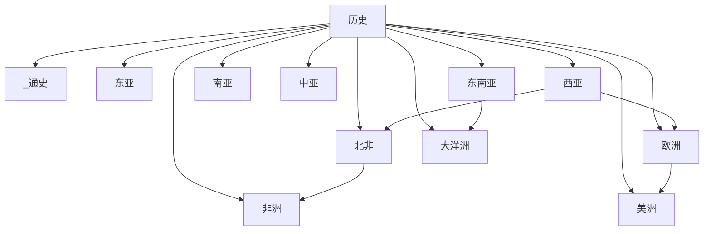

# 历史

## 概括

本目录用于整理世界区域历史。中国历史按东亚区域结构放入“东亚 / 中国”；其他一级目录优先按大区域和跨区域历史空间组织：东亚、东南亚、南亚、中亚、西亚、北非、欧洲、非洲、美洲和大洋洲。俄罗斯放在欧洲 / 斯拉夫 / 东斯拉夫中，草原汗国放在中亚中。跨区域帝国、世界体系和横向对照放入“_通史”。

西亚和北非现在是两个独立一级区域：西亚负责两河流域、黎凡特、阿拉伯半岛、南高加索、伊朗、土耳其和塞浦路斯；北非负责埃及、马格里布、苏丹和西撒哈拉。二者通过阿拉伯帝国、奥斯曼、地中海、红海、撒哈拉和现代地区体系互相连接。

## 世界历史区域框架

## 区域入口

| 区域 | 入口 | 整理重点 |
|---|---|---|
| 通史 | [世界历史通史](/%E4%BA%BA%E6%96%87%E7%A7%91%E5%AD%A6/%E5%8E%86%E5%8F%B2/_%E9%80%9A%E5%8F%B2/README.md) | 世界帝国、跨区域比较、全球史和大时间线 |
| 东亚 | [东亚历史](/%E4%BA%BA%E6%96%87%E7%A7%91%E5%AD%A6/%E5%8E%86%E5%8F%B2/%E4%B8%9C%E4%BA%9A/README.md) | 中国、日本、朝鲜半岛及东亚区域互动 |
| 东南亚 | [东南亚历史](/%E4%BA%BA%E6%96%87%E7%A7%91%E5%AD%A6/%E5%8E%86%E5%8F%B2/%E4%B8%9C%E5%8D%97%E4%BA%9A/README.md) | 中南半岛、海岛东南亚、殖民、独立和现代国家 |
| 南亚 | [南亚历史](/%E4%BA%BA%E6%96%87%E7%A7%91%E5%AD%A6/%E5%8E%86%E5%8F%B2/%E5%8D%97%E4%BA%9A/README.md) | 印度次大陆、印度河、恒河、伊斯兰王朝、莫卧儿与英属印度 |
| 中亚 | [中亚历史](/%E4%BA%BA%E6%96%87%E7%A7%91%E5%AD%A6/%E5%8E%86%E5%8F%B2/%E4%B8%AD%E4%BA%9A/README.md) | 河中绿洲、草原汗国、丝绸之路、蒙古、帖木儿和俄罗斯中亚 |
| 西亚 | [西亚历史](/%E4%BA%BA%E6%96%87%E7%A7%91%E5%AD%A6/%E5%8E%86%E5%8F%B2/%E8%A5%BF%E4%BA%9A/README.md) | 两河、黎凡特、阿拉伯半岛、南高加索、伊朗、土耳其和塞浦路斯 |
| 北非 | [北非历史](/%E4%BA%BA%E6%96%87%E7%A7%91%E5%AD%A6/%E5%8E%86%E5%8F%B2/%E5%8C%97%E9%9D%9E/README.md) | 埃及、马格里布、撒哈拉、苏丹、殖民与现代国家 |
| 欧洲 | [欧洲历史](/%E4%BA%BA%E6%96%87%E7%A7%91%E5%AD%A6/%E5%8E%86%E5%8F%B2/%E6%AC%A7%E6%B4%B2/README.md) | 古希腊、古罗马、中世纪、民族国家、革命、殖民和现代欧洲 |
| 非洲 | [非洲历史](/%E4%BA%BA%E6%96%87%E7%A7%91%E5%AD%A6/%E5%8E%86%E5%8F%B2/%E9%9D%9E%E6%B4%B2/README.md) | 西非、东非、中非、南部非洲和殖民独立 |
| 美洲 | [美洲历史](/%E4%BA%BA%E6%96%87%E7%A7%91%E5%AD%A6/%E5%8E%86%E5%8F%B2/%E7%BE%8E%E6%B4%B2/README.md) | 前哥伦布文明、欧洲殖民、独立运动和现代国家 |
| 大洋洲 | [大洋洲历史](/%E4%BA%BA%E6%96%87%E7%A7%91%E5%AD%A6/%E5%8E%86%E5%8F%B2/%E5%A4%A7%E6%B4%8B%E6%B4%B2/README.md) | 澳大利亚、新西兰、太平洋岛屿、殖民和现代国家 |
| 俄罗斯与东斯拉夫 | [东斯拉夫历史演变](/%E4%BA%BA%E6%96%87%E7%A7%91%E5%AD%A6/%E5%8E%86%E5%8F%B2/%E6%AC%A7%E6%B4%B2/%E6%96%AF%E6%8B%89%E5%A4%AB/%E4%B8%9C%E6%96%AF%E6%8B%89%E5%A4%AB/README.md) | 基辅罗斯、莫斯科公国、沙皇俄国、苏联和现代俄罗斯 |

## 整理原则

- 一级目录表达宏观历史区域；重要跨国文明区可继续建立“区域 README + 国家子目录”。
- 古代文明和跨区域帝国优先放在最能表达其核心地理与政治重心的区域，再通过互链连接其他区域。
- 区域 README 只保留主线、图表和入口；具体事实、君主世系、战争和制度细节放入下级笔记。
- 内部链接统一使用根相对、URL 编码的标准 Markdown 链接。

## 相关入口

- 上级目录：[人文科学](/%E4%BA%BA%E6%96%87%E7%A7%91%E5%AD%A6/README.md)
- 中国历史：[中国](/%E4%BA%BA%E6%96%87%E7%A7%91%E5%AD%A6/%E5%8E%86%E5%8F%B2/%E4%B8%9C%E4%BA%9A/%E4%B8%AD%E5%9B%BD/README.md)
