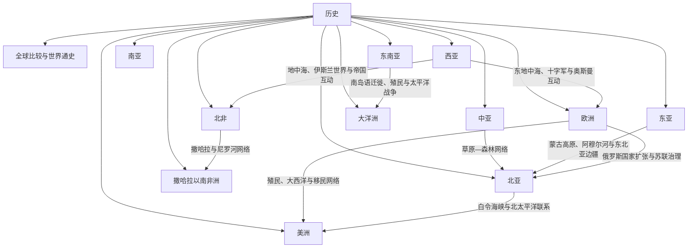

# 历史

## 概括

本目录用于从两条互补路径理解世界历史：

- **按地区进入**：先确定东亚、西亚、欧洲、北非等宏观历史空间，再进入文明、国家与专题。
- **按文明 / 历史共同体进入**：直接追踪某个文明、历史区域或长期共同体的起源、扩展、重组、断裂与现代承接。

物理目录继续以地区为主，README 负责提供多轴导航。文明、帝国、族群和现代国家并不是同一种对象；古代文明也不能机械视为某个现代国家的唯一祖先。跨现代国界的历史对象只保留一篇规范主笔记，相关国家与地区通过本地视角和链接进入。

## 世界历史区域框架

## 按地区进入

| 地区 | 入口 | 整理重点 |
|---|---|---|
| 全球比较 | [世界历史通史](/%E4%BA%BA%E6%96%87%E7%A7%91%E5%AD%A6/%E5%8E%86%E5%8F%B2/_%E9%80%9A%E5%8F%B2/README.md) | 大时间线、跨区域网络、帝国比较、工业化、战争、环境与全球化 |
| 东亚 | [东亚历史](/%E4%BA%BA%E6%96%87%E7%A7%91%E5%AD%A6/%E5%8E%86%E5%8F%B2/%E4%B8%9C%E4%BA%9A/README.md) | 中国、日本、朝鲜半岛、蒙古及东亚区域互动 |
| 东南亚 | [东南亚历史](/%E4%BA%BA%E6%96%87%E7%A7%91%E5%AD%A6/%E5%8E%86%E5%8F%B2/%E4%B8%9C%E5%8D%97%E4%BA%9A/README.md) | 中南半岛、海岛东南亚、殖民、独立和现代国家 |
| 南亚 | [南亚历史](/%E4%BA%BA%E6%96%87%E7%A7%91%E5%AD%A6/%E5%8E%86%E5%8F%B2/%E5%8D%97%E4%BA%9A/README.md) | 印度次大陆、喜马拉雅、印度洋、分治与现代国家 |
| 中亚 | [中亚历史](/%E4%BA%BA%E6%96%87%E7%A7%91%E5%AD%A6/%E5%8E%86%E5%8F%B2/%E4%B8%AD%E4%BA%9A/README.md) | 河中绿洲、欧亚草原、丝绸之路、蒙古与俄苏重组 |
| 北亚 | [北亚历史](/%E4%BA%BA%E6%96%87%E7%A7%91%E5%AD%A6/%E5%8E%86%E5%8F%B2/%E5%8C%97%E4%BA%9A/README.md) | 西伯利亚、俄罗斯远东、原住民族与北极网络 |
| 西亚 | [西亚历史](/%E4%BA%BA%E6%96%87%E7%A7%91%E5%AD%A6/%E5%8E%86%E5%8F%B2/%E8%A5%BF%E4%BA%9A/README.md) | 两河、黎凡特、阿拉伯半岛、南高加索、伊朗与安纳托利亚 |
| 北非 | [北非历史](/%E4%BA%BA%E6%96%87%E7%A7%91%E5%AD%A6/%E5%8E%86%E5%8F%B2/%E5%8C%97%E9%9D%9E/README.md) | 尼罗河、马格里布、撒哈拉、苏丹与现代国家 |
| 欧洲 | [欧洲历史](/%E4%BA%BA%E6%96%87%E7%A7%91%E5%AD%A6/%E5%8E%86%E5%8F%B2/%E6%AC%A7%E6%B4%B2/README.md) | 古典世界、历史区域、帝国、民族国家与欧洲一体化 |
| 撒哈拉以南非洲 | [撒哈拉以南非洲历史](/%E4%BA%BA%E6%96%87%E7%A7%91%E5%AD%A6/%E5%8E%86%E5%8F%B2/%E9%9D%9E%E6%B4%B2/README.md) | 西非、东非、中非、南部非洲及跨洲网络 |
| 美洲 | [美洲历史](/%E4%BA%BA%E6%96%87%E7%A7%91%E5%AD%A6/%E5%8E%86%E5%8F%B2/%E7%BE%8E%E6%B4%B2/README.md) | 原住民文明、殖民体系、独立与现代国家 |
| 大洋洲 | [大洋洲历史](/%E4%BA%BA%E6%96%87%E7%A7%91%E5%AD%A6/%E5%8E%86%E5%8F%B2/%E5%A4%A7%E6%B4%8B%E6%B4%B2/README.md) | 澳大利亚、新西兰、太平洋岛屿与南岛语海域 |

## 按文明 / 历史共同体进入

| 大区 | 文明 / 历史共同体 | 规范入口 | 对象性质与阅读范围 |
|---|---|---|---|
| 东亚 | 中国文明与中国历史 | [中国](/%E4%BA%BA%E6%96%87%E7%A7%91%E5%AD%A6/%E5%8E%86%E5%8F%B2/%E4%B8%9C%E4%BA%9A/%E4%B8%AD%E5%9B%BD/README.md) | 多区域、多族群文明传统与历代政权、制度、知识和现代国家 |
| 东亚 | 日本列岛历史 | [日本](/%E4%BA%BA%E6%96%87%E7%A7%91%E5%AD%A6/%E5%8E%86%E5%8F%B2/%E4%B8%9C%E4%BA%9A/%E6%97%A5%E6%9C%AC/README.md) | 列岛社会、律令国家、幕府、帝国与战后国家 |
| 东亚 | 朝鲜半岛历史 | [朝鲜半岛](/%E4%BA%BA%E6%96%87%E7%A7%91%E5%AD%A6/%E5%8E%86%E5%8F%B2/%E4%B8%9C%E4%BA%9A/%E6%9C%9D%E9%B2%9C%E5%8D%8A%E5%B2%9B/README.md) | 半岛诸国、高丽、朝鲜王朝、殖民与南北分裂 |
| 东亚 / 中亚 | 蒙古高原与草原政治 | [蒙古](/%E4%BA%BA%E6%96%87%E7%A7%91%E5%AD%A6/%E5%8E%86%E5%8F%B2/%E4%B8%9C%E4%BA%9A/%E8%92%99%E5%8F%A4/README.md)；[草原汗国](/%E4%BA%BA%E6%96%87%E7%A7%91%E5%AD%A6/%E5%8E%86%E5%8F%B2/%E4%B8%AD%E4%BA%9A/%E8%8D%89%E5%8E%9F%E6%B1%97%E5%9B%BD/README.md) | 蒙古高原国家史与跨欧亚草原共同史并读 |
| 东南亚 | 中南半岛历史空间 | [中南半岛](/%E4%BA%BA%E6%96%87%E7%A7%91%E5%AD%A6/%E5%8E%86%E5%8F%B2/%E4%B8%9C%E5%8D%97%E4%BA%9A/%E4%B8%AD%E5%8D%97%E5%8D%8A%E5%B2%9B/README.md) | 河谷国家、上座部佛教、越南传统与殖民边界 |
| 东南亚 / 大洋洲 | 海岛东南亚与南岛语海域 | [海岛东南亚](/%E4%BA%BA%E6%96%87%E7%A7%91%E5%AD%A6/%E5%8E%86%E5%8F%B2/%E4%B8%9C%E5%8D%97%E4%BA%9A/%E6%B5%B7%E5%B2%9B%E4%B8%9C%E5%8D%97%E4%BA%9A/README.md)；[太平洋岛屿](/%E4%BA%BA%E6%96%87%E7%A7%91%E5%AD%A6/%E5%8E%86%E5%8F%B2/%E5%A4%A7%E6%B4%8B%E6%B4%B2/%E5%A4%AA%E5%B9%B3%E6%B4%8B%E5%B2%9B%E5%B1%BF/README.md) | 港市、航海、迁徙、伊斯兰化与太平洋社会 |
| 南亚 | 印度次大陆共同史 | [南亚通史](/%E4%BA%BA%E6%96%87%E7%A7%91%E5%AD%A6/%E5%8E%86%E5%8F%B2/%E5%8D%97%E4%BA%9A/_%E9%80%9A%E5%8F%B2/README.md) | 印度河、恒河、宗教思想、跨国帝国、殖民与分治 |
| 中亚 | 河中绿洲文明 | [河中地区](/%E4%BA%BA%E6%96%87%E7%A7%91%E5%AD%A6/%E5%8E%86%E5%8F%B2/%E4%B8%AD%E4%BA%9A/%E6%B2%B3%E4%B8%AD%E5%9C%B0%E5%8C%BA/README.md) | 粟特、撒马尔罕、布哈拉、花剌子模与绿洲网络 |
| 中亚 / 北亚 | 欧亚草原与森林—北极网络 | [草原汗国](/%E4%BA%BA%E6%96%87%E7%A7%91%E5%AD%A6/%E5%8E%86%E5%8F%B2/%E4%B8%AD%E4%BA%9A/%E8%8D%89%E5%8E%9F%E6%B1%97%E5%9B%BD/README.md)；[北亚通史](/%E4%BA%BA%E6%96%87%E7%A7%91%E5%AD%A6/%E5%8E%86%E5%8F%B2/%E5%8C%97%E4%BA%9A/_%E9%80%9A%E5%8F%B2/README.md) | 游牧政权、原住民社会、俄国东扩与跨生态联系 |
| 西亚 | 两河流域文明 | [两河流域文明](/%E4%BA%BA%E6%96%87%E7%A7%91%E5%AD%A6/%E5%8E%86%E5%8F%B2/%E8%A5%BF%E4%BA%9A/%E4%B8%A4%E6%B2%B3%E6%B5%81%E5%9F%9F/README.md) | 苏美尔、阿卡德、巴比伦、亚述及后续区域重组 |
| 西亚 | 伊朗高原与波斯—伊朗传统 | [伊朗](/%E4%BA%BA%E6%96%87%E7%A7%91%E5%AD%A6/%E5%8E%86%E5%8F%B2/%E8%A5%BF%E4%BA%9A/%E4%BC%8A%E6%9C%97/README.md) | 埃兰、米底、波斯帝国、伊斯兰化与现代伊朗 |
| 西亚 | 黎凡特历史空间 | [黎凡特](/%E4%BA%BA%E6%96%87%E7%A7%91%E5%AD%A6/%E5%8E%86%E5%8F%B2/%E8%A5%BF%E4%BA%9A/%E9%BB%8E%E5%87%A1%E7%89%B9/README.md) | 迦南、腓尼基、帝国统治、委任统治与现代政治实体 |
| 西亚 / 北非 | 阿拉伯—伊斯兰帝国共同史 | [阿拉伯帝国](/%E4%BA%BA%E6%96%87%E7%A7%91%E5%AD%A6/%E5%8E%86%E5%8F%B2/%E8%A5%BF%E4%BA%9A/_%E9%80%9A%E5%8F%B2/%E9%98%BF%E6%8B%89%E4%BC%AF%E5%B8%9D%E5%9B%BD/README.md) | 跨洲帝国、宗教、语言、贸易和知识网络 |
| 北非 | 尼罗河—埃及历史 | [埃及](/%E4%BA%BA%E6%96%87%E7%A7%91%E5%AD%A6/%E5%8E%86%E5%8F%B2/%E5%8C%97%E9%9D%9E/%E5%9F%83%E5%8F%8A/README.md) | 古埃及、希腊罗马、基督教、伊斯兰化与现代国家 |
| 北非 / 地中海 | 迦太基与马格里布共同史 | [迦太基](/%E4%BA%BA%E6%96%87%E7%A7%91%E5%AD%A6/%E5%8E%86%E5%8F%B2/%E5%8C%97%E9%9D%9E/_%E9%80%9A%E5%8F%B2/%E8%BF%A6%E5%A4%AA%E5%9F%BA/README.md) | 腓尼基殖民城市、北非强国与西地中海网络 |
| 欧洲 / 地中海 | 希腊—希腊化世界 | [古希腊](/%E4%BA%BA%E6%96%87%E7%A7%91%E5%AD%A6/%E5%8E%86%E5%8F%B2/%E6%AC%A7%E6%B4%B2/_%E9%80%9A%E5%8F%B2/%E5%8F%A4%E5%B8%8C%E8%85%8A/README.md) | 爱琴文明、城邦、马其顿与希腊化传播 |
| 欧洲 / 地中海 | 罗马世界 | [古罗马](/%E4%BA%BA%E6%96%87%E7%A7%91%E5%AD%A6/%E5%8E%86%E5%8F%B2/%E6%AC%A7%E6%B4%B2/_%E9%80%9A%E5%8F%B2/%E5%8F%A4%E7%BD%97%E9%A9%AC/README.md) | 共和国、帝国、地中海统治与东西罗马分化 |
| 欧洲 | 德意志历史空间 | [德意志](/%E4%BA%BA%E6%96%87%E7%A7%91%E5%AD%A6/%E5%8E%86%E5%8F%B2/%E6%AC%A7%E6%B4%B2/%E5%BE%B7%E6%84%8F%E5%BF%97/README.md) | 东法兰克、神圣罗马帝国及德国、奥地利、瑞士等分支 |
| 欧洲 | 斯拉夫历史共同体 | [斯拉夫](/%E4%BA%BA%E6%96%87%E7%A7%91%E5%AD%A6/%E5%8E%86%E5%8F%B2/%E6%AC%A7%E6%B4%B2/%E6%96%AF%E6%8B%89%E5%A4%AB/README.md) | 东、西、南斯拉夫分化、国家形成与现代发展 |
| 撒哈拉以南非洲 | 西非与萨赫勒历史空间 | [西非](/%E4%BA%BA%E6%96%87%E7%A7%91%E5%AD%A6/%E5%8E%86%E5%8F%B2/%E9%9D%9E%E6%B4%B2/%E8%A5%BF%E9%9D%9E/README.md) | 萨赫勒帝国、森林王国、伊斯兰与大西洋网络 |
| 撒哈拉以南非洲 | 东非、非洲之角与斯瓦希里世界 | [东非](/%E4%BA%BA%E6%96%87%E7%A7%91%E5%AD%A6/%E5%8E%86%E5%8F%B2/%E9%9D%9E%E6%B4%B2/%E4%B8%9C%E9%9D%9E/README.md) | 高原国家、大湖区、红海与印度洋海岸 |
| 撒哈拉以南非洲 | 中非与南部非洲历史空间 | [中非](/%E4%BA%BA%E6%96%87%E7%A7%91%E5%AD%A6/%E5%8E%86%E5%8F%B2/%E9%9D%9E%E6%B4%B2/%E4%B8%AD%E9%9D%9E/README.md)；[南部非洲](/%E4%BA%BA%E6%96%87%E7%A7%91%E5%AD%A6/%E5%8E%86%E5%8F%B2/%E9%9D%9E%E6%B4%B2/%E5%8D%97%E9%83%A8%E9%9D%9E%E6%B4%B2/README.md) | 刚果盆地、高原王国、殖民重组与现代国家 |
| 美洲 | 中部美洲文明 | [中美洲与中部美洲](/%E4%BA%BA%E6%96%87%E7%A7%91%E5%AD%A6/%E5%8E%86%E5%8F%B2/%E7%BE%8E%E6%B4%B2/%E4%B8%AD%E7%BE%8E%E6%B4%B2/README.md) | 奥尔梅克、玛雅、特奥蒂瓦坎、墨西加与殖民后的连续性 |
| 美洲 | 安第斯文明与印加帝国 | [安第斯文明与印加帝国](/%E4%BA%BA%E6%96%87%E7%A7%91%E5%AD%A6/%E5%8E%86%E5%8F%B2/%E7%BE%8E%E6%B4%B2/%E5%8D%97%E7%BE%8E/%E5%AE%89%E7%AC%AC%E6%96%AF%E6%96%87%E6%98%8E%E4%B8%8E%E5%8D%B0%E5%8A%A0%E5%B8%9D%E5%9B%BD.md) | 安第斯高地文明、印加整合、殖民冲击与原住民延续 |
| 美洲 / 大西洋 | 加勒比与大西洋世界 | [加勒比历史](/%E4%BA%BA%E6%96%87%E7%A7%91%E5%AD%A6/%E5%8E%86%E5%8F%B2/%E7%BE%8E%E6%B4%B2/%E5%8A%A0%E5%8B%92%E6%AF%94/README.md) | 原住民、殖民种植园、奴隶制、革命与离散社群 |

## 阅读同一文明的方法

| 阅读层次 | 应回答的问题 |
|---|---|
| 范围与对象 | 这是文明区、历史区域、帝国、族群共同体还是现代国家？古今同名是否指同一对象？ |
| 政治演进 | 哪些节点是继承、征服、分裂、并立、占领、宗主或复国关系？ |
| 文明连续性 | 语言文字、宗教思想、制度法律、人口族群、经济网络和空间中心如何延续或重构？ |
| 关键断裂 | 征服、迁徙、殖民、分治和制度革命改变了什么？ |
| 现代承接 | 现代国家和社群继承了什么、没有继承什么，哪些关系仍有争议？ |
| 跨区域转折 | 外部战争、贸易、宗教传播和人口移动如何进入本地时间线？ |

## 整理原则

- 一级物理目录表达宏观历史区域；README 同时提供地区与文明两套阅读路径。
- 跨越现代国界的文明、帝国和共同历史过程只维护一篇规范主笔记，国家页保留本地视角并回链。
- 政权更替只是文明史的一条轴线；制度、人口、语言文字、宗教思想、经济网络和空间中心应作为并列连续性轴。
- Mermaid 普通箭头必须有明确语义；重叠、并立与争议关系不得压成无标签单线继承。
- 区域 README 只保留范围、主线、关键辨析和入口；具体事实、君主世系、战争与制度细节放入下级笔记。
- 内部链接统一使用根相对、URL 编码的标准 Markdown 链接。

## 上级

- [人文科学](/%E4%BA%BA%E6%96%87%E7%A7%91%E5%AD%A6/README.md)
