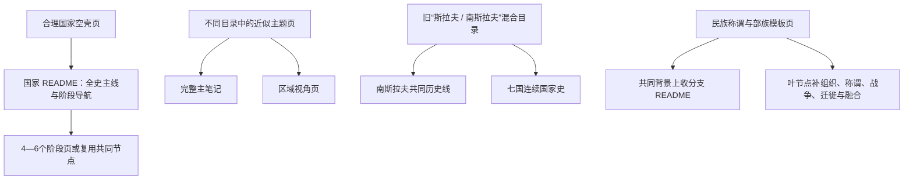

# 历史演进框架重组迁移记录

## 基准与保全原则

本记录以本轮修改前的 Git HEAD 为旧版基准，逐项登记所有被修改或移动的旧知识笔记。普通移动不改变知识页身份；原有段落、时间、人物、事件、表格、Mermaid、图片引用、内部链接和辨析点允许在新结构中重排或扩写，但不得无故删除。

本轮共识别 **22 个旧路径移动**，以下 22 项均有唯一新位置；没有无法解释的知识页删除。另有 **61 个旧文件原位调整**，也逐项列出。

## 结构变化

## 旧路径到新位置：普通移动

| 旧位置 | 新位置 | 内容迁移说明 |
|---|---|---|
| `人文科学/历史/欧洲/伊比利亚半岛/西哥特王国.md` | [西哥特统治下的伊比利亚](/%E4%BA%BA%E6%96%87%E7%A7%91%E5%AD%A6/%E5%8E%86%E5%8F%B2/%E6%AC%A7%E6%B4%B2/%E4%BC%8A%E6%AF%94%E5%88%A9%E4%BA%9A%E5%8D%8A%E5%B2%9B/%E8%A5%BF%E5%93%A5%E7%89%B9%E7%BB%9F%E6%B2%BB%E4%B8%8B%E7%9A%84%E4%BC%8A%E6%AF%94%E5%88%A9%E4%BA%9A.md) | 原托莱多王国和半岛前后关系整体迁入伊比利亚区域视角；完整生命周期仍由后罗马通史维护。 |
| `人文科学/历史/欧洲/德意志/德国/条顿骑士团.md` | [骑士团国世俗化与普鲁士形成](/%E4%BA%BA%E6%96%87%E7%A7%91%E5%AD%A6/%E5%8E%86%E5%8F%B2/%E6%AC%A7%E6%B4%B2/%E5%BE%B7%E6%84%8F%E5%BF%97/%E5%BE%B7%E5%9B%BD/%E9%AA%91%E5%A3%AB%E5%9B%A2%E5%9B%BD%E4%B8%96%E4%BF%97%E5%8C%96%E4%B8%8E%E6%99%AE%E9%B2%81%E5%A3%AB%E5%BD%A2%E6%88%90.md) | 原普鲁士形成事实整体迁入德意志区域视角；条顿骑士团完整生命周期另由通史主笔记维护。 |
| `人文科学/历史/欧洲/斯拉夫/南斯拉夫/README.md` | [南斯拉夫历史](/%E4%BA%BA%E6%96%87%E7%A7%91%E5%AD%A6/%E5%8E%86%E5%8F%B2/%E6%AC%A7%E6%B4%B2/%E4%B8%9C%E5%8D%97%E6%AC%A7%E4%B8%8E%E5%B7%B4%E5%B0%94%E5%B9%B2/%E5%8D%97%E6%96%AF%E6%8B%89%E5%A4%AB%E5%8E%86%E5%8F%B2/README.md) | 共同历史主线整体迁入；原有总览扩展为跨国演进图、阶段导航和国家分支。 |
| `人文科学/历史/欧洲/斯拉夫/南斯拉夫/保加利亚.md` | [保加利亚](/%E4%BA%BA%E6%96%87%E7%A7%91%E5%AD%A6/%E5%8E%86%E5%8F%B2/%E6%AC%A7%E6%B4%B2/%E4%B8%9C%E5%8D%97%E6%AC%A7%E4%B8%8E%E5%B7%B4%E5%B0%94%E5%B9%B2/%E4%BF%9D%E5%8A%A0%E5%88%A9%E4%BA%9A/README.md) | 合理国家空壳移作国家 README；原有辨识点保留，并扩成连续国家史。 |
| `人文科学/历史/欧洲/斯拉夫/南斯拉夫/保加利亚第一帝国.md` | [保加利亚第一帝国](/%E4%BA%BA%E6%96%87%E7%A7%91%E5%AD%A6/%E5%8E%86%E5%8F%B2/%E6%AC%A7%E6%B4%B2/%E4%B8%9C%E5%8D%97%E6%AC%A7%E4%B8%8E%E5%B7%B4%E5%B0%94%E5%B9%B2/%E4%BF%9D%E5%8A%A0%E5%88%A9%E4%BA%9A/%E4%BF%9D%E5%8A%A0%E5%88%A9%E4%BA%9A%E7%AC%AC%E4%B8%80%E5%B8%9D%E5%9B%BD.md) | 原阶段页普通移动到共同线或对应国家目录；原有时间、事实和演变关系保留并扩写。 |
| `人文科学/历史/欧洲/斯拉夫/南斯拉夫/克罗地亚.md` | [克罗地亚](/%E4%BA%BA%E6%96%87%E7%A7%91%E5%AD%A6/%E5%8E%86%E5%8F%B2/%E6%AC%A7%E6%B4%B2/%E4%B8%9C%E5%8D%97%E6%AC%A7%E4%B8%8E%E5%B7%B4%E5%B0%94%E5%B9%B2/%E5%85%8B%E7%BD%97%E5%9C%B0%E4%BA%9A/README.md) | 合理国家空壳移作国家 README；原有辨识点保留，并扩成连续国家史。 |
| `人文科学/历史/欧洲/斯拉夫/南斯拉夫/克罗地亚王国.md` | [克罗地亚王国](/%E4%BA%BA%E6%96%87%E7%A7%91%E5%AD%A6/%E5%8E%86%E5%8F%B2/%E6%AC%A7%E6%B4%B2/%E4%B8%9C%E5%8D%97%E6%AC%A7%E4%B8%8E%E5%B7%B4%E5%B0%94%E5%B9%B2/%E5%85%8B%E7%BD%97%E5%9C%B0%E4%BA%9A/%E5%85%8B%E7%BD%97%E5%9C%B0%E4%BA%9A%E7%8E%8B%E5%9B%BD.md) | 原阶段页普通移动到共同线或对应国家目录；原有时间、事实和演变关系保留并扩写。 |
| `人文科学/历史/欧洲/斯拉夫/南斯拉夫/北马其顿.md` | [北马其顿](/%E4%BA%BA%E6%96%87%E7%A7%91%E5%AD%A6/%E5%8E%86%E5%8F%B2/%E6%AC%A7%E6%B4%B2/%E4%B8%9C%E5%8D%97%E6%AC%A7%E4%B8%8E%E5%B7%B4%E5%B0%94%E5%B9%B2/%E5%8C%97%E9%A9%AC%E5%85%B6%E9%A1%BF/README.md) | 合理国家空壳移作国家 README；原有辨识点保留，并扩成连续国家史。 |
| `人文科学/历史/欧洲/斯拉夫/南斯拉夫/南斯拉夫王国.md` | [南斯拉夫王国](/%E4%BA%BA%E6%96%87%E7%A7%91%E5%AD%A6/%E5%8E%86%E5%8F%B2/%E6%AC%A7%E6%B4%B2/%E4%B8%9C%E5%8D%97%E6%AC%A7%E4%B8%8E%E5%B7%B4%E5%B0%94%E5%B9%B2/%E5%8D%97%E6%96%AF%E6%8B%89%E5%A4%AB%E5%8E%86%E5%8F%B2/%E5%8D%97%E6%96%AF%E6%8B%89%E5%A4%AB%E7%8E%8B%E5%9B%BD.md) | 原阶段页普通移动到共同线或对应国家目录；原有时间、事实和演变关系保留并扩写。 |
| `人文科学/历史/欧洲/斯拉夫/南斯拉夫/南斯拉夫社会主义联邦共和国.md` | [南斯拉夫社会主义联邦共和国](/%E4%BA%BA%E6%96%87%E7%A7%91%E5%AD%A6/%E5%8E%86%E5%8F%B2/%E6%AC%A7%E6%B4%B2/%E4%B8%9C%E5%8D%97%E6%AC%A7%E4%B8%8E%E5%B7%B4%E5%B0%94%E5%B9%B2/%E5%8D%97%E6%96%AF%E6%8B%89%E5%A4%AB%E5%8E%86%E5%8F%B2/%E5%8D%97%E6%96%AF%E6%8B%89%E5%A4%AB%E7%A4%BE%E4%BC%9A%E4%B8%BB%E4%B9%89%E8%81%94%E9%82%A6%E5%85%B1%E5%92%8C%E5%9B%BD.md) | 原阶段页普通移动到共同线或对应国家目录；原有时间、事实和演变关系保留并扩写。 |
| `人文科学/历史/欧洲/斯拉夫/南斯拉夫/南斯拉夫解体.md` | [南斯拉夫解体](/%E4%BA%BA%E6%96%87%E7%A7%91%E5%AD%A6/%E5%8E%86%E5%8F%B2/%E6%AC%A7%E6%B4%B2/%E4%B8%9C%E5%8D%97%E6%AC%A7%E4%B8%8E%E5%B7%B4%E5%B0%94%E5%B9%B2/%E5%8D%97%E6%96%AF%E6%8B%89%E5%A4%AB%E5%8E%86%E5%8F%B2/%E5%8D%97%E6%96%AF%E6%8B%89%E5%A4%AB%E8%A7%A3%E4%BD%93.md) | 原阶段页普通移动到共同线或对应国家目录；原有时间、事实和演变关系保留并扩写。 |
| `人文科学/历史/欧洲/斯拉夫/南斯拉夫/塞尔维亚.md` | [塞尔维亚](/%E4%BA%BA%E6%96%87%E7%A7%91%E5%AD%A6/%E5%8E%86%E5%8F%B2/%E6%AC%A7%E6%B4%B2/%E4%B8%9C%E5%8D%97%E6%AC%A7%E4%B8%8E%E5%B7%B4%E5%B0%94%E5%B9%B2/%E5%A1%9E%E5%B0%94%E7%BB%B4%E4%BA%9A/README.md) | 合理国家空壳移作国家 README；原有辨识点保留，并扩成连续国家史。 |
| `人文科学/历史/欧洲/斯拉夫/南斯拉夫/塞尔维亚中世纪国家.md` | [塞尔维亚中世纪国家](/%E4%BA%BA%E6%96%87%E7%A7%91%E5%AD%A6/%E5%8E%86%E5%8F%B2/%E6%AC%A7%E6%B4%B2/%E4%B8%9C%E5%8D%97%E6%AC%A7%E4%B8%8E%E5%B7%B4%E5%B0%94%E5%B9%B2/%E5%A1%9E%E5%B0%94%E7%BB%B4%E4%BA%9A/%E5%A1%9E%E5%B0%94%E7%BB%B4%E4%BA%9A%E4%B8%AD%E4%B8%96%E7%BA%AA%E5%9B%BD%E5%AE%B6.md) | 原阶段页普通移动到共同线或对应国家目录；原有时间、事实和演变关系保留并扩写。 |
| `人文科学/历史/欧洲/斯拉夫/南斯拉夫/奥斯曼统治下的巴尔干斯拉夫.md` | [奥斯曼统治下的巴尔干斯拉夫](/%E4%BA%BA%E6%96%87%E7%A7%91%E5%AD%A6/%E5%8E%86%E5%8F%B2/%E6%AC%A7%E6%B4%B2/%E4%B8%9C%E5%8D%97%E6%AC%A7%E4%B8%8E%E5%B7%B4%E5%B0%94%E5%B9%B2/%E5%8D%97%E6%96%AF%E6%8B%89%E5%A4%AB%E5%8E%86%E5%8F%B2/%E5%A5%A5%E6%96%AF%E6%9B%BC%E7%BB%9F%E6%B2%BB%E4%B8%8B%E7%9A%84%E5%B7%B4%E5%B0%94%E5%B9%B2%E6%96%AF%E6%8B%89%E5%A4%AB.md) | 原阶段页普通移动到共同线或对应国家目录；原有时间、事实和演变关系保留并扩写。 |
| `人文科学/历史/欧洲/斯拉夫/南斯拉夫/斯洛文尼亚.md` | [斯洛文尼亚](/%E4%BA%BA%E6%96%87%E7%A7%91%E5%AD%A6/%E5%8E%86%E5%8F%B2/%E6%AC%A7%E6%B4%B2/%E4%B8%9C%E5%8D%97%E6%AC%A7%E4%B8%8E%E5%B7%B4%E5%B0%94%E5%B9%B2/%E6%96%AF%E6%B4%9B%E6%96%87%E5%B0%BC%E4%BA%9A/README.md) | 合理国家空壳移作国家 README；原有辨识点保留，并扩成连续国家史。 |
| `人文科学/历史/欧洲/斯拉夫/南斯拉夫/早期南斯拉夫人.md` | [早期南斯拉夫人](/%E4%BA%BA%E6%96%87%E7%A7%91%E5%AD%A6/%E5%8E%86%E5%8F%B2/%E6%AC%A7%E6%B4%B2/%E4%B8%9C%E5%8D%97%E6%AC%A7%E4%B8%8E%E5%B7%B4%E5%B0%94%E5%B9%B2/%E5%8D%97%E6%96%AF%E6%8B%89%E5%A4%AB%E5%8E%86%E5%8F%B2/%E6%97%A9%E6%9C%9F%E5%8D%97%E6%96%AF%E6%8B%89%E5%A4%AB%E4%BA%BA.md) | 原阶段页普通移动到共同线或对应国家目录；原有时间、事实和演变关系保留并扩写。 |
| `人文科学/历史/欧洲/斯拉夫/南斯拉夫/波斯尼亚中世纪国家.md` | [波斯尼亚中世纪国家](/%E4%BA%BA%E6%96%87%E7%A7%91%E5%AD%A6/%E5%8E%86%E5%8F%B2/%E6%AC%A7%E6%B4%B2/%E4%B8%9C%E5%8D%97%E6%AC%A7%E4%B8%8E%E5%B7%B4%E5%B0%94%E5%B9%B2/%E6%B3%A2%E6%96%AF%E5%B0%BC%E4%BA%9A%E5%92%8C%E9%BB%91%E5%A1%9E%E5%93%A5%E7%BB%B4%E9%82%A3/%E6%B3%A2%E6%96%AF%E5%B0%BC%E4%BA%9A%E4%B8%AD%E4%B8%96%E7%BA%AA%E5%9B%BD%E5%AE%B6.md) | 原阶段页普通移动到共同线或对应国家目录；原有时间、事实和演变关系保留并扩写。 |
| `人文科学/历史/欧洲/斯拉夫/南斯拉夫/波黑.md` | [波斯尼亚和黑塞哥维那](/%E4%BA%BA%E6%96%87%E7%A7%91%E5%AD%A6/%E5%8E%86%E5%8F%B2/%E6%AC%A7%E6%B4%B2/%E4%B8%9C%E5%8D%97%E6%AC%A7%E4%B8%8E%E5%B7%B4%E5%B0%94%E5%B9%B2/%E6%B3%A2%E6%96%AF%E5%B0%BC%E4%BA%9A%E5%92%8C%E9%BB%91%E5%A1%9E%E5%93%A5%E7%BB%B4%E9%82%A3/README.md) | 合理国家空壳移作国家 README；原有辨识点保留，并扩成连续国家史。 |
| `人文科学/历史/欧洲/斯拉夫/南斯拉夫/黑山.md` | [黑山](/%E4%BA%BA%E6%96%87%E7%A7%91%E5%AD%A6/%E5%8E%86%E5%8F%B2/%E6%AC%A7%E6%B4%B2/%E4%B8%9C%E5%8D%97%E6%AC%A7%E4%B8%8E%E5%B7%B4%E5%B0%94%E5%B9%B2/%E9%BB%91%E5%B1%B1/README.md) | 合理国家空壳移作国家 README；原有辨识点保留，并扩成连续国家史。 |
| `人文科学/历史/欧洲/波罗的海/条顿骑士团.md` | [条顿骑士团国与波罗的海秩序](/%E4%BA%BA%E6%96%87%E7%A7%91%E5%AD%A6/%E5%8E%86%E5%8F%B2/%E6%AC%A7%E6%B4%B2/%E6%B3%A2%E7%BD%97%E7%9A%84%E6%B5%B7/%E6%9D%A1%E9%A1%BF%E9%AA%91%E5%A3%AB%E5%9B%A2%E5%9B%BD%E4%B8%8E%E6%B3%A2%E7%BD%97%E7%9A%84%E6%B5%B7%E7%A7%A9%E5%BA%8F.md) | 原征服、骑士团国、波兰—立陶宛冲突与世俗化内容整体迁入波罗的海区域视角。 |
| `人文科学/历史/欧洲/波罗的海/瑞典波罗的海帝国.md` | [瑞典统治下的东波罗的海](/%E4%BA%BA%E6%96%87%E7%A7%91%E5%AD%A6/%E5%8E%86%E5%8F%B2/%E6%AC%A7%E6%B4%B2/%E6%B3%A2%E7%BD%97%E7%9A%84%E6%B5%B7/%E7%91%9E%E5%85%B8%E7%BB%9F%E6%B2%BB%E4%B8%8B%E7%9A%84%E4%B8%9C%E6%B3%A2%E7%BD%97%E7%9A%84%E6%B5%B7.md) | 原势力范围、强权兴衰和大北方战争后变化整体迁入东波罗的海区域视角。 |
| `人文科学/历史/西亚/_通史/阿拉伯帝国/阿拉伯帝国的分裂与伊斯兰世界扩展.md` | [帝国分裂后的伊斯兰世界扩展](/%E4%BA%BA%E6%96%87%E7%A7%91%E5%AD%A6/%E5%8E%86%E5%8F%B2/%E8%A5%BF%E4%BA%9A/_%E9%80%9A%E5%8F%B2/%E9%98%BF%E6%8B%89%E4%BC%AF%E5%B8%9D%E5%9B%BD/%E5%B8%9D%E5%9B%BD%E5%88%86%E8%A3%82%E5%90%8E%E7%9A%84%E4%BC%8A%E6%96%AF%E5%85%B0%E4%B8%96%E7%95%8C%E6%89%A9%E5%B1%95.md) | 原宗教、语言、商业与知识传播内容整体移入文明网络页；政治分裂与地方王朝另由并行主笔记维护。 |

## 旧文件原位保留与扩写

| 旧位置 | 当前入口 | 内容迁移说明 |
|---|---|---|
| `人文科学/README.md` | [人文科学](/%E4%BA%BA%E6%96%87%E7%A7%91%E5%AD%A6/README.md) | 修正层级：中国历史改为“历史 → 东亚 → 中国”的快捷入口，不再与历史并列。 |
| `人文科学/历史/README.md` | [历史](/%E4%BA%BA%E6%96%87%E7%A7%91%E5%AD%A6/%E5%8E%86%E5%8F%B2/README.md) | 更新撒哈拉以南非洲显示、欧洲新结构入口及本迁移记录入口。 |
| `人文科学/历史/东亚/中国/_民族/突厥语族与北方草原/叶尼塞吉尔吉斯/README.md` | [叶尼塞吉尔吉斯](/%E4%BA%BA%E6%96%87%E7%A7%91%E5%AD%A6/%E5%8E%86%E5%8F%B2/%E4%B8%9C%E4%BA%9A/%E4%B8%AD%E5%9B%BD/_%E6%B0%91%E6%97%8F/%E7%AA%81%E5%8E%A5%E8%AF%AD%E6%97%8F%E4%B8%8E%E5%8C%97%E6%96%B9%E8%8D%89%E5%8E%9F/%E5%8F%B6%E5%B0%BC%E5%A1%9E%E5%90%89%E5%B0%94%E5%90%89%E6%96%AF/README.md) | 上收共同历史背景，改成称谓时代、迁徙融合与现代民族形成总览。 |
| `人文科学/历史/东亚/中国/_民族/突厥语族与北方草原/叶尼塞吉尔吉斯/吉利吉思.md` | [吉利吉思](/%E4%BA%BA%E6%96%87%E7%A7%91%E5%AD%A6/%E5%8E%86%E5%8F%B2/%E4%B8%9C%E4%BA%9A/%E4%B8%AD%E5%9B%BD/_%E6%B0%91%E6%97%8F/%E7%AA%81%E5%8E%A5%E8%AF%AD%E6%97%8F%E4%B8%8E%E5%8C%97%E6%96%B9%E8%8D%89%E5%8E%9F/%E5%8F%B6%E5%B0%BC%E5%A1%9E%E5%90%89%E5%B0%94%E5%90%89%E6%96%AF/%E5%90%89%E5%88%A9%E5%90%89%E6%80%9D.md) | 保留称谓页，补充出现时代、文献语境、地域、所指人群、争议和后续变化。 |
| `人文科学/历史/东亚/中国/_民族/突厥语族与北方草原/叶尼塞吉尔吉斯/吉尔吉斯族.md` | [吉尔吉斯族](/%E4%BA%BA%E6%96%87%E7%A7%91%E5%AD%A6/%E5%8E%86%E5%8F%B2/%E4%B8%9C%E4%BA%9A/%E4%B8%AD%E5%9B%BD/_%E6%B0%91%E6%97%8F/%E7%AA%81%E5%8E%A5%E8%AF%AD%E6%97%8F%E4%B8%8E%E5%8C%97%E6%96%B9%E8%8D%89%E5%8E%9F/%E5%8F%B6%E5%B0%BC%E5%A1%9E%E5%90%89%E5%B0%94%E5%90%89%E6%96%AF/%E5%90%89%E5%B0%94%E5%90%89%E6%96%AF%E6%97%8F.md) | 保留称谓页，补充出现时代、文献语境、地域、所指人群、争议和后续变化。 |
| `人文科学/历史/东亚/中国/_民族/突厥语族与北方草原/叶尼塞吉尔吉斯/坚昆.md` | [坚昆](/%E4%BA%BA%E6%96%87%E7%A7%91%E5%AD%A6/%E5%8E%86%E5%8F%B2/%E4%B8%9C%E4%BA%9A/%E4%B8%AD%E5%9B%BD/_%E6%B0%91%E6%97%8F/%E7%AA%81%E5%8E%A5%E8%AF%AD%E6%97%8F%E4%B8%8E%E5%8C%97%E6%96%B9%E8%8D%89%E5%8E%9F/%E5%8F%B6%E5%B0%BC%E5%A1%9E%E5%90%89%E5%B0%94%E5%90%89%E6%96%AF/%E5%9D%9A%E6%98%86.md) | 保留称谓页，补充出现时代、文献语境、地域、所指人群、争议和后续变化。 |
| `人文科学/历史/东亚/中国/_民族/突厥语族与北方草原/叶尼塞吉尔吉斯/契骨.md` | [契骨](/%E4%BA%BA%E6%96%87%E7%A7%91%E5%AD%A6/%E5%8E%86%E5%8F%B2/%E4%B8%9C%E4%BA%9A/%E4%B8%AD%E5%9B%BD/_%E6%B0%91%E6%97%8F/%E7%AA%81%E5%8E%A5%E8%AF%AD%E6%97%8F%E4%B8%8E%E5%8C%97%E6%96%B9%E8%8D%89%E5%8E%9F/%E5%8F%B6%E5%B0%BC%E5%A1%9E%E5%90%89%E5%B0%94%E5%90%89%E6%96%AF/%E5%A5%91%E9%AA%A8.md) | 保留称谓页，补充出现时代、文献语境、地域、所指人群、争议和后续变化。 |
| `人文科学/历史/东亚/中国/_民族/突厥语族与北方草原/叶尼塞吉尔吉斯/布鲁特.md` | [布鲁特](/%E4%BA%BA%E6%96%87%E7%A7%91%E5%AD%A6/%E5%8E%86%E5%8F%B2/%E4%B8%9C%E4%BA%9A/%E4%B8%AD%E5%9B%BD/_%E6%B0%91%E6%97%8F/%E7%AA%81%E5%8E%A5%E8%AF%AD%E6%97%8F%E4%B8%8E%E5%8C%97%E6%96%B9%E8%8D%89%E5%8E%9F/%E5%8F%B6%E5%B0%BC%E5%A1%9E%E5%90%89%E5%B0%94%E5%90%89%E6%96%AF/%E5%B8%83%E9%B2%81%E7%89%B9.md) | 保留称谓页，补充出现时代、文献语境、地域、所指人群、争议和后续变化。 |
| `人文科学/历史/东亚/中国/_民族/突厥语族与北方草原/叶尼塞吉尔吉斯/黠戛斯.md` | [黠戛斯](/%E4%BA%BA%E6%96%87%E7%A7%91%E5%AD%A6/%E5%8E%86%E5%8F%B2/%E4%B8%9C%E4%BA%9A/%E4%B8%AD%E5%9B%BD/_%E6%B0%91%E6%97%8F/%E7%AA%81%E5%8E%A5%E8%AF%AD%E6%97%8F%E4%B8%8E%E5%8C%97%E6%96%B9%E8%8D%89%E5%8E%9F/%E5%8F%B6%E5%B0%BC%E5%A1%9E%E5%90%89%E5%B0%94%E5%90%89%E6%96%AF/%E9%BB%A0%E6%88%9B%E6%96%AF.md) | 保留称谓页，补充出现时代、文献语境、地域、所指人群、争议和后续变化。 |
| `人文科学/历史/东亚/中国/_民族/蒙古语族与东胡/蒙古帝国前诸部/README.md` | [蒙古帝国前诸部](/%E4%BA%BA%E6%96%87%E7%A7%91%E5%AD%A6/%E5%8E%86%E5%8F%B2/%E4%B8%9C%E4%BA%9A/%E4%B8%AD%E5%9B%BD/_%E6%B0%91%E6%97%8F/%E8%92%99%E5%8F%A4%E8%AF%AD%E6%97%8F%E4%B8%8E%E4%B8%9C%E8%83%A1/%E8%92%99%E5%8F%A4%E5%B8%9D%E5%9B%BD%E5%89%8D%E8%AF%B8%E9%83%A8/README.md) | 集中共同草原背景与分类边界，区分征服、西迁、结盟和帝国整合。 |
| `人文科学/历史/东亚/中国/_民族/蒙古语族与东胡/蒙古帝国前诸部/乃蛮.md` | [乃蛮](/%E4%BA%BA%E6%96%87%E7%A7%91%E5%AD%A6/%E5%8E%86%E5%8F%B2/%E4%B8%9C%E4%BA%9A/%E4%B8%AD%E5%9B%BD/_%E6%B0%91%E6%97%8F/%E8%92%99%E5%8F%A4%E8%AF%AD%E6%97%8F%E4%B8%8E%E4%B8%9C%E8%83%A1/%E8%92%99%E5%8F%A4%E5%B8%9D%E5%9B%BD%E5%89%8D%E8%AF%B8%E9%83%A8/%E4%B9%83%E8%9B%AE.md) | 保留节点，补充本部组织、人物、战争、归附或融合过程。 |
| `人文科学/历史/东亚/中国/_民族/蒙古语族与东胡/蒙古帝国前诸部/克烈.md` | [克烈](/%E4%BA%BA%E6%96%87%E7%A7%91%E5%AD%A6/%E5%8E%86%E5%8F%B2/%E4%B8%9C%E4%BA%9A/%E4%B8%AD%E5%9B%BD/_%E6%B0%91%E6%97%8F/%E8%92%99%E5%8F%A4%E8%AF%AD%E6%97%8F%E4%B8%8E%E4%B8%9C%E8%83%A1/%E8%92%99%E5%8F%A4%E5%B8%9D%E5%9B%BD%E5%89%8D%E8%AF%B8%E9%83%A8/%E5%85%8B%E7%83%88.md) | 保留节点，补充本部组织、人物、战争、归附或融合过程。 |
| `人文科学/历史/东亚/中国/_民族/蒙古语族与东胡/蒙古帝国前诸部/塔塔尔.md` | [塔塔尔](/%E4%BA%BA%E6%96%87%E7%A7%91%E5%AD%A6/%E5%8E%86%E5%8F%B2/%E4%B8%9C%E4%BA%9A/%E4%B8%AD%E5%9B%BD/_%E6%B0%91%E6%97%8F/%E8%92%99%E5%8F%A4%E8%AF%AD%E6%97%8F%E4%B8%8E%E4%B8%9C%E8%83%A1/%E8%92%99%E5%8F%A4%E5%B8%9D%E5%9B%BD%E5%89%8D%E8%AF%B8%E9%83%A8/%E5%A1%94%E5%A1%94%E5%B0%94.md) | 保留节点，补充本部组织、人物、战争、归附或融合过程。 |
| `人文科学/历史/东亚/中国/_民族/蒙古语族与东胡/蒙古帝国前诸部/汪古.md` | [汪古](/%E4%BA%BA%E6%96%87%E7%A7%91%E5%AD%A6/%E5%8E%86%E5%8F%B2/%E4%B8%9C%E4%BA%9A/%E4%B8%AD%E5%9B%BD/_%E6%B0%91%E6%97%8F/%E8%92%99%E5%8F%A4%E8%AF%AD%E6%97%8F%E4%B8%8E%E4%B8%9C%E8%83%A1/%E8%92%99%E5%8F%A4%E5%B8%9D%E5%9B%BD%E5%89%8D%E8%AF%B8%E9%83%A8/%E6%B1%AA%E5%8F%A4.md) | 保留节点，补充本部组织、人物、战争、归附或融合过程。 |
| `人文科学/历史/东亚/中国/_民族/蒙古语族与东胡/蒙古帝国前诸部/蔑乞儿.md` | [蔑乞儿](/%E4%BA%BA%E6%96%87%E7%A7%91%E5%AD%A6/%E5%8E%86%E5%8F%B2/%E4%B8%9C%E4%BA%9A/%E4%B8%AD%E5%9B%BD/_%E6%B0%91%E6%97%8F/%E8%92%99%E5%8F%A4%E8%AF%AD%E6%97%8F%E4%B8%8E%E4%B8%9C%E8%83%A1/%E8%92%99%E5%8F%A4%E5%B8%9D%E5%9B%BD%E5%89%8D%E8%AF%B8%E9%83%A8/%E8%94%91%E4%B9%9E%E5%84%BF.md) | 保留节点，补充本部组织、人物、战争、归附或融合过程。 |
| `人文科学/历史/东亚/中国/_民族/通古斯语族与肃慎/女真诸部/README.md` | [女真诸部](/%E4%BA%BA%E6%96%87%E7%A7%91%E5%AD%A6/%E5%8E%86%E5%8F%B2/%E4%B8%9C%E4%BA%9A/%E4%B8%AD%E5%9B%BD/_%E6%B0%91%E6%97%8F/%E9%80%9A%E5%8F%A4%E6%96%AF%E8%AF%AD%E6%97%8F%E4%B8%8E%E8%82%83%E6%85%8E/%E5%A5%B3%E7%9C%9F%E8%AF%B8%E9%83%A8/README.md) | 集中东北亚长时段背景，改正三大女真自然汇合式谱系。 |
| `人文科学/历史/东亚/中国/_民族/通古斯语族与肃慎/女真诸部/东海女真.md` | [东海女真](/%E4%BA%BA%E6%96%87%E7%A7%91%E5%AD%A6/%E5%8E%86%E5%8F%B2/%E4%B8%9C%E4%BA%9A/%E4%B8%AD%E5%9B%BD/_%E6%B0%91%E6%97%8F/%E9%80%9A%E5%8F%A4%E6%96%AF%E8%AF%AD%E6%97%8F%E4%B8%8E%E8%82%83%E6%85%8E/%E5%A5%B3%E7%9C%9F%E8%AF%B8%E9%83%A8/%E4%B8%9C%E6%B5%B7%E5%A5%B3%E7%9C%9F.md) | 保留原表格与事实，补充本部地域、政治组织、征服、编旗和多元后续。 |
| `人文科学/历史/东亚/中国/_民族/通古斯语族与肃慎/女真诸部/女真.md` | [女真](/%E4%BA%BA%E6%96%87%E7%A7%91%E5%AD%A6/%E5%8E%86%E5%8F%B2/%E4%B8%9C%E4%BA%9A/%E4%B8%AD%E5%9B%BD/_%E6%B0%91%E6%97%8F/%E9%80%9A%E5%8F%A4%E6%96%AF%E8%AF%AD%E6%97%8F%E4%B8%8E%E8%82%83%E6%85%8E/%E5%A5%B3%E7%9C%9F%E8%AF%B8%E9%83%A8/%E5%A5%B3%E7%9C%9F.md) | 保留原表格与事实，补充本部地域、政治组织、征服、编旗和多元后续。 |
| `人文科学/历史/东亚/中国/_民族/通古斯语族与肃慎/女真诸部/建州女真.md` | [建州女真](/%E4%BA%BA%E6%96%87%E7%A7%91%E5%AD%A6/%E5%8E%86%E5%8F%B2/%E4%B8%9C%E4%BA%9A/%E4%B8%AD%E5%9B%BD/_%E6%B0%91%E6%97%8F/%E9%80%9A%E5%8F%A4%E6%96%AF%E8%AF%AD%E6%97%8F%E4%B8%8E%E8%82%83%E6%85%8E/%E5%A5%B3%E7%9C%9F%E8%AF%B8%E9%83%A8/%E5%BB%BA%E5%B7%9E%E5%A5%B3%E7%9C%9F.md) | 保留原表格与事实，补充本部地域、政治组织、征服、编旗和多元后续。 |
| `人文科学/历史/东亚/中国/_民族/通古斯语族与肃慎/女真诸部/海西女真.md` | [海西女真](/%E4%BA%BA%E6%96%87%E7%A7%91%E5%AD%A6/%E5%8E%86%E5%8F%B2/%E4%B8%9C%E4%BA%9A/%E4%B8%AD%E5%9B%BD/_%E6%B0%91%E6%97%8F/%E9%80%9A%E5%8F%A4%E6%96%AF%E8%AF%AD%E6%97%8F%E4%B8%8E%E8%82%83%E6%85%8E/%E5%A5%B3%E7%9C%9F%E8%AF%B8%E9%83%A8/%E6%B5%B7%E8%A5%BF%E5%A5%B3%E7%9C%9F.md) | 保留原表格与事实，补充本部地域、政治组织、征服、编旗和多元后续。 |
| `人文科学/历史/东亚/中国/五代/README.md` | [五代](/%E4%BA%BA%E6%96%87%E7%A7%91%E5%AD%A6/%E5%8E%86%E5%8F%B2/%E4%B8%9C%E4%BA%9A/%E4%B8%AD%E5%9B%BD/%E4%BA%94%E4%BB%A3/README.md) | 原内容原位保留；将会导致 Mermaid 解析失败的带文字虚线改成标准带标签箭头。 |
| `人文科学/历史/东亚/中国/五代/五代/README.md` | [五代](/%E4%BA%BA%E6%96%87%E7%A7%91%E5%AD%A6/%E5%8E%86%E5%8F%B2/%E4%B8%9C%E4%BA%9A/%E4%B8%AD%E5%9B%BD/%E4%BA%94%E4%BB%A3/%E4%BA%94%E4%BB%A3/README.md) | 原内容原位保留；将会导致 Mermaid 解析失败的带文字虚线改成标准带标签箭头。 |
| `人文科学/历史/东亚/中国/五代/十国/吴.md` | [吴](/%E4%BA%BA%E6%96%87%E7%A7%91%E5%AD%A6/%E5%8E%86%E5%8F%B2/%E4%B8%9C%E4%BA%9A/%E4%B8%AD%E5%9B%BD/%E4%BA%94%E4%BB%A3/%E5%8D%81%E5%9B%BD/%E5%90%B4.md) | 正文、表格和链接不动；仅用准确显示标题消除同名政权搜索歧义。 |
| `人文科学/历史/东亚/中国/五代/十国/楚.md` | [楚](/%E4%BA%BA%E6%96%87%E7%A7%91%E5%AD%A6/%E5%8E%86%E5%8F%B2/%E4%B8%9C%E4%BA%9A/%E4%B8%AD%E5%9B%BD/%E4%BA%94%E4%BB%A3/%E5%8D%81%E5%9B%BD/%E6%A5%9A.md) | 正文、表格和链接不动；仅用准确显示标题消除同名政权搜索歧义。 |
| `人文科学/历史/东亚/中国/五代/后汉及其他政权/燕.md` | [燕](/%E4%BA%BA%E6%96%87%E7%A7%91%E5%AD%A6/%E5%8E%86%E5%8F%B2/%E4%B8%9C%E4%BA%9A/%E4%B8%AD%E5%9B%BD/%E4%BA%94%E4%BB%A3/%E5%90%8E%E6%B1%89%E5%8F%8A%E5%85%B6%E4%BB%96%E6%94%BF%E6%9D%83/%E7%87%95.md) | 正文、表格和链接不动；仅用准确显示标题消除同名政权搜索歧义。 |
| `人文科学/历史/东亚/中国/周/先秦诸侯/吴/README.md` | [吴](/%E4%BA%BA%E6%96%87%E7%A7%91%E5%AD%A6/%E5%8E%86%E5%8F%B2/%E4%B8%9C%E4%BA%9A/%E4%B8%AD%E5%9B%BD/%E5%91%A8/%E5%85%88%E7%A7%A6%E8%AF%B8%E4%BE%AF/%E5%90%B4/README.md) | 正文、表格和链接不动；仅用准确显示标题消除同名政权搜索歧义。 |
| `人文科学/历史/东亚/中国/周/先秦诸侯/宋/README.md` | [宋](/%E4%BA%BA%E6%96%87%E7%A7%91%E5%AD%A6/%E5%8E%86%E5%8F%B2/%E4%B8%9C%E4%BA%9A/%E4%B8%AD%E5%9B%BD/%E5%91%A8/%E5%85%88%E7%A7%A6%E8%AF%B8%E4%BE%AF/%E5%AE%8B/README.md) | 正文、表格和链接不动；仅用准确显示标题消除同名政权搜索歧义。 |
| `人文科学/历史/东亚/中国/周/先秦诸侯/楚/README.md` | [楚](/%E4%BA%BA%E6%96%87%E7%A7%91%E5%AD%A6/%E5%8E%86%E5%8F%B2/%E4%B8%9C%E4%BA%9A/%E4%B8%AD%E5%9B%BD/%E5%91%A8/%E5%85%88%E7%A7%A6%E8%AF%B8%E4%BE%AF/%E6%A5%9A/README.md) | 正文、表格和链接不动；仅用准确显示标题消除同名政权搜索歧义。 |
| `人文科学/历史/东亚/中国/周/先秦诸侯/燕/README.md` | [燕](/%E4%BA%BA%E6%96%87%E7%A7%91%E5%AD%A6/%E5%8E%86%E5%8F%B2/%E4%B8%9C%E4%BA%9A/%E4%B8%AD%E5%9B%BD/%E5%91%A8/%E5%85%88%E7%A7%A6%E8%AF%B8%E4%BE%AF/%E7%87%95/README.md) | 正文、表格和链接不动；仅用准确显示标题消除同名政权搜索歧义。 |
| `人文科学/历史/东亚/中国/周/先秦诸侯/秦/README.md` | [秦](/%E4%BA%BA%E6%96%87%E7%A7%91%E5%AD%A6/%E5%8E%86%E5%8F%B2/%E4%B8%9C%E4%BA%9A/%E4%B8%AD%E5%9B%BD/%E5%91%A8/%E5%85%88%E7%A7%A6%E8%AF%B8%E4%BE%AF/%E7%A7%A6/README.md) | 正文、表格和链接不动；仅用准确显示标题消除同名政权搜索歧义。 |
| `人文科学/历史/东亚/中国/秦/README.md` | [秦](/%E4%BA%BA%E6%96%87%E7%A7%91%E5%AD%A6/%E5%8E%86%E5%8F%B2/%E4%B8%9C%E4%BA%9A/%E4%B8%AD%E5%9B%BD/%E7%A7%A6/README.md) | 正文、表格和链接不动；仅用准确显示标题消除同名政权搜索歧义。 |
| `人文科学/历史/东亚/中国/辽宋金西夏/宋/README.md` | [宋](/%E4%BA%BA%E6%96%87%E7%A7%91%E5%AD%A6/%E5%8E%86%E5%8F%B2/%E4%B8%9C%E4%BA%9A/%E4%B8%AD%E5%9B%BD/%E8%BE%BD%E5%AE%8B%E9%87%91%E8%A5%BF%E5%A4%8F/%E5%AE%8B/README.md) | 正文、表格和链接不动；仅用准确显示标题消除同名政权搜索歧义。 |
| `人文科学/历史/欧洲/README.md` | [欧洲](/%E4%BA%BA%E6%96%87%E7%A7%91%E5%AD%A6/%E5%8E%86%E5%8F%B2/%E6%AC%A7%E6%B4%B2/README.md) | 原内容保留；更新南斯拉夫共同线和七国国家史的新入口。 |
| `人文科学/历史/欧洲/中欧/README.md` | [中欧历史空间](/%E4%BA%BA%E6%96%87%E7%A7%91%E5%AD%A6/%E5%8E%86%E5%8F%B2/%E6%AC%A7%E6%B4%B2/_%E9%80%9A%E5%8F%B2/%E4%B8%AD%E6%AC%A7%E5%8E%86%E5%8F%B2%E7%A9%BA%E9%97%B4.md) | 原有概括、Mermaid、导航和辨析全部保留；从仅含两国的目录入口改为欧洲通史中的跨时期区域专题。 |
| `人文科学/历史/欧洲/中欧/瑞士.md` | [瑞士历史](/%E4%BA%BA%E6%96%87%E7%A7%91%E5%AD%A6/%E5%8E%86%E5%8F%B2/%E6%AC%A7%E6%B4%B2/%E5%BE%B7%E6%84%8F%E5%BF%97/%E7%91%9E%E5%A3%AB/README.md) | 原有国家主线、表格、事件和辨析全部保留；按神圣罗马帝国到瑞士邦联的演进关系移入德意志目录，并明确多语言国家辨析。 |
| `人文科学/历史/欧洲/_通史/十字军东征/广义十字军运动/README.md` | [广义十字军运动](/%E4%BA%BA%E6%96%87%E7%A7%91%E5%AD%A6/%E5%8E%86%E5%8F%B2/%E6%AC%A7%E6%B4%B2/_%E9%80%9A%E5%8F%B2/%E5%8D%81%E5%AD%97%E5%86%9B%E4%B8%9C%E5%BE%81/%E5%B9%BF%E4%B9%89%E5%8D%81%E5%AD%97%E5%86%9B%E8%BF%90%E5%8A%A8/README.md) | 原有事实保留；补充主笔记与区域视角分工并同步移动后的入口。 |
| `人文科学/历史/欧洲/_通史/十字军东征/广义十字军运动/北方十字军.md` | [北方十字军](/%E4%BA%BA%E6%96%87%E7%A7%91%E5%AD%A6/%E5%8E%86%E5%8F%B2/%E6%AC%A7%E6%B4%B2/_%E9%80%9A%E5%8F%B2/%E5%8D%81%E5%AD%97%E5%86%9B%E4%B8%9C%E5%BE%81/%E5%B9%BF%E4%B9%89%E5%8D%81%E5%AD%97%E5%86%9B%E8%BF%90%E5%8A%A8/%E5%8C%97%E6%96%B9%E5%8D%81%E5%AD%97%E5%86%9B.md) | 原有事实保留；补充主笔记与区域视角分工并同步移动后的入口。 |
| `人文科学/历史/欧洲/_通史/后罗马时代的日耳曼诸国/西哥特王国.md` | [西哥特王国](/%E4%BA%BA%E6%96%87%E7%A7%91%E5%AD%A6/%E5%8E%86%E5%8F%B2/%E6%AC%A7%E6%B4%B2/_%E9%80%9A%E5%8F%B2/%E5%90%8E%E7%BD%97%E9%A9%AC%E6%97%B6%E4%BB%A3%E7%9A%84%E6%97%A5%E8%80%B3%E6%9B%BC%E8%AF%B8%E5%9B%BD/%E8%A5%BF%E5%93%A5%E7%89%B9%E7%8E%8B%E5%9B%BD.md) | 原有事实保留；补充主笔记与区域视角分工并同步移动后的入口。 |
| `人文科学/历史/欧洲/东南欧与巴尔干/README.md` | [东南欧与巴尔干](/%E4%BA%BA%E6%96%87%E7%A7%91%E5%AD%A6/%E5%8E%86%E5%8F%B2/%E6%AC%A7%E6%B4%B2/%E4%B8%9C%E5%8D%97%E6%AC%A7%E4%B8%8E%E5%B7%B4%E5%B0%94%E5%B9%B2/README.md) | 原内容保留；更新南斯拉夫共同线和七国国家史的新入口。 |
| `人文科学/历史/欧洲/中欧/匈牙利.md` | [匈牙利历史](/%E4%BA%BA%E6%96%87%E7%A7%91%E5%AD%A6/%E5%8E%86%E5%8F%B2/%E6%AC%A7%E6%B4%B2/%E5%8C%88%E7%89%99%E5%88%A9/README.md) | 原有国家主线、表格、事件、辨析和南斯拉夫入口全部保留；升为欧洲一级国家线，并补充中欧、奥地利和东南欧互链。 |
| `人文科学/历史/欧洲/伊比利亚半岛/README.md` | [伊比利亚半岛](/%E4%BA%BA%E6%96%87%E7%A7%91%E5%AD%A6/%E5%8E%86%E5%8F%B2/%E6%AC%A7%E6%B4%B2/%E4%BC%8A%E6%AF%94%E5%88%A9%E4%BA%9A%E5%8D%8A%E5%B2%9B/README.md) | 原有事实保留；补充主笔记与区域视角分工并同步移动后的入口。 |
| `人文科学/历史/欧洲/伊比利亚半岛/西班牙/罗马西班尼亚与西哥特传统.md` | [罗马西班尼亚与西哥特传统](/%E4%BA%BA%E6%96%87%E7%A7%91%E5%AD%A6/%E5%8E%86%E5%8F%B2/%E6%AC%A7%E6%B4%B2/%E4%BC%8A%E6%AF%94%E5%88%A9%E4%BA%9A%E5%8D%8A%E5%B2%9B/%E8%A5%BF%E7%8F%AD%E7%89%99/%E7%BD%97%E9%A9%AC%E8%A5%BF%E7%8F%AD%E5%B0%BC%E4%BA%9A%E4%B8%8E%E8%A5%BF%E5%93%A5%E7%89%B9%E4%BC%A0%E7%BB%9F.md) | 原有事实保留；补充主笔记与区域视角分工并同步移动后的入口。 |
| `人文科学/历史/欧洲/北欧/README.md` | [北欧](/%E4%BA%BA%E6%96%87%E7%A7%91%E5%AD%A6/%E5%8E%86%E5%8F%B2/%E6%AC%A7%E6%B4%B2/%E5%8C%97%E6%AC%A7/README.md) | 保留国家或区域入口，扩为全史主线、Mermaid、阶段导航和关键辨析。 |
| `人文科学/历史/欧洲/北欧/丹麦/README.md` | [丹麦](/%E4%BA%BA%E6%96%87%E7%A7%91%E5%AD%A6/%E5%8E%86%E5%8F%B2/%E6%AC%A7%E6%B4%B2/%E5%8C%97%E6%AC%A7/%E4%B8%B9%E9%BA%A6/README.md) | 保留国家或区域入口，扩为全史主线、Mermaid、阶段导航和关键辨析。 |
| `人文科学/历史/欧洲/北欧/冰岛/README.md` | [冰岛](/%E4%BA%BA%E6%96%87%E7%A7%91%E5%AD%A6/%E5%8E%86%E5%8F%B2/%E6%AC%A7%E6%B4%B2/%E5%8C%97%E6%AC%A7/%E5%86%B0%E5%B2%9B/README.md) | 保留国家或区域入口，扩为全史主线、Mermaid、阶段导航和关键辨析。 |
| `人文科学/历史/欧洲/北欧/挪威/README.md` | [挪威](/%E4%BA%BA%E6%96%87%E7%A7%91%E5%AD%A6/%E5%8E%86%E5%8F%B2/%E6%AC%A7%E6%B4%B2/%E5%8C%97%E6%AC%A7/%E6%8C%AA%E5%A8%81/README.md) | 保留国家或区域入口，扩为全史主线、Mermaid、阶段导航和关键辨析。 |
| `人文科学/历史/欧洲/北欧/瑞典/README.md` | [瑞典](/%E4%BA%BA%E6%96%87%E7%A7%91%E5%AD%A6/%E5%8E%86%E5%8F%B2/%E6%AC%A7%E6%B4%B2/%E5%8C%97%E6%AC%A7/%E7%91%9E%E5%85%B8/README.md) | 保留国家或区域入口，扩为全史主线、Mermaid、阶段导航和关键辨析。 |
| `人文科学/历史/欧洲/北欧/瑞典帝国.md` | [瑞典帝国](/%E4%BA%BA%E6%96%87%E7%A7%91%E5%AD%A6/%E5%8E%86%E5%8F%B2/%E6%AC%A7%E6%B4%B2/%E5%8C%97%E6%AC%A7/%E7%91%9E%E5%85%B8%E5%B8%9D%E5%9B%BD.md) | 保留瑞典帝国主笔记并扩写完整强权兴衰，供国家与波罗的海视角复用。 |
| `人文科学/历史/欧洲/北欧/芬兰/README.md` | [芬兰](/%E4%BA%BA%E6%96%87%E7%A7%91%E5%AD%A6/%E5%8E%86%E5%8F%B2/%E6%AC%A7%E6%B4%B2/%E5%8C%97%E6%AC%A7/%E8%8A%AC%E5%85%B0/README.md) | 保留国家或区域入口，扩为全史主线、Mermaid、阶段导航和关键辨析。 |
| `人文科学/历史/欧洲/德意志/德国/README.md` | [德国](/%E4%BA%BA%E6%96%87%E7%A7%91%E5%AD%A6/%E5%8E%86%E5%8F%B2/%E6%AC%A7%E6%B4%B2/%E5%BE%B7%E6%84%8F%E5%BF%97/%E5%BE%B7%E5%9B%BD/README.md) | 原有事实保留；补充主笔记与区域视角分工并同步移动后的入口。 |
| `人文科学/历史/欧洲/德意志/德国/普鲁士公国.md` | [普鲁士公国](/%E4%BA%BA%E6%96%87%E7%A7%91%E5%AD%A6/%E5%8E%86%E5%8F%B2/%E6%AC%A7%E6%B4%B2/%E5%BE%B7%E6%84%8F%E5%BF%97/%E5%BE%B7%E5%9B%BD/%E6%99%AE%E9%B2%81%E5%A3%AB%E5%85%AC%E5%9B%BD.md) | 原有事实保留；补充主笔记与区域视角分工并同步移动后的入口。 |
| `人文科学/历史/欧洲/斯拉夫/README.md` | [斯拉夫](/%E4%BA%BA%E6%96%87%E7%A7%91%E5%AD%A6/%E5%8E%86%E5%8F%B2/%E6%AC%A7%E6%B4%B2/%E6%96%AF%E6%8B%89%E5%A4%AB/README.md) | 原内容保留；更新南斯拉夫共同线和七国国家史的新入口。 |
| `人文科学/历史/欧洲/波罗的海/README.md` | [波罗的海](/%E4%BA%BA%E6%96%87%E7%A7%91%E5%AD%A6/%E5%8E%86%E5%8F%B2/%E6%AC%A7%E6%B4%B2/%E6%B3%A2%E7%BD%97%E7%9A%84%E6%B5%B7/README.md) | 原有区域事实保留；明确主笔记与区域视角分工并同步新路径。 |
| `人文科学/历史/欧洲/波罗的海/中世纪波罗的海十字军.md` | [中世纪波罗的海十字军](/%E4%BA%BA%E6%96%87%E7%A7%91%E5%AD%A6/%E5%8E%86%E5%8F%B2/%E6%AC%A7%E6%B4%B2/%E6%B3%A2%E7%BD%97%E7%9A%84%E6%B5%B7/%E4%B8%AD%E4%B8%96%E7%BA%AA%E6%B3%A2%E7%BD%97%E7%9A%84%E6%B5%B7%E5%8D%81%E5%AD%97%E5%86%9B.md) | 原有区域事实保留；明确主笔记与区域视角分工并同步新路径。 |
| `人文科学/历史/欧洲/波罗的海/俄罗斯帝国统治下的波罗的海.md` | [俄罗斯帝国统治下的波罗的海](/%E4%BA%BA%E6%96%87%E7%A7%91%E5%AD%A6/%E5%8E%86%E5%8F%B2/%E6%AC%A7%E6%B4%B2/%E6%B3%A2%E7%BD%97%E7%9A%84%E6%B5%B7/%E4%BF%84%E7%BD%97%E6%96%AF%E5%B8%9D%E5%9B%BD%E7%BB%9F%E6%B2%BB%E4%B8%8B%E7%9A%84%E6%B3%A2%E7%BD%97%E7%9A%84%E6%B5%B7.md) | 原有区域事实保留；明确主笔记与区域视角分工并同步新路径。 |
| `人文科学/历史/欧洲/波罗的海/利沃尼亚.md` | [利沃尼亚](/%E4%BA%BA%E6%96%87%E7%A7%91%E5%AD%A6/%E5%8E%86%E5%8F%B2/%E6%AC%A7%E6%B4%B2/%E6%B3%A2%E7%BD%97%E7%9A%84%E6%B5%B7/%E5%88%A9%E6%B2%83%E5%B0%BC%E4%BA%9A.md) | 原有区域事实保留；明确主笔记与区域视角分工并同步新路径。 |
| `人文科学/历史/欧洲/波罗的海/拉脱维亚/README.md` | [拉脱维亚](/%E4%BA%BA%E6%96%87%E7%A7%91%E5%AD%A6/%E5%8E%86%E5%8F%B2/%E6%AC%A7%E6%B4%B2/%E6%B3%A2%E7%BD%97%E7%9A%84%E6%B5%B7/%E6%8B%89%E8%84%B1%E7%BB%B4%E4%BA%9A/README.md) | 保留国家 README，复用共同节点并扩成六阶段连续国家史。 |
| `人文科学/历史/欧洲/波罗的海/爱沙尼亚/README.md` | [爱沙尼亚](/%E4%BA%BA%E6%96%87%E7%A7%91%E5%AD%A6/%E5%8E%86%E5%8F%B2/%E6%AC%A7%E6%B4%B2/%E6%B3%A2%E7%BD%97%E7%9A%84%E6%B5%B7/%E7%88%B1%E6%B2%99%E5%B0%BC%E4%BA%9A/README.md) | 保留国家 README，复用共同节点并扩成六阶段连续国家史。 |
| `人文科学/历史/欧洲/波罗的海/立陶宛/README.md` | [立陶宛](/%E4%BA%BA%E6%96%87%E7%A7%91%E5%AD%A6/%E5%8E%86%E5%8F%B2/%E6%AC%A7%E6%B4%B2/%E6%B3%A2%E7%BD%97%E7%9A%84%E6%B5%B7/%E7%AB%8B%E9%99%B6%E5%AE%9B/README.md) | 保留国家 README，复用共同节点并扩成六阶段连续国家史。 |
| `人文科学/历史/西亚/_通史/阿拉伯帝国/README.md` | [阿拉伯帝国](/%E4%BA%BA%E6%96%87%E7%A7%91%E5%AD%A6/%E5%8E%86%E5%8F%B2/%E8%A5%BF%E4%BA%9A/_%E9%80%9A%E5%8F%B2/%E9%98%BF%E6%8B%89%E4%BC%AF%E5%B8%9D%E5%9B%BD/README.md) | 原有事实保留；明确政治分裂主线与宗教、语言、贸易、知识网络主线的并行分工。 |
| `人文科学/历史/西亚/_通史/阿拉伯帝国/倭马亚王朝.md` | [倭马亚王朝](/%E4%BA%BA%E6%96%87%E7%A7%91%E5%AD%A6/%E5%8E%86%E5%8F%B2/%E8%A5%BF%E4%BA%9A/_%E9%80%9A%E5%8F%B2/%E9%98%BF%E6%8B%89%E4%BC%AF%E5%B8%9D%E5%9B%BD/%E5%80%AD%E9%A9%AC%E4%BA%9A%E7%8E%8B%E6%9C%9D.md) | 原有事实保留；明确政治分裂主线与宗教、语言、贸易、知识网络主线的并行分工。 |
| `人文科学/历史/西亚/_通史/阿拉伯帝国/后阿拔斯与地方王朝.md` | [后阿拔斯与地方王朝](/%E4%BA%BA%E6%96%87%E7%A7%91%E5%AD%A6/%E5%8E%86%E5%8F%B2/%E8%A5%BF%E4%BA%9A/_%E9%80%9A%E5%8F%B2/%E9%98%BF%E6%8B%89%E4%BC%AF%E5%B8%9D%E5%9B%BD/%E5%90%8E%E9%98%BF%E6%8B%94%E6%96%AF%E4%B8%8E%E5%9C%B0%E6%96%B9%E7%8E%8B%E6%9C%9D.md) | 原有事实保留；明确政治分裂主线与宗教、语言、贸易、知识网络主线的并行分工。 |
| `人文科学/历史/非洲/README.md` | [非洲](/%E4%BA%BA%E6%96%87%E7%A7%91%E5%AD%A6/%E5%8E%86%E5%8F%B2/%E9%9D%9E%E6%B4%B2/README.md) | 原内容不动，显示标题改为“撒哈拉以南非洲历史”，消除与北非一级入口的重叠。 |

## 本轮新增的阶段与主笔记

普通移动后的目标页已在前表登记，不重复计为新增知识节点。除此之外，本轮新增 **66 篇知识笔记**；本迁移记录自身另计1篇。

| 分组 | 新增数 | 说明 |
|---|---:|---|
| 条顿骑士团通史 | 1 | 补足从圣地医院兄弟会、军事修会、骑士团国、世俗化到近现代修会的完整主线。 |
| 北欧五国阶段页 | 28 | 丹麦6、挪威6、瑞典5、冰岛5、芬兰6，共28篇国家阶段页。 |
| 南斯拉夫共同阶段 | 3 | 新增帝国分治与民族运动、二战时期、1992—2006年共同国家3篇。 |
| 保加利亚阶段 | 5 | 在原第一帝国外新增第二帝国、奥斯曼与民族复兴、公国与王国、人民共和国、共和国5篇。 |
| 塞尔维亚阶段 | 3 | 在原中世纪页外新增帝国边疆、革命至王国、当代共和国3篇。 |
| 克罗地亚阶段 | 3 | 在原中世纪王国外新增匈牙利—哈布斯堡、民族复兴、独立战争与当代3篇。 |
| 斯洛文尼亚阶段 | 5 | 新增早期与卡兰塔尼亚、哈布斯堡与民族形成、王国与二战、社会主义、独立与当代5篇。 |
| 波斯尼亚和黑塞哥维那阶段 | 5 | 在原中世纪页外新增奥斯曼、奥匈、王国与二战、社会主义、独立战争与代顿5篇。 |
| 黑山阶段 | 6 | 新增中世纪、奥斯曼边疆与自治、公国与王国、南斯拉夫、塞黑与建国、独立后6篇。 |
| 北马其顿阶段与辨析 | 7 | 新增6个阶段页及“古代马其顿与现代国家名称辨析”1篇。 |

## 主笔记与区域视角分工

| 主题 | 完整主笔记 | 区域视角 |
|---|---|---|
| 北方十字军 | [北方十字军](/%E4%BA%BA%E6%96%87%E7%A7%91%E5%AD%A6/%E5%8E%86%E5%8F%B2/%E6%AC%A7%E6%B4%B2/_%E9%80%9A%E5%8F%B2/%E5%8D%81%E5%AD%97%E5%86%9B%E4%B8%9C%E5%BE%81/%E5%B9%BF%E4%B9%89%E5%8D%81%E5%AD%97%E5%86%9B%E8%BF%90%E5%8A%A8/%E5%8C%97%E6%96%B9%E5%8D%81%E5%AD%97%E5%86%9B.md) | [中世纪波罗的海十字军](/%E4%BA%BA%E6%96%87%E7%A7%91%E5%AD%A6/%E5%8E%86%E5%8F%B2/%E6%AC%A7%E6%B4%B2/%E6%B3%A2%E7%BD%97%E7%9A%84%E6%B5%B7/%E4%B8%AD%E4%B8%96%E7%BA%AA%E6%B3%A2%E7%BD%97%E7%9A%84%E6%B5%B7%E5%8D%81%E5%AD%97%E5%86%9B.md) |
| 条顿骑士团 | [条顿骑士团](/%E4%BA%BA%E6%96%87%E7%A7%91%E5%AD%A6/%E5%8E%86%E5%8F%B2/%E6%AC%A7%E6%B4%B2/_%E9%80%9A%E5%8F%B2/%E5%8D%81%E5%AD%97%E5%86%9B%E4%B8%9C%E5%BE%81/%E5%B9%BF%E4%B9%89%E5%8D%81%E5%AD%97%E5%86%9B%E8%BF%90%E5%8A%A8/%E6%9D%A1%E9%A1%BF%E9%AA%91%E5%A3%AB%E5%9B%A2.md) | [条顿骑士团国与波罗的海秩序](/%E4%BA%BA%E6%96%87%E7%A7%91%E5%AD%A6/%E5%8E%86%E5%8F%B2/%E6%AC%A7%E6%B4%B2/%E6%B3%A2%E7%BD%97%E7%9A%84%E6%B5%B7/%E6%9D%A1%E9%A1%BF%E9%AA%91%E5%A3%AB%E5%9B%A2%E5%9B%BD%E4%B8%8E%E6%B3%A2%E7%BD%97%E7%9A%84%E6%B5%B7%E7%A7%A9%E5%BA%8F.md)；[骑士团国世俗化与普鲁士形成](/%E4%BA%BA%E6%96%87%E7%A7%91%E5%AD%A6/%E5%8E%86%E5%8F%B2/%E6%AC%A7%E6%B4%B2/%E5%BE%B7%E6%84%8F%E5%BF%97/%E5%BE%B7%E5%9B%BD/%E9%AA%91%E5%A3%AB%E5%9B%A2%E5%9B%BD%E4%B8%96%E4%BF%97%E5%8C%96%E4%B8%8E%E6%99%AE%E9%B2%81%E5%A3%AB%E5%BD%A2%E6%88%90.md) |
| 瑞典帝国 | [瑞典帝国](/%E4%BA%BA%E6%96%87%E7%A7%91%E5%AD%A6/%E5%8E%86%E5%8F%B2/%E6%AC%A7%E6%B4%B2/%E5%8C%97%E6%AC%A7/%E7%91%9E%E5%85%B8%E5%B8%9D%E5%9B%BD.md) | [瑞典统治下的东波罗的海](/%E4%BA%BA%E6%96%87%E7%A7%91%E5%AD%A6/%E5%8E%86%E5%8F%B2/%E6%AC%A7%E6%B4%B2/%E6%B3%A2%E7%BD%97%E7%9A%84%E6%B5%B7/%E7%91%9E%E5%85%B8%E7%BB%9F%E6%B2%BB%E4%B8%8B%E7%9A%84%E4%B8%9C%E6%B3%A2%E7%BD%97%E7%9A%84%E6%B5%B7.md) |
| 西哥特王国 | [西哥特王国](/%E4%BA%BA%E6%96%87%E7%A7%91%E5%AD%A6/%E5%8E%86%E5%8F%B2/%E6%AC%A7%E6%B4%B2/_%E9%80%9A%E5%8F%B2/%E5%90%8E%E7%BD%97%E9%A9%AC%E6%97%B6%E4%BB%A3%E7%9A%84%E6%97%A5%E8%80%B3%E6%9B%BC%E8%AF%B8%E5%9B%BD/%E8%A5%BF%E5%93%A5%E7%89%B9%E7%8E%8B%E5%9B%BD.md) | [西哥特统治下的伊比利亚](/%E4%BA%BA%E6%96%87%E7%A7%91%E5%AD%A6/%E5%8E%86%E5%8F%B2/%E6%AC%A7%E6%B4%B2/%E4%BC%8A%E6%AF%94%E5%88%A9%E4%BA%9A%E5%8D%8A%E5%B2%9B/%E8%A5%BF%E5%93%A5%E7%89%B9%E7%BB%9F%E6%B2%BB%E4%B8%8B%E7%9A%84%E4%BC%8A%E6%AF%94%E5%88%A9%E4%BA%9A.md) |
| 阿拔斯后期 | [后阿拔斯与地方王朝](/%E4%BA%BA%E6%96%87%E7%A7%91%E5%AD%A6/%E5%8E%86%E5%8F%B2/%E8%A5%BF%E4%BA%9A/_%E9%80%9A%E5%8F%B2/%E9%98%BF%E6%8B%89%E4%BC%AF%E5%B8%9D%E5%9B%BD/%E5%90%8E%E9%98%BF%E6%8B%94%E6%96%AF%E4%B8%8E%E5%9C%B0%E6%96%B9%E7%8E%8B%E6%9C%9D.md)（政治与政权） | [帝国分裂后的伊斯兰世界扩展](/%E4%BA%BA%E6%96%87%E7%A7%91%E5%AD%A6/%E5%8E%86%E5%8F%B2/%E8%A5%BF%E4%BA%9A/_%E9%80%9A%E5%8F%B2/%E9%98%BF%E6%8B%89%E4%BC%AF%E5%B8%9D%E5%9B%BD/%E5%B8%9D%E5%9B%BD%E5%88%86%E8%A3%82%E5%90%8E%E7%9A%84%E4%BC%8A%E6%96%AF%E5%85%B0%E4%B8%96%E7%95%8C%E6%89%A9%E5%B1%95.md)（语言、宗教、贸易与知识网络） |

## 内容保全与结构验收

| 检查项 | 结果 |
|---|---|
| 历史笔记总数 | 旧版1305篇；加入本记录后预计1372篇，净增67篇。 |
| 旧路径迁移 | 22/22 已登记且目标存在。 |
| 原有图片引用 | 差异中删除0条；`_resources/` 变更0项。 |
| README 覆盖 | 289个含知识笔记的目录，缺失0个。 |
| 属性与标题 | 缺少 `status: 已整理` 或 `title` 为0；title 与 H1 不一致为0。 |
| 内部链接 | 预计创建本记录后失效0；相对内部链接0；未编码路径0；双重编码0。 |
| 重复 | 重复 title 组0；规范化正文完全重复组0。 |
| Mermaid | 未闭合代码块0；已知错误虚线标签写法0。 |
| Obsidian wiki 链接 | 0。 |
| Git 暂存区 | 0项；本轮未执行暂存。 |

## 结论

本轮没有删除知识笔记。原有空壳页都在合理位置转为国家 README 或有效阶段页；近似重复页改成“完整主笔记 + 区域视角”；民族称谓和部族页保留原节点并补足特有历史过程。所有移动均以旧路径—新路径表为导航接口，后续若继续拆分，应沿用本记录的内容保全方法。
