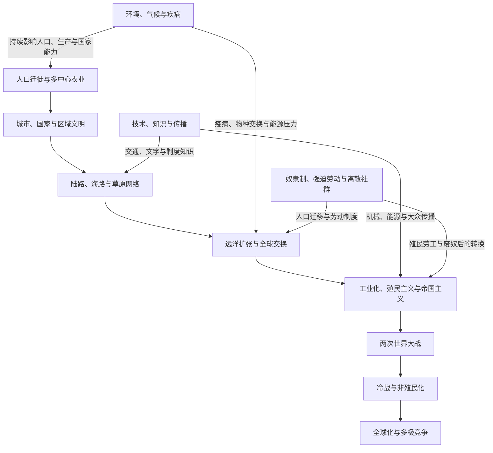

# 世界历史通史

## 概括

本目录放置不适合归入单一区域的世界历史横向主题。它以大时间线、人口与城市、跨区域网络、海洋扩张、工业化、世界大战、冷战和全球化为时间骨架，并以环境与疾病、技术与知识、奴隶制与强迫劳动作为贯穿各时期的比较视角；具体国家、文明、人物、战争与制度仍回到各区域目录维护。

## 对象与职责

- **全球比较专题**：比较多个地区共同经历的长期过程，不代替各区域自身的分期。
- **跨区域网络**：处理商路、海洋、迁徙、技术、疾病和劳动制度等跨境联系。
- **世界时间坐标**：提供横向对照，帮助读者判断不同文明处于同时代的哪些阶段。
- **不收纳单一文明或国家通史**：完整文明、帝国和国家笔记以其核心历史区域为规范地址，再由本目录的比较专题链接进入。

## 世界历史主线

## 主题导航

| 主题 | 入口 | 说明 |
|---|---|---|
| 世界历史总时间线 | [世界历史总时间线](/%E4%BA%BA%E6%96%87%E7%A7%91%E5%AD%A6/%E5%8E%86%E5%8F%B2/_%E9%80%9A%E5%8F%B2/%E4%B8%96%E7%95%8C%E5%8E%86%E5%8F%B2%E6%80%BB%E6%97%B6%E9%97%B4%E7%BA%BF.md) | 在同一尺度中比较各区域长期变化，避免只采用欧洲分期。 |
| 人口、农业与城市 | [人口迁徙、农业与城市文明](/%E4%BA%BA%E6%96%87%E7%A7%91%E5%AD%A6/%E5%8E%86%E5%8F%B2/_%E9%80%9A%E5%8F%B2/%E4%BA%BA%E5%8F%A3%E8%BF%81%E5%BE%99%E3%80%81%E5%86%9C%E4%B8%9A%E4%B8%8E%E5%9F%8E%E5%B8%82%E6%96%87%E6%98%8E.md) | 人类扩散、多中心农业、定居、城市和国家形成。 |
| 前现代交流网络 | [丝绸之路、印度洋与跨撒哈拉网络](/%E4%BA%BA%E6%96%87%E7%A7%91%E5%AD%A6/%E5%8E%86%E5%8F%B2/_%E9%80%9A%E5%8F%B2/%E4%B8%9D%E7%BB%B8%E4%B9%8B%E8%B7%AF%E3%80%81%E5%8D%B0%E5%BA%A6%E6%B4%8B%E4%B8%8E%E8%B7%A8%E6%92%92%E5%93%88%E6%8B%89%E7%BD%91%E7%BB%9C.md) | 商路、港市、草原、季风和沙漠交通的比较。 |
| 海洋扩张与大西洋世界 | [大航海、哥伦布大交换与大西洋世界](/%E4%BA%BA%E6%96%87%E7%A7%91%E5%AD%A6/%E5%8E%86%E5%8F%B2/_%E9%80%9A%E5%8F%B2/%E5%A4%A7%E8%88%AA%E6%B5%B7%E3%80%81%E5%93%A5%E4%BC%A6%E5%B8%83%E5%A4%A7%E4%BA%A4%E6%8D%A2%E4%B8%8E%E5%A4%A7%E8%A5%BF%E6%B4%8B%E4%B8%96%E7%95%8C.md) | 远洋航线、殖民征服、奴隶贸易、物种与白银流动。 |
| 工业化与帝国主义 | [工业革命、殖民主义与帝国主义](/%E4%BA%BA%E6%96%87%E7%A7%91%E5%AD%A6/%E5%8E%86%E5%8F%B2/_%E9%80%9A%E5%8F%B2/%E5%B7%A5%E4%B8%9A%E9%9D%A9%E5%91%BD%E3%80%81%E6%AE%96%E6%B0%91%E4%B8%BB%E4%B9%89%E4%B8%8E%E5%B8%9D%E5%9B%BD%E4%B8%BB%E4%B9%89.md) | 能源、生产、城市、殖民统治和全球不平等。 |
| 两次世界大战 | [两次世界大战](/%E4%BA%BA%E6%96%87%E7%A7%91%E5%AD%A6/%E5%8E%86%E5%8F%B2/_%E9%80%9A%E5%8F%B2/%E4%B8%A4%E6%AC%A1%E4%B8%96%E7%95%8C%E5%A4%A7%E6%88%98.md) | 全球战场、帝国动员、大规模暴力与战后重组。 |
| 冷战与当代世界 | [冷战、非殖民化与全球化](/%E4%BA%BA%E6%96%87%E7%A7%91%E5%AD%A6/%E5%8E%86%E5%8F%B2/_%E9%80%9A%E5%8F%B2/%E5%86%B7%E6%88%98%E3%80%81%E9%9D%9E%E6%AE%96%E6%B0%91%E5%8C%96%E4%B8%8E%E5%85%A8%E7%90%83%E5%8C%96.md) | 两极竞争、独立建国、不结盟运动和全球化。 |
| 环境、气候与疾病 | [环境、气候与疾病史](/%E4%BA%BA%E6%96%87%E7%A7%91%E5%AD%A6/%E5%8E%86%E5%8F%B2/_%E9%80%9A%E5%8F%B2/%E7%8E%AF%E5%A2%83%E3%80%81%E6%B0%94%E5%80%99%E4%B8%8E%E7%96%BE%E7%97%85%E5%8F%B2.md) | 气候、农业、城市疫病、物种交换、工业污染、公共卫生与全球变暖。 |
| 技术、知识与传播 | [技术、知识与传播史](/%E4%BA%BA%E6%96%87%E7%A7%91%E5%AD%A6/%E5%8E%86%E5%8F%B2/_%E9%80%9A%E5%8F%B2/%E6%8A%80%E6%9C%AF%E3%80%81%E7%9F%A5%E8%AF%86%E4%B8%8E%E4%BC%A0%E6%92%AD%E5%8F%B2.md) | 文字、工匠知识、印刷、航海、火药、能源、通信和数字化。 |
| 奴隶制与强迫劳动 | [奴隶制、强迫劳动与离散社群](/%E4%BA%BA%E6%96%87%E7%A7%91%E5%AD%A6/%E5%8E%86%E5%8F%B2/_%E9%80%9A%E5%8F%B2/%E5%A5%B4%E9%9A%B6%E5%88%B6%E3%80%81%E5%BC%BA%E8%BF%AB%E5%8A%B3%E5%8A%A8%E4%B8%8E%E7%A6%BB%E6%95%A3%E7%A4%BE%E7%BE%A4.md) | 比较奴役、债役、农奴、徭役、契约劳工、殖民强迫劳动、废奴和离散社群。 |
| 帝国时空对照 | [世界大帝国时空图](/%E4%BA%BA%E6%96%87%E7%A7%91%E5%AD%A6/%E5%8E%86%E5%8F%B2/_%E9%80%9A%E5%8F%B2/%E4%B8%96%E7%95%8C%E5%A4%A7%E5%B8%9D%E5%9B%BD%E6%97%B6%E7%A9%BA%E5%9B%BE.md) | 横向比较各时期大帝国的时间、空间和相互关系。 |

## 返回地区与文明入口

完整的地区入口和“按文明 / 历史共同体”入口统一由[历史总览](/%E4%BA%BA%E6%96%87%E7%A7%91%E5%AD%A6/%E5%8E%86%E5%8F%B2/README.md)维护，避免在两个总览页重复更新同一张导航表。

## 整理原则

- 世界级专题保留比较框架、主要机制和跨区域链接，不复制各国通史。
- 采用多中心视角，不把欧洲扩张写成其他地区进入历史的起点。
- 同一过程同时说明交流、冲突、强制迁徙和地方主动性。
- 全球分期只是导航工具；具体地区仍采用适合自身历史的阶段划分。

## 相关笔记

- [历史](/%E4%BA%BA%E6%96%87%E7%A7%91%E5%AD%A6/%E5%8E%86%E5%8F%B2/README.md)
