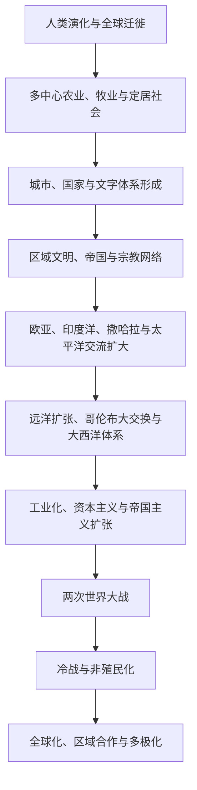

# 世界历史总时间线

## 概括

世界历史总时间线用于把各区域同时发生的长期变化放在同一尺度中比较。它不是把所有地区套进单一“古代—中世纪—近代”分期，而是观察人口迁徙、生产方式、城市与国家、跨区域网络、工业化、帝国体系和全球政治如何先后扩展并彼此影响。

## 总体演进

## 大时间线

| 时段 | 全球性过程 | 阅读提示 |
|---|---|---|
| 约30万年前起 | 智人在非洲出现，随后多次扩散到其他大陆 | 人类迁徙不是一次单线移动，各群体之间存在分化、交流与融合。 |
| 约前1万纪起 | 多个地区独立发展农业、牧业与定居生活 | 农业并非只起源于西亚，也不是所有社会必然采用的唯一道路。 |
| 约前4千纪起 | 西亚、北非、南亚、东亚及后来美洲出现城市与国家 | 城市化、文字、税贡和国家形成的时间与机制各不相同。 |
| 前1千纪—公元1千纪 | 大型帝国、世界性宗教与跨区域商路扩展 | 地中海、草原、丝绸之路、印度洋和撒哈拉网络互相连接。 |
| 约1000—1500年 | 区域国家、商业城市和海陆网络进一步密集 | 宋元中国、伊斯兰世界、印度洋港市、非洲王国和美洲文明都具有重要发展。 |
| 约1450—1800年 | 欧洲远洋扩张、大西洋奴隶贸易与全球物种交换 | 海洋联系强化，但亚洲、非洲和美洲社会并非被动背景。 |
| 约1750—1914年 | 工业化、民族国家、资本主义与新帝国主义 | 技术和生产能力扩大，同时伴随殖民征服、劳工强制与环境改变。 |
| 1914—1945年 | 两次世界大战、革命、经济危机与大规模暴力 | 欧洲、亚洲、非洲和太平洋战场共同构成全球战争。 |
| 1945—1991年 | 冷战、非殖民化、发展主义与区域冲突 | 美苏竞争与地方革命、国家建构和不结盟运动交织。 |
| 1991年至今 | 全球化深化、区域合作、数字网络与多极竞争 | 全球联系加强并未消除国家、地区和社会之间的不平等与冲突。 |

## 区域入口

- [东亚](/%E4%BA%BA%E6%96%87%E7%A7%91%E5%AD%A6/%E5%8E%86%E5%8F%B2/%E4%B8%9C%E4%BA%9A/README.md)、[东南亚](/%E4%BA%BA%E6%96%87%E7%A7%91%E5%AD%A6/%E5%8E%86%E5%8F%B2/%E4%B8%9C%E5%8D%97%E4%BA%9A/README.md)、[南亚](/%E4%BA%BA%E6%96%87%E7%A7%91%E5%AD%A6/%E5%8E%86%E5%8F%B2/%E5%8D%97%E4%BA%9A/README.md)
- [中亚](/%E4%BA%BA%E6%96%87%E7%A7%91%E5%AD%A6/%E5%8E%86%E5%8F%B2/%E4%B8%AD%E4%BA%9A/README.md)、[西亚](/%E4%BA%BA%E6%96%87%E7%A7%91%E5%AD%A6/%E5%8E%86%E5%8F%B2/%E8%A5%BF%E4%BA%9A/README.md)、[北非](/%E4%BA%BA%E6%96%87%E7%A7%91%E5%AD%A6/%E5%8E%86%E5%8F%B2/%E5%8C%97%E9%9D%9E/README.md)
- [欧洲](/%E4%BA%BA%E6%96%87%E7%A7%91%E5%AD%A6/%E5%8E%86%E5%8F%B2/%E6%AC%A7%E6%B4%B2/README.md)、[非洲](/%E4%BA%BA%E6%96%87%E7%A7%91%E5%AD%A6/%E5%8E%86%E5%8F%B2/%E9%9D%9E%E6%B4%B2/README.md)
- [美洲](/%E4%BA%BA%E6%96%87%E7%A7%91%E5%AD%A6/%E5%8E%86%E5%8F%B2/%E7%BE%8E%E6%B4%B2/README.md)、[大洋洲](/%E4%BA%BA%E6%96%87%E7%A7%91%E5%AD%A6/%E5%8E%86%E5%8F%B2/%E5%A4%A7%E6%B4%8B%E6%B4%B2/README.md)

## 关键辨析

- “古代、中世纪、近代”主要来自欧洲史分期，不能无条件套用于所有地区。
- 全球联系增强不等于各地趋同；同一技术、宗教或制度会在不同社会中被重新解释。
- 帝国、国家、民族和文明是不同分析层次，不能相互替代。
- 世界历史总览只提供同时性与联系框架，具体事实应回到区域笔记核对。
