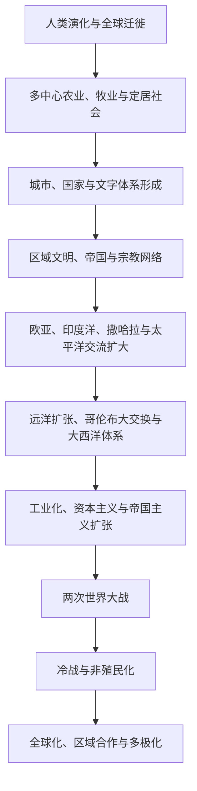

# 世界历史总时间线

## 概括

世界历史总时间线用于把各区域同时发生的长期变化放在同一尺度中比较。它不是把所有地区套进单一“古代—中世纪—近代”分期，而是观察人口迁徙、生产方式、城市与国家、跨区域网络、工业化、帝国体系和全球政治如何先后扩展并彼此影响。

## 总体演进

## 大时间线

| 时段 | 全球性过程 | 阅读提示 |
|---|---|---|
| 约30万年前起 | 智人在非洲出现，随后多次扩散到其他大陆 | 人类迁徙不是一次单线移动，各群体之间存在分化、交流与融合。 |
| 约前1万纪起 | 多个地区独立发展农业、牧业与定居生活 | 农业并非只起源于西亚，也不是所有社会必然采用的唯一道路。 |
| 约前4千纪起 | 西亚、北非、南亚、东亚及后来美洲出现城市与国家 | 城市化、文字、税贡和国家形成的时间与机制各不相同。 |
| 前1千纪—公元1千纪 | 大型帝国、世界性宗教与跨区域商路扩展 | 地中海、草原、丝绸之路、印度洋和撒哈拉网络互相连接。 |
| 约1000—1500年 | 区域国家、商业城市和海陆网络进一步密集 | 宋元中国、伊斯兰世界、印度洋港市、非洲王国和美洲文明都具有重要发展。 |
| 约1450—1800年 | 欧洲远洋扩张、大西洋奴隶贸易与全球物种交换 | 海洋联系强化，但亚洲、非洲和美洲社会并非被动背景。 |
| 约1750—1914年 | 工业化、民族国家、资本主义与新帝国主义 | 技术和生产能力扩大，同时伴随殖民征服、劳工强制与环境改变。 |
| 1914—1945年 | 两次世界大战、革命、经济危机与大规模暴力 | 欧洲、亚洲、非洲和太平洋战场共同构成全球战争。 |
| 1945—1991年 | 冷战、非殖民化、发展主义与区域冲突 | 美苏竞争与地方革命、国家建构和不结盟运动交织。 |
| 1991年至今 | 全球化深化、区域合作、数字网络与多极竞争 | 全球联系加强并未消除国家、地区和社会之间的不平等与冲突。 |

## 跨区域同步比较矩阵

这张表用来回答“同一时期其他地区在发生什么”，而不是把所有地区强行套入欧洲式分期。每个单元格只保留结构性变化，具体政权顺序回到地区笔记查阅。

| 时段 | 东亚 | 南亚与东南亚 | 中亚、西亚与北非 | 欧洲 | 撒哈拉以南非洲 | 美洲与大洋洲 |
|---|---|---|---|---|---|---|
| 约前1万纪—前4000年 | 黄河、长江及东北等地出现多中心栽培、定居与陶器传统 | 印度河流域、恒河地区及新几内亚高地等地发展栽培；东南亚维持多样采集—园艺经济 | 新月沃地的谷物、羊和山羊驯化扩散，并与安纳托利亚、尼罗河定居网络相连 | 东南欧农业受西亚传播影响，西北部较晚形成农业社会 | 萨赫勒和西非形成独立的植物驯化与牧业路径，班图语人群扩散尚未全面展开 | 墨西哥、中安第斯等地独立驯化作物；澳大利亚和太平洋多数地区继续以高度适应环境的采集、渔猎和火管理为主 |
| 前4000—前1200年 | 城邑、青铜技术、文字与王权在黄河流域逐步结合 | 印度河城市体系兴衰；恒河与德干的农业、聚落和交换扩展 | 美索不达米亚、埃及和安纳托利亚形成城市国家、王国、文字与远距贸易 | 爱琴海宫殿社会、矿产网络和农业聚落发展，城市国家尚未成为唯一模式 | 尼罗河上游、萨赫勒和西非的牧业、冶金与交换网络逐渐复杂化 | 安第斯祭祀中心与灌溉社会发展；中部美洲村落和早期公共建筑出现；南岛语人群开始远距离海洋扩散 |
| 前1200—前300年 | 周代封建网络、列国竞争、铁器与官僚化并行 | 恒河国家、城市化与佛教、耆那教等思想传统形成；东南亚海陆交换加强 | 青铜时代体系崩溃后出现新亚述、巴比伦和波斯帝国，腓尼基等航海网络扩大 | 希腊城邦、殖民和地中海贸易发展，罗马仍由区域城邦走向共和国 | 努比亚库施国家、西非铁器社会和跨地区迁徙扩展 | 奥尔梅克等中部美洲传统、安第斯查文网络和北美土丘社会发展；拉皮塔人向远大洋洲扩散 |
| 前300—300年 | 秦汉建立大一统官僚帝国并连接草原和丝路 | 孔雀王朝、贵霜与南亚区域国家并存；东南亚港口受到印度洋贸易推动 | 希腊化王国、安息、罗马东方与草原政权交错，红海—印度洋贸易增强 | 罗马从共和国扩张为帝国，地中海被整合为税粮、道路与城市网络 | 阿克苏姆兴起，萨赫勒、班图语人群和印度洋沿岸网络继续扩展 | 特奥蒂瓦坎、玛雅早期城市和安第斯区域国家形成；波利尼西亚航海扩散继续 |
| 300—900年 | 中国经历分裂再统一，隋唐与草原、朝鲜、日本和海上网络互动 | 笈多及后继国家并立；东南亚扶南、真腊、室利佛逝等连接印度洋与南海 | 萨珊与拜占庭竞争后，哈里发帝国扩张并形成阿拉伯语—伊斯兰跨区域网络 | 西罗马解体后多王国并立，拜占庭延续，拉丁基督教和法兰克权力重组 | 阿克苏姆转型，萨赫勒国家与跨撒哈拉贸易增长，东非斯瓦希里港市萌芽 | 玛雅古典城市、特奥蒂瓦坎及安第斯莫切—瓦里等体系发展；波利尼西亚社会向更远岛屿扩散 |
| 900—1500年 | 宋辽金夏并立、元朝及明初重组东亚，商业化与海运扩大 | 朱罗海权、德里苏丹国和区域王国并存；吴哥、蒲甘、满者伯夷等控制稻作区与港口 | 突厥化、塞尔柱、蒙古和帖木儿扩张重组欧亚，埃及与西亚多中心并立 | 封建权利、城市、教会、王国和商业联盟并存，黑死病与战争改变劳动力和财政 | 加纳、马里、桑海等萨赫勒国家及大津巴布韦、斯瓦希里港市连接金、盐与海洋贸易 | 密西西比文化、阿兹特克、玛雅后古典政体与印加帝国发展；毛利人在新西兰定居并形成区域社会 |
| 1450—1750年 | 明清完成帝国更替，白银贸易和海禁—开放循环把中国、日本、东南亚接入全球市场 | 莫卧儿及德干诸国、东南亚港市和陆上王朝并存，欧洲公司逐步取得贸易与领土据点 | 奥斯曼、萨法维、中亚汗国构成火器与商路帝国体系 | 王权国家、宗教改革、财政军事竞争和远洋帝国同时扩张 | 大西洋奴隶贸易冲击西非和中非，内陆国家与东非印度洋贸易仍按地区差异演变 | 征服、疫病和强迫劳动摧毁并重组美洲社会；殖民地与逃奴社群形成；太平洋岛屿仍保持多样主权体系 |
| 1750—1914年 | 清帝国由扩张转向内外危机，日本明治国家工业化，东亚被纳入不平等条约体系 | 英属印度形成，东南亚多数地区殖民化，暹罗以改革维持独立 | 俄英扩张压缩中亚和西亚自主空间，奥斯曼与伊朗改革并受债务和列强干预 | 工业革命、民族国家、工人运动与帝国主义共同发展 | 奴隶贸易废止并未终结强迫劳动；瓜分非洲后殖民国家以税收、劳役和边界重组社会 | 美洲独立国家扩张并排斥原住民，奴隶制逐步废除；澳大利亚、新西兰殖民国家形成，太平洋岛屿遭瓜分 |
| 1914—1945年 | 中国革命与战争、日本帝国扩张及太平洋战争相互交织 | 南亚民族运动扩大，东南亚遭殖民动员和日本占领 | 奥斯曼解体、委任统治和民族国家形成，中亚纳入苏联 | 两次世界大战、革命、法西斯主义和大屠杀摧毁旧帝国体系 | 殖民军人和资源被卷入两次大战，城市工人、退伍军人与民族主义组织增长 | 美国成为世界强国，拉丁美洲经历国家主义与外部干预；太平洋成为世界大战主战场之一 |
| 1945—1991年 | 中国革命、朝鲜战争、冷战分裂与出口工业化并存 | 南亚分治独立，东南亚革命、战争与发展型国家并存 | 冷战、石油政治、阿以冲突、革命与威权国家交织 | 欧洲殖民帝国瓦解，东西冷战分裂后走向共同体整合 | 非殖民化建立新国家，边界、债务、发展战略与代理战争塑造政治 | 美国主导西方联盟，拉美革命与军事政变并行；太平洋岛屿逐步独立或形成自由联合关系 |
| 1991年至今 | 产业链、数字化、人口老龄化与地区安全竞争并存 | 高增长与不平等、宗教民族政治、城市化和海洋竞争并存 | 苏联解体后国家重建，中东战争、能源转型与社会运动持续 | 欧盟扩大后面对金融、移民、安全与内部整合压力 | 选举政治、城市化、区域组织和资源经济发展，同时面对债务、冲突与气候脆弱性 | 美洲民主化与政治极化并存；原住民主权、迁移、气候风险和太平洋地缘竞争上升 |

## 全球转折的因果层次

| 转折 | 长期结构因素 | 加速机制 | 直接触发或表现 | 不能简化为 |
|---|---|---|---|---|
| 农业与定居扩展 | 气候稳定、可驯化物种、人群知识积累和生态管理 | 人口增长、储藏、土地权利与技术传播 | 多地分别出现栽培、牧业和村落 | 一次从西亚向全世界的单线“农业革命” |
| 城市与国家形成 | 灌溉或雨养农业剩余、贸易节点、宗教组织和战争 | 税贡、文字、度量衡、专业军队与公共工程 | 城市中心、王权和官僚机构出现 | “有河流就必然产生专制国家” |
| 大型帝国扩张 | 人口与财政基础、交通、军队组织和边疆联盟 | 道路、驿站、铸币、宗教或法律整合 | 征服多个生态区和族群 | 只靠一位征服者或一种武器 |
| 跨区域宗教与知识网络 | 商路、城市、翻译、朝圣和教育机构 | 国家赞助、侨民社群、纸张与书籍传播 | 佛教、基督教、伊斯兰教等跨越原生地区 | 思想不变地从中心复制到边缘 |
| 远洋体系形成 | 航海经验、国家财政、商业资本和对贵金属、香料的需求 | 火炮船、海图、港口据点、公司和殖民暴力 | 大西洋航线、哥伦布大交换与全球贸易常态化 | 单纯的“地理发现”或欧洲技术必然胜利 |
| 工业化扩散 | 能源、工资与市场结构、资本、国家制度和全球资源 | 蒸汽、电力、化石燃料、工厂纪律和交通革命 | 生产率、城市化与军事实力快速上升 | 一项发明自动造成现代化 |
| 帝国主义与民族国家扩张 | 工业能力、财政军事竞争、种族主义与资本输出 | 铁路、电报、医学、征兵与边界测绘 | 殖民瓜分、人口分类和同化政策 | 欧洲国家单方面、无地方合作者或抵抗者地占领 |
| 两次世界大战 | 联盟、安全困境、帝国竞争、民族主义和经济危机 | 总体战动员、工业杀伤、宣传和种族政治 | 1914 年危机、1939 年侵略扩大战争 | 只由一次刺杀或单一独裁者造成 |
| 非殖民化 | 殖民社会组织、战争动员、帝国财政衰弱和国际规范变化 | 政党、工会、游击战、谈判与联合国舞台 | 独立浪潮和领土重组 | 殖民者主动“赠予”独立 |
| 当代全球化与多极化 | 产业链、金融、能源、人口与数字网络相互依赖 | 集装箱、航空、互联网、跨国制度和移民 | 生产跨境分工、信息即时传播与大国竞争并存 | 国家消失或世界必然趋同 |

## 同时性阅读要点

- **“青铜时代崩溃”主要描述东地中海和西亚部分地区**，不能作为前 12 世纪全世界的统一断代。
- **公元 5 世纪西罗马政治解体不是全球“古代结束”**：同时期东罗马、萨珊、南亚、东亚、非洲和美洲都沿自身轨迹重组。
- **约 1200—1350 年的欧亚连接既有蒙古帝国的军事统一，也有商人、使节、工匠、宗教人士和疾病传播**；不能只写征服。
- **约 1500 年后的全球联系是不对称整合**：美洲人口灾难、非洲强迫迁徙、亚洲商业力量和欧洲海权扩张同时存在。
- **工业革命首先集中于少数地区**，其全球扩散依赖殖民资源、劳工、市场和国家政策，不是所有社会同步进入同一阶段。
- **1945 年后的“冷战”与“非殖民化”必须并读**：许多冲突既有美苏竞争，也有土地、族群、阶级和建国问题，不能全部解释为代理战争。
- **1991 年不是历史终点**：苏联解体结束了两极格局，却没有终结帝国遗产、地区战争、国家竞争或全球不平等。

## 区域入口

- [东亚](/%E4%BA%BA%E6%96%87%E7%A7%91%E5%AD%A6/%E5%8E%86%E5%8F%B2/%E4%B8%9C%E4%BA%9A/README.md)、[东南亚](/%E4%BA%BA%E6%96%87%E7%A7%91%E5%AD%A6/%E5%8E%86%E5%8F%B2/%E4%B8%9C%E5%8D%97%E4%BA%9A/README.md)、[南亚](/%E4%BA%BA%E6%96%87%E7%A7%91%E5%AD%A6/%E5%8E%86%E5%8F%B2/%E5%8D%97%E4%BA%9A/README.md)
- [中亚](/%E4%BA%BA%E6%96%87%E7%A7%91%E5%AD%A6/%E5%8E%86%E5%8F%B2/%E4%B8%AD%E4%BA%9A/README.md)、[西亚](/%E4%BA%BA%E6%96%87%E7%A7%91%E5%AD%A6/%E5%8E%86%E5%8F%B2/%E8%A5%BF%E4%BA%9A/README.md)、[北非](/%E4%BA%BA%E6%96%87%E7%A7%91%E5%AD%A6/%E5%8E%86%E5%8F%B2/%E5%8C%97%E9%9D%9E/README.md)
- [欧洲](/%E4%BA%BA%E6%96%87%E7%A7%91%E5%AD%A6/%E5%8E%86%E5%8F%B2/%E6%AC%A7%E6%B4%B2/README.md)、[非洲](/%E4%BA%BA%E6%96%87%E7%A7%91%E5%AD%A6/%E5%8E%86%E5%8F%B2/%E9%9D%9E%E6%B4%B2/README.md)
- [美洲](/%E4%BA%BA%E6%96%87%E7%A7%91%E5%AD%A6/%E5%8E%86%E5%8F%B2/%E7%BE%8E%E6%B4%B2/README.md)、[大洋洲](/%E4%BA%BA%E6%96%87%E7%A7%91%E5%AD%A6/%E5%8E%86%E5%8F%B2/%E5%A4%A7%E6%B4%8B%E6%B4%B2/README.md)

## 关键辨析

- “古代、中世纪、近代”主要来自欧洲史分期，不能无条件套用于所有地区。
- 全球联系增强不等于各地趋同；同一技术、宗教或制度会在不同社会中被重新解释。
- 帝国、国家、民族和文明是不同分析层次，不能相互替代。
- 世界历史总览只提供同时性与联系框架，具体事实应回到区域笔记核对。
