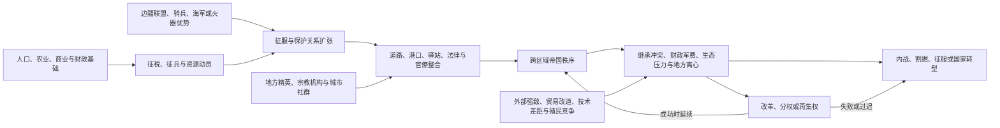

# 世界大帝国时空图

## 概括

本笔记按“时间纵轴 + 地区横轴”整理主要文明、王朝和帝国的并行关系，时间范围大致从公元前4000年到第一次世界大战前夕。它适合用来比较同一时期不同地区的大国格局，例如罗马帝国、汉帝国、阿拉伯帝国、蒙古帝国、奥斯曼帝国、清帝国和近代欧洲殖民帝国的时间重叠。

## 帝国形成与解体机制

这张图表示常见机制而非固定循环。帝国可能因征服形成，也可能由联盟、朝贡、贸易控制或殖民公司逐步扩展；解体后也不一定“文明消失”，人口、制度、城市、语言和边界往往被后继国家继承。

## 原有时空图

## 阅读方式

- 横向按地区排列，主要包括欧洲、北非、两河流域 / 巴勒斯坦、小亚细亚半岛、伊朗、中亚、西域、北方草原、中国、朝鲜 / 日本、印度北部等区域。
- 纵向按时间排列，上方是公元前，下方进入公元后，底部到1914年第一次世界大战前。
- 色块表示政权或帝国的大致存在时间和空间范围；黑色区域用于表示该政权的大致空间范围。
- 紫色圆圈数字对应人物索引，位置大致表示人物活动或影响发生的年代。
- 蓝字、绿字、红字多用于标注重要人物、事件、文化节点或超出主图范围的说明。

## 大帝国主线

| 阶段 | 大致时间 | 主线概括 | 代表政权 / 帝国 |
|---|---:|---|---|
| 古代文明形成 | 前4000年-前1000年 | 大河流域文明先后出现，国家形态从城邦、早期王国走向区域帝国。 | 埃及古王国、阿卡德王国、乌尔第三王朝、商王国、赫梯、亚述早期政权 |
| 古代帝国扩张 | 前1000年-前300年 | 西亚帝国化明显，地中海世界和中国进入大一统前夜。 | 新亚述帝国、新巴比伦王国、阿契美尼德波斯帝国、秦帝国、亚历山大帝国 |
| 古典帝国并立 | 前300年-300年 | 欧亚大陆出现多个大帝国并存格局。 | 罗马共和国 / 罗马帝国、汉帝国、安息帝国、贵霜帝国、塞琉古王朝 |
| 中古宗教帝国 | 300年-900年 | 基督教、伊斯兰教和佛教世界的政治结构扩大，欧亚多中心并立。 | 拜占庭帝国、萨珊王朝、阿拉伯帝国、唐帝国、吐蕃、查理曼帝国 |
| 草原与伊斯兰重组 | 900年-1300年 | 草原帝国和伊斯兰王朝深刻改变欧亚交通与权力格局。 | 辽、金、宋、西夏、塞尔柱突厥、花剌子模、蒙古帝国、元帝国 |
| 近世帝国体系 | 1300年-1700年 | 火器帝国、海洋扩张和区域大一统政权并行。 | 奥斯曼帝国、帖木儿帝国、莫卧儿帝国、明帝国、清帝国、西班牙帝国、葡萄牙帝国 |
| 近代殖民与民族国家 | 1700年-1914年 | 欧洲海权帝国扩张，传统大陆帝国与民族国家体系并存。 | 大英帝国、法兰西殖民帝国、俄罗斯帝国、奥匈帝国、德意志帝国、奥斯曼帝国、清帝国、日本帝国 |

## 区域对照

| 区域 | 主要脉络 |
|---|---|
| 欧洲 | 希腊城邦与马其顿之后，罗马统一地中海；西罗马崩溃后出现法兰克、神圣罗马、拜占庭、奥斯曼入欧和近代欧洲列强。 |
| 北非 | 古埃及长期延续，后受波斯、希腊化、罗马、拜占庭和阿拉伯帝国影响；近世又进入奥斯曼和欧洲殖民体系。 |
| 两河流域 / 巴勒斯坦 | 苏美尔、阿卡德、巴比伦、亚述、新巴比伦、波斯、希腊化、罗马 / 拜占庭、阿拉伯、蒙古、奥斯曼等势力反复更替。 |
| 伊朗 | 埃兰、米底、阿契美尼德、安息、萨珊、阿拉伯征服后伊斯兰化，再经塞尔柱、蒙古、帖木儿、萨法维等政权重组。 |
| 中亚与草原 | 斯基泰、匈奴、突厥、回鹘、蒙古等游牧或半游牧势力连接东西方，对中国、西亚和东欧都产生压力。 |
| 中国 | 夏商周到秦汉形成帝国传统；魏晋南北朝分裂后隋唐重建统一；宋辽金夏并立，元明清延续大一统王朝。 |
| 朝鲜 / 日本 | 朝鲜半岛从古朝鲜、三国、统一新罗、高丽到朝鲜王朝；日本从绳文、弥生、古坟、大和、奈良、平安到幕府与近代日本。 |
| 印度北部 | 印度河文明之后，孔雀王朝、贵霜、笈多、德里苏丹国、莫卧儿帝国和英属印度构成主要线索。 |
| 东南亚 | 早期港市、扶南与真腊之后，吴哥、蒲甘、室利佛逝、满者伯夷、阿瑜陀耶、东吁与阮氏等依稻作平原、河流和海峡网络形成不同类型国家；不能只视为印度或中国的边缘。 |
| 撒哈拉以南非洲 | 库施、阿克苏姆、萨赫勒诸国、大津巴布韦、刚果及埃塞俄比亚等通过尼罗河、跨撒哈拉、红海和印度洋网络发展，政治集中程度与边界形态因生态区而异。 |
| 美洲 | 玛雅并非单一帝国；特奥蒂瓦坎、托尔特克、阿兹特克联盟、印加帝国及密西西比文化等体现城市网络、贡赋联盟和道路帝国等不同组织方式。 |
| 大洋洲 | 南岛语扩散建立跨岛航海社会；汤加等形成海上霸权和贡赋网络，夏威夷、塔希提、新西兰等在不同时间出现酋邦或王国，疆域不能以大陆帝国标准衡量。 |

## 跨区域帝国同步比较矩阵

“帝国”在这里指能够持续支配多个地区、政治共同体或族群，并把资源向中心或统治联盟汇集的政治结构。它可以是领土国家、贡赋联盟、海上网络或殖民体系，不要求所有边界都被同等直接统治。

| 时段 | 西亚与北非 | 欧洲 | 东亚与中亚 | 南亚与东南亚 | 撒哈拉以南非洲 | 美洲与大洋洲 | 比较重点 |
|---|---|---|---|---|---|---|---|
| 前3000—前1200年 | 埃及王国、美索不达米亚城邦与区域王朝、赫梯等形成税贡和宫殿体系 | 爱琴海宫殿国家及东南欧区域中心发展 | 中国早期城邑、商王权与草原—农耕交换网络形成 | 印度河城市体系；南亚与东南亚其他地区存在多种村落、港口和酋邦路径 | 努比亚国家、尼罗河与萨赫勒交换网络发展 | 安第斯祭祀中心、中部美洲早期公共建筑；拉皮塔航海网络起步 | 国家形成多中心，文字、城市和王权并非同步出现 |
| 前900—前300年 | 新亚述、新巴比伦与阿契美尼德波斯建立跨地区帝国 | 雅典、斯巴达、马其顿和罗马早期扩张，城邦与联盟仍重要 | 周代列国竞争、游牧联盟和秦的领土国家化 | 恒河诸国与孔雀王朝前夜；东南亚海路交流扩大 | 库施王国、西非铁器与聚落网络发展 | 奥尔梅克传统、查文网络和北美土丘中心发展 | 驿道、行省、铸币、常备军与地方精英合作扩大统治半径 |
| 前300—300年 | 塞琉古、安息、托勒密埃及与罗马东方竞争 | 罗马从共和国扩张为地中海帝国 | 秦汉帝国、匈奴联盟及西域诸政权互动 | 孔雀、贵霜、百乘等国家并立；东南亚港口接入印度洋 | 阿克苏姆兴起，萨赫勒和东非网络扩展 | 特奥蒂瓦坎、玛雅城市和安第斯区域国家成长；太平洋航海继续 | 大帝国并立依靠税粮、道路、军役、城市和边疆外交，而非完全同质化 |
| 300—900年 | 萨珊与拜占庭竞争，随后哈里发帝国跨越西亚北非 | 西欧后罗马诸国、拜占庭与加洛林帝国并存 | 中国分裂后隋唐统一，突厥、吐蕃、回鹘等构成多中心秩序 | 笈多及后继国家；扶南、真腊、室利佛逝和爪哇政权连接海陆贸易 | 阿克苏姆转型，萨赫勒国家、斯瓦希里港市和内陆国家发展 | 玛雅古典城邦、瓦里与蒂瓦纳科等；波利尼西亚岛屿社会分化 | 宗教、商人和翻译网络能跨越帝国边界，政治解体不等于交流中断 |
| 900—1250年 | 阿拔斯政治分权，法蒂玛、塞尔柱、阿尤布等争夺核心区 | 拜占庭、神圣罗马、诺曼和其他王国并立，十字军建立海外政权 | 宋辽金夏与草原政权并存，蒙古统一前夕跨境贸易增长 | 朱罗、德里苏丹国前期；吴哥、蒲甘、室利佛逝等控制稻作区或海峡 | 加纳、马里兴起，埃塞俄比亚和斯瓦希里城市扩大 | 托尔特克及后继政体、密西西比中心和安第斯诸国；汤加海上网络扩张 | “帝国”可通过直接行省、朝贡、港口控制或宗教合法性维系统治 |
| 1200—1500年 | 蒙古征服后伊儿汗国、帖木儿及埃及马穆鲁克等重组区域 | 蒙古冲击东欧，奥斯曼兴起，伊比利亚和西欧王权集中 | 蒙古帝国及四大汗国、元朝、明朝与后蒙古秩序 | 德里苏丹国、毗奢耶那伽罗；满者伯夷、阿瑜陀耶等海陆国家 | 马里、桑海、大津巴布韦、刚果及斯瓦希里港市发展 | 阿兹特克三方联盟、印加帝国和后古典玛雅诸国；波利尼西亚酋邦强化 | 蒙古时代连接并非世界统一；美洲和非洲同步存在大型国家与商业网络 |
| 1450—1750年 | 奥斯曼、萨法维及中亚汗国构成火器与商路帝国体系 | 西班牙、葡萄牙、荷兰、法国、英国等建立海洋殖民帝国，俄国向欧亚扩张 | 明清更替，蒙古与满洲边疆重组，日本幕府集中化 | 莫卧儿、德干诸国、缅甸和暹罗王朝并立，欧洲公司夺取沿海据点 | 刚果、奥约、阿散蒂等在贸易和战争中重组，埃塞俄比亚延续，奴隶贸易冲击地区政治 | 阿兹特克与印加遭征服，西葡殖民国家扩展；夏威夷、塔希提等岛屿王权发展 | 大陆“火器帝国”与海洋公司帝国并行；疾病、商业和地方盟友与武器同样关键 |
| 1750—1914年 | 奥斯曼、伊朗和北非改革并受欧洲债务与军事压力，中亚被俄国征服 | 英、法、俄等全球帝国扩张，德意志、意大利等民族国家形成 | 清帝国、日本帝国与俄国边疆竞争，东亚进入条约体系 | 英属印度确立，东南亚多数地区殖民化，暹罗维持缓冲独立 | 埃塞俄比亚抵抗征服，其他多数地区在“瓜分非洲”中纳入殖民统治 | 美洲共和国扩张至原住民领土；美国形成海外帝国，太平洋岛屿被列强分割 | 工业、金融、航运、电报和种族主义提高殖民控制能力，但地方抵抗和协商持续存在 |

## 帝国统治机制比较

| 机制 | 主要功能 | 常见做法 | 跨区域例子 | 脆弱点 |
|---|---|---|---|---|
| 财政与贡赋 | 把农业、商业、矿产和劳动力转为可动员资源 | 地税、户税、关税、贡品、专卖、包税和殖民公司收益 | 波斯行省贡赋、罗马税粮、汉代田赋、奥斯曼包税、印加劳役、殖民关税 | 税基萎缩、征收腐败、军费超过收入时，中央会依赖加税、借债或掠夺 |
| 军事组织 | 征服、守边和镇压内部挑战 | 常备军、封建军役、部落联盟、奴隶军、海军、征兵与雇佣兵 | 罗马军团、草原骑兵、马穆鲁克、八旗、奥斯曼禁卫军、欧洲殖民军 | 军队地方化、欠饷、继承争夺或技术落后可能使武装成为政变和割据力量 |
| 交通与信息 | 缩短命令、税粮和军队移动时间 | 道路、驿站、运河、港口、烽燧、邮政、电报 | 波斯御道、罗马道路、秦汉驰道、印加道路、蒙古驿站、英帝国电报 | 基础设施维护成本高，节点失守或贸易改道会割裂中心与边疆 |
| 地方精英合作 | 以较低成本统治多族群和远距离地区 | 保留贵族、城市议会、土司、宗教领袖、酋长和间接统治 | 阿契美尼德行省、罗马地方公民权、奥斯曼米利特、殖民“间接统治” | 精英可能截留资源、形成世袭割据，或在中央衰弱时转向对手 |
| 法律与身份 | 规定权利义务并制造帝国共同性 | 多元法律、统一法典、户籍、身份等级、公民权与臣民分类 | 罗马公民权、唐律、伊斯兰法与地方惯例、殖民种族分类 | 同化压力和不平等待遇会激化反抗；多元法也可能制造管辖冲突 |
| 宗教与政治合法性 | 解释征服、秩序和统治者权威 | 神王、天命、哈里发、护教者、转轮王、祭祀中心与王朝谱系 | 埃及法老、周秦汉天命、拜占庭皇权、哈里发、印加太阳崇拜 | 宗教分裂、预言运动、教权竞争或统治失败会削弱正统性 |
| 人口与劳动控制 | 建设工程、生产粮食和开发边疆 | 移民屯垦、劳役、奴隶制、债役、契约劳工和强制迁徙 | 亚述迁徙、汉唐屯田、印加米塔、西班牙恩贡制、大西洋奴隶制 | 人口逃亡、疫病、起义和劳动力枯竭直接破坏财政与军需 |
| 边疆外交 | 在直接统治以外建立缓冲和交换 | 朝贡、册封、婚盟、人质、边贸、附庸与保护国 | 汉匈和亲、罗马附庸国、中华朝贡、奥斯曼附庸、欧洲保护国 | 边疆伙伴具有自身目标；补贴停止或中心威慑下降时容易倒向竞争者 |
| 知识与分类 | 使人口、土地和资源“可见” | 人口普查、地图、档案、度量衡、语言翻译和民族分类 | 秦汉户籍、罗马测量、伊斯兰地理、清代舆图、殖民人口调查 | 分类会遗漏流动人口并固化族群差异，地方知识也可能抵抗中央标准 |

## 崛起、鼎盛与衰落的多因模型

| 阶段 | 结构因素 | 行动者与制度 | 外部环境 | 常见误读 |
|---|---|---|---|---|
| 建立 | 资源区互补、人口增长、贸易节点或旧秩序危机 | 军事联盟、财政改革、继承安排和政治叙事把多集团组织起来 | 邻国分裂、技术传播、气候窗口或贸易转移提供机会 | 只归因于“伟大开国君主” |
| 扩张 | 税粮和兵源能够随征服增长，交通成本可控 | 奖励军队、吸纳地方精英、设置行省或附庸 | 对手分散、边疆盟友合作、海陆通道开放 | 把胜利全归因于一种武器或民族性格 |
| 鼎盛 | 中央、地方和边疆之间形成可持续分配 | 官僚、法律、货币、宗教与公共工程降低统治成本 | 长距离贸易和相对和平增加收入 | 把版图最大时刻等同于社会各方面最繁荣 |
| 结构性衰弱 | 收入增长慢于军费，土地与财富集中，继承和代表机制失灵 | 官僚腐败、军队政治化、地方精英截留资源 | 疫病、气候波动、贸易改道和新竞争者加压 | 用“奢侈”“道德败坏”代替可检验机制 |
| 直接危机 | 财政、粮食、军队忠诚和合法性同时受损 | 宫廷政变、内战、叛乱、改革失败或权力真空 | 入侵、封锁、价格崩溃或灾害成为触发 | 把最后一场战役当成全部灭亡原因 |
| 解体或转型 | 中央不能维持跨区域再分配 | 行省独立、王朝替换、联邦化、殖民接管或民族国家化 | 对手接管关键首都、航路和税源 | 把政权灭亡写成居民、文化和制度全部消失 |

## 比较时的边界

- **帝国不等于文明**：罗马、汉、阿拉伯、蒙古或印加政权都有明确的政治兴衰，相关语言、宗教、城市和制度却可能延续更久。
- **疆域图不等于均匀控制**：首都、行省、附庸、贸易站和季节性影响区的统治强度不同，边界线往往是现代制图的简化。
- **大型国家不一定都是帝国**，小型海上网络也可能具有帝国性；判断应看是否长期支配多个政治共同体并进行不对称资源转移。
- **朝贡不自动等于直接主权**：礼仪、贸易、册封、军事保护和实际行政必须分别判断。
- **“衰落”可能是中心视角**：帝国分裂对中央是衰败，对地方精英、城市或新国家却可能是权力重组。
- **近代殖民帝国并非完全新事物**，但工业火力、全球金融、种族分类、公司法和远洋通信显著提高其控制范围与强度。
- 本页不维护各王朝完整世系；统治者顺序、复位、共治和争议继承均以相应地区或政权专页为准。

## 图中人物编号

原有时空图用紫色数字标出一组跨时代人物，位置只表示其大致生活年代或影响节点。下表保留编号是为了识读图片，不把编号顺序当作学术性的影响力排名，也不以人物替代制度、群体和跨区域过程。

| 序号 | 人物 | 序号 | 人物 | 序号 | 人物 |
|---:|---|---:|---|---:|---|
| 1 | 穆罕默德 | 2 | 牛顿 | 3 | 耶稣 |
| 4 | 释迦牟尼 | 5 | 孔子 | 6 | 圣保罗 |
| 7 | 蔡伦 | 8 | 古腾堡 | 9 | 哥伦布 |
| 10 | 爱因斯坦 | 11 | 马克思 | 12 | 巴斯德 |
| 13 | 伽利略 | 14 | 亚里士多德 | 15 | 列宁 |
| 16 | 摩西 | 17 | 达尔文 | 18 | 秦始皇 |
| 19 | 屋大维 | 20 | 毛泽东 | 21 | 成吉思汗 |
| 22 | 欧几里德 | 23 | 马丁·路德 | 24 | 哥白尼 |
| 25 | 瓦特 | 26 | 君士坦丁大帝 | 27 | 华盛顿 |
| 28 | 法拉第 | 29 | 麦克斯韦 | 30 | 莱特兄弟 |
| 31 | 拉瓦锡 | 32 | 弗洛伊德 | 33 | 亚历山大大帝 |
| 34 | 拿破仑 | 35 | 希特勒 | 36 | 莎士比亚 |
| 37 | 亚当·斯密 | 38 | 爱迪生 | 39 | 列文虎克 |
| 40 | 柏拉图 | 41 | 马可尼 | 42 | 贝多芬 |

## 使用提示

- 看欧洲史时，可重点对照罗马帝国、拜占庭帝国、法兰克 / 神圣罗马帝国、奥斯曼帝国和近代列强。
- 看中国史时，可重点对照汉帝国与罗马帝国、唐帝国与阿拉伯帝国、元帝国与蒙古四大汗国、清帝国与近代欧洲殖民帝国。
- 看西亚史时，可把阿契美尼德、亚历山大帝国、塞琉古、安息、萨珊、阿拉伯、塞尔柱、蒙古、奥斯曼串成主线。

## 相关笔记

- [欧洲历史](/%E4%BA%BA%E6%96%87%E7%A7%91%E5%AD%A6/%E5%8E%86%E5%8F%B2/%E6%AC%A7%E6%B4%B2/README.md)
- [欧洲四大帝王与四大名将](/%E4%BA%BA%E6%96%87%E7%A7%91%E5%AD%A6/%E5%8E%86%E5%8F%B2/%E6%AC%A7%E6%B4%B2/_%E9%80%9A%E5%8F%B2/%E6%AC%A7%E6%B4%B2%E5%9B%9B%E5%A4%A7%E5%B8%9D%E7%8E%8B%E4%B8%8E%E5%9B%9B%E5%A4%A7%E5%90%8D%E5%B0%86.md)
- [西亚](/%E4%BA%BA%E6%96%87%E7%A7%91%E5%AD%A6/%E5%8E%86%E5%8F%B2/%E8%A5%BF%E4%BA%9A/README.md)与[北非](/%E4%BA%BA%E6%96%87%E7%A7%91%E5%AD%A6/%E5%8E%86%E5%8F%B2/%E5%8C%97%E9%9D%9E/README.md)
- [两河流域文明](/%E4%BA%BA%E6%96%87%E7%A7%91%E5%AD%A6/%E5%8E%86%E5%8F%B2/%E8%A5%BF%E4%BA%9A/%E4%B8%A4%E6%B2%B3%E6%B5%81%E5%9F%9F/README.md)
- [阿拉伯帝国](/%E4%BA%BA%E6%96%87%E7%A7%91%E5%AD%A6/%E5%8E%86%E5%8F%B2/%E8%A5%BF%E4%BA%9A/_%E9%80%9A%E5%8F%B2/%E9%98%BF%E6%8B%89%E4%BC%AF%E5%B8%9D%E5%9B%BD/README.md)
- [伊朗](/%E4%BA%BA%E6%96%87%E7%A7%91%E5%AD%A6/%E5%8E%86%E5%8F%B2/%E8%A5%BF%E4%BA%9A/%E4%BC%8A%E6%9C%97/README.md)
- [南亚](/%E4%BA%BA%E6%96%87%E7%A7%91%E5%AD%A6/%E5%8E%86%E5%8F%B2/%E5%8D%97%E4%BA%9A/README.md)
- [印度](/%E4%BA%BA%E6%96%87%E7%A7%91%E5%AD%A6/%E5%8E%86%E5%8F%B2/%E5%8D%97%E4%BA%9A/%E5%8D%B0%E5%BA%A6/README.md)
