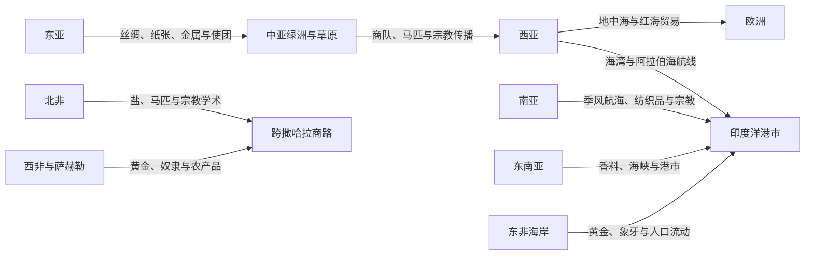

# 丝绸之路、印度洋与跨撒哈拉网络

## 概括

前现代跨区域交流由多条陆路、海路、河道和草原通道组成。“丝绸之路”不是一条固定道路，印度洋贸易依赖季风和港市，跨撒哈拉网络则连接北非、萨赫勒和西非。商人、牧民、朝圣者、军队、移民和奴隶共同推动商品、宗教、技术与疾病传播。

## 网络关系

## 网络比较

| 网络 | 主要空间 | 关键机制 | 代表性影响 |
|---|---|---|---|
| 丝绸之路 | 中国西北、中亚、伊朗、西亚与地中海 | 绿洲商队、草原政治、帝国驿路和中转贸易 | 丝绸、马匹、玻璃、纸张、佛教、伊斯兰及多种艺术技术传播。 |
| 欧亚草原网络 | 蒙古高原、哈萨克草原、黑海北岸 | 游牧联盟、马匹军事、季节迁徙和贡赐贸易 | 连接农耕帝国，推动人口、军事技术和政治制度跨区流动。 |
| 印度洋网络 | 红海、波斯湾、阿拉伯海、孟加拉湾与南海 | 季风航海、港市社群、侨商和海上帝国 | 纺织品、香料、陶瓷、宗教、语言和沿岸城市文化传播。 |
| 跨撒哈拉网络 | 马格里布、撒哈拉绿洲、萨赫勒与西非 | 骆驼商队、绿洲中转和国家保护 | 黄金、盐、奴隶、书籍和伊斯兰学术网络扩展。 |
| 地中海网络 | 南欧、北非、黎凡特与安纳托利亚 | 航海、城市、帝国税收与战争 | 谷物、金属、奴隶、宗教和法律传统长期交流。 |

## 共同特征

- 商路会随帝国兴衰、气候、安全、税收和市场变化而转移。
- 商品往往经过多次转手，远距离贸易不要求单个商人走完全程。
- 宗教传播依靠翻译、寺院、商人社群、朝圣和政治保护，而非单向“文明输出”。
- 贸易网络同时可能传播疾病、战争、奴役与环境压力。
- 港市和绿洲常具有多语言、多宗教和跨族群特征。

## 相关入口

- [中亚历史](/%E4%BA%BA%E6%96%87%E7%A7%91%E5%AD%A6/%E5%8E%86%E5%8F%B2/%E4%B8%AD%E4%BA%9A/README.md)
- [西亚历史](/%E4%BA%BA%E6%96%87%E7%A7%91%E5%AD%A6/%E5%8E%86%E5%8F%B2/%E8%A5%BF%E4%BA%9A/README.md)
- [南亚历史](/%E4%BA%BA%E6%96%87%E7%A7%91%E5%AD%A6/%E5%8E%86%E5%8F%B2/%E5%8D%97%E4%BA%9A/README.md)
- [东南亚历史](/%E4%BA%BA%E6%96%87%E7%A7%91%E5%AD%A6/%E5%8E%86%E5%8F%B2/%E4%B8%9C%E5%8D%97%E4%BA%9A/README.md)
- [北非历史](/%E4%BA%BA%E6%96%87%E7%A7%91%E5%AD%A6/%E5%8E%86%E5%8F%B2/%E5%8C%97%E9%9D%9E/README.md)
- [非洲历史](/%E4%BA%BA%E6%96%87%E7%A7%91%E5%AD%A6/%E5%8E%86%E5%8F%B2/%E9%9D%9E%E6%B4%B2/README.md)

## 关键辨析

- “丝绸之路”是后世概括性的网络名称，不等于一条连续、稳定且只运输丝绸的道路。
- 海洋和沙漠不是绝对屏障，而是需要专门技术、知识和政治保护的交通空间。
- 贸易繁荣不能掩盖强迫迁徙、奴隶贸易和军事征服。
