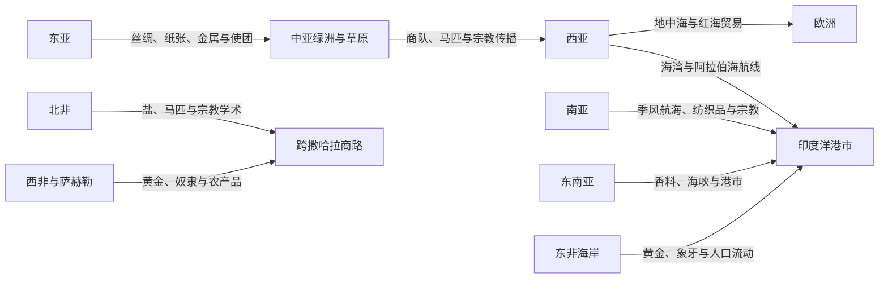

# 丝绸之路、印度洋与跨撒哈拉网络

## 概括

前现代跨区域交流由多条陆路、海路、河道和草原通道组成。“丝绸之路”不是一条固定道路，印度洋贸易依赖季风和港市，跨撒哈拉网络则连接北非、萨赫勒和西非。商人、牧民、朝圣者、军队、移民和奴隶共同推动商品、宗教、技术与疾病传播。

## 网络关系

## 网络比较

| 网络 | 主要空间 | 关键机制 | 代表性影响 |
|---|---|---|---|
| 丝绸之路 | 中国西北、中亚、伊朗、西亚与地中海 | 绿洲商队、草原政治、帝国驿路和中转贸易 | 丝绸、马匹、玻璃、纸张、佛教、伊斯兰及多种艺术技术传播。 |
| 欧亚草原网络 | 蒙古高原、哈萨克草原、黑海北岸 | 游牧联盟、马匹军事、季节迁徙和贡赐贸易 | 连接农耕帝国，推动人口、军事技术和政治制度跨区流动。 |
| 印度洋网络 | 红海、波斯湾、阿拉伯海、孟加拉湾与南海 | 季风航海、港市社群、侨商和海上帝国 | 纺织品、香料、陶瓷、宗教、语言和沿岸城市文化传播。 |
| 跨撒哈拉网络 | 马格里布、撒哈拉绿洲、萨赫勒与西非 | 骆驼商队、绿洲中转和国家保护 | 黄金、盐、奴隶、书籍和伊斯兰学术网络扩展。 |
| 地中海网络 | 南欧、北非、黎凡特与安纳托利亚 | 航海、城市、帝国税收与战争 | 谷物、金属、奴隶、宗教和法律传统长期交流。 |

## 阶段过程

| 阶段 | 欧亚陆路与草原 | 印度洋与相邻海域 | 撒哈拉—萨赫勒 | 主要转折 |
|---|---|---|---|---|
| 公元前2千纪以前至公元前1千纪 | 黑曜石、青金石、锡、玉石和马匹已通过短程交换逐级移动；草原迁徙连接农耕区边缘 | 红海、波斯湾与阿拉伯海存在沿岸和海湾航行，南亚、两河及非洲东北部交换商品 | 撒哈拉气候转干后，绿洲和区域交换仍延续，但远程运输受牲畜、补水和政治安全限制 | 跨区联系早于后世网络名称，主要依靠多段转运。 |
| 公元前2世纪—公元3世纪 | 汉朝向西经营、贵霜和安息等政权控制中段，地中海市场共同扩大欧亚奢侈品交换 | 季风知识、港口税收和罗马—红海—南亚航线使海运规模上升 | 北非与萨赫勒间已有交换，骆驼运输逐渐改善跨沙漠能力 | 帝国边界并非只会阻断，也可提供驿路、铸币、治安与需求。 |
| 4—7世纪 | 粟特等中介商人、绿洲城邦和草原政权维持多语网络；战争使线路不断改道 | 阿克苏姆、波斯湾、南亚和东南亚港市参与海上转运 | 骆驼商队和绿洲节点增强，北非政治变化重组终点市场 | 宗教、艺术和工艺随商人、僧侣、使团和移民传播。 |
| 7—10世纪 | 唐朝、中亚诸政权与哈里发世界之间保持贸易和翻译交流，政治冲突使部分路线南北转换 | 伊斯兰商业法、阿拉伯语交通圈和侨商社群把红海、海湾、东非、南亚与东南亚更紧密连接 | 伊斯兰化的北非城市与加纳等萨赫勒政权之间，黄金、盐和人口贸易扩大 | 共同的度量、信用、语言和宗教信任降低部分跨区交易成本。 |
| 10—14世纪 | 宋元时期商品化、草原帝国和蒙古统治下的驿站体系一度提高跨欧亚通行度 | 中国陶瓷、印度纺织品、东南亚香料与东非黄金进入多层港市体系；朱罗远征等显示贸易与武力并存 | 加纳、马里及马格里布城市依靠商税和商队保护发展，廷巴克图等成为学术节点 | 贸易规模扩大，侨商、经纪人与地方统治者形成互相依赖关系。 |
| 14—16世纪 | 黑死病、蒙古诸汗国分裂和帖木儿战争重组而未终结陆路；奥斯曼、萨法维等继续经营交通 | 马六甲等海峡港兴起；明代远航与区域商人并存，葡萄牙武装船队随后进入 | 马里之后的桑海控制尼日尔河与沙漠节点，摩洛哥入侵又改变政治保护 | 疫病和军事财政显示“连接”既能创造繁荣，也能放大风险。 |
| 16—19世纪 | 俄国、清朝、奥斯曼和中亚汗国继续维持商队、朝贡与边境市场，陆路并未被海运完全取代 | 欧洲特许公司以火炮、据点和垄断介入既有亚洲网络，地方商人仍承担大量区域贸易 | 大西洋贸易竞争、萨赫勒政权变化和19世纪殖民扩张逐步改变跨撒哈拉相对地位，但商队延续 | 海上军事化和殖民垄断重配利润与风险，未创造一个全新的“无前史”体系。 |
| 19世纪后期以来 | 铁路、轮船、国界和海关把部分旧商路改造成国家交通线或边境贸易 | 蒸汽航运、运河、集装箱和石油运输形成现代全球海运体系 | 殖民边界、铁路和公路改变路线，朝圣、移民和地方贸易继续穿越沙漠 | 旧网络的港口、侨民、语言和商业制度被纳入现代国家与全球资本。 |

## 跨区域比较矩阵

| 比较维度 | 丝绸之路绿洲商队 | 欧亚草原网络 | 印度洋港市网络 | 跨撒哈拉网络 | 地中海网络 |
|---|---|---|---|---|---|
| 基本交通单元 | 骆驼、马队和分段商队；绿洲补给决定线路 | 骑马迁徙、驿站、部落联盟和边境市场 | 帆船、季风航期、港口仓储与转口船队 | 骆驼商队、绿洲、水井与沙漠向导 | 沿岸航行、深水航线、岛屿和港口城市 |
| 核心节点 | 敦煌、河中、伊朗高原和安纳托利亚等多层中转地 | 草场、河谷、关隘、冬夏营地和农牧边境 | 红海与海湾出口、古吉拉特和马拉巴尔、海峡港、东非海岸 | 马格里布城市、沙漠绿洲、萨赫勒河谷与黄金产区 | 亚历山大里亚、君士坦丁堡、黎凡特、北非和南欧港口 |
| 政治保障 | 帝国驿路、关税、商队护送与绿洲政权；统一并非必要 | 草原联盟保护通道，也可征贡、劫掠或封锁 | 港主、海上帝国、城市法庭和侨商自治；主权常呈多层重叠 | 萨赫勒王国、绿洲首领和北非政权分享商税与治安责任 | 城邦、帝国、行会和海军竞争，战争与商业常同时发生 |
| 商业制度 | 经纪、翻译、信用、合伙和多次转手 | 贡赐、互市、牲畜交换、保护费和战利品分配 | 家族商号、合伙、汇兑、海事信用与侨商信任 | 商队合资、赊贷、向导知识和统治者课税 | 契约、公证、保险、合伙、铸币和海商法 |
| 主要货流 | 高价值低体积商品、马匹、金属、纸张及地方粮食补给 | 马匹、牲畜、毛皮、金属、人口与军需 | 纺织品、香料、陶瓷、粮食、木材、金银和大宗货物 | 黄金、盐、铜、纺织品、书籍、农产品和被奴役者 | 谷物、酒、油、木材、金属、纺织品和被奴役者 |
| 知识与宗教 | 佛教、摩尼教、基督教、伊斯兰、艺术母题和翻译传统 | 军事技术、政治礼仪、口述知识与宗教在农牧边界重组 | 伊斯兰、印度诸宗教、佛教及航海、医学、语言知识形成沿岸网络 | 伊斯兰法学、阿拉伯语书写和西非学术传统互动 | 犹太教、基督教、伊斯兰及古典知识在翻译、争论和教育中流动 |
| 强制与风险 | 战争、关卡勒索、人口掳掠和瘟疫传播 | 征服、强制迁徙、贡赋和生态波动 | 海盗、奴隶贸易、船难、殖民垄断和季风失误 | 奴隶贸易、沙漠死亡、战争和国家征发 | 海战、海盗、奴役、封锁和城市疫病 |
| 长期遗产 | 多语绿洲文化、跨区艺术和边疆城市；现代国界切断部分旧联系 | 农牧政治互动、马匹军事和欧亚人口移动 | 港市多元社会、侨民网络和现代海运走廊 | 萨赫勒城市、宗教学术与跨沙漠亲属商业联系 | 城市法、航海商业、宗教共同体和帝国边界记忆 |

矩阵中的每一列都是跨越多个时代的分析模型，不表示相应区域内部始终同质。例如印度洋既有远洋贸易，也有大量短途沿岸运输；跨撒哈拉贸易的政治中心也会在西线、中线和东线之间变化。

## 网络运作机制

1. **生态知识把障碍转化为通道**：季风时序、绿洲水源、草场轮换、海流和山口知识决定可行路线；这些知识多由水手、向导、牧民和地方社群维护。
2. **政治权力分配而非单纯“开放 / 封闭”**：统治者通过护送、驿站、税收和市场法降低风险，也可能以垄断、战争和没收提高成本。帝国衰落通常使线路转移，不一定使交流停止。
3. **中介制度缩短信任距离**：亲属商号、宗教共同体、翻译、经纪人、信用、合伙和标准化度量，使商人不必亲自走完整条路线。
4. **侨居与在地化同时发生**：商人在港市或绿洲定居、通婚并建立礼拜和教育机构，但仍须接受地方权力和市场规则；“侨商”不是脱离当地社会的封闭群体。
5. **利润与强制相互嵌入**：自由交换、贡赐、国家征发、奴隶贸易和战利品可能使用同一运输网络，不能把商路只写成和平交流。
6. **传播依赖重新解释**：纸张、宗教、作物或艺术形式进入新地区后，会因材料、语言和政治需要被改造，而不是保持原样复制。

## 长期影响

- 跨区网络支持绿洲、港口和沙漠边缘城市的财政与就业，也会使这些城市受战争、航线改道和环境变化影响。
- 商贸把不同货币、法律和信用制度置于同一交易链，推动翻译、比较和制度借用，却没有消除地方关税和主权边界。
- 宗教共同体借助商旅和朝圣形成跨地域联系；地方皈依往往是长期社会重组，不是一次由外来商人完成的事件。
- 商品需求改变生产区的劳动、土地和生态，例如香料、黄金、象牙、马匹及人口贸易都可能加剧强制和资源压力。
- 疫病可沿高度连接的节点快速扩散；14世纪鼠疫说明政治统一和商业繁荣也可能扩大系统性风险。
- 现代港口、边境城市、侨民社群和交通走廊继承旧网络的一部分，但轮船、铁路、殖民国界和国家海关改变了权力尺度。

## 争议与局限

- “丝绸之路”“印度洋世界”和“跨撒哈拉贸易”都是分析概念，边界随研究问题而变；不可将后世名称当作当时人的统一制度。
- 奢侈品和旅行者记载较容易进入文献，日常粮食、短途运输、女性劳动、船员和向导则常被低估。
- 发现远方商品只能证明某种连接，不能直接推出贸易量、单一来源或持续外交关系。
- 海洋贸易在近代扩大并不等于陆路突然“衰落”；大宗海运、地方商队和边境互市承担的功能不同。
- “全球化前史”有助于比较连接，却可能把并未平等参与的地区写成一个无差别市场；利润、风险和暴力分配始终不均。

## 共同特征

- 商路会随帝国兴衰、气候、安全、税收和市场变化而转移。
- 商品往往经过多次转手，远距离贸易不要求单个商人走完全程。
- 宗教传播依靠翻译、寺院、商人社群、朝圣和政治保护，而非单向“文明输出”。
- 贸易网络同时可能传播疾病、战争、奴役与环境压力。
- 港市和绿洲常具有多语言、多宗教和跨族群特征。

## 相关入口

- [中亚历史](/%E4%BA%BA%E6%96%87%E7%A7%91%E5%AD%A6/%E5%8E%86%E5%8F%B2/%E4%B8%AD%E4%BA%9A/README.md)
- [西亚历史](/%E4%BA%BA%E6%96%87%E7%A7%91%E5%AD%A6/%E5%8E%86%E5%8F%B2/%E8%A5%BF%E4%BA%9A/README.md)
- [南亚历史](/%E4%BA%BA%E6%96%87%E7%A7%91%E5%AD%A6/%E5%8E%86%E5%8F%B2/%E5%8D%97%E4%BA%9A/README.md)
- [东南亚历史](/%E4%BA%BA%E6%96%87%E7%A7%91%E5%AD%A6/%E5%8E%86%E5%8F%B2/%E4%B8%9C%E5%8D%97%E4%BA%9A/README.md)
- [北非历史](/%E4%BA%BA%E6%96%87%E7%A7%91%E5%AD%A6/%E5%8E%86%E5%8F%B2/%E5%8C%97%E9%9D%9E/README.md)
- [非洲历史](/%E4%BA%BA%E6%96%87%E7%A7%91%E5%AD%A6/%E5%8E%86%E5%8F%B2/%E9%9D%9E%E6%B4%B2/README.md)

## 关键辨析

- “丝绸之路”是后世概括性的网络名称，不等于一条连续、稳定且只运输丝绸的道路。
- 海洋和沙漠不是绝对屏障，而是需要专门技术、知识和政治保护的交通空间。
- 贸易繁荣不能掩盖强迫迁徙、奴隶贸易和军事征服。
