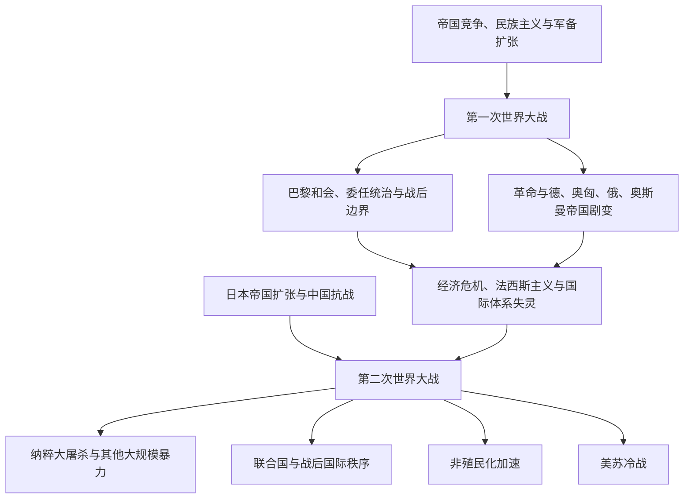

# 两次世界大战

## 时间

- 第一次世界大战：1914—1918年。
- 第二次世界大战：通常以1939—1945年概括全球战争；亚洲的长期战争背景可追溯到1931年日本占领中国东北和1937年全面侵华战争。

## 概括

两次世界大战不是只发生在欧洲的国家间战争。殖民帝国动员全球人口与资源，战场覆盖欧洲、非洲、西亚、东亚、东南亚、大西洋和太平洋；战争同时引发革命、帝国解体、种族灭绝、人口迁徙和新的国际组织。

## 演进关系

## 分阶段过程

| 阶段 | 时间 | 主要过程 | 关键变化 |
|---|---|---|---|
| 七月危机与机动作战 | 1914年6—9月 | 萨拉热窝刺杀、奥匈最后通牒、各国动员和宣战把巴尔干危机扩展为欧洲战争；德国进攻比利时与法国，俄军进入东普鲁士。 | 英国及其帝国参战使战争迅速全球化；马恩河战役阻止德军速胜，西线转入堑壕对峙。 |
| 消耗战与全球战场展开 | 1914年末—1916年 | 西线形成堑壕体系，东线保持较大机动性；奥斯曼参战后出现高加索、达达尼尔、两河与巴勒斯坦战场，德属非洲与太平洋殖民地也遭进攻。 | 海上封锁、潜艇战、凡尔登、索姆河与勃鲁西洛夫攻势把工业生产、粮食、运输和人口承受力变成胜负基础。 |
| 革命、美国参战与总体危机 | 1917年 | 德国恢复无限制潜艇战后美国参战；俄国二月革命和十月革命导致旧政权崩溃，交战国普遍面临兵变、罢工、通货膨胀和粮食短缺。 | 战争目标从领土与安全扩大到威尔逊式民族自决、革命和平和战后秩序竞争，但这些原则后来被选择性适用。 |
| 停战与帝国瓦解 | 1918年 | 《布列斯特—立托夫斯克条约》使德国暂时集中西线，春季攻势失败后协约国发动百日攻势；保加利亚、奥斯曼、奥匈和德国先后停战。 | 军事失败与国内革命相互强化，四个大陆帝国解体或剧变，大量难民和边界冲突延续到正式和约以后。 |
| 和约、委任统治与未完成的和平 | 1919—1923年 | 巴黎和会及系列条约重画欧洲和中东边界，国际联盟与委任统治制度建立；土耳其独立战争、俄国内战和多地反殖民抗争继续。 | 新民族国家扩大，但少数族群、殖民地与战败国诉求未获一致处理；赔款、安全焦虑和边界争端削弱战后秩序。 |
| 战间危机与区域侵略 | 1920年代—1939年 | 短暂稳定后，大萧条加剧失业、保护主义与政治激进化；日本侵占中国东北并扩大侵华，意大利侵略埃塞俄比亚，德国破坏凡尔赛体系。 | 国际联盟制裁不足、列强绥靖和相互猜疑使侵略成本下降；欧洲战争与亚洲长期战争逐步汇合。 |
| 轴心国扩张 | 1939—1941年 | 德国进攻波兰后迅速占领欧洲多地，意大利扩大战争，德国进攻苏联；日本在中国战场持续作战并向东南亚和太平洋推进。 | 法国沦陷、英国坚持作战、苏德战争和珍珠港事件把欧洲、地中海、亚洲与太平洋战场连成同一全球战争。 |
| 联盟形成与战略转折 | 1942—1943年 | 同盟国协调工业、运输、情报和跨洋作战；中途岛、瓜达尔卡纳尔、阿拉曼和斯大林格勒等战役遏止轴心扩张。 | 轴心国失去战略主动权，但占领区屠杀、饥荒、强制劳工与反游击镇压仍在扩大。 |
| 反攻、解放与战争结束 | 1943—1945年 | 苏军西进，盟军自意大利和诺曼底进入欧洲；中国、东南亚与太平洋战场继续消耗日本，殖民地军队与后勤体系深度参与。 | 德国无条件投降；美国投下原子弹、苏联对日参战后日本投降。战后占领、审判、人口迁移与国家重建随即开始。 |

## 第一次世界大战

- 欧洲联盟体系、帝国竞争、军备竞赛和民族主义构成长期背景，萨拉热窝事件触发危机升级。
- 西线堑壕战之外，还有东线、巴尔干、奥斯曼战场、中东、非洲殖民地和海上战争。
- 殖民地士兵、劳工和资源被大规模动员，战争经验推动部分地区的政治组织与民族主义。
- 俄国革命改变战争与国际政治；德意志、奥匈、俄罗斯和奥斯曼帝国均发生解体或政体剧变。
- 战后和约、民族自决的选择性适用、委任统治和新边界留下长期争议。

## 两次大战之间

- 战后债务、通货膨胀、经济大萧条和社会冲突削弱自由民主制度。
- 意大利法西斯主义、德国纳粹主义和日本军国主义采取不同形式，但都以扩张、动员和暴力重塑政治。
- 国际联盟缺乏有效强制能力，列强绥靖、孤立主义和利益冲突使集体安全失效。
- 反殖民运动、社会主义运动与民族主义在亚洲、非洲和中东继续发展。

## 第二次世界大战

- 欧洲战场以德国侵略波兰为全球战争通常采用的起点；东亚战争则具有更早且连续的帝国扩张背景。
- 德国及其盟国占领欧洲广大地区，苏德战争成为欧洲陆战核心；北非、大西洋和地中海战场同样关键。
- 亚太战争涉及中国抗战、东南亚占领、太平洋岛屿战场以及美日战争。
- 纳粹德国及其合作者实施对欧洲犹太人的系统性灭绝，并迫害罗姆人、残障者、战俘和其他群体。
- 战争还伴随南京大屠杀、强制劳工、细菌战、无差别轰炸、人口驱逐及其他大规模暴力。
- 1945年后，联合国成立，欧洲和亚洲帝国体系被削弱，美苏竞争与非殖民化同时展开。

## 因果层次比较

| 战争 | 结构因素 | 累积压力与外部环境 | 直接触发与升级机制 |
|---|---|---|---|
| 第一次世界大战 | 欧洲列强实力变化、帝国竞争、联盟承诺、军备竞赛、民族主义和多民族帝国内部矛盾共同压缩妥协空间。 | 摩洛哥危机、巴尔干战争、奥斯曼势力收缩及俄奥在巴尔干的竞争反复制造危机；各国总动员计划把时间压力置于外交之上。 | 1914年萨拉热窝刺杀本身不是充分原因；奥匈最后通牒、德国“空白支票”、俄国动员、德国对俄法宣战并入侵比利时，才把区域冲突连锁升级为大战。 |
| 第二次世界大战 | 凡尔赛体系的修正主义、经济大萧条、法西斯和军国主义动员、种族帝国观念，以及德国、意大利、日本追求领土与资源的政策构成长因。 | 国际联盟制裁能力不足，英法战争疲惫与绥靖，美苏不信任，美国孤立倾向，以及中国、埃塞俄比亚、西班牙等地冲突未被遏止，使侵略者逐次试探成功。 | 欧洲以德国1939年进攻波兰及英法宣战为直接开端；东亚全面战争在1937年已展开，1941年德国进攻苏联、日本袭击珍珠港并进攻东南亚使各区域战场彻底合流。 |

因果分析必须同时保留不同国家的主动决策。经济危机、资源压力或安全焦虑可以解释决策环境，却不能把侵略、占领和种族灭绝写成自动或不可避免的结果。

## 跨区域比较矩阵

| 地区 | 第一次世界大战 | 第二次世界大战 | 动员、地方政治与战后变化 |
|---|---|---|---|
| 欧洲 | 西线堑壕战、东线机动作战、巴尔干战场和海上封锁消耗四个帝国；平民经济被配给、征用与轰炸深刻改变。 | 德国占领、西欧抵抗、苏德战争、意大利与巴尔干战场相互连接；纳粹大屠杀和占领区报复使平民成为系统性暴力对象。 | 总体动员扩大国家征税、福利与宣传能力；两战之间边界重画，1945年后又出现占领改革、欧洲分裂与一体化起点。 |
| 亚洲太平洋 | 日本夺取德国在山东和太平洋的权益；中国劳工、印度士兵以及澳大利亚、新西兰等帝国部队服务于欧洲、中东与太平洋战区。 | 中国战场长期牵制日军，日本占领东南亚并向太平洋扩张；岛屿战、海空战、饥荒、强制劳工和殖民地抵抗共同构成战争经验。 | 征兵、征粮、通货膨胀与占领瓦解殖民权威；中国内战重启，朝鲜和越南出现分裂战争，多地独立运动进入决定阶段。 |
| 非洲 | 协约国进攻德属多哥、喀麦隆、西南非与东非；东非战事大量依赖非洲搬运工，征发、疫病和粮食破坏造成远超战斗本身的损失。 | 北非与东非是地中海、红海和苏伊士交通的关键战场；自由法国、英国及其他盟军广泛征募非洲士兵，部队还赴欧洲和亚洲作战。 | 税收、作物统制、劳役和兵役深入乡村；退伍军人、城市工人和泛非组织把平等承诺与现实歧视的落差转化为战后政治诉求。 |
| 中东与西亚 | 奥斯曼在高加索、达达尼尔、两河、阿拉伯半岛和巴勒斯坦作战；亚美尼亚人遭大规模驱逐与屠杀，黎凡特饥荒、阿拉伯起义和英法占领改变区域秩序。 | 北非战局关系苏伊士与地中海补给；英苏1941年进入伊朗，伊拉克、叙利亚—黎巴嫩和巴勒斯坦也受基地、石油、政变与军队调动影响。 | 一战后委任统治与新边界没有兑现所有独立承诺；二战后欧洲力量衰退、犹太人大屠杀后果、阿拉伯民族主义与石油战略共同重塑地区冲突。 |
| 美洲与大西洋 | 加拿大、加勒比等帝国属地自开战即被动员，美国1917年参战；粮食、信贷、航运和反潜作战使大西洋后方成为协约国优势来源。 | 美国和加拿大成为主要工业与军事基地，巴西派远征军赴意大利，墨西哥派航空部队参战，多国提供原料、基地与海上护航。 | 战争促进国家工业、劳动力迁移与美国实力上升，也伴随少数族群隔离、拘禁和政治压制；战后美洲更深进入美国主导的安全和金融体系。 |
| 殖民地与跨境人口 | 印度、北非、西非、加勒比、印度支那和华工等数百万士兵与劳工跨洲服役，但公民权和自决承诺极不平等。 | 南亚、东南亚、非洲、太平洋岛屿及加勒比再次提供兵员、港口、粮食、矿产和劳力；战俘、难民、被奴役劳工与被驱逐人口形成巨大迁徙。 | 战时共同服役并未消除种族等级，却提供组织经验、技术训练与政治语言；退伍军人、妇女和劳工的权利要求成为非殖民化和社会改革的一部分。 |

## 关键转折

| 时间 | 转折 | 为什么重要 |
|---|---|---|
| 1914年9月 | 马恩河战役 | 德国未能迅速击败法国，西线转入长期消耗，原先的短期战争预期破产。 |
| 1915年 | 奥斯曼战场与达达尼尔战役扩大 | 战争深入中东、高加索和帝国边缘，殖民军与海上交通的重要性显著上升。 |
| 1916年 | 凡尔登、索姆河与勃鲁西洛夫攻势 | 工业火力和人力消耗达到新规模，各国社会与财政承受力成为战略核心。 |
| 1917年 | 美国参战与俄国革命 | 协约国获得长期资源优势，俄国退出又让德国得到短暂窗口；革命为战后国际政治增加新的制度选择。 |
| 1918年 | 德军春季攻势失败与协约国百日攻势 | 战场逆转叠加国内危机，推动同盟国连续停战和帝国政体崩溃。 |
| 1937年 | 中国全面抗战爆发 | 亚洲大战早于欧洲战场形成，并持续消耗日本兵力、资源与占领能力。 |
| 1940年 | 法国战败与不列颠之战 | 德国控制欧洲大陆大部，却未迫使英国退出，为后来的跨大西洋联盟保留基地。 |
| 1941年 | 德国进攻苏联与日本袭击珍珠港 | 苏德战场成为欧洲陆战核心，美国正式参战，欧亚与太平洋冲突合并。 |
| 1942—1943年 | 中途岛、阿拉曼、斯大林格勒和瓜达尔卡纳尔 | 轴心国在海、陆多个战区相继失去战略主动，同盟国开始持续反攻。 |
| 1944—1945年 | 诺曼底登陆、苏军西进、德国与日本投降 | 轴心政权覆灭，原子武器出现，战后占领、审判、联合国与美苏对峙同步展开。 |

## 长期影响

| 层面 | 主要影响 | 地区差异与限度 |
|---|---|---|
| 国际秩序 | 一战后建立国际联盟与委任统治，二战后建立联合国、国际金融机构和更稳定的多边框架。 | 民族自决和集体安全从未被一致执行；殖民地、战败国与小国参与规则制定的程度长期不平等。 |
| 国家与边界 | 欧洲、西亚和东亚多次重画边界，帝国臣民被重新分类为多数、少数或无国籍人口。 | 新边界可带来主权，也制造少数族群问题、人口交换、难民与后续领土冲突。 |
| 暴力与法律 | 总体战、种族灭绝、战略轰炸和原子弹显示现代国家暴力极限，推动战争罪审判、种族灭绝罪和人权规范发展。 | 法律追责具有选择性，殖民暴力、饥荒、性暴力和亚洲战场罪行在不同社会获得的承认并不均衡。 |
| 非殖民化 | 两次大战削弱欧洲帝国财政与威望，殖民地动员和战时承诺为民族运动提供人员、经验与合法性。 | 独立既可通过谈判，也可能经历长期战争；殖民边界、出口经济和军事机构往往被新国家继承。 |
| 社会经济 | 国家规划、税收、福利、公共卫生、女性就业和产业技术扩展，战后重建又推动消费、教育与城市化。 | 复员后女性和少数群体常被要求退出新岗位；毁坏、债务、饥荒与住房短缺在战区和殖民地更为严重。 |
| 军事与记忆 | 空权、机械化、情报、核威慑和军工体系改变后续战争；纪念、创伤与受害者身份进入公共政治。 | 各国对解放、战败、合作、抵抗和受害的叙事不同，纪念政治会影响外交与国内族群关系。 |

## 关键辨析

- 第一次世界大战的责任不能被缩减为单一事件或单一国家；危机由联盟、动员计划和多国决策共同升级。
- 第二次世界大战在欧洲与亚洲具有不同起点和发展节奏，1939年是全球通用分期，不是所有地区战争的真正开端。
- 殖民地人民既参与帝国战争，也利用战时变化推动独立、革命和社会改革。
- 战争记忆因国家、族群和受害群体而不同，需要区分军事史、占领史、抵抗史与大规模暴力史。

## 相关入口

- [欧洲通史](/%E4%BA%BA%E6%96%87%E7%A7%91%E5%AD%A6/%E5%8E%86%E5%8F%B2/%E6%AC%A7%E6%B4%B2/_%E9%80%9A%E5%8F%B2/README.md)
- [东亚通史](/%E4%BA%BA%E6%96%87%E7%A7%91%E5%AD%A6/%E5%8E%86%E5%8F%B2/%E4%B8%9C%E4%BA%9A/_%E9%80%9A%E5%8F%B2/README.md)
- [东南亚历史](/%E4%BA%BA%E6%96%87%E7%A7%91%E5%AD%A6/%E5%8E%86%E5%8F%B2/%E4%B8%9C%E5%8D%97%E4%BA%9A/README.md)
- [非洲历史](/%E4%BA%BA%E6%96%87%E7%A7%91%E5%AD%A6/%E5%8E%86%E5%8F%B2/%E9%9D%9E%E6%B4%B2/README.md)
- [西亚历史](/%E4%BA%BA%E6%96%87%E7%A7%91%E5%AD%A6/%E5%8E%86%E5%8F%B2/%E8%A5%BF%E4%BA%9A/README.md)
