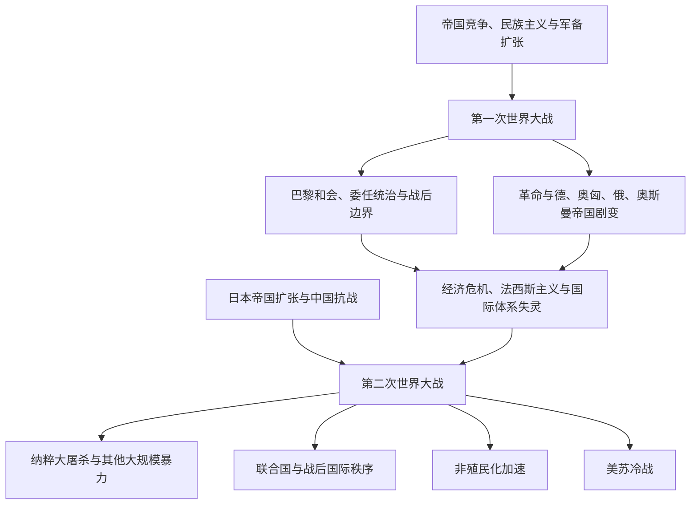

# 两次世界大战

## 时间

- 第一次世界大战：1914—1918年。
- 第二次世界大战：通常以1939—1945年概括全球战争；亚洲的长期战争背景可追溯到1931年日本占领中国东北和1937年全面侵华战争。

## 概括

两次世界大战不是只发生在欧洲的国家间战争。殖民帝国动员全球人口与资源，战场覆盖欧洲、非洲、西亚、东亚、东南亚、大西洋和太平洋；战争同时引发革命、帝国解体、种族灭绝、人口迁徙和新的国际组织。

## 演进关系

## 第一次世界大战

- 欧洲联盟体系、帝国竞争、军备竞赛和民族主义构成长期背景，萨拉热窝事件触发危机升级。
- 西线堑壕战之外，还有东线、巴尔干、奥斯曼战场、中东、非洲殖民地和海上战争。
- 殖民地士兵、劳工和资源被大规模动员，战争经验推动部分地区的政治组织与民族主义。
- 俄国革命改变战争与国际政治；德意志、奥匈、俄罗斯和奥斯曼帝国均发生解体或政体剧变。
- 战后和约、民族自决的选择性适用、委任统治和新边界留下长期争议。

## 两次大战之间

- 战后债务、通货膨胀、经济大萧条和社会冲突削弱自由民主制度。
- 意大利法西斯主义、德国纳粹主义和日本军国主义采取不同形式，但都以扩张、动员和暴力重塑政治。
- 国际联盟缺乏有效强制能力，列强绥靖、孤立主义和利益冲突使集体安全失效。
- 反殖民运动、社会主义运动与民族主义在亚洲、非洲和中东继续发展。

## 第二次世界大战

- 欧洲战场以德国侵略波兰为全球战争通常采用的起点；东亚战争则具有更早且连续的帝国扩张背景。
- 德国及其盟国占领欧洲广大地区，苏德战争成为欧洲陆战核心；北非、大西洋和地中海战场同样关键。
- 亚太战争涉及中国抗战、东南亚占领、太平洋岛屿战场以及美日战争。
- 纳粹德国及其合作者实施对欧洲犹太人的系统性灭绝，并迫害罗姆人、残障者、战俘和其他群体。
- 战争还伴随南京大屠杀、强制劳工、细菌战、无差别轰炸、人口驱逐及其他大规模暴力。
- 1945年后，联合国成立，欧洲和亚洲帝国体系被削弱，美苏竞争与非殖民化同时展开。

## 关键辨析

- 第一次世界大战的责任不能被缩减为单一事件或单一国家；危机由联盟、动员计划和多国决策共同升级。
- 第二次世界大战在欧洲与亚洲具有不同起点和发展节奏，1939年是全球通用分期，不是所有地区战争的真正开端。
- 殖民地人民既参与帝国战争，也利用战时变化推动独立、革命和社会改革。
- 战争记忆因国家、族群和受害群体而不同，需要区分军事史、占领史、抵抗史与大规模暴力史。

## 相关入口

- [欧洲通史](/%E4%BA%BA%E6%96%87%E7%A7%91%E5%AD%A6/%E5%8E%86%E5%8F%B2/%E6%AC%A7%E6%B4%B2/_%E9%80%9A%E5%8F%B2/README.md)
- [东亚通史](/%E4%BA%BA%E6%96%87%E7%A7%91%E5%AD%A6/%E5%8E%86%E5%8F%B2/%E4%B8%9C%E4%BA%9A/_%E9%80%9A%E5%8F%B2/README.md)
- [东南亚历史](/%E4%BA%BA%E6%96%87%E7%A7%91%E5%AD%A6/%E5%8E%86%E5%8F%B2/%E4%B8%9C%E5%8D%97%E4%BA%9A/README.md)
- [非洲历史](/%E4%BA%BA%E6%96%87%E7%A7%91%E5%AD%A6/%E5%8E%86%E5%8F%B2/%E9%9D%9E%E6%B4%B2/README.md)
- [西亚历史](/%E4%BA%BA%E6%96%87%E7%A7%91%E5%AD%A6/%E5%8E%86%E5%8F%B2/%E8%A5%BF%E4%BA%9A/README.md)
