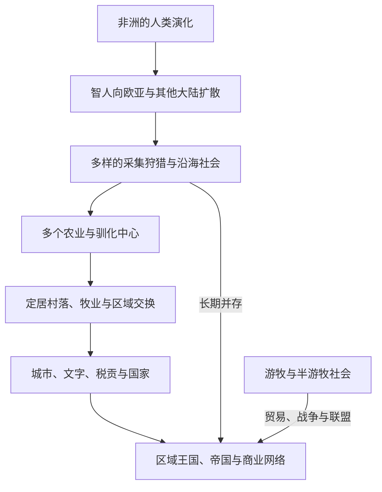

# 人口迁徙、农业与城市文明

## 概括

人类社会从采集狩猎到农业、牧业、村落、城市和国家的变化并非单一路线。不同地区在气候、物种、人口密度、贸易和社会组织作用下形成多种生产与政治形态；采集、农耕、牧业和城市生活也长期共存。

## 长期演进

## 多中心发展

| 区域 | 代表性变化 | 说明 |
|---|---|---|
| 西亚 | 小麦、大麦和家畜驯化；村落与两河城市 | 是早期农业和城市化中心之一，但不是唯一源头。 |
| 东亚 | 黄河流域粟作、长江流域稻作及区域社会复杂化 | 农业、聚落与国家形成具有多条地区主线。 |
| 南亚 | 印度河流域农业、城市与广域贸易 | 哈拉帕城市体系与西亚、伊朗高原及次大陆内部网络相连。 |
| 非洲 | 萨赫勒、高地和热带地区的作物、牧业与冶铁发展 | 尼罗河文明之外，非洲存在多个独立或交互发展的生产中心。 |
| 新几内亚与太平洋 | 高地农业、航海技术与岛屿定居 | 说明农业和复杂社会不只依赖大陆型河谷。 |
| 中部美洲 | 玉米等作物培育、城市与礼仪中心 | 奥尔梅克、玛雅、特奥蒂瓦坎等传统形成独立城市文明。 |
| 安第斯 | 高地农业、灌溉、道路与国家组织 | 城市和国家形成不以欧亚式文字或轮式运输为必要条件。 |

## 阶段过程

| 阶段 | 人口迁徙 | 生产与聚落变化 | 城市和政治结果 |
|---|---|---|---|
| 约30万—5万年前 | 智人在非洲演化并形成多样区域人口；不同人群之间持续移动、分化和交流 | 采集、狩猎、渔捞和火管理适应草原、森林、海岸与高地 | 高流动性不等于缺乏领地、交换或复杂社会关系。 |
| 约5万—1.2万年前 | 人群扩散至欧亚北部、萨胡尔和美洲等地；海岸与内陆路线并行，年代和路线仍有争议 | 石器、纤维、航海与季节性营地形成多样地方传统 | 人口密度总体较低，但远距离原料、婚姻和知识交换已存在。 |
| 约公元前1万—前4000年 | 全新世气候变化、人口增长与区域互动伴随多个驯化中心形成 | 西亚、东亚、新几内亚、非洲、美洲等地分别驯化不同动植物；采集与栽培长期并存 | 储存、村落和土地权利重组，但并非所有农耕社会立刻形成阶级或国家。 |
| 约公元前4000—前1000年 | 农民、牧民和工匠迁徙推动作物、语言与技术扩散，也与本地人群混合 | 灌溉、犁耕、畜力、冶金和区域专业化扩大 | 两河、尼罗河、印度河、东亚等地出现不同城市和国家体系；城市化并非同步。 |
| 公元前1千纪—公元500年 | 草原迁徙、班图语族人群长期扩散、南岛航海及帝国内部移民重组人口 | 稻作、粟麦、铁器、牧业和海洋生计在新环境中重新组合 | 帝国、商路和区域城市增长；边疆既是冲突带也是混合和技术交换带。 |
| 500—1500年 | 宗教、商贸、征服和环境压力推动欧亚、非洲与太平洋人口流动 | 新作物和复种、梯田、水利、畜牧和渔业支持更多城镇；波利尼西亚诸岛继续定居 | 港市、草原都城、非洲内陆城市和美洲城市并存，城市不必依赖同一种文字或王朝结构。 |
| 1500—1800年 | 殖民定居、跨大西洋奴隶贸易、强制迁徙和欧亚内部移民规模扩大 | 哥伦布大交换重组作物、牲畜、疾病和土地利用；种植园与矿区形成 | 美洲人口灾难、殖民城市和大西洋港口扩张，权力与财富高度不均。 |
| 1800—1945年 | 工业就业、铁路和轮船促进乡城与跨洋迁移；殖民征募、契约劳工和难民流动并存 | 化石能源、机械农业和全球粮食贸易扩大，传统生计受到土地圈占和市场波动冲击 | 工业城市快速增长，住房、卫生、阶级和民族政治成为治理核心。 |
| 1945年以来 | 非殖民化、战争、劳务市场、教育和家庭团聚形成多方向迁移 | 机械化农业减少部分地区农村劳动需求，大都市和城市带吸纳人口 | 全球城市化加速，但非正规住区、小城市、季节迁移和农村—城市往返同样重要。 |

## 跨区域比较矩阵

| 生态与区域类型 | 代表地区 | 食物与能源基础 | 常见迁徙方式 | 聚落 / 城市机制 | 主要脆弱性与差异 |
|---|---|---|---|---|---|
| 河谷灌溉区 | 两河、尼罗河、印度河部分地区、黄河与部分安第斯河谷 | 谷物、畜力、灌溉与集中储存 | 农民垦殖、治水劳工、战争俘虏和城市吸纳 | 水利、仓储、税赋、神庙 / 宫廷与市场可支撑高密度中心 | 洪水和盐碱化风险各异；治水不必然产生同一种“专制国家”。 |
| 季风与雨养农业区 | 南亚、东南亚、东亚南部、欧洲部分地区、西非雨养带 | 稻作、麦类、块根、豆类、林园和复种 | 村落扩张、山地—低地迁移和季节劳作 | 地方水利、市场镇、寺院和港口可连接分散农区 | 降雨波动、病媒生态和土地权利不同，不能用大河文明模型概括。 |
| 草原、荒漠与农牧交错带 | 欧亚草原、撒哈拉—萨赫勒、阿拉伯半岛、北美大平原 | 牲畜、牧草、狩猎及与农区交换的谷物和手工业品 | 季节迁徙、长程放牧、军事迁徙和商队移动 | 营地、绿洲、边市和草原都城形成流动政治网络 | 干旱、边界封锁和草场竞争重要；“游牧”并不等于无领地或无国家。 |
| 热带森林与稀树草原 | 中非、亚马孙、东南亚内陆等 | 块根、香蕉、稻作、园艺、渔猎与森林管理 | 河流迁移、轮作聚落和区域贸易 | 低密度城市、土方工程、道路和仪式中心可能不易被后世辨识 | 土壤、疾病和保存条件影响考古证据，过去常被误写成“空白地区”。 |
| 高原与山地区 | 安第斯、埃塞俄比亚高地、新几内亚、喜马拉雅周边 | 梯田、块茎、谷物、驮畜和垂直生态交换 | 不同海拔间季节移动、移民殖民点和国家迁调 | 跨高度仓储、道路与互惠网络支持城镇和国家 | 霜冻、交通成本和地震等风险突出，但高原不是孤立边缘。 |
| 海岸、岛屿与海洋网络 | 地中海、东南亚群岛、太平洋、加勒比 | 渔业、园艺、航海、港口贸易与外来作物 | 岛屿定居、商旅、殖民和侨民网络 | 港市、航海知识和中转贸易可支撑人口集中 | 风暴、淡水、外来疾病和运输依赖重要；小岛社会也能形成复杂政治。 |
| 工业化大都市区 | 19世纪后的欧洲、北美及随后扩展的亚洲、拉美、非洲城市带 | 化石能源、电力、机械化农业和全球供应链 | 乡城迁移、跨国劳务、难民与通勤 | 工厂、服务业、基础设施、金融和国家福利聚集 | 污染、住房、分隔、不平等和对远方资源的依赖被城市边界遮蔽。 |

矩阵比较的是生态—生产—聚落组合，而不是给每个文明贴固定标签。同一地区可同时存在河谷农业、山地牧业、港市和采集社会，并会随战争、市场、技术和气候变化而重组。

## 关键机制

- 气候变化和生态条件影响迁徙与生产方式，但不会机械决定社会制度。
- 农业能支持更高人口密度，也可能带来营养压力、疾病、劳役和社会分化。
- 城市依赖粮食、手工业、交通、权力和仪式网络；不同城市未必受同一种中央国家控制。
- 牧民、山地社会、渔猎者和农民通过贸易、婚姻、战争和政治联盟长期互动。
- 文字有利于行政和记忆，却不是判断社会是否“文明”的唯一标准。

## 机制的相互作用

| 机制 | 具体过程 | 不应作出的单因推论 |
|---|---|---|
| 人口与资源压力 | 人口增长可能推动迁徙、集约农业、分工或冲突，人口下降也可能释放土地或削弱维护网络 | 人口多不会自动产生城市，人口少也不等于社会简单。 |
| 驯化与生态工程 | 选择种子、控制繁殖、灌溉、燃烧、梯田和森林园艺改变物种与景观 | 农业不是人类第一次改造环境，也不总比采集狩猎更稳定。 |
| 剩余、储存与分配 | 可储存产物支持季节缓冲、专业劳动、宴礼和税贡，同时让控制仓储者获得权力 | “剩余”本身不会自动创造国家；产权、武力、宗教和互惠制度决定分配。 |
| 交通与市场 | 河流、道路、驮畜和航海连接食物产区、手工业与城市需求 | 城市不能脱离腹地生存，但腹地也会主动选择、抵制或转移市场。 |
| 战争与强制 | 征服、迁村、殖民、奴役和国家移民可以迅速改变人口与土地格局 | 语言或物质文化扩散不必全部来自大规模征服。 |
| 亲属、性别与家庭劳动 | 婚姻、继承、育儿、种子知识和家庭分工维持迁徙与生产 | 只计算正式政治领袖和男性劳工会遗漏再生产与知识传承。 |
| 疾病与营养 | 高密度、人畜接触、单一饮食和贸易网络改变疾病谱，公共卫生又改变城市死亡率 | 农业或城市化的健康后果因阶层、性别、环境和时期而异。 |
| 国家与地方制度 | 户籍、税收、粮仓、土地法和救济影响人口定居与流动 | 国家记录中的“定居人口”不等于实际没有季节移动或逃避登记。 |

## 长期影响

- 农业和城市化提高许多地区可维持的人口密度，并扩大专业分工、税收和公共工程，却也常伴随土地不平等、劳役、战争和营养差异。
- 作物、家畜和人群迁徙改变语言与基因分布，但现代民族并不是某次史前迁徙的纯粹、封闭后裔。
- 城市把粮食、水、燃料和废物交换延伸至远方，形成“城市代谢”；城市繁荣可能把生态成本转移给乡村、殖民地或边疆。
- 牧民、渔民、山地居民和采集者长期向国家和城市提供运输、肉类、鱼类、林产和军事力量，不是注定被农业文明取代的残余。
- 殖民定居、强迫迁徙和工业化使土地权利、种族分类和国界固定化，许多当代移民与原住民族争议由此延续。
- 大规模城市化带来教育、医疗、政治组织和创新机会，也产生住房分隔、非正规就业、污染和基础设施不平等。

## 争议与局限

- 农业扩散可能包括人口迁入、通婚、作物和技术采用等多种组合；遗传、语言和考古材料不能彼此简单替代。
- “新石器革命”便于概括长期转型，却容易制造突然、单向且必然进步的印象。
- 以灌溉解释国家形成的“水利决定论”忽略雨养农业、地方合作、战争、贸易和宗教合法性。
- 城市遗址的衰减、迁址或人口分散不必然等于文明“崩溃”；居民可能转向较小聚落或新的政治中心。
- “文明”一词具有历史等级色彩。若使用，应明确指城市、国家或文字等具体特征，而不是把非城市社会排除在人类历史之外。
- 古人类遗骸和基因研究能揭示迁徙，却涉及样本偏差、年代模型以及后裔社群对遗骸、数据和解释权的伦理要求。

## 相关入口

- [非洲历史](/%E4%BA%BA%E6%96%87%E7%A7%91%E5%AD%A6/%E5%8E%86%E5%8F%B2/%E9%9D%9E%E6%B4%B2/README.md)
- [西亚历史](/%E4%BA%BA%E6%96%87%E7%A7%91%E5%AD%A6/%E5%8E%86%E5%8F%B2/%E8%A5%BF%E4%BA%9A/README.md)
- [南亚历史](/%E4%BA%BA%E6%96%87%E7%A7%91%E5%AD%A6/%E5%8E%86%E5%8F%B2/%E5%8D%97%E4%BA%9A/README.md)
- [东亚历史](/%E4%BA%BA%E6%96%87%E7%A7%91%E5%AD%A6/%E5%8E%86%E5%8F%B2/%E4%B8%9C%E4%BA%9A/README.md)
- [美洲历史](/%E4%BA%BA%E6%96%87%E7%A7%91%E5%AD%A6/%E5%8E%86%E5%8F%B2/%E7%BE%8E%E6%B4%B2/README.md)
- [大洋洲历史](/%E4%BA%BA%E6%96%87%E7%A7%91%E5%AD%A6/%E5%8E%86%E5%8F%B2/%E5%A4%A7%E6%B4%8B%E6%B4%B2/README.md)

## 关键辨析

- “农业革命”是长期且多次发生的变化，不是全球同时完成的单一事件。
- 城市、国家、阶级和文字之间没有固定先后顺序。
- 现代民族不能直接追溯为史前考古文化的单一后裔。
