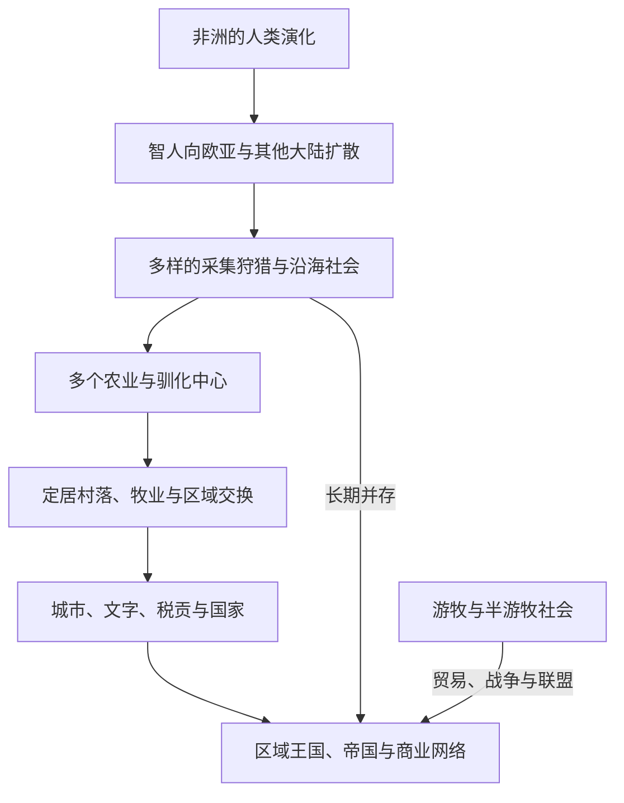

# 人口迁徙、农业与城市文明

## 概括

人类社会从采集狩猎到农业、牧业、村落、城市和国家的变化并非单一路线。不同地区在气候、物种、人口密度、贸易和社会组织作用下形成多种生产与政治形态；采集、农耕、牧业和城市生活也长期共存。

## 长期演进

## 多中心发展

| 区域 | 代表性变化 | 说明 |
|---|---|---|
| 西亚 | 小麦、大麦和家畜驯化；村落与两河城市 | 是早期农业和城市化中心之一，但不是唯一源头。 |
| 东亚 | 黄河流域粟作、长江流域稻作及区域社会复杂化 | 农业、聚落与国家形成具有多条地区主线。 |
| 南亚 | 印度河流域农业、城市与广域贸易 | 哈拉帕城市体系与西亚、伊朗高原及次大陆内部网络相连。 |
| 非洲 | 萨赫勒、高地和热带地区的作物、牧业与冶铁发展 | 尼罗河文明之外，非洲存在多个独立或交互发展的生产中心。 |
| 新几内亚与太平洋 | 高地农业、航海技术与岛屿定居 | 说明农业和复杂社会不只依赖大陆型河谷。 |
| 中部美洲 | 玉米等作物培育、城市与礼仪中心 | 奥尔梅克、玛雅、特奥蒂瓦坎等传统形成独立城市文明。 |
| 安第斯 | 高地农业、灌溉、道路与国家组织 | 城市和国家形成不以欧亚式文字或轮式运输为必要条件。 |

## 关键机制

- 气候变化和生态条件影响迁徙与生产方式，但不会机械决定社会制度。
- 农业能支持更高人口密度，也可能带来营养压力、疾病、劳役和社会分化。
- 城市依赖粮食、手工业、交通、权力和仪式网络；不同城市未必受同一种中央国家控制。
- 牧民、山地社会、渔猎者和农民通过贸易、婚姻、战争和政治联盟长期互动。
- 文字有利于行政和记忆，却不是判断社会是否“文明”的唯一标准。

## 相关入口

- [非洲历史](/%E4%BA%BA%E6%96%87%E7%A7%91%E5%AD%A6/%E5%8E%86%E5%8F%B2/%E9%9D%9E%E6%B4%B2/README.md)
- [西亚历史](/%E4%BA%BA%E6%96%87%E7%A7%91%E5%AD%A6/%E5%8E%86%E5%8F%B2/%E8%A5%BF%E4%BA%9A/README.md)
- [南亚历史](/%E4%BA%BA%E6%96%87%E7%A7%91%E5%AD%A6/%E5%8E%86%E5%8F%B2/%E5%8D%97%E4%BA%9A/README.md)
- [东亚历史](/%E4%BA%BA%E6%96%87%E7%A7%91%E5%AD%A6/%E5%8E%86%E5%8F%B2/%E4%B8%9C%E4%BA%9A/README.md)
- [美洲历史](/%E4%BA%BA%E6%96%87%E7%A7%91%E5%AD%A6/%E5%8E%86%E5%8F%B2/%E7%BE%8E%E6%B4%B2/README.md)
- [大洋洲历史](/%E4%BA%BA%E6%96%87%E7%A7%91%E5%AD%A6/%E5%8E%86%E5%8F%B2/%E5%A4%A7%E6%B4%8B%E6%B4%B2/README.md)

## 关键辨析

- “农业革命”是长期且多次发生的变化，不是全球同时完成的单一事件。
- 城市、国家、阶级和文字之间没有固定先后顺序。
- 现代民族不能直接追溯为史前考古文化的单一后裔。
