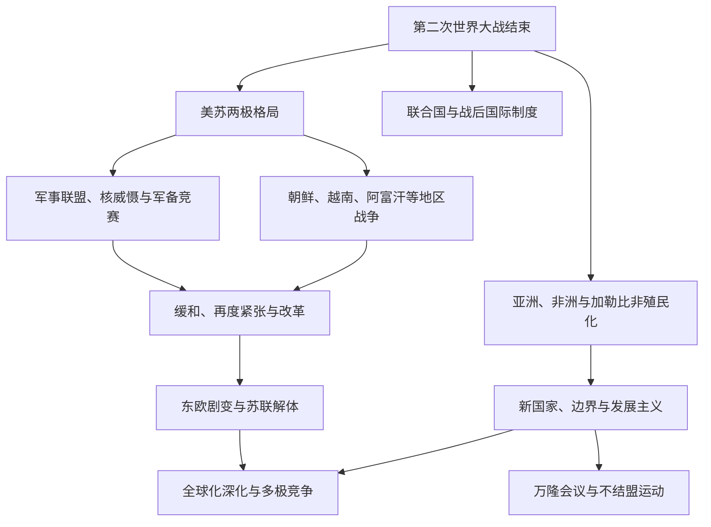

# 冷战、非殖民化与全球化

## 概括

1945年后的世界不能只写成美国与苏联的双边对抗。冷战竞争与亚洲、非洲、中东和拉丁美洲的独立革命、国家建构、内战、发展政策和不结盟运动相互交织。1991年苏联解体结束了冷战的主要制度格局，但全球化、区域冲突与大国竞争继续发展。

## 演进关系

## 核心阶段

| 阶段 | 时间 | 主线 |
|---|---|---|
| 战后阵营形成 | 1945—1950年代 | 德国分裂、北约与华约、中华人民共和国成立、朝鲜战争和核军备扩张。 |
| 非殖民化高潮 | 1940年代后期—1970年代 | 南亚、东南亚、中东、非洲和加勒比大量殖民地独立。 |
| 地区战争与革命 | 1950—1980年代 | 越南战争、中东战争、非洲解放战争、拉美革命与政变、苏联入侵阿富汗等。 |
| 缓和与再度紧张 | 1960年代后期—1980年代 | 美苏军控、关系缓和与后续军备升级并存，中国、欧洲、日本等力量地位变化。 |
| 冷战结束 | 1989—1991年 | 东欧政权转型、德国统一和苏联解体终结两极制度框架。 |
| 全球化与多极化 | 20世纪后期至今 | 贸易、金融、移民和数字网络深化，区域组织与新兴大国作用增强。 |

## 非殖民化

- 独立来源多样，包括谈判移交、群众运动、武装斗争、殖民战争和帝国财政困境。
- 新国家往往继承殖民边界、行政制度、出口经济和社会不平等，同时需要建立军队、政党和国家认同。
- 万隆会议和不结盟运动试图扩大亚非拉国家的外交空间，并不意味着成员在所有问题上保持中立。
- 去殖民化不仅是建立主权国家，也涉及土地、语言、文化、知识和经济结构的长期调整。

## 冷战的地区主动性

- 地方政府、革命组织、军队和社会运动会利用超级大国竞争追求自身目标，并非只是美苏代理人。
- 朝鲜战争、越南战争、中东冲突、非洲内战和阿富汗战争各有本地历史根源。
- 拉丁美洲的革命、军事政变和美国干预与土地、阶级和国家建设问题交织。
- 中国—苏联分裂、不结盟运动和欧洲一体化说明冷战世界从未完全由两个中心控制。

## 全球化

- 20世纪后期集装箱运输、航空、通信、跨国企业与金融自由化加速全球联系。
- 产业转移和贸易增长改变东亚、东南亚及其他地区的城市与劳动结构。
- 全球化同时扩大部分地区的发展机会和国家间联系，也加剧产业冲击、债务、移民压力与环境问题。
- 1991年后并未进入无冲突的单极世界；民族主义、地区战争、宗教政治和大国竞争继续存在。

## 关键辨析

- 冷战不是1945—1991年所有冲突的唯一原因，许多战争有殖民边界、国内政治和区域竞争根源。
- “第三世界”最初具有反殖民和政治联合含义，不应只作为贫困地区的贬义标签。
- 独立不等于殖民结构立即消失，非殖民化是持续过程。
- 全球化不是不可逆的单向整合，也不等于国家作用消失。

## 相关入口

- [两次世界大战](/%E4%BA%BA%E6%96%87%E7%A7%91%E5%AD%A6/%E5%8E%86%E5%8F%B2/_%E9%80%9A%E5%8F%B2/%E4%B8%A4%E6%AC%A1%E4%B8%96%E7%95%8C%E5%A4%A7%E6%88%98.md)
- [东亚历史](/%E4%BA%BA%E6%96%87%E7%A7%91%E5%AD%A6/%E5%8E%86%E5%8F%B2/%E4%B8%9C%E4%BA%9A/README.md)
- [东南亚历史](/%E4%BA%BA%E6%96%87%E7%A7%91%E5%AD%A6/%E5%8E%86%E5%8F%B2/%E4%B8%9C%E5%8D%97%E4%BA%9A/README.md)
- [非洲历史](/%E4%BA%BA%E6%96%87%E7%A7%91%E5%AD%A6/%E5%8E%86%E5%8F%B2/%E9%9D%9E%E6%B4%B2/README.md)
- [美洲历史](/%E4%BA%BA%E6%96%87%E7%A7%91%E5%AD%A6/%E5%8E%86%E5%8F%B2/%E7%BE%8E%E6%B4%B2/README.md)
- [欧洲历史](/%E4%BA%BA%E6%96%87%E7%A7%91%E5%AD%A6/%E5%8E%86%E5%8F%B2/%E6%AC%A7%E6%B4%B2/README.md)
