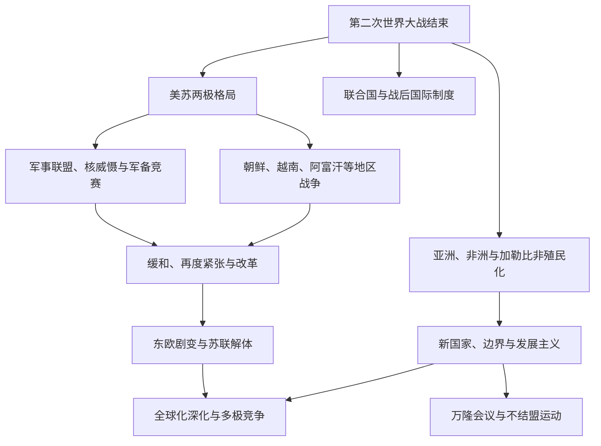

# 冷战、非殖民化与全球化

## 概括

1945年后的世界不能只写成美国与苏联的双边对抗。冷战竞争与亚洲、非洲、中东和拉丁美洲的独立革命、国家建构、内战、发展政策和不结盟运动相互交织。1991年苏联解体结束了冷战的主要制度格局，但全球化、区域冲突与大国竞争继续发展。

## 演进关系

## 时间与范围

- 冷战的主要制度框架通常划为1945—1991年，但其起点与终点在各地区并不同步：东亚内战与殖民战争早于欧洲阵营定型，非洲南部的殖民统治和种族隔离则延续到冷战末期以后。
- 非殖民化在第二次世界大战后加速，却不是一次完成的权力交接；主权、边界、土地、经济依附、语言与知识体系的调整延续至今。
- 20世纪后期以来的全球化承接战后贸易金融制度、去殖民后的国家网络和信息技术革命，同时经历石油危机、债务危机、社会主义体系转型、金融危机与新的大国竞争。

## 分阶段过程

| 阶段 | 时间 | 超级大国与国际体系 | 非殖民化、地方政治与全球经济 |
|---|---|---|---|
| 战后秩序与阵营形成 | 1945—1949年 | 联合国、布雷顿森林体系和战后占领机制建立；美苏围绕东欧、德国、核武器与战后重建发生安全冲突，杜鲁门主义、马歇尔计划和柏林封锁加速阵营化。 | 亚洲民族解放、内战和殖民复归战争已经展开；印度、巴基斯坦等独立，印度尼西亚与越南等地的主权斗争不能由美苏对立单独解释。 |
| 军事化与核危机 | 1949—1962年 | 北约、华约与双边同盟网络形成；苏联获得原子弹，朝鲜战争、柏林危机和古巴导弹危机把核威慑推至核心。 | 中华人民共和国成立、朝鲜半岛分裂和印度支那战争均有本地革命与国家统一议程；万隆会议提出亚非合作，非殖民化改变联合国成员结构。 |
| 非殖民化高潮与有限缓和 | 1955—1973年 | 美苏一面扩展援助、基地和代理关系，一面在古巴导弹危机后建立危机沟通与初步军控。 | 非洲独立浪潮、阿尔及利亚战争、刚果危机、越南战争和中东战争交错；不结盟国家争取政策空间，土地改革、军队建制和族群—区域整合成为国内核心问题。 |
| 缓和、南方诉求与经济震荡 | 1970年代 | 美苏签署军控协议并发展缓和，中国与美国关系转变；欧洲一体化、日本经济力量与产油国影响上升。 | 葡萄牙殖民帝国瓦解，南部非洲解放战争延续；石油危机、布雷顿森林体系终结和“新国际经济秩序”诉求显示政治独立并未消除贸易、债务和技术不平等。 |
| 再度紧张与债务调整 | 1979—1985年 | 苏联进入阿富汗、北约与华约更新军备，美国扩大对反共力量支持，核竞赛重新升温。 | 伊朗革命、中美洲战争、非洲之角冲突各有国家、阶级与宗教动力；拉丁美洲和非洲债务危机推动紧缩与结构调整，改变国家发展战略。 |
| 改革与冷战终结 | 1985—1991年 | 戈尔巴乔夫改革与军控、东欧政权转型、柏林墙开放、德国统一和苏联解体终结两极制度框架。 | 地方社会运动、经济停滞、民族共和国主权诉求与执政集团选择共同作用；冷战结束没有自动终止内战、边界争议或殖民遗产。 |
| 全球化加速 | 1990年代—2008年 | 美国在军事和金融制度中占优势，欧盟扩展，俄罗斯转型，中国等新兴经济体加速融入世界市场。 | 集装箱、互联网、贸易协定、跨国生产链和资本流动深化；同时出现去工业化冲击、金融波动、移民争议和干预战争。 |
| 多极竞争与全球化重组 | 2008年至今 | 金融危机后大国竞争、区域强国作用、制裁与供应链安全上升，单一“冷战重演”框架不足以解释多层竞争。 | 数字平台、气候风险、公共卫生、能源转型和跨境迁移推动新合作，也加深国内分配矛盾；全球联系并未消失，而是在区域化与安全化中重组。 |

## 非殖民化

- 独立来源多样，包括谈判移交、群众运动、武装斗争、殖民战争和帝国财政困境。
- 新国家往往继承殖民边界、行政制度、出口经济和社会不平等，同时需要建立军队、政党和国家认同。
- 万隆会议和不结盟运动试图扩大亚非拉国家的外交空间，并不意味着成员在所有问题上保持中立。
- 去殖民化不仅是建立主权国家，也涉及土地、语言、文化、知识和经济结构的长期调整。

## 冷战的地区主动性

- 地方政府、革命组织、军队和社会运动会利用超级大国竞争追求自身目标，并非只是美苏代理人。
- 朝鲜战争、越南战争、中东冲突、非洲内战和阿富汗战争各有本地历史根源。
- 拉丁美洲的革命、军事政变和美国干预与土地、阶级和国家建设问题交织。
- 中国—苏联分裂、不结盟运动和欧洲一体化说明冷战世界从未完全由两个中心控制。

## 全球化

- 20世纪后期集装箱运输、航空、通信、跨国企业与金融自由化加速全球联系。
- 产业转移和贸易增长改变东亚、东南亚及其他地区的城市与劳动结构。
- 全球化同时扩大部分地区的发展机会和国家间联系，也加剧产业冲击、债务、移民压力与环境问题。
- 1991年后并未进入无冲突的单极世界；民族主义、地区战争、宗教政治和大国竞争继续存在。

## 因果层次：三条进程不能互相替代

| 进程 | 结构因素 | 外部压力与国际环境 | 直接触发或加速机制 |
|---|---|---|---|
| 冷战形成 | 二战后美苏力量上升，资本主义与社会主义制度竞争、苏联边境安全诉求、美国开放市场与全球基地政策相互冲突；欧洲和日本战败留下权力真空。 | 核武器改变大战风险，东欧红军驻扎、西欧经济崩溃、德国处置和亚洲内战使任何一方的防御安排都容易被另一方视为进攻。 | 伊朗和土耳其危机、希腊内战、杜鲁门主义、马歇尔计划、捷克斯洛伐克政变及柏林封锁逐步把矛盾制度化；不存在一个能单独解释冷战的“第一枪”。 |
| 非殖民化 | 殖民统治的政治排斥、土地与劳动控制、教育和城市网络发展催生政党、工会、退伍军人组织与民族认同。 | 两次大战削弱帝国财政和威望，联合国自决规范扩大，新兴国家相互声援，美苏竞争又提供援助、武器和外交机会。 | 选举胜利、群众罢工、军人哗变、游击战争、殖民镇压失控或宗主国政权更替可成为不同地区的直接突破口；独立并无统一模式。 |
| 地方战争与革命 | 新旧国家的合法性、土地分配、阶级关系、族群和宗教边界、军民关系及国家统一目标决定冲突议程。 | 邻国介入、殖民边界、难民流动、军火和冷战援助改变力量对比，超级大国常把地方冲突纳入遏制或革命战略。 | 政变、选举争议、分离运动、边境事件或外军进入可以引爆战争，但参战者通常追求自身权力和社会方案，并非被动接受代理人角色。 |
| 全球化加速与重组 | 技术、跨国企业、金融自由化、国家监管变化和劳动力差异推动生产、资本和信息跨境组织。 | 石油危机、债务危机、社会主义国家改革、冷战结束、区域一体化与全球规则扩展改变政策选择。 | 中国改革开放、东欧和苏联转型、贸易组织扩容、集装箱与互联网普及等相互叠加；2008年金融危机、疫情与地缘竞争又推动供应链安全化和区域化。 |

## 非殖民化的路径与国家建构

| 地区 | 常见路径与节点 | 独立后的首要难题 | 不能忽略的地区差异 |
|---|---|---|---|
| 南亚 | 印度与巴基斯坦经谈判移交和分治独立，斯里兰卡等地也以宪政移交为主，殖民边缘地区则出现不同节奏。 | 难民安置、领土争端、语言与宗教多样性、土改和文官—军队关系。 | 谈判独立不等于低成本；分治暴力、克什米尔争端与国内社会改革深刻影响国家形成。 |
| 东南亚 | 印度尼西亚和印度支那经历反殖民战争，缅甸、菲律宾、马来亚等在谈判、战争和安全行动之间形成不同道路。 | 殖民边界内的民族整合、共产党与军队关系、华人和其他少数群体地位、土地与出口经济。 | 日本占领削弱欧洲权威却没有自动带来自由；地方革命、旧精英、宗教网络和外部军事介入的组合各异。 |
| 中东与北非 | 委任统治结束、军事政变、王朝谈判和民族解放战争并存；阿尔及利亚战争与苏伊士危机是帝国退潮的重要节点。 | 巴勒斯坦问题、边界与难民、军人政治、石油收益分配、阿拉伯统一和本国主权之间的张力。 | 宗主权结束的时间并不等于实际基地、公司和安全关系终止；共和国、君主国和殖民定居社会路径不同。 |
| 撒哈拉以南非洲 | 黄金海岸独立带动英属非洲谈判移交，法国殖民地多经公投和共同体解体独立；刚果、葡属非洲及南部非洲经历严重危机或长期战争。 | 殖民边界、区域和族群代表、单一出口经济、有限行政人才、军队政变与农村土地制度。 | 族群不是自动冲突原因；殖民分类、资源分布、政党竞争和外部支持共同决定政治化方式。 |
| 加勒比与太平洋 | 大岛殖民地、微型岛屿和托管地分别选择独立、自由联合或继续保持属地关系。 | 小规模经济、移民、灾害风险、国防与财政依赖，以及领海和资源治理。 | 非殖民化不只通向独立国家；经真实政治选择形成的自由联合或一体化也是自决形式，但仍可能存在权力不对称。 |

## 超级大国竞争与地方动力比较矩阵

| 地区 | 地方建国、阶级与族群动力 | 超级大国及跨国介入 | 结果与长期差异 |
|---|---|---|---|
| 欧洲 | 德国问题、战后清算、共产党与社会民主力量、边界迁移和重建分配塑造政治；东欧各国也有自身战争经历与政党结构。 | 美苏占领区、马歇尔计划、北约、华约、核部署和情报竞争把欧洲制度化分割。 | 西欧福利国家与一体化、东欧国家社会主义和德国分裂并行；1989年转型既受苏联政策改变影响，也来自本地社会运动与经济困境。 |
| 东亚 | 中国革命与国家统一、朝鲜半岛竞争政权、台湾海峡、日本战后重建均有殖民遗产、内战和社会革命根源。 | 美国同盟、基地和援助，苏联与中国的军事经济支持，以及中苏分裂改变冲突结构。 | 朝鲜战争固化半岛分裂，日本和部分地区形成出口工业化，中国走出独立的革命与改革路径；地区秩序从未只是美苏两方。 |
| 南亚与东南亚 | 土地改革、农民动员、反殖民民族主义、宗教与族群边界、军队建制和国家统一是越南、印尼、缅甸、柬埔寨等冲突的核心。 | 美国、苏联、中国和前殖民国家提供武器、顾问、基地或制裁，邻国也有自己的安全目标。 | 同类援助可产生不同结果：越南完成统一，部分国家形成军人政权或一党体制，另一些保持选举竞争；地方组织能力比阵营标签更能解释差异。 |
| 中东与北非 | 巴勒斯坦—以色列冲突、阿拉伯民族主义、王朝与共和国竞争、宗教政治、军人集团和石油分配构成独立议程。 | 美苏军援、外交保护和基地竞争与英法旧影响叠加，产油国和地区强国也主动塑造联盟。 | 阵营经常转换，所谓“亲美”或“亲苏”国家仍会追求本国领土与政权安全；1970年代后石油与伊朗革命进一步打破简单两极图景。 |
| 撒哈拉以南非洲 | 土地、矿产、殖民边界、白人少数统治、军队和解放运动之间的竞争驱动刚果、安哥拉、莫桑比克、非洲之角和南部非洲战争。 | 美苏、中国、古巴、前宗主国、南非及邻国以不同方式介入，外援放大战争能力但不创造全部矛盾。 | 部分解放运动建立长期执政党，部分国家陷入政变或内战；非洲统一组织维护既有边界以减少国家间战争，却不能消除内部代表问题。 |
| 拉丁美洲与加勒比 | 土地高度集中、寡头政治、劳工和农民组织、国家资源主权、种族等级与军队角色推动革命和改革。 | 美国以同盟、经济压力、秘密行动和军事支持遏制左翼，苏联支持古巴并有限援助其他力量；古巴也形成自身对外政策。 | 古巴革命、智利政变、中美洲战争和南锥体独裁路径不同；债务危机与人权运动推动1980年代后民主化，但社会不平等延续。 |

## 关键转折

| 时间 | 转折 | 影响 |
|---|---|---|
| 1947年 | 杜鲁门主义、马歇尔计划与南亚分治独立 | 欧洲阵营化和亚洲非殖民化同时加速，显示战后世界从一开始就有两条并行主线。 |
| 1949年 | 北约成立、中华人民共和国成立、苏联首次核试验和德国分裂 | 军事联盟、亚洲革命与核均势共同重塑力量格局。 |
| 1955年 | 万隆会议 | 亚非国家把反殖民、和平共处和政策自主带入国际议程，不愿只在两极之间选边。 |
| 1956年 | 苏伊士危机与匈牙利事件 | 英法帝国能力进一步衰落，同时苏联维持东欧控制，揭示两大阵营对主权原则的选择性。 |
| 1960年 | “非洲年”与联合国非殖民化宣言 | 大批新国家进入联合国，自决成为更强的国际规范，南方国家开始改变多边机构票数结构。 |
| 1962年 | 古巴导弹危机 | 核战争风险达到顶峰，促成危机沟通和有限军控，但地区战争并未停止。 |
| 1964—1975年 | 越南战争升级并以西贡政权垮台告终 | 地方革命战争、民族统一与超级大国介入交织，美国遏制战略受到严重挫折。 |
| 1973年 | 石油危机与缓和并存 | 产油国显示南方资源政治力量，全球通胀和增长放缓改变发展战略与阵营经济。 |
| 1974—1975年 | 葡萄牙革命、葡属非洲独立 | 欧洲最后大型殖民帝国之一迅速解体，安哥拉等地随即进入多方介入的国家建构战争。 |
| 1979年 | 伊朗革命、苏联进入阿富汗及美中建交 | 宗教革命、再度紧张和三角外交同时出现，简单两极模型更难概括世界。 |
| 1989—1991年 | 东欧转型、德国统一与苏联解体 | 两极制度结束，但民族国家重组、市场转型和地区战争开启新的不稳定。 |
| 2008年以后 | 全球金融危机与全球化重组 | 对自由化模式的信任下降，产业安全、数字主权、区域组织和大国竞争重新塑造跨境联系。 |

## 长期影响

| 层面 | 主要遗产 | 持续问题 |
|---|---|---|
| 主权与国际组织 | 新独立国家使联合国从战胜国主导机构转为成员更普遍的全球论坛，不结盟运动和七十七国集团扩大南方集体议价。 | 少数海外领地、自决争议与大国否决权仍显示主权平等和实际权力之间的距离。 |
| 国家能力与安全体制 | 战争、援助和发展主义推动军队、计划机构、教育、卫生与基础设施扩张。 | 安全部门膨胀、政变传统、紧急法和一党体制也常借冷战威胁获得正当化。 |
| 社会与身份 | 土改、教育普及、妇女和劳工组织、民权与反种族隔离运动改变公民资格。 | 殖民分类、分治边界和不均衡发展可把语言、宗教或族群差异转化为权力竞争。 |
| 发展与不平等 | 工业化、绿色革命、资源国有化和出口制造使部分国家快速转型。 | 初级产品依赖、债务、结构调整和资本外逃限制政策空间，政治独立不等于经济关系平等。 |
| 全球化与反作用 | 贸易、移民、传播和数字网络形成跨国社会，并支持知识共享和跨境运动。 | 收益在国家、地区与阶级间分配不均，金融危机、产业流失、环境压力和身份政治推动保护主义与重新监管。 |

## 关键辨析

- 冷战不是1945—1991年所有冲突的唯一原因，许多战争有殖民边界、国内政治和区域竞争根源。
- “第三世界”最初具有反殖民和政治联合含义，不应只作为贫困地区的贬义标签。
- 独立不等于殖民结构立即消失，非殖民化是持续过程。
- 全球化不是不可逆的单向整合，也不等于国家作用消失。

## 相关入口

- [两次世界大战](/%E4%BA%BA%E6%96%87%E7%A7%91%E5%AD%A6/%E5%8E%86%E5%8F%B2/_%E9%80%9A%E5%8F%B2/%E4%B8%A4%E6%AC%A1%E4%B8%96%E7%95%8C%E5%A4%A7%E6%88%98.md)
- [东亚历史](/%E4%BA%BA%E6%96%87%E7%A7%91%E5%AD%A6/%E5%8E%86%E5%8F%B2/%E4%B8%9C%E4%BA%9A/README.md)
- [东南亚历史](/%E4%BA%BA%E6%96%87%E7%A7%91%E5%AD%A6/%E5%8E%86%E5%8F%B2/%E4%B8%9C%E5%8D%97%E4%BA%9A/README.md)
- [非洲历史](/%E4%BA%BA%E6%96%87%E7%A7%91%E5%AD%A6/%E5%8E%86%E5%8F%B2/%E9%9D%9E%E6%B4%B2/README.md)
- [美洲历史](/%E4%BA%BA%E6%96%87%E7%A7%91%E5%AD%A6/%E5%8E%86%E5%8F%B2/%E7%BE%8E%E6%B4%B2/README.md)
- [欧洲历史](/%E4%BA%BA%E6%96%87%E7%A7%91%E5%AD%A6/%E5%8E%86%E5%8F%B2/%E6%AC%A7%E6%B4%B2/README.md)
