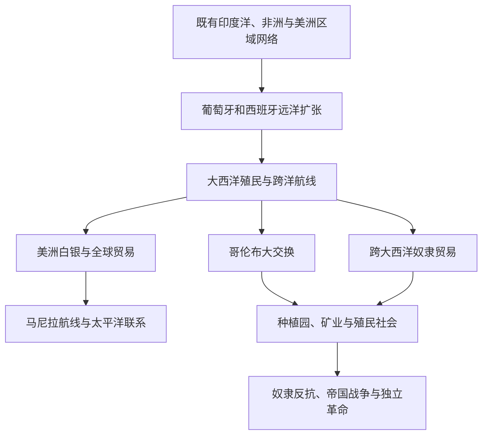

# 大航海、哥伦布大交换与大西洋世界

## 概括

15世纪以后，欧洲远洋扩张把既有的印度洋、非洲沿海、大西洋和美洲网络更紧密地连接起来。1492年后的跨大西洋接触推动人口、作物、动物、病原体、白银和制度大规模流动，同时伴随征服、殖民、奴隶贸易和原住民人口灾难。

## 演进关系

## 核心过程

| 过程 | 内容 | 影响 |
|---|---|---|
| 伊比利亚远洋扩张 | 葡萄牙绕行非洲进入印度洋；西班牙建立跨大西洋与跨太平洋航线 | 旧大陆海洋网络与美洲被纳入更紧密的全球贸易。 |
| 哥伦布大交换 | 作物、家畜、病原体和人口跨越大西洋流动 | 美洲原住民遭受严重疾病冲击；玉米、马铃薯等作物改变欧亚非农业。 |
| 征服与殖民 | 欧洲帝国利用军事、联盟、疾病和地方冲突建立统治 | 原有政治体系被摧毁或改造，同时持续存在抵抗、协商和文化重组。 |
| 大西洋奴隶贸易 | 数百万非洲人被强迫迁往美洲 | 塑造种植园经济、非洲侨民社会，并给非洲地区造成长期人口与政治影响。 |
| 白银与全球市场 | 波托西、墨西哥等地白银流入欧洲和亚洲市场 | 美洲矿业、欧洲金融、亚洲商品需求和强迫劳役相互连接。 |
| 帝国竞争与革命 | 荷兰、英国、法国等加入殖民竞争；殖民地爆发反抗和独立革命 | 大西洋世界形成新的国家、种族秩序与经济体系。 |

## 观察视角

- 美洲在1492年前已有复杂文明、城市、农业和跨区域网络，不能把欧洲到来称为当地历史的起点。
- 葡萄牙和西班牙并未凭航海技术自动取得全面控制；地方盟友、非洲和亚洲商人以及原住民政治都影响结果。
- 大西洋体系与印度洋、太平洋并行并相互连接，不应被写成全球贸易的唯一中心。
- 文化混合往往发生在强制劳动、奴役、传教、迁徙和法律等级之中，不能只以“交流”概括。

## 相关入口

- [美洲历史](/%E4%BA%BA%E6%96%87%E7%A7%91%E5%AD%A6/%E5%8E%86%E5%8F%B2/%E7%BE%8E%E6%B4%B2/README.md)
- [非洲历史](/%E4%BA%BA%E6%96%87%E7%A7%91%E5%AD%A6/%E5%8E%86%E5%8F%B2/%E9%9D%9E%E6%B4%B2/README.md)
- [欧洲历史](/%E4%BA%BA%E6%96%87%E7%A7%91%E5%AD%A6/%E5%8E%86%E5%8F%B2/%E6%AC%A7%E6%B4%B2/README.md)
- [东南亚历史](/%E4%BA%BA%E6%96%87%E7%A7%91%E5%AD%A6/%E5%8E%86%E5%8F%B2/%E4%B8%9C%E5%8D%97%E4%BA%9A/README.md)
- [大洋洲历史](/%E4%BA%BA%E6%96%87%E7%A7%91%E5%AD%A6/%E5%8E%86%E5%8F%B2/%E5%A4%A7%E6%B4%8B%E6%B4%B2/README.md)
