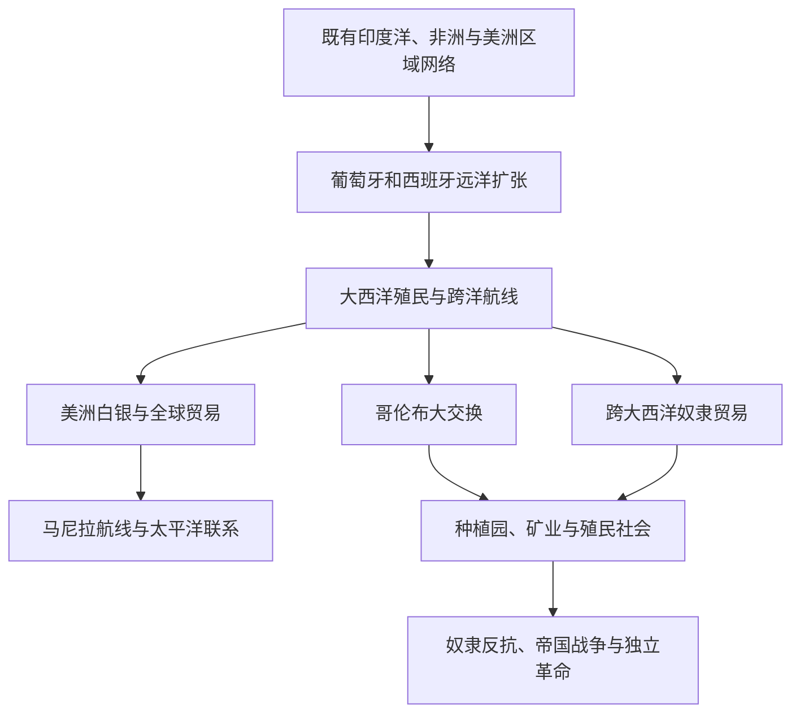

# 大航海、哥伦布大交换与大西洋世界

## 概括

15世纪以后，欧洲远洋扩张把既有的印度洋、非洲沿海、大西洋和美洲网络更紧密地连接起来。1492年后的跨大西洋接触推动人口、作物、动物、病原体、白银和制度大规模流动，同时伴随征服、殖民、奴隶贸易和原住民人口灾难。

## 演进关系

## 时间与范围

- 狭义“地理大发现”多指15世纪后期至16世纪的远洋航线开辟；本篇把它放入约15—19世纪初的大西洋世界形成过程，并追踪其与印度洋、太平洋及非洲内陆网络的连接。
- “发现”只适合描述航海者对其原先未知地区的认知，不表示美洲、非洲或太平洋岛屿此前无人居住或没有历史。
- 哥伦布大交换没有明确终止日期；疾病、作物、牲畜、人口与生态系统的跨洋重组至今仍有影响。

## 分阶段过程

| 阶段 | 时间 | 主要过程 | 关键变化 |
|---|---|---|---|
| 既有网络与大西洋试探 | 15世纪以前—约1450年 | 印度洋季风贸易、跨撒哈拉商路、地中海航运、美洲区域交换和太平洋岛际航行各自成熟；伊比利亚、热那亚和非洲商人已经营大西洋岛屿与沿岸。 | 远洋扩张建立在既有制图、天文、船舶、金融和港口知识的汇合上，并非从零开始。 |
| 非洲沿岸与岛屿殖民 | 1415—1492年 | 葡萄牙逐步沿西非海岸建立贸易据点，并在马德拉、亚速尔、佛得角等岛发展种植园；卡斯蒂利亚完成加那利群岛征服。 | 黄金、象牙、奴隶贸易与糖业把海上航线、资本和强迫劳动结合，形成后来大西洋种植园的先例。 |
| 跨洋航线与征服 | 1492—1522年 | 哥伦布航行连接加勒比与欧洲，达·伽马绕至印度洋，麦哲伦—埃尔卡诺船队完成首次环球航行；西班牙征服者借助原住民盟友、疾病与内部分裂击败阿兹特克和印加国家。 | 大西洋两岸开始持续人口和物种交换，伊比利亚王权把航海授权、宗教正当性与殖民行政结合。 |
| 殖民整合与全球白银 | 1520年代—17世纪初 | 副王区、传教网络、矿业和强迫劳役制度扩展；波托西和墨西哥白银经大西洋流向欧洲，也经马尼拉航线流向亚洲。 | 美洲矿山、非洲劳动力、欧洲财政和亚洲商品需求被纳入同一跨洋回路，价格、税收与生态均受影响。 |
| 多帝国竞争与种植园扩张 | 17—18世纪 | 荷兰、英国、法国等挑战伊比利亚垄断，在加勒比、北美、非洲海岸和印度洋建立据点；糖、烟草、咖啡与棉花种植园扩大。 | 跨大西洋奴隶贸易达到高峰，海盗、特许公司、海军和贸易法共同塑造帝国竞争；被奴役者的逃亡、起义和文化重建贯穿其中。 |
| 革命、废奴与帝国重组 | 18世纪后期—19世纪初 | 北美独立、海地革命和西属美洲独立战争动摇殖民秩序；英国等国先后禁止奴隶贸易，奴隶制在不同地区逐步废除。 | 主权国家增加，但种植园、种族等级、债务和契约劳工等制度继续延续；大西洋体系转入工业化和新帝国主义阶段。 |

## 核心过程

| 过程 | 内容 | 影响 |
|---|---|---|
| 伊比利亚远洋扩张 | 葡萄牙绕行非洲进入印度洋；西班牙建立跨大西洋与跨太平洋航线 | 旧大陆海洋网络与美洲被纳入更紧密的全球贸易。 |
| 哥伦布大交换 | 作物、家畜、病原体和人口跨越大西洋流动 | 美洲原住民遭受严重疾病冲击；玉米、马铃薯等作物改变欧亚非农业。 |
| 征服与殖民 | 欧洲帝国利用军事、联盟、疾病和地方冲突建立统治 | 原有政治体系被摧毁或改造，同时持续存在抵抗、协商和文化重组。 |
| 大西洋奴隶贸易 | 数百万非洲人被强迫迁往美洲 | 塑造种植园经济、非洲侨民社会，并给非洲地区造成长期人口与政治影响。 |
| 白银与全球市场 | 波托西、墨西哥等地白银流入欧洲和亚洲市场 | 美洲矿业、欧洲金融、亚洲商品需求和强迫劳役相互连接。 |
| 帝国竞争与革命 | 荷兰、英国、法国等加入殖民竞争；殖民地爆发反抗和独立革命 | 大西洋世界形成新的国家、种族秩序与经济体系。 |

## 因果层次

| 过程 | 结构因素 | 外部压力与约束 | 直接转折或加速机制 |
|---|---|---|---|
| 伊比利亚远洋扩张 | 大西洋岛屿经验、王权与商人融资、船舶和天文知识、港口网络及基督教扩张观念逐步结合。 | 欧洲对黄金、香料和亚洲商品的需求，地中海贸易成本与中间商网络，以及葡萄牙—卡斯蒂利亚竞争推动寻找新航线；不能简化成奥斯曼“封锁”旧路。 | 葡萄牙占领休达、绕过好望角，哥伦布获得王室资助及《托尔德西里亚斯条约》划分势力范围，使试探性航行变成持续国家工程。 |
| 美洲征服 | 远征者追求财富和身份，王权提供法律授权；美洲各政治体内部的贡赋、敌对联盟和继承冲突为外来者提供可利用空间。 | 天花等旧大陆病原体造成免疫冲击，跨洋补给与后续移民持续到来；但距离、地形与人数限制仍使征服高度依赖地方盟友。 | 科尔特斯与反特诺奇蒂特兰联盟合作、俘获统治者，以及皮萨罗利用印加内战等具体事件改变力量平衡；征服并非欧洲武器的自动胜利。 |
| 种植园与奴隶贸易 | 欧洲消费需求、土地集中、信贷保险和种族化法律把糖、烟草、咖啡、棉花生产同终身世袭奴役结合。 | 美洲原住民人口锐减、殖民劳力需求、西非和中非战争与国家竞争，以及欧洲海运能力扩大了人口贩运。 | 岛屿糖业扩张、特许公司和奴隶贸易承包制度使跨洋贩运规模上升；非洲统治者、商人与社会的参与方式和承受后果因地区而异。 |
| 白银全球化 | 美洲大型银矿、殖民税制、欧洲战争财政和亚洲对银的货币需求形成跨区域互补。 | 高海拔矿区劳动力、汞供应、海盗和运输风险限制产量；中国税制货币化与亚洲商品竞争影响白银去向。 | 波托西和萨卡特卡斯开采、汞齐法应用及1571年马尼拉建立，使大西洋与太平洋白银回路长期化。 |
| 革命与废奴 | 帝国战争债务、殖民税制、种族等级、奴隶反抗和地方政治认同削弱旧秩序；启蒙和自然权利语言提供新的正当性。 | 欧洲列强战争、海上封锁和宗主国政权危机给殖民地联盟与起义创造空间。 | 北美独立、法国革命、海地奴隶革命及拿破仑入侵伊比利亚分别触发不同革命；废奴来自被奴役者抗争、宗教和人道主义运动、经济变化与国家战争的共同作用。 |

## 哥伦布大交换矩阵

| 流向 | 主要人口、物种或病原体 | 传播机制 | 主要后果 |
|---|---|---|---|
| 欧亚非洲至美洲 | 天花、麻疹、流感等病原体；马、牛、猪、羊；小麦、甘蔗、咖啡；欧洲移民和被强迫迁移的非洲人。 | 船舶、殖民定居、牧场、种植园、战争、传教站和奴隶贸易。 | 疫病与战争叠加造成原住民人口灾难；牲畜改变土地利用和交通，种植园作物扩大出口经济，非洲离散社群成为美洲社会的基本组成。 |
| 美洲至欧洲、非洲与亚洲 | 玉米、马铃薯、甘薯、木薯、番茄、辣椒、花生、可可和烟草等。 | 帝国船队、商人网络、传教和地方农民试种，再经陆路与印度洋网络二次传播。 | 新作物适应不同生态带，支持部分地区人口增长并改变饮食；商品作物也可促成单一种植、税收控制和土地压力。 |
| 美洲内部重组 | 牲畜、铁器、新旧作物、逃亡奴隶社群与殖民人口在岛屿、边疆和城市间流动。 | 传教区、矿区补给、商队、走私、军事边疆和跨殖民地港航。 | 原住民社会既遭失地与强迫聚居，也选择性采用马匹、作物和市场；新的非洲—欧洲—原住民混合社群在不平等法律秩序中形成。 |
| 大西洋至印度洋和太平洋 | 美洲白银、作物与殖民航海经验进入亚洲，亚洲纺织品、瓷器、香料和移民反向进入美洲。 | 好望角航线、马尼拉大帆船、澳门和东南亚港市，以及欧洲和亚洲商人共同经营的网络。 | 大西洋世界从未自成封闭体系；中国、日本、南亚和东南亚的需求、监管与商人选择决定全球交换的方向和规模。 |

疾病冲击具有明显不对称性：欧亚非洲长期密集人畜接触形成的多种病原体进入美洲后破坏极大，但人口下降同时受到战争、饥荒、迁移、强迫劳动和生育结构变化影响，不能归为单一疾病。

## 劳动制度与殖民社会

| 制度 | 主要机制 | 与前后制度的关系 | 社会后果 |
|---|---|---|---|
| 恩科米恩达 | 王权授予殖民者征收特定原住民社区贡赋和劳役的权利，名义上附带保护与传教义务。 | 不是土地所有权，却常与土地占有和地方强制结合；王权改革后在许多地区被其他征役方式取代。 | 加重人口损失和社区负担，也引发原住民诉讼、逃亡、协商与教会内部争论。 |
| 重新分配劳役与殖民米塔 | 官府按配额临时征发原住民劳动，安第斯矿业米塔尤其服务于波托西等矿区。 | 借用并改造前殖民时期公共劳役概念，把服务共同体和国家的义务转为殖民矿业和工程需要。 | 高死亡风险、家庭分离与市场迁徙并存；部分工人也以工资、贸易和法律策略争取空间。 |
| 大西洋动产奴隶制 | 被奴役者被法律视为可买卖财产，身份趋向终身和世袭，并按种族分类。 | 与古代和非洲既有奴役制度有联系但不相同；种植园规模、跨洋贸易和种族法使其形成特殊的大西洋体系。 | 创造巨额出口利润和深刻种族等级，同时产生逃亡社群、日常抵抗、起义、亲属重建与丰富离散文化。 |
| 废奴后的契约和债役 | 契约劳工、债务束缚、佃作与刑罚劳工在不同地区补充或替代奴隶劳动。 | 法律身份不再等同奴隶，但招募欺骗、迁徙限制、债务和惩罚仍可造成高度强制。 | 印度、中国等地劳工形成新离散社群，旧种植园和矿区的不平等土地与种族结构得以延续。 |

## 跨区域比较矩阵

| 地区 | 接入前的主要网络与政治 | 纳入跨洋体系的方式 | 地方主动性、抵抗与长期差异 |
|---|---|---|---|
| 伊比利亚与西北欧 | 地中海贸易、渔业、岛屿殖民、王朝战争和商人金融已有深厚基础。 | 王室特许、海军、特许公司、关税垄断和定居殖民先后扩展，荷英法逐步挑战伊比利亚优势。 | 帝国收入支持战争却也造成债务和走私；港市、商人、宗教少数群体与国家之间并非始终利益一致。 |
| 西非与中非 | 跨撒哈拉、沿海和内陆商路连接多种王国、城邦和无中央国家社会。 | 黄金、象牙和奴隶贸易重心部分转向大西洋海岸，欧洲多依赖非洲中介而难以直接控制内陆。 | 一些政权以贸易和火器增强，一些地区遭战争、绑架和人口损失；非洲人的选择存在于不对称市场中，不能把整片大陆写成被动供给地。 |
| 加勒比 | 岛屿间航行、农业和酋邦政治连接泰诺、加勒比等社群。 | 最早遭受持续殖民、疫病、强迫劳动和种植园替代，随后成为欧洲多帝国战争与奴隶贸易中心。 | 原住民并未完全消失；逃亡奴隶、海地革命和跨岛走私挑战种植园秩序，岛屿间语言、土地和解放时间差异显著。 |
| 中部美洲与安第斯 | 大型国家、贡赋网络、城市和道路体系与地方共同体并存。 | 殖民者利用地方联盟并接管贡赋基础，建立副王区、教区、矿业和劳役体系。 | 原住民贵族、村社和混合城市群体通过诉讼、市场、宗教重释和起义维护利益；边疆地区长期不受完全控制。 |
| 北美大西洋沿岸 | 原住民贸易、外交和季节迁徙网络覆盖大陆，政治权力分散于多种联盟与社群。 | 欧洲定居殖民、皮毛贸易、传教和土地条约并行，人口迁入与农业扩张逐渐压缩原住民空间。 | 原住民联盟运用帝国竞争维持自主，非洲奴隶制和欧洲契约劳工又塑造殖民社会；不同殖民区的定居密度和劳动制度差异很大。 |
| 印度洋与东南亚 | 季风航海、穆斯林与南亚商人、港市国家和中国贸易早已形成多中心网络。 | 葡萄牙炮舰和要塞加入而未完全取代既有贸易，荷英特许公司后来以垄断、条约和领土统治扩大控制。 | 亚洲统治者和商人转移港口、结盟或抵抗；香料群岛等地遭强制垄断，其他区域则长期保留本地航运优势。 |
| 东亚与太平洋 | 中国朝贡贸易、东亚海商、琉球网络及南岛航海连接海域社会。 | 白银贸易和马尼拉航线把美洲与中国商品市场相连，欧洲传教士与商人受本地国家严格准入；太平洋岛屿接触节奏更晚且不均。 | 明清、日本等国家通过海禁、口岸和税制主动调节贸易；岛屿社会后来面对疾病、捕鲸、传教与殖民，不能用16世纪大西洋模式概括。 |

## 关键转折

| 时间 | 转折 | 影响 |
|---|---|---|
| 1415年 | 葡萄牙占领休达 | 伊比利亚扩张转向北非和大西洋，国家、宗教战争与商业探索开始更紧密结合。 |
| 1488—1498年 | 迪亚士绕过好望角、达·伽马抵达印度 | 欧洲船队获得直达印度洋的航线，但仍须进入由亚洲和非洲商人主导的既有市场。 |
| 1492年 | 哥伦布抵达加勒比 | 开启持续跨大西洋接触、殖民和生物交换，也是美洲人口灾难和征服过程的起点。 |
| 1519—1530年代 | 征服特诺奇蒂特兰并进入印加内战 | 地方联盟、疾病和帝国内部冲突帮助少量远征者建立殖民统治核心。 |
| 1545年与1571年 | 波托西银矿开发、马尼拉建立 | 美洲白银通过大西洋和太平洋进入全球货币与商品网络。 |
| 17世纪 | 加勒比糖业和多帝国竞争扩张 | 种植园对奴隶劳动力需求激增，荷英法等国打破伊比利亚海上垄断。 |
| 1680—18世纪 | 原住民、逃亡奴隶和殖民地起义频繁 | 普韦布洛起义、马龙社群及多种反抗显示殖民控制从未完整。 |
| 1791—1804年 | 海地革命 | 被奴役者推翻奴隶制和殖民统治，建立独立国家，冲击整个大西洋种族与帝国秩序。 |
| 1807年以后 | 奴隶贸易禁令与美洲独立扩展 | 海上贩运逐步非法化但仍延续，主权革命瓦解多数美洲殖民帝国，奴隶制和强迫劳动则更晚终止。 |

## 长期影响

| 层面 | 长期变化 | 不均衡与延续 |
|---|---|---|
| 人口 | 欧洲移民、非洲强迫迁徙、原住民人口下降及混合社群形成重塑大西洋人口地理。 | 人口类别被殖民法律种族化，失地、离散和身份等级延续到独立以后。 |
| 生态 | 作物和牲畜跨洲传播改变饮食、运输和土地利用，全球物种交换成为持续过程。 | 森林清除、牧场扩张、矿山污染和单一种植把环境成本集中于殖民边疆。 |
| 经济 | 大西洋、印度洋与太平洋回路连接白银、信贷、保险、消费品和劳动力，推动早期全球市场。 | 利润与风险分配极不平等，殖民地常依赖少数出口品，强迫劳动支撑的财富进入欧洲国家与商人网络。 |
| 政治 | 海洋帝国、殖民官僚和跨洲战争扩大国家财政与海军，革命又传播主权和公民权观念。 | 独立国家往往继承殖民边界、土地集中和种族秩序，形式主权没有自动实现社会平等。 |
| 文化与知识 | 语言、宗教、饮食、音乐和医疗知识在迁徙与翻译中重组，原住民和非洲知识影响全球农业与自然史。 | 传教、奴役和殖民分类压制许多传统；“交流”既包含创造，也包含强制同化和知识占有。 |
| 世界格局 | 大西洋力量上升，但其发展依赖非洲人口、亚洲市场和美洲资源，并始终与旧大陆网络相连。 | 不能把全球史写成欧洲单向扩张；不同地区对贸易准入、劳动力和国家权力的控制决定了纳入程度。 |

## 观察视角

- 美洲在1492年前已有复杂文明、城市、农业和跨区域网络，不能把欧洲到来称为当地历史的起点。
- 葡萄牙和西班牙并未凭航海技术自动取得全面控制；地方盟友、非洲和亚洲商人以及原住民政治都影响结果。
- 大西洋体系与印度洋、太平洋并行并相互连接，不应被写成全球贸易的唯一中心。
- 文化混合往往发生在强制劳动、奴役、传教、迁徙和法律等级之中，不能只以“交流”概括。

## 相关入口

- [美洲历史](/%E4%BA%BA%E6%96%87%E7%A7%91%E5%AD%A6/%E5%8E%86%E5%8F%B2/%E7%BE%8E%E6%B4%B2/README.md)
- [非洲历史](/%E4%BA%BA%E6%96%87%E7%A7%91%E5%AD%A6/%E5%8E%86%E5%8F%B2/%E9%9D%9E%E6%B4%B2/README.md)
- [欧洲历史](/%E4%BA%BA%E6%96%87%E7%A7%91%E5%AD%A6/%E5%8E%86%E5%8F%B2/%E6%AC%A7%E6%B4%B2/README.md)
- [东南亚历史](/%E4%BA%BA%E6%96%87%E7%A7%91%E5%AD%A6/%E5%8E%86%E5%8F%B2/%E4%B8%9C%E5%8D%97%E4%BA%9A/README.md)
- [大洋洲历史](/%E4%BA%BA%E6%96%87%E7%A7%91%E5%AD%A6/%E5%8E%86%E5%8F%B2/%E5%A4%A7%E6%B4%8B%E6%B4%B2/README.md)
