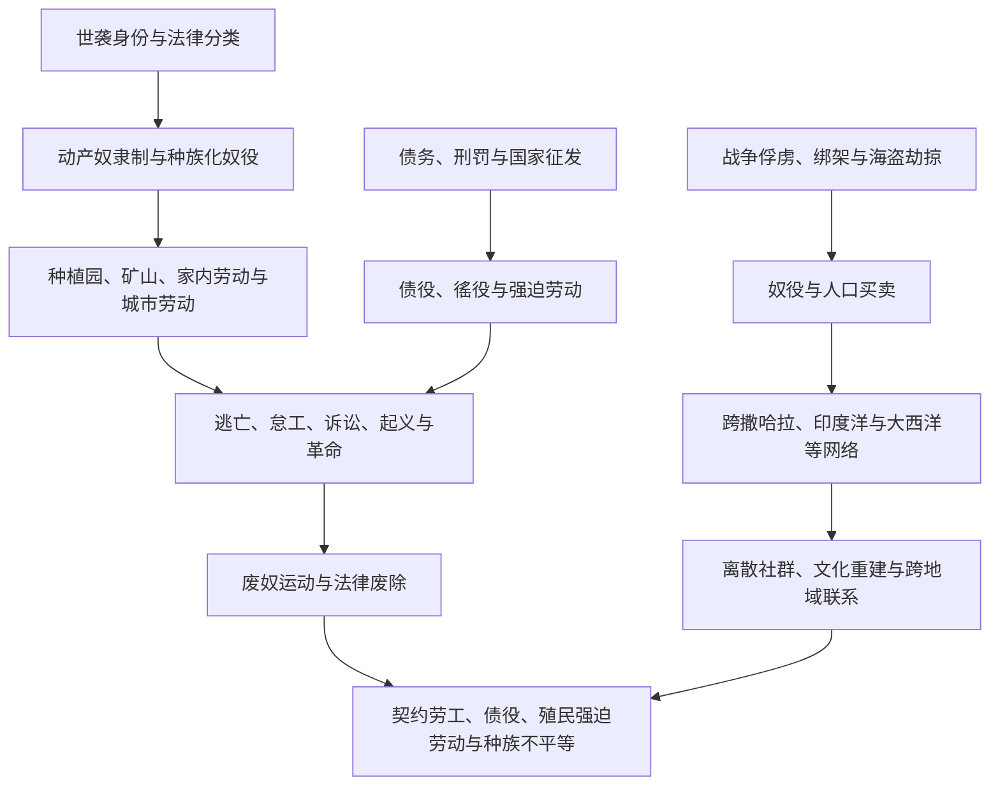

# 奴隶制、强迫劳动与离散社群

## 概括

奴隶制和强迫劳动在不同时代具有不同法律形式、劳动关系和身份边界。战争俘虏、债务、惩罚、出生身份、种族化法律、国家徭役和殖民劳工制度都可能剥夺人的自由，但不能被无差别地写成同一种制度。全球比较需要同时观察强制机制、经济用途、家庭与身份、反抗、废除和制度遗产。

## 制度演变图

## 概念辨析

| 概念 | 核心特征 | 注意事项 |
|---|---|---|
| 动产奴隶制 | 人被法律视为可买卖财产，身份常可世袭 | 大西洋世界形成高度种族化、世袭化的典型制度，但并非历史上唯一奴隶制。 |
| 家内与宫廷奴隶制 | 从事家务、行政、军事或宫廷服务 | 个别奴隶可能获得权力，不能据此否认制度性不自由。 |
| 债役 | 以债务为由限制劳动和迁徙自由 | 可能有期限，也可能通过利息、继承或暴力事实终身化。 |
| 农奴制 | 农民依附土地和领主，承担租赋与劳役 | 与动产奴隶制不同，但自由、婚姻和迁徙同样可能受到严重限制。 |
| 徭役与国家征发 | 国家或地方权力强制提供劳动 | 可用于道路、军役、矿山和大型工程，持续时间和权利状态各异。 |
| 契约劳工 | 名义上以契约规定期限和工资 | 殖民环境下常伴随欺骗、债务、惩罚和行动限制，不能自动等同自由劳动。 |
| 囚犯劳动 | 以刑罚、流放或战争拘禁为基础 | 可能服务殖民扩张、矿业、农业和基础设施。 |
| 现代强迫劳动 | 以暴力、威胁、债务、扣押证件等迫使劳动 | 法律废奴后仍可存在于国家、企业和非法网络中。 |

## 主要区域网络

| 网络 / 制度 | 大致时期 | 主要联系 |
|---|---|---|
| 古代地中海与西亚奴隶制 | 古代 | 战争、海盗、家内劳动、矿业、农业和城市市场。 |
| 撒哈拉、红海与印度洋网络 | 古代至近代 | 非洲内陆、北非、西亚、印度洋岛屿和南亚之间的人口迁移。 |
| 大西洋奴隶贸易 | 15-19世纪 | 欧洲、美洲和非洲国家及商人共同构成贩运网络，种植园需求推动规模扩大。 |
| 美洲殖民强迫劳动 | 16-19世纪 | 监护、贡赋、米塔、奴隶制和任务区等制度重组原住民与非洲劳工。 |
| 俄国与东欧农奴制 | 中世纪晚期至19世纪 | 农民对土地和地主的依附加强，19世纪通过改革废除。 |
| 印度与太平洋契约劳工 | 19-20世纪初 | 废奴后，大量南亚、东亚和太平洋岛民被招募到种植园、铁路和矿山。 |
| 殖民国家强迫劳动 | 19-20世纪 | 非洲、亚洲和太平洋殖民地以税收、劳役和惩罚推动道路、种植园及采矿。 |
| 囚犯与劳改营体系 | 近现代 | 澳大利亚流放、俄国与苏联劳改营等将刑罚与边疆或工业开发结合。 |

## 抵抗、废除与遗产

| 线索 | 说明 |
|---|---|
| 日常抵抗 | 怠工、破坏工具、维持家庭和文化、隐瞒产出与谈判。 |
| 逃亡社群 | 美洲马龙社群、巴西基隆博等建立相对自主的共同体。 |
| 起义与革命 | 海地革命是被奴役者推翻奴隶制与殖民统治的关键案例。 |
| 废奴运动 | 被奴役者行动、宗教、人权观念、政治组织、战争与经济变化共同作用。 |
| 法律废除以后 | 土地、工资、政治权利和种族等级并未自动平等，新的强迫劳动形式可能接续。 |
| 离散社群 | 非洲及其他离散群体重建语言、宗教、音乐、家庭和政治联系，不只是被动受害者。 |

## 关键辨析

- 奴隶贸易中的非洲参与者、欧洲商人、美洲种植园主和殖民国家权力并不对等，不能用“各方都有参与”抹平规模与责任差异。
- 阿拉伯、伊斯兰、非洲、欧洲或美洲内部都不是单一行为主体，应区分时期、国家、港口、商人和社会制度。
- 废奴日期通常只表示法律节点，非法奴役、债役、契约控制和种族不平等可能长期延续。
- 强迫迁徙造成家庭破裂和人口损失，也形成具有创造力、政治行动和跨地域联系的离散社群。

## 区域与专题入口

- [非洲贸易网络与奴隶贸易](/%E4%BA%BA%E6%96%87%E7%A7%91%E5%AD%A6/%E5%8E%86%E5%8F%B2/%E9%9D%9E%E6%B4%B2/_%E9%80%9A%E5%8F%B2/%E9%9D%9E%E6%B4%B2%E8%B4%B8%E6%98%93%E7%BD%91%E7%BB%9C%E4%B8%8E%E5%A5%B4%E9%9A%B6%E8%B4%B8%E6%98%93.md)
- [大西洋奴隶贸易、种植园与侨民](/%E4%BA%BA%E6%96%87%E7%A7%91%E5%AD%A6/%E5%8E%86%E5%8F%B2/%E7%BE%8E%E6%B4%B2/%E6%AE%96%E6%B0%91%E4%B8%8E%E7%8B%AC%E7%AB%8B/%E5%A4%A7%E8%A5%BF%E6%B4%8B%E5%A5%B4%E9%9A%B6%E8%B4%B8%E6%98%93%E3%80%81%E7%A7%8D%E6%A4%8D%E5%9B%AD%E4%B8%8E%E4%BE%A8%E6%B0%91.md)
- [海地革命与法属加勒比](/%E4%BA%BA%E6%96%87%E7%A7%91%E5%AD%A6/%E5%8E%86%E5%8F%B2/%E7%BE%8E%E6%B4%B2/%E5%8A%A0%E5%8B%92%E6%AF%94/%E6%B5%B7%E5%9C%B0%E9%9D%A9%E5%91%BD%E4%B8%8E%E6%B3%95%E5%B1%9E%E5%8A%A0%E5%8B%92%E6%AF%94.md)
- [工业革命、殖民主义与帝国主义](/%E4%BA%BA%E6%96%87%E7%A7%91%E5%AD%A6/%E5%8E%86%E5%8F%B2/_%E9%80%9A%E5%8F%B2/%E5%B7%A5%E4%B8%9A%E9%9D%A9%E5%91%BD%E3%80%81%E6%AE%96%E6%B0%91%E4%B8%BB%E4%B9%89%E4%B8%8E%E5%B8%9D%E5%9B%BD%E4%B8%BB%E4%B9%89.md)
