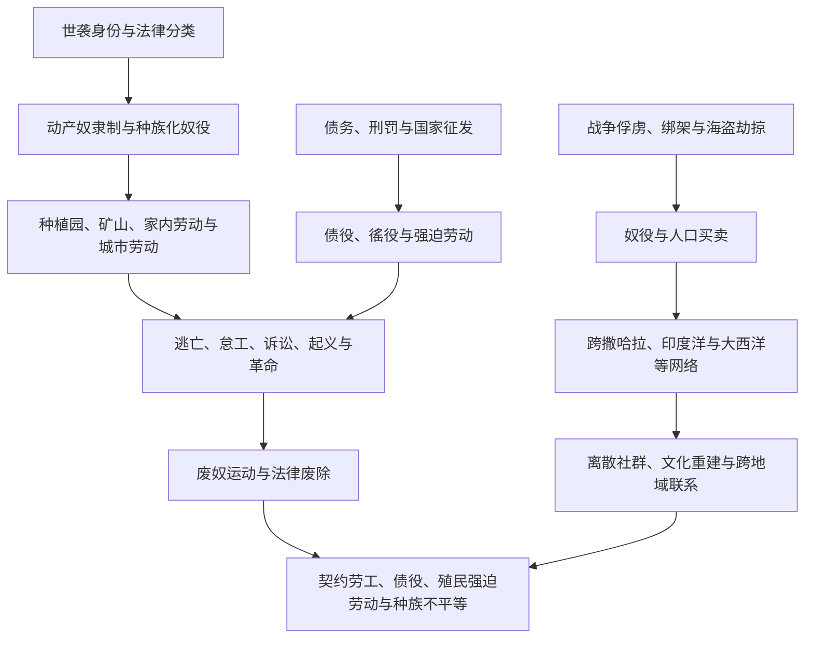

# 奴隶制、强迫劳动与离散社群

## 概括

奴隶制和强迫劳动在不同时代具有不同法律形式、劳动关系和身份边界。战争俘虏、债务、惩罚、出生身份、种族化法律、国家徭役和殖民劳工制度都可能剥夺人的自由，但不能被无差别地写成同一种制度。全球比较需要同时观察强制机制、经济用途、家庭与身份、反抗、废除和制度遗产。

## 制度演变图

## 概念辨析

| 概念 | 核心特征 | 注意事项 |
|---|---|---|
| 动产奴隶制 | 人被法律视为可买卖财产，身份常可世袭 | 大西洋世界形成高度种族化、世袭化的典型制度，但并非历史上唯一奴隶制。 |
| 家内与宫廷奴隶制 | 从事家务、行政、军事或宫廷服务 | 个别奴隶可能获得权力，不能据此否认制度性不自由。 |
| 债役 | 以债务为由限制劳动和迁徙自由 | 可能有期限，也可能通过利息、继承或暴力事实终身化。 |
| 农奴制 | 农民依附土地和领主，承担租赋与劳役 | 与动产奴隶制不同，但自由、婚姻和迁徙同样可能受到严重限制。 |
| 徭役与国家征发 | 国家或地方权力强制提供劳动 | 可用于道路、军役、矿山和大型工程，持续时间和权利状态各异。 |
| 契约劳工 | 名义上以契约规定期限和工资 | 殖民环境下常伴随欺骗、债务、惩罚和行动限制，不能自动等同自由劳动。 |
| 囚犯劳动 | 以刑罚、流放或战争拘禁为基础 | 可能服务殖民扩张、矿业、农业和基础设施。 |
| 现代强迫劳动 | 以暴力、威胁、债务、扣押证件等迫使劳动 | 法律废奴后仍可存在于国家、企业和非法网络中。 |

## 主要区域网络

| 网络 / 制度 | 大致时期 | 主要联系 |
|---|---|---|
| 古代地中海与西亚奴隶制 | 古代 | 战争、海盗、家内劳动、矿业、农业和城市市场。 |
| 撒哈拉、红海与印度洋网络 | 古代至近代 | 非洲内陆、北非、西亚、印度洋岛屿和南亚之间的人口迁移。 |
| 大西洋奴隶贸易 | 15-19世纪 | 欧洲、美洲和非洲国家及商人共同构成贩运网络，种植园需求推动规模扩大。 |
| 美洲殖民强迫劳动 | 16-19世纪 | 监护、贡赋、米塔、奴隶制和任务区等制度重组原住民与非洲劳工。 |
| 俄国与东欧农奴制 | 中世纪晚期至19世纪 | 农民对土地和地主的依附加强，19世纪通过改革废除。 |
| 印度与太平洋契约劳工 | 19-20世纪初 | 废奴后，大量南亚、东亚和太平洋岛民被招募到种植园、铁路和矿山。 |
| 殖民国家强迫劳动 | 19-20世纪 | 非洲、亚洲和太平洋殖民地以税收、劳役和惩罚推动道路、种植园及采矿。 |
| 囚犯与劳改营体系 | 近现代 | 澳大利亚流放、俄国与苏联劳改营等将刑罚与边疆或工业开发结合。 |

## 阶段过程

| 阶段 | 制度变化 | 经济与政治过程 | 人口与社会结果 |
|---|---|---|---|
| 古代至约500年 | 战俘奴役、债役、家内奴隶、矿山与庄园劳动在地中海、西亚及其他地区以不同法律形式并存 | 城邦、帝国、市场与家庭共同使用不自由劳动；国家征发和奴隶市场相互连接 | 被奴役者来源、获释机会和子女身份差异很大，不能以罗马动产奴隶制代表全部古代社会。 |
| 约500—1450年 | 欧亚、非洲内部及撒哈拉、红海、印度洋等人口贸易持续；农奴制、军事和宫廷奴役形成多种组合 | 战争、边疆扩张、债务和商贸提供人口，宗教法与地方习惯既限制也承认某些奴役关系 | 家内、军政、农业和航海劳动并存；非洲、斯拉夫、突厥、草原与高加索等多地人口被卷入不同网络。 |
| 1450—1650年 | 葡萄牙和西班牙扩张把大西洋岛屿种植园、非洲贸易与美洲殖民连接；美洲强迫原住民劳动制度建立 | 糖、白银和殖民财政推动跨洋运输，疾病和征服造成劳动力危机与人口灾难 | 非洲奴隶输入扩大，但监护征役、贡赋、米塔和任务区等制度仍同时压迫原住民。 |
| 1650—1800年 | 大西洋种植园动产奴隶制规模急剧扩大，种族化、世袭化法律趋于系统 | 欧洲和美洲资本、非洲政治与商贸网络、航运保险和殖民军队共同运作，权力与收益极不均 | 跨洋死亡、家庭分离和性暴力严重；被奴役者也建立亲属、宗教、语言、市场与反抗网络。 |
| 1770年代—19世纪末 | 革命、逃亡、起义、废奴主义、战争与国家改革逐步终止合法奴隶贸易和奴隶制 | 海地革命、帝国废奴、美国内战及拉美各国废奴路径不同；补偿常流向奴隶主而非被奴役者 | 法律自由扩大，但土地、教育、工资和政治权利不足使旧等级延续；废奴日期不是社会平等日期。 |
| 19世纪—20世纪初 | 契约劳工、债役、佃农控制、囚犯租赁和殖民强迫劳动部分接续废奴后的劳动力需求 | 招募商、种植园、矿业、税收和刑法限制工人离职，铁路与轮船扩大跨洋劳务流动 | 南亚、东亚、太平洋及非洲劳工形成新离散社群；名义契约与实际自由程度差异很大。 |
| 1919—1945年 | 国际劳工规范开始限制强迫劳动，但殖民劳役、集中营、劳改营和战时奴役扩大 | 国家以开发、惩罚、种族政策和总动员强征劳动，企业可能参与承包和生产 | 大规模死亡、迁徙和创伤显示现代官僚与工业技术同样可组织极端强制。 |
| 1945年以来 | 国际法普遍禁止奴隶制和强迫劳动，殖民帝国解体，多国改革债役和歧视性劳动法 | 非法贩运、扣押证件、债务、国家强迫、武装冲突和部分囚犯劳动制度仍可限制自由 | 幸存者权利、企业供应链责任、赔偿、土地与历史记忆成为持续议题。 |

## 跨区域比较矩阵

| 制度 / 网络 | 进入不自由状态的主要方式 | 法律身份与代际传递 | 主要劳动用途 | 家庭、性别与流动 | 权力结构与退出路径 |
|---|---|---|---|---|---|
| 古代地中海与西亚奴隶制 | 战争俘虏、海盗、出生、买卖和债务 | 可被视为财产，但不同政体对婚姻、赎身和获释规定不同 | 农业、矿山、家内、手工业、商业和公共工程 | 买卖可拆散家庭；女性常承受家务、性剥削和生育控制 | 家庭、市场与国家共同执行；赎身、释放、逃亡和起义并存。 |
| 撒哈拉、红海与印度洋网络 | 战争、绑架、贡赋、边疆贸易和债务 | 身份可能终身或可获释，世袭程度依地区、时期、性别和宗教法实践而异 | 家内、农业、港口、航海、军事、行政与性剥削 | 女性和儿童在部分路线比例较高；陆海转运形成多方向离散 | 地方统治者、商人和家庭网络参与；皈依、赎身或官职不消除制度暴力。 |
| 大西洋种植园动产奴隶制 | 非洲境内战争、绑架和买卖，经欧洲船运至美洲 | 高度种族化、可买卖且母系世袭，法律系统性限制自由 | 糖、咖啡、棉花、烟草、稻米、矿业、家内和城市劳动 | 跨洋与境内买卖反复拆散家庭，强迫生育和性暴力成为再生产机制 | 殖民国家、商人、信贷与种植园结合；逃亡、赎身、诉讼、起义和战争促成解放。 |
| 美洲殖民原住民强迫劳动 | 征服、贡赋、村落迁并、国家轮役、债务和传教管制 | 通常不完全等同动产奴隶，但迁徙、劳动与土地权受强制；非法奴役也存在 | 矿山、种植园、运输、家内、公共工程和任务区生产 | 疾病、迁村和劳役破坏家庭；社区身份与土地制度也成为抵抗资源 | 王室、殖民官员、地方精英和教会权限重叠；逃离、诉讼、起义和制度改革并行。 |
| 俄国与东欧农奴制 | 出生于依附家庭、债务和法律固定农民 | 人身依附土地或地主，买卖与迁徙限制因时期和地区不同 | 庄园农业、家内、手工业和国家劳役 | 家庭可作为税役单位，婚姻和迁徙受领主控制 | 国家与地主共同维持；逃亡、服役、赎买和19世纪改革改变身份。 |
| 印度洋 / 太平洋契约劳工 | 招募、预支工资、债务、欺骗或殖民征募 | 名义有期限和工资，刑事惩罚、证件与债务可使离职困难 | 种植园、矿山、铁路、港口和家内劳动 | 性别比例失衡、家庭分离与新婚姻网络并存；期满后可返乡或定居 | 企业、招募商和殖民国家共同监管；申诉、罢工、逃亡和禁运改革推动终止。 |
| 殖民国家强迫劳动 | 人头税、劳役法、村长征发、刑罚和军事命令 | 通常以臣民义务或“教化”包装，不一定可买卖 | 道路、铁路、采矿、种植园、搬运和军事后勤 | 征发使家庭失去劳力，女性承担额外生产与照护 | 殖民行政与公司共享收益；逃亡、抗税、罢工、反殖民运动和国际监督削弱制度。 |
| 现代强迫劳动与人口贩运 | 暴力、债务、扣证、招聘欺诈、拘禁、冲突和国家命令 | 法律通常禁止，但实际控制使受害者无法安全离开 | 农业、建筑、制造、渔业、家政、性剥削及国家项目 | 移民身份、性别、年龄和语言隔离影响风险，家庭债务可跨境延续 | 非法网络、企业链条或国家机构可能参与；识别、保护、工会、司法和供应链监管决定退出。 |

比较的目的在于区分制度，而不是建立“哪一种较轻”的等级。即使存在赎身、晋升或家庭形成，核心问题仍是人能否拒绝劳动、离开、维持身体与亲属自主，以及谁有权买卖、惩罚或征发。

## 强制劳动的形成与延续机制

1. **制造可支配人口**：战争、债务、刑罚、种族 / 身份分类、无证移民地位和土地剥夺把人置于缺少退出选择的位置。
2. **高利润或高风险需求**：种植园、矿山、远洋船舶、军需和大型工程需要大量、可替换或难以自愿招募的劳动，推动国家和企业降低强制成本。
3. **法律把暴力常态化**：逃亡罪、通行证、体罚权、母系世袭、契约刑事制裁和户籍限制，使私人暴力获得公共权力支持。
4. **信贷与物流扩大距离**：预付款、保险、船运、拍卖、劳务承包和供应链把捕获、运输、使用和获利分给不同参与者，也稀释责任。
5. **家庭与性别控制再生产制度**：买卖配偶子女、强迫婚姻、性暴力和对子女身份的规定，决定劳动力是否世袭以及离散社群如何重建。
6. **去社会化与分类**：改名、禁语、隔离、宗教强制和种族理论试图削弱团结；被奴役者仍通过亲属、信仰、音乐、市场和秘密交流创造共同体。
7. **暴力与奖励并用**：监工、警察和军队执行惩罚，有限的口粮、职位、赎身或土地承诺则制造内部差异；少数晋升案例不代表普遍自由。
8. **抵抗改变成本与合法性**：怠工、逃亡、罢工、诉讼、武装起义和跨国倡议提高维持制度的军事、财政和政治成本，常与战争及经济变化共同促成废除。

## 抵抗、废除与遗产

| 线索 | 说明 |
|---|---|
| 日常抵抗 | 怠工、破坏工具、维持家庭和文化、隐瞒产出与谈判。 |
| 逃亡社群 | 美洲马龙社群、巴西基隆博等建立相对自主的共同体。 |
| 起义与革命 | 海地革命是被奴役者推翻奴隶制与殖民统治的关键案例。 |
| 废奴运动 | 被奴役者行动、宗教、人权观念、政治组织、战争与经济变化共同作用。 |
| 法律废除以后 | 土地、工资、政治权利和种族等级并未自动平等，新的强迫劳动形式可能接续。 |
| 离散社群 | 非洲及其他离散群体重建语言、宗教、音乐、家庭和政治联系，不只是被动受害者。 |

## 长期影响

| 领域 | 长期遗产 | 延续机制 |
|---|---|---|
| 人口与家庭 | 死亡、性别失衡、家庭分离、跨海离散和新亲属网络改变人口分布 | 境内再贩卖、殖民边界和移民限制使分离在法律废除后继续。 |
| 土地与财富 | 种植园、矿山和殖民基础设施积累资本，被奴役者和强迫劳工通常得不到土地、工资与补偿 | 财产法、债务、继承、企业延续和国家补偿奴隶主等安排固化差距。 |
| 种族、等级与公民权 | 奴役的法律分类影响肤色、血统、种姓、族群和“可劳动人口”的观念 | 教育、住房、警务、移民和选举制度可能继续再生产旧等级。 |
| 国家与企业能力 | 户籍、通行证、劳工招募、警察和运输系统因控制劳动而扩张 | 废奴后这些工具可转用于殖民劳役、囚犯劳动和移民监管。 |
| 离散文化 | 被迫迁徙者在语言、宗教、饮食、音乐、医药和政治组织中创造跨地域传统 | 文化重建源于能动性，但不应被浪漫化为暴力带来的“正面结果”。 |
| 抵抗与权利 | 逃亡社群、海地革命、废奴运动、工会和反殖民运动扩展自由与公民权语言 | 权利成果依赖组织和执行，形式平等可能与经济依附并存。 |
| 记忆、赔偿与修复 | 档案、纪念、遗骸、文物、企业收益和国家责任成为公共争论 | 谁被统计、谁能发言、补偿对象及土地返还范围影响修复正义。 |

## 争议与方法局限

- 奴隶贸易和强迫劳动数量常依赖航运清单、税册、法庭与殖民报告；非法运输、内陆死亡、家内劳动和未登记者容易被漏算。
- 全球比较必须区分可买卖、世袭、依附土地、限期契约和国家征发等制度；指出差异不等于淡化任何制度中的暴力。
- 强调非洲或其他地方中介者的行动能力，不能抹平欧洲殖民军力、航运资本、美洲种植园需求和种族法所造成的结构性不对等。
- “奴隶”是历史法律身份，但以“被奴役者”表述可提醒这种身份由他人施加；具体笔记仍应保留当时法名以便辨析制度。
- 废奴的法律日期、实际停止贩运、获得公民权和实现经济自由是不同节点，必须分别追踪。
- “现代奴隶制”能动员关注，却可能把人口贩运、债役、强迫婚姻、国家劳役和恶劣但可退出的工作混成单一数字；比较应以无法安全拒绝或离开的强制标准为核心。
- 离散社群不只由奴隶贸易产生，也包括契约劳工、流亡、殖民教育和自由迁移；共同文化不能反推所有成员具有相同经历。
- 幸存者证词、口述史和社群记忆可纠正国家与商人档案的偏向，但也应说明记忆形成时间、代际传递和创伤伦理。

## 关键辨析

- 奴隶贸易中的非洲参与者、欧洲商人、美洲种植园主和殖民国家权力并不对等，不能用“各方都有参与”抹平规模与责任差异。
- 阿拉伯、伊斯兰、非洲、欧洲或美洲内部都不是单一行为主体，应区分时期、国家、港口、商人和社会制度。
- 废奴日期通常只表示法律节点，非法奴役、债役、契约控制和种族不平等可能长期延续。
- 强迫迁徙造成家庭破裂和人口损失，也形成具有创造力、政治行动和跨地域联系的离散社群。

## 区域与专题入口

- [非洲贸易网络与奴隶贸易](/%E4%BA%BA%E6%96%87%E7%A7%91%E5%AD%A6/%E5%8E%86%E5%8F%B2/%E9%9D%9E%E6%B4%B2/_%E9%80%9A%E5%8F%B2/%E9%9D%9E%E6%B4%B2%E8%B4%B8%E6%98%93%E7%BD%91%E7%BB%9C%E4%B8%8E%E5%A5%B4%E9%9A%B6%E8%B4%B8%E6%98%93.md)
- [大西洋奴隶贸易、种植园与侨民](/%E4%BA%BA%E6%96%87%E7%A7%91%E5%AD%A6/%E5%8E%86%E5%8F%B2/%E7%BE%8E%E6%B4%B2/%E6%AE%96%E6%B0%91%E4%B8%8E%E7%8B%AC%E7%AB%8B/%E5%A4%A7%E8%A5%BF%E6%B4%8B%E5%A5%B4%E9%9A%B6%E8%B4%B8%E6%98%93%E3%80%81%E7%A7%8D%E6%A4%8D%E5%9B%AD%E4%B8%8E%E4%BE%A8%E6%B0%91.md)
- [海地革命与法属加勒比](/%E4%BA%BA%E6%96%87%E7%A7%91%E5%AD%A6/%E5%8E%86%E5%8F%B2/%E7%BE%8E%E6%B4%B2/%E5%8A%A0%E5%8B%92%E6%AF%94/%E6%B5%B7%E5%9C%B0%E9%9D%A9%E5%91%BD%E4%B8%8E%E6%B3%95%E5%B1%9E%E5%8A%A0%E5%8B%92%E6%AF%94.md)
- [工业革命、殖民主义与帝国主义](/%E4%BA%BA%E6%96%87%E7%A7%91%E5%AD%A6/%E5%8E%86%E5%8F%B2/_%E9%80%9A%E5%8F%B2/%E5%B7%A5%E4%B8%9A%E9%9D%A9%E5%91%BD%E3%80%81%E6%AE%96%E6%B0%91%E4%B8%BB%E4%B9%89%E4%B8%8E%E5%B8%9D%E5%9B%BD%E4%B8%BB%E4%B9%89.md)
