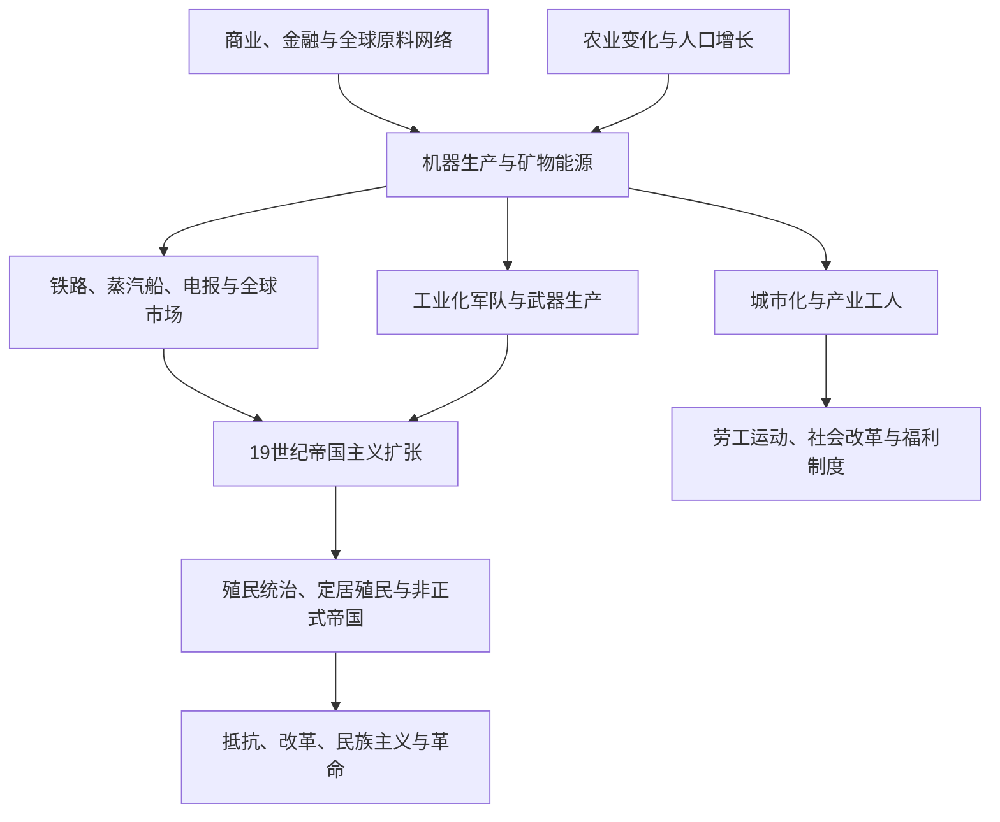

# 工业革命、殖民主义与帝国主义

## 概括

工业化把矿物能源、机器生产、交通通信、资本组织和大规模雇佣劳动结合起来，首先在18世纪后期的英国显著加速，随后以不同路径扩展到欧洲、美洲、日本及其他地区。工业化提高生产和军事能力，也与殖民扩张、资源开采、劳工强制、城市贫困和环境变化相互作用。

## 演进关系

## 核心维度

| 维度 | 内容 | 需要注意 |
|---|---|---|
| 能源与技术 | 煤炭、蒸汽机、机械纺织、钢铁、电力和化学工业 | 技术扩散依赖资本、技能、国家政策和全球原料，不是自动发生。 |
| 劳动与城市 | 工厂纪律、雇佣劳动、童工、工会和快速城市化 | 工业增长与贫困、公共卫生危机及社会改革并存。 |
| 交通通信 | 铁路、蒸汽船、电报和运河 | 缩短运输时间，也便于殖民控制、资源输出和军事动员。 |
| 殖民主义 | 直接统治、保护国、定居殖民、特许公司与强迫劳动 | 不同殖民制度不能用单一模式解释。 |
| 帝国主义 | 列强争夺领土、市场、战略通道和政治影响 | 既包括正式殖民，也包括债务、租界和不平等条约等非正式控制。 |
| 抵抗与改革 | 武装抵抗、宗教运动、制度改革、劳工组织和民族主义 | 被殖民社会具有主动性，并非只接受欧洲制度。 |

## 区域差异

- 英国率先形成大规模工业体系，欧洲大陆、美国和日本随后走出不同的国家推动与市场路径。
- 拉丁美洲独立后仍通过矿产、农产品、铁路和外资深度参与世界市场。
- 印度、东南亚、非洲和中东的殖民经济常被重组为原料、税收和战略通道体系。
- 日本明治国家推动工业化并建立自己的帝国，说明工业化和帝国主义并非只属于欧美列强。
- 清朝、中国近代各政权及奥斯曼、伊朗等通过军事、教育和制度改革回应全球压力，但结果受内外政治条件制约。

## 关键辨析

- 工业革命不是单一发明造成的瞬间变化，而是能源、生产、市场、制度和劳动关系的长期重组。
- 殖民主义早于工业革命存在；19世纪工业能力进一步扩大了帝国扩张的速度和范围。
- “现代化”不应等同于“西方化”，也不能用来合理化殖民统治。
- 工业化带来的增长、公共设施与社会改革，不能抵消奴役、掠夺、战争和环境代价。

## 相关入口

- [欧洲历史](/%E4%BA%BA%E6%96%87%E7%A7%91%E5%AD%A6/%E5%8E%86%E5%8F%B2/%E6%AC%A7%E6%B4%B2/README.md)
- [东亚历史](/%E4%BA%BA%E6%96%87%E7%A7%91%E5%AD%A6/%E5%8E%86%E5%8F%B2/%E4%B8%9C%E4%BA%9A/README.md)
- [南亚历史](/%E4%BA%BA%E6%96%87%E7%A7%91%E5%AD%A6/%E5%8E%86%E5%8F%B2/%E5%8D%97%E4%BA%9A/README.md)
- [东南亚历史](/%E4%BA%BA%E6%96%87%E7%A7%91%E5%AD%A6/%E5%8E%86%E5%8F%B2/%E4%B8%9C%E5%8D%97%E4%BA%9A/README.md)
- [非洲历史](/%E4%BA%BA%E6%96%87%E7%A7%91%E5%AD%A6/%E5%8E%86%E5%8F%B2/%E9%9D%9E%E6%B4%B2/README.md)
- [美洲历史](/%E4%BA%BA%E6%96%87%E7%A7%91%E5%AD%A6/%E5%8E%86%E5%8F%B2/%E7%BE%8E%E6%B4%B2/README.md)
