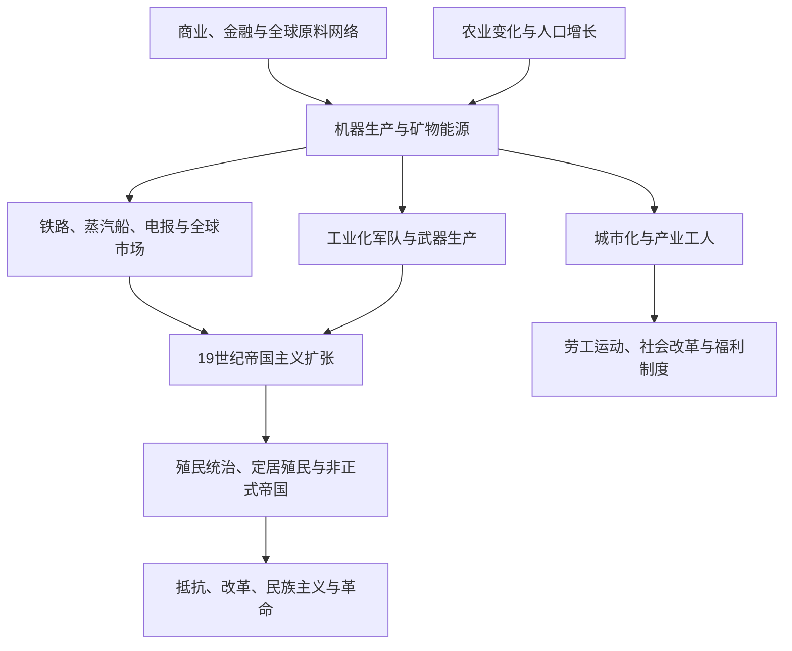

# 工业革命、殖民主义与帝国主义

## 概括

工业化把矿物能源、机器生产、交通通信、资本组织和大规模雇佣劳动结合起来，首先在18世纪后期的英国显著加速，随后以不同路径扩展到欧洲、美洲、日本及其他地区。工业化提高生产和军事能力，也与殖民扩张、资源开采、劳工强制、城市贫困和环境变化相互作用。

## 演进关系

## 时间与范围

- 狭义第一次工业革命约自18世纪后期延续到19世纪中叶，核心是煤炭、蒸汽、机械纺织和工厂制度；19世纪后期的钢铁、电力、化工、内燃机与企业组织变化常称第二次工业革命。
- 殖民主义在工业革命前已经存在，19世纪工业、金融和军事能力使其扩张加速；帝国主义既包括领土殖民，也包括保护国、租界、债务控制和不平等条约等非正式支配。
- 本篇重点到第一次世界大战前后，并追踪工业化与殖民结构对劳动、城市、国家能力和全球不平等的长期影响。

## 分阶段过程

| 阶段 | 时间 | 工业化过程 | 帝国与全球联系 |
|---|---|---|---|
| 商业扩张与早期机械化 | 17世纪—18世纪中叶 | 家庭手工业、工场、金融市场和农业变化扩大商品与劳动力供给，水力机械和采矿技术持续改进。 | 大西洋奴隶制、亚洲纺织品贸易、美洲贵金属与殖民消费市场积累资本和需求，但不同地区所得与代价极不均衡。 |
| 英国第一次工业革命 | 约1760—1830年代 | 棉纺机械、焦炭炼铁、改良蒸汽机和工厂集中生产相互推动，煤田、港口、运河与国内市场降低运输和能源成本。 | 奴隶种植园棉花、印度市场和海军保护是外部联系之一；工业化不能只归因于帝国，也不能脱离全球原料与战争财政解释。 |
| 铁路时代与区域扩散 | 1830—1870年代 | 铁路、蒸汽船、电报和机器制造扩展，工业化进入比利时、法国、德意志诸邦、美国等地，各国以银行、关税和国家采购形成不同路径。 | 运输革命扩大粮食、矿产和移民流动，也强化炮舰外交、条约港与殖民地资源输出。 |
| 第二次工业革命 | 1870年代—1914年 | 钢铁、电力、化工、石油、内燃机和大企业组织提高规模与研发能力；城市公共交通、卫生和大众消费发展。 | 企业、银行和国家更紧密结合，军备竞赛、海军基地、战略运河与全球通信使工业竞争具有地缘政治性质。 |
| 新帝国主义高潮 | 1870年代—1914年 | 工业国家并非都以相同速度或方式殖民，扩张由战略竞争、资本投资、传教与种族主义共同推动。 | 非洲瓜分、亚洲殖民扩张、定居殖民和非正式帝国并行；地方统治者、商人、军队与社会组织通过合作、谈判、迁徙或武装抵抗改变殖民结果。 |
| 战争动员与殖民秩序危机 | 1914年以后 | 总体战把工业产能、科学、运输和群众动员推向新规模，也暴露供应链和阶级矛盾。 | 殖民地兵员与资源支持帝国战争，战后民族主义、劳工运动与发展型国家扩张；殖民结构直到20世纪非殖民化才逐步重组。 |

## 核心维度

| 维度 | 内容 | 需要注意 |
|---|---|---|
| 能源与技术 | 煤炭、蒸汽机、机械纺织、钢铁、电力和化学工业 | 技术扩散依赖资本、技能、国家政策和全球原料，不是自动发生。 |
| 劳动与城市 | 工厂纪律、雇佣劳动、童工、工会和快速城市化 | 工业增长与贫困、公共卫生危机及社会改革并存。 |
| 交通通信 | 铁路、蒸汽船、电报和运河 | 缩短运输时间，也便于殖民控制、资源输出和军事动员。 |
| 殖民主义 | 直接统治、保护国、定居殖民、特许公司与强迫劳动 | 不同殖民制度不能用单一模式解释。 |
| 帝国主义 | 列强争夺领土、市场、战略通道和政治影响 | 既包括正式殖民，也包括债务、租界和不平等条约等非正式控制。 |
| 抵抗与改革 | 武装抵抗、宗教运动、制度改革、劳工组织和民族主义 | 被殖民社会具有主动性，并非只接受欧洲制度。 |

## 区域差异

- 英国率先形成大规模工业体系，欧洲大陆、美国和日本随后走出不同的国家推动与市场路径。
- 拉丁美洲独立后仍通过矿产、农产品、铁路和外资深度参与世界市场。
- 印度、东南亚、非洲和中东的殖民经济常被重组为原料、税收和战略通道体系。
- 日本明治国家推动工业化并建立自己的帝国，说明工业化和帝国主义并非只属于欧美列强。
- 清朝、中国近代各政权及奥斯曼、伊朗等通过军事、教育和制度改革回应全球压力，但结果受内外政治条件制约。

## 因果层次

| 过程 | 结构因素 | 外部压力与全球联系 | 直接转折或加速机制 |
|---|---|---|---|
| 英国早期工业化 | 煤炭可得性、较高工资与市场需求、农业和人口变化、熟练工匠、金融信用、专利与国家财政能力共同创造持续试验条件。 | 亚洲纺织品竞争、美洲和加勒比奴隶种植园棉花、殖民市场、欧洲战争和海军保护把英国生产置于全球原料与消费网络中。 | 珍妮纺纱机、水力纺纱机、改良蒸汽机和工厂组织相互配合，随后铁路降低运输成本；没有一项发明能单独“触发”工业革命。 |
| 工业化扩散 | 教育、银行、关税、统一市场、矿产、城市工匠与国家采购能力决定各地吸收技术的速度。 | 英国商品竞争、战争封锁、跨国工程师与资本流动迫使或帮助后发国家选择不同政策。 | 铁路干线、国家贷款、军工订单和企业法改革常形成局部突破，但区域工业核心与农业腹地长期并存。 |
| 19世纪帝国主义扩张 | 列强战略竞争、民族主义、种族主义和“文明使命”观念，同军工、航运、金融与官僚能力结合。 | 原料和市场需求、苏伊士等交通要道、帝国竞争及当地政权财政危机提供扩张机会，但经济收益并非每次征服的唯一动机。 | 债务接管、条约冲突、边境战争、公司破产或传教士事件常成为干预借口；柏林会议规范非洲占领竞争，而不是凭一次会议创造瓜分。 |
| 殖民经济重组 | 人头税、土地法、关税、货币税收和劳动力管制迫使家庭进入出口与工资经济，铁路和港口围绕矿山与种植园布局。 | 世界商品价格、外国资本、航运费率和宗主国贸易政策限制殖民地政策空间。 | 特许公司获得土地矿权、强迫劳动法实施、铁路通车或单一作物繁荣可迅速改变地方经济，也使危机在价格下跌时集中爆发。 |
| 抵抗、改革与民族主义 | 既有政治合法性、宗教网络、土地权利、村社组织、城市知识阶层和劳工利益构成动员基础。 | 敌对列强、侨民网络、新式教育、印刷和跨国反殖民思想提供资源与语言。 | 征税、征兵、失地、亵渎宗教、强迫种植或王位干预等具体事件常引发起义；失败后的军事和行政改革又可能孕育后续民族运动。 |

## 工业化与帝国联系的跨区域比较矩阵

| 地区 | 起点与主要路径 | 殖民或帝国联系 | 结果与地区差异 |
|---|---|---|---|
| 英国与西北欧 | 英国以煤炭、纺织和工厂率先突破；比利时、法国、德国等结合矿区、银行、铁路、技术教育和国家政策追赶。 | 海外原料、市场和航运扩大规模，欧洲内部竞争又推动关税、军工与殖民扩张。 | 工业核心区城市化迅速，工会、社会主义和公共卫生改革兴起；南欧、东欧及各国内部农村地区转型较慢。 |
| 美国与其他定居殖民社会 | 美国依靠关税、广阔资源、专利、铁路和大企业形成重工业；加拿大、澳大利亚等通过资源出口、移民和帝国内市场建设交通与加工。 | 原住民土地被夺取，非洲奴隶制及其废除后的种族劳动秩序、亚洲和欧洲移民共同支撑扩张。 | 高工资和大市场促进机械化，但财富建立在大陆征服与土地不平等上；资源型地区对外部价格仍高度敏感。 |
| 日本 | 明治国家通过地税、征兵、教育、国营示范企业和进口设备集中资源，随后把企业出售给民间集团并发展军工。 | 避免被殖民的压力推动改革，工业和军事能力又支持日本在台湾、朝鲜、中国东北等地建立自己的帝国。 | 日本证明后发国家可由国家主导快速工业化，也说明摆脱西方支配不必然带来反帝国主义。 |
| 中国与东亚其他地区 | 通商口岸、洋务企业、民间纺织、矿业和铁路并行，中央与区域财政分散、战争和条约权利限制统一工业政策。 | 不平等条约、租界、外债与列强竞争构成非正式帝国环境，日本扩张进一步破坏工业区域。 | 沿海和少数城市形成现代产业，广大农村仍以家庭生产为主；国家统一、主权和工业化因而被近代政治紧密结合。 |
| 南亚 | 印度手工纺织在英国机器品冲击下部分衰退但未消失，孟买棉纺、孟加拉黄麻、铁路和矿业又形成重要工业核心。 | 殖民关税、财政汇款、土地税和面向帝国的铁路重塑市场，原料出口与英国制成品输入长期不对称。 | 商人、工人和农民并非被动，印度资本与工会逐步成长；区域产业差异和殖民政策成为民族主义经济批判的核心。 |
| 东南亚 | 港市、稻米、锡、橡胶、糖和石油等出口经济扩大，华人、印度人和本地劳工跨境流动；暹罗以国家改革和外交维持形式独立。 | 荷、英、法、美等殖民制度以公司、直接统治和保护国不同方式控制土地、劳工和贸易。 | 铁路港口多服务出口，制造业有限但城市商业活跃；岛屿和大陆、殖民地与暹罗之间的国家能力和土地制度差异很大。 |
| 奥斯曼帝国、伊朗与埃及 | 军事工场、纺织、铁路、电报和行政教育改革由国家推动，私人商人和侨民资本也参与；埃及曾尝试国家主导工业。 | 欧洲商品竞争、治外法权、外债和债务管理压缩关税与财政自主，苏伊士运河和后来的石油提高战略压力。 | 改革增强部分军政能力，却可能因债务招致控制或占领；工业化不能用“完全停滞”概括，也未能消除区域和农村差距。 |
| 撒哈拉以南非洲 | 多数地区被纳入矿业、种植园和现金作物体系，南非矿业—工业核心最突出，部分沿海城市形成加工和铁路工场。 | 列强通过征服、特许公司、税收和强迫劳动铺设面向港口的基础设施；埃塞俄比亚等保有政治独立的地区走出不同道路。 | 基础设施可连接市场，却常跨越而非整合本地经济；矿区移工、土地剥夺和种族劳动控制留下深远社会空间分割。 |
| 拉丁美洲 | 独立国家以银、铜、硝石、咖啡、糖、肉类和谷物出口换取铁路、设备与资本，部分国家发展纺织和食品工业。 | 英美及欧洲资本、债务和贸易形成非正式帝国影响，本地国家和寡头仍保有比正式殖民地更大的政策选择。 | 出口繁荣推动港市和国家财政，也强化土地集中与价格依赖；20世纪危机后部分国家转向进口替代工业化。 |

## 殖民与帝国控制形式

| 形式 | 权力机制 | 经济与社会特点 | 辨析 |
|---|---|---|---|
| 直接殖民统治 | 宗主国官僚和军队掌握最高立法、财政与治安，可借地方酋长或官员执行基层事务。 | 税收、土地登记、人口分类和教育用于控制劳力与资源。 | “直接”不表示完全排除地方中介；行政人员有限时，殖民政府仍依赖既有权威。 |
| 保护国与间接统治 | 保留名义君主或地方首领，外交、军事和关键财政由帝国控制。 | 统治成本较低，却可能固定或重造“传统”身份和领地边界。 | 名义主权与实际权力必须区分，不同保护国的自治程度差异很大。 |
| 特许公司统治 | 国家授予公司贸易垄断、征税、司法、军队或领土管理权。 | 股东利润与领土统治结合，容易以强迫劳动和暴力压低成本。 | 公司失败后常转为王室或国家直接统治，公私边界并不稳定。 |
| 定居殖民 | 大量外来定居者获取土地并争取自治，原住民被驱逐、隔离、同化或置于不同法律地位。 | 农牧、矿业和城市市场扩大，土地与公民权按种族分配。 | 定居者与宗主国可能冲突，但两者的自治争议不等于原住民主权得到恢复。 |
| 非正式帝国 | 不直接吞并领土，而以债务、关税控制、治外法权、租界、顾问和炮舰威胁影响政策。 | 当地国家继续存在，关键收入、港口或市场准入却受外部约束。 | 不能把一切贸易和投资都称为帝国主义；关键在于谈判权、退出权和强制能力是否对称。 |
| 军事占领与势力范围 | 战争后驻军、划分势力范围或控制战略通道，法律安排可能是临时或含混的。 | 基地、铁路、运河和边境安全优先，常与公司利益及当地派系合作。 | 正式法理、名义宗主权和实际控制可能分离，判断时需同时看驻军、财政和任免权。 |

## 关键转折

| 时间 | 转折 | 影响 |
|---|---|---|
| 1760—1780年代 | 机械纺纱、水力工厂与瓦特式蒸汽机扩散 | 纺织、煤炭、铁和机器制造形成相互促进的产业群，工厂制度开始稳定。 |
| 1830年 | 利物浦—曼彻斯特铁路开通 | 铁路显示蒸汽运输可大规模连接原料、工厂与市场，随后成为工业化和帝国控制的重要基础设施。 |
| 1839—1842年 | 第一次鸦片战争及不平等条约体系开端 | 工业化海军和商业利益结合，开启中国通商口岸与治外法权等非正式帝国机制。 |
| 1857—1858年 | 印度大起义与英属印度统治重组 | 东印度公司统治终结，英国王室直接接管，军队、土地和族群政策被重新安排。 |
| 1868年 | 日本明治维新 | 国家集中、制度改革与工业政策加速，使日本成为亚洲工业化及帝国扩张的重要案例。 |
| 1869年 | 苏伊士运河通航 | 欧洲至印度洋航程缩短，埃及债务与运河控制成为英国占领和全球战略竞争焦点。 |
| 1884—1885年 | 柏林西非会议 | 列强约定占领通知和有效统治原则，非洲瓜分加速；非洲社会没有参与划界。 |
| 1890年代—1914年 | 电力、化工、石油、无线电与军备扩张 | 第二次工业革命提高国家和企业规模，帝国竞争、民族主义与总体战准备更加紧密。 |
| 1914—1918年 | 第一次世界大战总体动员 | 工业能力转化为长期战争和殖民地资源征用，欧洲帝国秩序受重创，反殖民政治加速。 |

## 长期影响

| 层面 | 主要变化 | 代价、限制与延续 |
|---|---|---|
| 生产与生活 | 机器、矿物能源和科学管理显著提高产量，铁路、电力、清洁供水和大众商品改变日常生活。 | 收益分配取决于工资、产权和公共政策；长工时、童工、事故和贫民区在早期工业城市普遍存在。 |
| 劳动与政治 | 工厂集中促进工会、社会主义、妇女劳动组织和大众政党，国家逐步建立劳动法、保险与公共教育。 | 改革常经长期斗争取得，殖民地和种族化劳工通常被排除在宗主国同等权利之外。 |
| 国家与战争 | 税收、统计、通信、铁路和军工扩大国家治理与动员能力。 | 同样能力也支持监控、征兵、集中营、殖民镇压和总体战，技术进步不自带政治方向。 |
| 全球经济 | 运输和金融把粮食、原料、资本与移民连接成世界市场，部分后发国家成功追赶。 | 殖民分工和不平等条约限制产业升级，矿业与单一作物地区更易受价格危机影响。 |
| 城市与人口 | 城市就业、教育和医疗吸引人口，公共卫生降低部分死亡率，跨洲移民形成新社会。 | 住房拥挤、传染病、土地剥夺和移工家庭分离集中于低收入群体。 |
| 环境 | 化石能源提高单位劳动产出并缓解部分木材压力，工业农业和交通扩展全球供给。 | 煤烟、矿山、河流污染、森林砍伐和温室气体累积把成本转移给工人、殖民边疆与后代。 |
| 反殖民与发展 | 殖民学校、军队、城市劳动和印刷网络意外提供民族主义组织条件，独立国家把工业化视为主权基础。 | 新国家继承面向出口的铁路、土地集中与行政边界，政治独立后仍需处理债务、技术依赖和区域失衡。 |

## 关键辨析

- 工业革命不是单一发明造成的瞬间变化，而是能源、生产、市场、制度和劳动关系的长期重组。
- 殖民主义早于工业革命存在；19世纪工业能力进一步扩大了帝国扩张的速度和范围。
- “现代化”不应等同于“西方化”，也不能用来合理化殖民统治。
- 工业化带来的增长、公共设施与社会改革，不能抵消奴役、掠夺、战争和环境代价。

## 相关入口

- [欧洲历史](/%E4%BA%BA%E6%96%87%E7%A7%91%E5%AD%A6/%E5%8E%86%E5%8F%B2/%E6%AC%A7%E6%B4%B2/README.md)
- [东亚历史](/%E4%BA%BA%E6%96%87%E7%A7%91%E5%AD%A6/%E5%8E%86%E5%8F%B2/%E4%B8%9C%E4%BA%9A/README.md)
- [南亚历史](/%E4%BA%BA%E6%96%87%E7%A7%91%E5%AD%A6/%E5%8E%86%E5%8F%B2/%E5%8D%97%E4%BA%9A/README.md)
- [东南亚历史](/%E4%BA%BA%E6%96%87%E7%A7%91%E5%AD%A6/%E5%8E%86%E5%8F%B2/%E4%B8%9C%E5%8D%97%E4%BA%9A/README.md)
- [非洲历史](/%E4%BA%BA%E6%96%87%E7%A7%91%E5%AD%A6/%E5%8E%86%E5%8F%B2/%E9%9D%9E%E6%B4%B2/README.md)
- [美洲历史](/%E4%BA%BA%E6%96%87%E7%A7%91%E5%AD%A6/%E5%8E%86%E5%8F%B2/%E7%BE%8E%E6%B4%B2/README.md)
