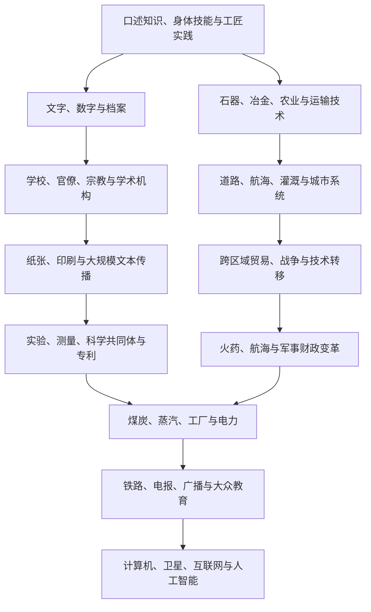

# 技术、知识与传播史

## 概括

技术史不只是发明清单。技术需要材料、劳动、知识、制度、资金、使用者和维修网络才能长期运作；知识也通过口述、文字、学校、宗教、工匠传统、印刷、科学机构和数字网络传播。发明可能独立出现，也可能在跨文化传播中被重新组合。

## 演进与传播图

## 阶段过程

| 阶段 | 知识载体与机构 | 技术系统 | 传播与重组 |
|---|---|---|---|
| 史前至早期定居社会 | 口述、观察、模仿、仪式、身体训练与代际学徒制 | 石器、火、纤维、航海、狩猎、植物管理和建筑 | 人群迁徙、婚姻和交换传播技能；缺少文字不等于缺少系统知识。 |
| 早期城市与国家 | 文字、数字、历法、档案、工匠作坊和神庙 / 宫廷学校 | 灌溉、青铜、车船、度量衡、城市工程 | 国家征调和贸易扩大标准化，也可能把工艺秘密限制在家族或职业群体。 |
| 古典时代至公元7世纪 | 官僚档案、哲学与医学传统、宗教经典、图书馆和口述技艺并存 | 铁器、道路、水利、玻璃、造纸早期、复合船舶和攻城技术 | 帝国、商路、战争俘虏和翻译使希腊、伊朗、印度、东亚及其他知识传统相互接触。 |
| 7—15世纪 | 寺院、书院、经院、伊斯兰学术机构、考试和跨语言翻译 | 纸张与印刷、火药、指南针、数学、天文、医学、水力和远洋航海 | 阿拉伯语、波斯语、拉丁语、梵语、汉文等知识圈既保存也批评、扩展和本地化旧知识。 |
| 15—18世纪 | 印刷市场、国家测绘、航海学校、科学院、工匠网络和殖民档案 | 远洋船、火炮、钟表、透镜、采矿、实验仪器和全球作物系统 | 印刷降低部分文本成本，帝国把地方知识转为可征税、可测绘资源；知识取得常伴随强制。 |
| 18世纪后期—19世纪 | 专利、工程学校、工厂、职业协会、实验室与大众报刊 | 煤炭、蒸汽、机器生产、铁路、电报、化学和卫生工程 | 科学、工艺、资本和国家采购更紧密结合，工业化在不同地区速度和路径不一。 |
| 20世纪 | 大学—企业—国家研究体系、标准组织、广播和普及教育 | 电力、内燃机、航空、抗生素、核技术、电子学和自动化 | 两次世界大战和冷战加速集中研发，也造成知识保密、军民转用和技术灾难。 |
| 20世纪后期以来 | 数字数据库、开源社群、平台、卫星与跨国研究网络 | 半导体、互联网、生物技术、可再生能源、机器人和人工智能 | 信息复制成本下降，但芯片、能源、数据、海底电缆和云平台形成新的物质依赖与权力集中。 |

## 跨区域比较矩阵

| 区域 / 知识圈 | 主要知识机构 | 代表性技术与知识系统 | 典型传播渠道 | 权力与资源条件 | 比较时的局限 |
|---|---|---|---|---|---|
| 东亚 | 官僚档案、书院、寺院、工匠作坊、家族与考试制度 | 纸张印刷、冶铁、农学、水利、火药、航海和历法 | 朝贡与贸易、僧侣旅行、战争、移民、官方编纂和民间刊刻 | 国家采购和标准化能力强，地方市场和工匠知识同样关键 | 不能把中国发明视为自动、完整地“传到西方”；路线、时间和再发明须分别核对。 |
| 南亚 | 宫廷、寺院、佛教与耆那教机构、医学和数学师承、手工业群体 | 数字与数学、天文、医学、纺织、冶金、灌溉和造船 | 梵语及地方语言文本、波斯语行政、印度洋商贸和侨民 | 港市、王权、寺院土地与专业社群共同支持知识 | 殖民档案常把活态技艺写成静止“传统”，区域和社会群体差异容易被抹平。 |
| 伊斯兰世界与西亚 | 清真寺、经学院、医院、宫廷、市场工匠和翻译机构 | 代数、天文、光学、医学、灌溉、纸张、地图和航海 | 阿拉伯语与波斯语学术圈、朝圣、商贸、翻译和帝国行政 | 慈善基金、宫廷赞助、城市市场和跨区学者网络并存 | “保存希腊知识”的说法过窄，忽略原创研究及印度、伊朗等多源输入。 |
| 欧洲与地中海 | 修道院、大学、行会、印刷市场、科学院、企业实验室 | 海事、机械钟、印刷、火炮、实验仪器、蒸汽和电气系统 | 拉丁语及俗语印刷、殖民网络、战争、专利和产业间人员流动 | 煤炭、资本、国家竞争和殖民资源共同塑造工业化 | 不能以近代优势倒推一条自古领先的连续路线，也不能忽略外来知识与殖民收益。 |
| 撒哈拉以南非洲 | 口述师承、年龄组、宫廷、宗教学校、铁匠和商贸社群 | 冶铁、农业生态知识、建筑、航海、医药、采矿和复杂城市系统 | 撒哈拉与印度洋贸易、迁徙、亲属和专业工匠网络 | 地方国家、市场和社群管理资源；殖民征收与技术压制后来重组制度 | 热带保存条件和殖民偏见造成文献不均，不应把文字材料少误判为技术停滞。 |
| 美洲 | 宫廷和祭司记录、结绳与图像记忆、社区农业知识、道路和工匠体系 | 玉米育种、梯田灌溉、城市规划、冶金、历法、道路和生态管理 | 商路、征服、贡赋、移民与跨生态带交换 | 城市国家、帝国、村社和亲属网络形式多样 | 轮式运输或欧亚字母文字缺席不等于没有复杂计算、行政和工程。 |
| 大洋洲与海洋社群 | 航海师承、谱系口述、仪式、村社和跨岛交换伙伴 | 远洋导航、船体、风浪与星象知识、园艺和岛屿生态管理 | 探索航行、婚姻、礼物交换、迁徙和后来的殖民学校 | 知识常由特定家族或身份维护，环境观察高度精细 | 以书面图纸衡量航海知识会低估身体记忆、口述地图和实地训练。 |

这些区域并非封闭容器。表格用于比较知识制度和证据偏差，而不是给每个地区指定一种固定“文明性格”；港市、边疆、侨民和翻译者经常跨越列间界线。

## 核心主题

| 主题 | 比较重点 | 代表线索 |
|---|---|---|
| 农业与水利 | 作物、工具、灌溉、土壤与劳动组织如何结合 | 犁、梯田、运河、水车、作物轮作。 |
| 冶金与材料 | 原料、燃料、炉温、工匠组织和国家需求 | 青铜、铁、钢、玻璃、陶瓷、合成材料。 |
| 文字与计算 | 信息如何记录、复制、核验和治理 | 楔形文字、纸草、纸张、数字、账簿和统计。 |
| 印刷与教育 | 文本成本、识字率、语言标准化与审查 | 雕版、活字、印刷机、报刊、公共教育。 |
| 航海与测绘 | 船体、帆装、季风知识、导航工具与港口制度 | 指南针、海图、天文导航、经度测量。 |
| 火药与军事 | 武器技术如何与财政、训练、城防和后勤结合 | 火炮、火枪、堡垒、常备军和军工生产。 |
| 工业与能源 | 能源密度、机械、工厂纪律、资本和市场 | 蒸汽机、煤炭、电力、内燃机和流水线。 |
| 交通通信 | 时间标准、物流、新闻和国家控制 | 铁路、轮船、电报、电话、广播和航空。 |
| 医疗与公共卫生 | 理论、器械、药物、临床制度和社会信任 | 解剖、疫苗、麻醉、抗生素、卫生工程。 |
| 数字技术 | 计算、数据、平台、监控和全球供应链 | 半导体、计算机、互联网、移动通信和人工智能。 |

## 传播机制

| 机制 | 说明 |
|---|---|
| 商贸与迁徙 | 商人、工匠、移民和侨民携带工具、种子、技艺和语言。 |
| 帝国与战争 | 征服可强制转移工匠和知识，也会破坏既有技术系统。 |
| 翻译与教育 | 翻译机构、宗教学校、大学、考试和教材重组知识。 |
| 殖民主义 | 测绘、医学、植物学和交通服务统治，也被地方社会吸收、改造和抵抗。 |
| 企业与国家 | 专利、标准、采购、研究机构和基础设施决定技术扩散速度。 |
| 使用者改造 | 技术常在维修、仿制、地方材料和新用途过程中发生变化。 |

## 采用、维护与失效机制

1. **默会知识与成文知识互补**：图纸、配方和论文只能记录部分信息；手感、调试、安全习惯和现场判断往往必须通过学徒制与共同劳动掌握。
2. **互补设施决定采用**：铁路需要轨距、车站、维修、融资和时刻制度，疫苗需要生产、冷链、信任与接种组织。单件器物进入某地不等于完整技术系统落地。
3. **标准形成网络效应**：度量衡、螺纹、电压、时间、编码和协议提高互操作性，同时可能排除不符合主导标准的地方方案和生产者。
4. **国家、市场与公共知识共同作用**：军费、公共工程、企业投资、专利、大学和开放共享并不是相互替代的单一路径；不同时期的组合决定谁承担风险、谁取得收益。
5. **维修比“首次发明”更能解释寿命**：零件、技术人员、预算、制度记忆和用户反馈决定系统能否持续。大量技术不是被更先进器物立即淘汰，而是因维护链断裂或用途改变而退出。
6. **强制转移会造成知识断裂**：征服者可能迁走工匠、掠取手稿、采集种质并登记地方知识；转移能创造新组合，也会削弱原社群的控制、署名和收益。
7. **使用者具有改造能力**：修理、仿制、非预期用途和地方材料替代经常产生真正创新，技术中心与“接受地”的区分因此会随时间改变。
8. **风险和信任影响扩散**：事故、污染、医疗伤害、监控或军事用途会改变公众接受；所谓“抵制技术”可能是对成本和权力分配的理性反应。

## 长期影响

| 领域 | 长期变化 | 不平等与反作用 |
|---|---|---|
| 生产与劳动 | 工具、机械和信息系统提高部分生产率并创造新职业 | 自动化也会贬低技能、强化工厂纪律、转移失业风险或依赖低薪维护劳动。 |
| 国家能力 | 文字、统计、测绘、交通和通信扩大征税、救济与公共服务 | 同一系统也能服务征兵、人口分类、殖民占领和大规模监控。 |
| 战争与帝国 | 火药、工业生产、铁路、航空和核技术改变暴力规模 | 技术差距只有与财政、后勤、联盟和制度结合才转化为优势；失败方也会迅速学习。 |
| 知识权威 | 印刷、专业认证和科学方法增强公开检验与累积研究 | 专家制度可能排除地方、女性、原住民和工匠知识，并受资助和政治议程影响。 |
| 时间与空间 | 轮船、铁路、电报、广播和互联网压缩通信与运输时间 | 标准时间、平台规则和即时响应也重组生活节奏、劳动控制和注意力。 |
| 健康与寿命 | 清洁供水、疫苗、药物和临床制度降低许多疾病风险 | 医疗资源分配不均，殖民实验、强制政策和抗微生物药物耐药性留下新风险。 |
| 环境与能源 | 高密度能源支持城市、工业和全球运输 | 采矿、化石燃料、电子废物与基础设施扩大污染、气候和生态成本。 |
| 文化与传播 | 低成本复制促进识字、公共讨论、音乐影像和跨国社群 | 审查、宣传、版权集中、虚假信息和算法排序塑造可见性。 |

## 争议与局限

- 追问“谁最先发明”有时必要，但相似技术可能独立形成，且从原型到可维护系统通常经过多人、跨地区长期改造。
- “技术决定论”把社会变化归因于器物本身；相反，完全忽视材料性能和能源约束也会低估技术的真实作用。
- 关于工业化和“大分流”的解释，应同时比较能源、工资、市场、国家、殖民资源和生态条件，避免用单一文化优越论。
- 专利既可能公开知识并激励投资，也可能形成诉讼、垄断和知识圈占；其效果依产业和制度而异。
- 殖民测绘、医学、植物学和人类学产生可用知识，却常通过不平等采集、强迫和分类服务统治；后来的保存不抵消取得过程。
- 数字信息看似“非物质”，实际依赖矿产、芯片厂、电网、数据中心、海底电缆和内容审核劳动；数字鸿沟包含设备、语言、能力和控制权。
- 技术史的材料保存高度不均。耐久金属和国家档案更容易留下证据，木、纤维、日常维修和口述知识常被低估。

## 关键辨析

- “发明”不等于大规模采用；成本、基础设施、制度和社会需求决定扩散。
- 技术传播不是单向“先进文明输出”，接收者会筛选、改造并产生新组合。
- 技术优势不会自动造成军事或经济胜利，组织、财政、地理和政治联盟同样重要。
- 书面和科学知识不应遮蔽口述、地方、女性、原住民和工匠知识。
- 数字化提高信息速度，也带来平台垄断、劳动重组、隐私、虚假信息和能源消耗问题。

## 区域与专题入口

- [丝绸之路、印度洋与跨撒哈拉网络](/%E4%BA%BA%E6%96%87%E7%A7%91%E5%AD%A6/%E5%8E%86%E5%8F%B2/_%E9%80%9A%E5%8F%B2/%E4%B8%9D%E7%BB%B8%E4%B9%8B%E8%B7%AF%E3%80%81%E5%8D%B0%E5%BA%A6%E6%B4%8B%E4%B8%8E%E8%B7%A8%E6%92%92%E5%93%88%E6%8B%89%E7%BD%91%E7%BB%9C.md)
- [大航海、哥伦布大交换与大西洋世界](/%E4%BA%BA%E6%96%87%E7%A7%91%E5%AD%A6/%E5%8E%86%E5%8F%B2/_%E9%80%9A%E5%8F%B2/%E5%A4%A7%E8%88%AA%E6%B5%B7%E3%80%81%E5%93%A5%E4%BC%A6%E5%B8%83%E5%A4%A7%E4%BA%A4%E6%8D%A2%E4%B8%8E%E5%A4%A7%E8%A5%BF%E6%B4%8B%E4%B8%96%E7%95%8C.md)
- [工业革命、殖民主义与帝国主义](/%E4%BA%BA%E6%96%87%E7%A7%91%E5%AD%A6/%E5%8E%86%E5%8F%B2/_%E9%80%9A%E5%8F%B2/%E5%B7%A5%E4%B8%9A%E9%9D%A9%E5%91%BD%E3%80%81%E6%AE%96%E6%B0%91%E4%B8%BB%E4%B9%89%E4%B8%8E%E5%B8%9D%E5%9B%BD%E4%B8%BB%E4%B9%89.md)
- [两次世界大战](/%E4%BA%BA%E6%96%87%E7%A7%91%E5%AD%A6/%E5%8E%86%E5%8F%B2/_%E9%80%9A%E5%8F%B2/%E4%B8%A4%E6%AC%A1%E4%B8%96%E7%95%8C%E5%A4%A7%E6%88%98.md)
