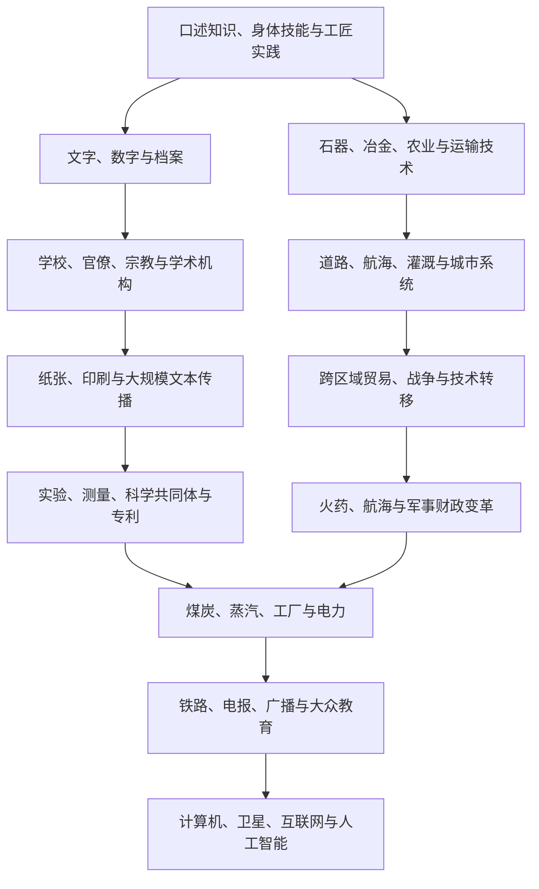

# 技术、知识与传播史

## 概括

技术史不只是发明清单。技术需要材料、劳动、知识、制度、资金、使用者和维修网络才能长期运作；知识也通过口述、文字、学校、宗教、工匠传统、印刷、科学机构和数字网络传播。发明可能独立出现，也可能在跨文化传播中被重新组合。

## 演进与传播图

## 核心主题

| 主题 | 比较重点 | 代表线索 |
|---|---|---|
| 农业与水利 | 作物、工具、灌溉、土壤与劳动组织如何结合 | 犁、梯田、运河、水车、作物轮作。 |
| 冶金与材料 | 原料、燃料、炉温、工匠组织和国家需求 | 青铜、铁、钢、玻璃、陶瓷、合成材料。 |
| 文字与计算 | 信息如何记录、复制、核验和治理 | 楔形文字、纸草、纸张、数字、账簿和统计。 |
| 印刷与教育 | 文本成本、识字率、语言标准化与审查 | 雕版、活字、印刷机、报刊、公共教育。 |
| 航海与测绘 | 船体、帆装、季风知识、导航工具与港口制度 | 指南针、海图、天文导航、经度测量。 |
| 火药与军事 | 武器技术如何与财政、训练、城防和后勤结合 | 火炮、火枪、堡垒、常备军和军工生产。 |
| 工业与能源 | 能源密度、机械、工厂纪律、资本和市场 | 蒸汽机、煤炭、电力、内燃机和流水线。 |
| 交通通信 | 时间标准、物流、新闻和国家控制 | 铁路、轮船、电报、电话、广播和航空。 |
| 医疗与公共卫生 | 理论、器械、药物、临床制度和社会信任 | 解剖、疫苗、麻醉、抗生素、卫生工程。 |
| 数字技术 | 计算、数据、平台、监控和全球供应链 | 半导体、计算机、互联网、移动通信和人工智能。 |

## 传播机制

| 机制 | 说明 |
|---|---|
| 商贸与迁徙 | 商人、工匠、移民和侨民携带工具、种子、技艺和语言。 |
| 帝国与战争 | 征服可强制转移工匠和知识，也会破坏既有技术系统。 |
| 翻译与教育 | 翻译机构、宗教学校、大学、考试和教材重组知识。 |
| 殖民主义 | 测绘、医学、植物学和交通服务统治，也被地方社会吸收、改造和抵抗。 |
| 企业与国家 | 专利、标准、采购、研究机构和基础设施决定技术扩散速度。 |
| 使用者改造 | 技术常在维修、仿制、地方材料和新用途过程中发生变化。 |

## 关键辨析

- “发明”不等于大规模采用；成本、基础设施、制度和社会需求决定扩散。
- 技术传播不是单向“先进文明输出”，接收者会筛选、改造并产生新组合。
- 技术优势不会自动造成军事或经济胜利，组织、财政、地理和政治联盟同样重要。
- 书面和科学知识不应遮蔽口述、地方、女性、原住民和工匠知识。
- 数字化提高信息速度，也带来平台垄断、劳动重组、隐私、虚假信息和能源消耗问题。

## 区域与专题入口

- [丝绸之路、印度洋与跨撒哈拉网络](/%E4%BA%BA%E6%96%87%E7%A7%91%E5%AD%A6/%E5%8E%86%E5%8F%B2/_%E9%80%9A%E5%8F%B2/%E4%B8%9D%E7%BB%B8%E4%B9%8B%E8%B7%AF%E3%80%81%E5%8D%B0%E5%BA%A6%E6%B4%8B%E4%B8%8E%E8%B7%A8%E6%92%92%E5%93%88%E6%8B%89%E7%BD%91%E7%BB%9C.md)
- [大航海、哥伦布大交换与大西洋世界](/%E4%BA%BA%E6%96%87%E7%A7%91%E5%AD%A6/%E5%8E%86%E5%8F%B2/_%E9%80%9A%E5%8F%B2/%E5%A4%A7%E8%88%AA%E6%B5%B7%E3%80%81%E5%93%A5%E4%BC%A6%E5%B8%83%E5%A4%A7%E4%BA%A4%E6%8D%A2%E4%B8%8E%E5%A4%A7%E8%A5%BF%E6%B4%8B%E4%B8%96%E7%95%8C.md)
- [工业革命、殖民主义与帝国主义](/%E4%BA%BA%E6%96%87%E7%A7%91%E5%AD%A6/%E5%8E%86%E5%8F%B2/_%E9%80%9A%E5%8F%B2/%E5%B7%A5%E4%B8%9A%E9%9D%A9%E5%91%BD%E3%80%81%E6%AE%96%E6%B0%91%E4%B8%BB%E4%B9%89%E4%B8%8E%E5%B8%9D%E5%9B%BD%E4%B8%BB%E4%B9%89.md)
- [两次世界大战](/%E4%BA%BA%E6%96%87%E7%A7%91%E5%AD%A6/%E5%8E%86%E5%8F%B2/_%E9%80%9A%E5%8F%B2/%E4%B8%A4%E6%AC%A1%E4%B8%96%E7%95%8C%E5%A4%A7%E6%88%98.md)
