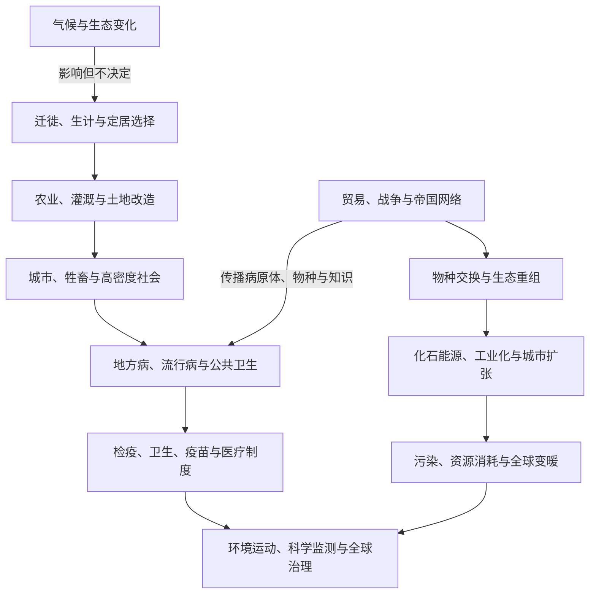

# 环境、气候与疾病史

## 概括

环境史研究人类如何适应、改造并理解自然环境，也研究气候、病原体、动物、植物和能源如何参与历史过程。气候和疾病会改变生产、迁徙、战争和国家能力，但不会自动决定社会结果；制度、知识、不平等和人的选择会显著改变冲击的分布。

## 长时段主线

## 时间与主题导航

| 时段 | 环境与疾病线索 | 历史联系 |
|---|---|---|
| 更新世晚期至全新世 | 冰期结束、海平面上升和生态带移动 | 影响人口扩散、海岸变化和地区资源组合。 |
| 农业形成以后 | 森林清理、灌溉、牲畜驯化和聚落密集 | 提高食物产量，也扩大人畜共患病、土壤盐碱化和阶层分化风险。 |
| 古代与中世纪城市网络 | 供水、垃圾、饥荒和跨地区疫病 | 国家、宗教和社区发展救济、隔离与医疗实践。 |
| 6世纪与14世纪等时期 | 鼠疫大流行 | 沿贸易和战争网络传播，人口损失改变劳动力、财政和社会关系。 |
| 15-18世纪 | 哥伦布大交换与全球物种迁移 | 欧亚非疾病重创美洲原住民；作物、牲畜和病原体在大洋间重组。 |
| 约14-19世纪 | “小冰期”等区域气候波动 | 与歉收、价格、战争和迁徙发生关联，但不同社会应对差异很大。 |
| 18-19世纪以后 | 煤炭、蒸汽、工业城市和公共卫生 | 能源使用、污染和城市疾病推动下水道、卫生统计和现代公共卫生。 |
| 1918-1920年 | 流感大流行 | 世界大战运输、军营和全球人口流动加速传播。 |
| 1945年以后 | “大加速”、化学农业、水坝和大规模城市化 | 人类生产消费对气候、生物多样性和水土系统的影响迅速扩大。 |
| 21世纪 | 新冠疫情与气候变化 | 显示全球供应链、公共卫生能力、信息传播和社会不平等的相互作用。 |

## 比较维度

| 维度 | 应观察的问题 |
|---|---|
| 气候 | 是长期趋势、短期极端事件还是区域变化？社会是否有储备、贸易和救济能力？ |
| 疾病 | 病原体如何传播？年龄、营养、居住、战争和医疗条件如何影响死亡风险？ |
| 农业 | 增产技术如何改变土地、水、劳工和阶层关系？ |
| 城市 | 密度带来创新和市场，也要求供水、排污、住房和卫生治理。 |
| 帝国与殖民 | 环境知识、植物移植、资源开采和疾病暴露如何与权力不平等结合？ |
| 能源 | 木材、畜力、水力、煤、石油、电力和核能如何改变生产与地缘关系？ |
| 灾害 | 同一自然事件为何对不同阶层、性别、地区和政治群体造成不同损失？ |

## 关键辨析

- 环境影响历史，但“气候决定文明兴衰”通常过度简化了制度、战争、贸易和社会选择。
- 疫病死亡数字常来自不完整记录，应区分估计范围、地区差异和后世推算。
- “自然灾害”造成的损失往往被住房、基础设施、贫困、殖民和救济制度放大。
- 哥伦布大交换包含作物传播和人口增长，也包含征服、疾病、奴隶制和生态破坏。
- 公共卫生措施既能降低疾病，也可能伴随隔离、监控和不平等执行，需要放回具体制度环境评价。

## 区域与专题入口

- [人口迁徙、农业与城市文明](/%E4%BA%BA%E6%96%87%E7%A7%91%E5%AD%A6/%E5%8E%86%E5%8F%B2/_%E9%80%9A%E5%8F%B2/%E4%BA%BA%E5%8F%A3%E8%BF%81%E5%BE%99%E3%80%81%E5%86%9C%E4%B8%9A%E4%B8%8E%E5%9F%8E%E5%B8%82%E6%96%87%E6%98%8E.md)
- [大航海、哥伦布大交换与大西洋世界](/%E4%BA%BA%E6%96%87%E7%A7%91%E5%AD%A6/%E5%8E%86%E5%8F%B2/_%E9%80%9A%E5%8F%B2/%E5%A4%A7%E8%88%AA%E6%B5%B7%E3%80%81%E5%93%A5%E4%BC%A6%E5%B8%83%E5%A4%A7%E4%BA%A4%E6%8D%A2%E4%B8%8E%E5%A4%A7%E8%A5%BF%E6%B4%8B%E4%B8%96%E7%95%8C.md)
- [工业革命、殖民主义与帝国主义](/%E4%BA%BA%E6%96%87%E7%A7%91%E5%AD%A6/%E5%8E%86%E5%8F%B2/_%E9%80%9A%E5%8F%B2/%E5%B7%A5%E4%B8%9A%E9%9D%A9%E5%91%BD%E3%80%81%E6%AE%96%E6%B0%91%E4%B8%BB%E4%B9%89%E4%B8%8E%E5%B8%9D%E5%9B%BD%E4%B8%BB%E4%B9%89.md)
- [北极与亚北极](/%E4%BA%BA%E6%96%87%E7%A7%91%E5%AD%A6/%E5%8E%86%E5%8F%B2/%E5%8C%97%E4%BA%9A/%E5%8C%97%E6%9E%81%E4%B8%8E%E4%BA%9A%E5%8C%97%E6%9E%81/README.md)
