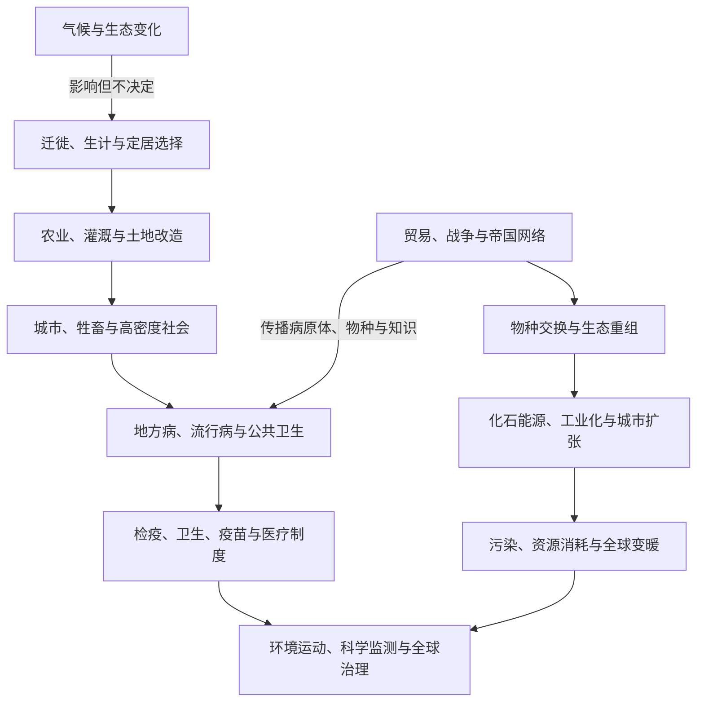

# 环境、气候与疾病史

## 概括

环境史研究人类如何适应、改造并理解自然环境，也研究气候、病原体、动物、植物和能源如何参与历史过程。气候和疾病会改变生产、迁徙、战争和国家能力，但不会自动决定社会结果；制度、知识、不平等和人的选择会显著改变冲击的分布。

## 长时段主线

## 时间与主题导航

| 时段 | 环境与疾病线索 | 历史联系 |
|---|---|---|
| 更新世晚期至全新世 | 冰期结束、海平面上升和生态带移动 | 影响人口扩散、海岸变化和地区资源组合。 |
| 农业形成以后 | 森林清理、灌溉、牲畜驯化和聚落密集 | 提高食物产量，也扩大人畜共患病、土壤盐碱化和阶层分化风险。 |
| 古代与中世纪城市网络 | 供水、垃圾、饥荒和跨地区疫病 | 国家、宗教和社区发展救济、隔离与医疗实践。 |
| 6世纪与14世纪等时期 | 鼠疫大流行 | 沿贸易和战争网络传播，人口损失改变劳动力、财政和社会关系。 |
| 15-18世纪 | 哥伦布大交换与全球物种迁移 | 欧亚非疾病重创美洲原住民；作物、牲畜和病原体在大洋间重组。 |
| 约14-19世纪 | “小冰期”等区域气候波动 | 与歉收、价格、战争和迁徙发生关联，但不同社会应对差异很大。 |
| 18-19世纪以后 | 煤炭、蒸汽、工业城市和公共卫生 | 能源使用、污染和城市疾病推动下水道、卫生统计和现代公共卫生。 |
| 1918-1920年 | 流感大流行 | 世界大战运输、军营和全球人口流动加速传播。 |
| 1945年以后 | “大加速”、化学农业、水坝和大规模城市化 | 人类生产消费对气候、生物多样性和水土系统的影响迅速扩大。 |
| 21世纪 | 新冠疫情与气候变化 | 显示全球供应链、公共卫生能力、信息传播和社会不平等的相互作用。 |

## 环境冲击与疾病扩散的作用过程

| 环节 | 需要观察的机制 | 可能结果 | 为什么不能单因解释 |
|---|---|---|---|
| 背景变化 | 长期气候趋势、季节波动、火山喷发、洪旱、物种与病原体生态变化 | 收成、牧草、水源和病媒分布改变 | 同一气候信号在不同地点的强度、季节和持续时间并不相同。 |
| 暴露形成 | 城市密度、人畜接触、贸易、军队、朝圣、殖民移民和运输速度 | 病原体或灾害影响更多人口，远方地区被连接 | 连接也能运入粮食、医疗和信息，既放大风险也提供缓冲。 |
| 脆弱性分配 | 营养、住房、劳动、年龄、免疫经验、土地权和政治地位 | 死亡、迁徙和财产损失在阶层、族群和性别间不均 | “自然”冲击经由社会制度转化，平均数字会遮蔽差异。 |
| 国家与社区应对 | 粮仓、贸易、价格管制、救济、迁徙、检疫、供水、疫苗和公共沟通 | 缓解损失，也可能导致强制隔离、污名和资源争夺 | 政策成效取决于行政能力、信任、时间和谁被纳入保护。 |
| 次生危机 | 饥荒削弱免疫，战争破坏供水，疫情减少劳动力，迁徙改变土地使用 | 疾病、暴力、财政和生态压力相互强化 | 结果通常来自反馈链，而不是一个气候事件或一种病原体直接造成。 |
| 恢复与制度记忆 | 重建、劳动力重新议价、卫生工程、土地改革、纪念与知识保存 | 新制度、人口结构和生态格局形成 | 恢复可能改善总体指标，却让债务、失地和长期健康损害集中于弱势群体。 |

## 疾病与公共卫生的阶段过程

| 阶段 | 疾病生态 | 传播条件 | 制度反应与长期变化 |
|---|---|---|---|
| 采集狩猎与低密度聚落 | 小规模感染、寄生虫和创伤并存，某些急性传染病难以长期维持 | 季节会聚和群体接触仍可传播疾病 | 植物、仪式、照护和隔离知识由社群维护；证据主要来自骨骼、病原体和民族志类比，局限很大。 |
| 农业、牲畜与早期城市 | 人畜接触、密度、储水与废物提高地方病和人畜共患病机会 | 粮食网络和战争连接城镇 | 家庭护理、宗教慈善、医者传统、供水和城市规章逐步发展。 |
| 帝国与前现代贸易网络 | 不同疾病池接触，鼠疫、天花等可跨区流行 | 商队、港口、军队、朝圣和征服加速传播 | 城门管制、逃离、救济、宗教解释和后来的海港检疫并行；替罪与迫害也会出现。 |
| 15—18世纪跨洋交换 | 美洲人口对多种欧亚非病原体缺少既有免疫，疾病与征服、饥饿、奴役共同作用 | 船运、殖民聚落、奴隶贸易和物种迁移 | 人口灾难重塑土地与帝国，但各地年代、死亡率和恢复路径不同。 |
| 19世纪工业与殖民时代 | 霍乱、结核、疟疾、黄热病等与城市、港口、军营和殖民劳动相关 | 铁路、轮船和大城市缩短传播时间 | 统计、下水道、检疫、细菌学和热带医学扩展；卫生也被用于空间隔离和殖民控制。 |
| 20世纪公共卫生扩张 | 流感、战争疾病与慢性病并存，疫苗和抗生素改变死亡谱 | 全球战争、航空和大众社会加速传播 | 福利国家、国际卫生机构和大规模接种降低部分风险，但资源分配和药物试验不平等延续。 |
| 20世纪后期以来 | 新发传染病、耐药性、慢性病与气候敏感疾病叠加 | 航空、供应链、城市化和生态侵扰形成全球传播条件 | 监测、基因测序和快速疫苗平台增强响应，同时带来数据权、边境管制、错误信息和信任问题。 |

## 跨区域比较矩阵

| 区域 / 环境类型 | 主要环境压力 | 疾病与暴露特征 | 适应和治理机制 | 权力差异与长期遗产 |
|---|---|---|---|---|
| 灌溉河谷与高密度农区 | 洪水、干旱、盐碱化、河道变化和水利维护 | 储水、牲畜、人口密度和粮运连接地方病与流行病 | 堤坝、渠道、粮仓、税收、地方协作和迁村 | 上下游、地主与佃农承担成本不同；废弃水利可能被误写为单纯气候“崩溃”。 |
| 季风亚洲与热带农区 | 季风失常、台风、洪涝、山地侵蚀和作物病害 | 温湿环境影响蚊媒、水媒病和寄生虫，稻作与城市水网改变暴露 | 复种、梯田、蓄水、市场调粮、村社与国家救济 | 殖民作物和土地税可能削弱缓冲；“热带不卫生”论曾为种族隔离服务。 |
| 草原、荒漠与萨赫勒 | 降雨波动、草场和水源移动、沙尘及牲畜疫病 | 流动人口的疾病模式与城市不同，贸易节点仍可传播感染 | 季节迁徙、牲畜组合、互惠、绿洲管理和跨区贸易 | 固定国界、圈地和定居政策可能破坏传统风险分散，被错误归咎于“过度放牧”。 |
| 海岸、岛屿与海洋网络 | 风暴、海平面、淡水有限、火山与外来物种 | 港口和船舶易引入新病原体，小人口社群可能受冲击更大 | 航海预警、作物多样化、跨岛亲属、抬高聚落和疏散 | 殖民种植园、军事基地与外来疾病改变土地；现代气候迁移还涉及主权和文化延续。 |
| 美洲殖民接触区 | 外来牲畜、森林清理、矿山、种植园和土地征服 | 天花等疾病与战争、饥饿、强迫劳动共同造成人口危机 | 原住民族迁移、结盟、医药与社区重建，殖民政权推行隔离和传教 | “无人土地”叙事利用人口下降掩盖幸存者权利，生态恢复也不等于社会创伤消失。 |
| 工业城市与采掘区 | 煤烟、污水、矿毒、工伤、热岛和化学污染 | 拥挤住房、职业暴露和交通网络塑造传染病与慢性病 | 供水排污、劳动法、卫生统计、医院、污染规制和社会运动 | 改善常先覆盖富裕区；污染产业和废物可向殖民地、少数族群社区或海外转移。 |
| 北极、高山与寒冷地区 | 海冰、冻土、雪崩、短生长季和快速变暖 | 偏远条件限制医疗，外来人员和集中住房改变疾病暴露 | 高度地方化的迁徙、储食、衣居和生态知识，现代航空与远程医疗补充 | 国家定居、寄宿学校和资源开发破坏知识传承；气候变化威胁交通、食物与文化地点。 |

矩阵中的“区域”不是固定命运。同一帝国内部可能同时包含灌溉区、草原、港市和山地；环境风险必须落到具体时间、阶层、制度和证据尺度上比较。

## 比较维度

| 维度 | 应观察的问题 |
|---|---|
| 气候 | 是长期趋势、短期极端事件还是区域变化？社会是否有储备、贸易和救济能力？ |
| 疾病 | 病原体如何传播？年龄、营养、居住、战争和医疗条件如何影响死亡风险？ |
| 农业 | 增产技术如何改变土地、水、劳工和阶层关系？ |
| 城市 | 密度带来创新和市场，也要求供水、排污、住房和卫生治理。 |
| 帝国与殖民 | 环境知识、植物移植、资源开采和疾病暴露如何与权力不平等结合？ |
| 能源 | 木材、畜力、水力、煤、石油、电力和核能如何改变生产与地缘关系？ |
| 灾害 | 同一自然事件为何对不同阶层、性别、地区和政治群体造成不同损失？ |

## 长期影响

- 农业、燃烧、灌溉、牧业和城市建设把许多景观变成人类与其他物种共同塑造的历史生态系统；“自然”与“人造”不是简单二分。
- 疫病改变人口年龄结构、劳动力议价、财政和宗教实践，但战争、迁徙、土地制度与救济决定变化是否持续。
- 粮仓、检疫、户籍、卫生统计和疫苗提高国家保护能力，也扩大国家观察、分类和限制人口流动的权力。
- 帝国和殖民网络移动作物、牲畜、病原体与环境知识，既创造新的食物和药物体系，也造成种植园单作、物种入侵和原住民失地。
- 工业能源突破部分地方生物质约束，却把开采、污染和碳排放累积为跨地区、跨世代风险。
- 环境伤害往往留下不易逆转的路径：土壤和水体污染、职业病、被迫迁村、土地权丧失及基础设施选址会在危机结束后延续。
- 灾害和疫情也能推动公共卫生、劳动保护、互助组织与国际合作，但改革成果可能因紧急状态结束、财政削减或政治排斥而退化。

## 争议与方法局限

- 将某次国家衰落与干旱、寒冷或火山事件对照，只能建立时间关联；还须检验空间尺度、替代解释、制度反应和年代误差。
- 前现代人口与疫病死亡率多依赖零散税册、墓葬、编年史和模型。应呈现范围与地区差异，避免使用看似精确的单一全球数字。
- 古病原体 DNA 能确认部分感染，却不直接说明所有死者死因、社会传播方式或症状体验，必须与考古和文献结合。
- “哥伦布大交换”强调跨洋生态重组，但若只写物种清单，会遮蔽征服、强迫劳动、土地掠夺和原住民族主动适应。
- “人类世”用于描述人类活动成为行星尺度力量，但其起点可指农业、殖民交换、工业化或20世纪“大加速”；不同起点对应不同责任叙事。
- 全球气候平均值不能直接解释地方历史，区域降水、季节、海流与极端事件往往比年均温更接近具体社会影响。
- 现代公共卫生史既包含寿命改善，也包含优生、强制隔离、种族化医学和未经同意的试验；不能以最终技术成效抵消权力伤害。

## 关键辨析

- 环境影响历史，但“气候决定文明兴衰”通常过度简化了制度、战争、贸易和社会选择。
- 疫病死亡数字常来自不完整记录，应区分估计范围、地区差异和后世推算。
- “自然灾害”造成的损失往往被住房、基础设施、贫困、殖民和救济制度放大。
- 哥伦布大交换包含作物传播和人口增长，也包含征服、疾病、奴隶制和生态破坏。
- 公共卫生措施既能降低疾病，也可能伴随隔离、监控和不平等执行，需要放回具体制度环境评价。

## 区域与专题入口

- [人口迁徙、农业与城市文明](/%E4%BA%BA%E6%96%87%E7%A7%91%E5%AD%A6/%E5%8E%86%E5%8F%B2/_%E9%80%9A%E5%8F%B2/%E4%BA%BA%E5%8F%A3%E8%BF%81%E5%BE%99%E3%80%81%E5%86%9C%E4%B8%9A%E4%B8%8E%E5%9F%8E%E5%B8%82%E6%96%87%E6%98%8E.md)
- [大航海、哥伦布大交换与大西洋世界](/%E4%BA%BA%E6%96%87%E7%A7%91%E5%AD%A6/%E5%8E%86%E5%8F%B2/_%E9%80%9A%E5%8F%B2/%E5%A4%A7%E8%88%AA%E6%B5%B7%E3%80%81%E5%93%A5%E4%BC%A6%E5%B8%83%E5%A4%A7%E4%BA%A4%E6%8D%A2%E4%B8%8E%E5%A4%A7%E8%A5%BF%E6%B4%8B%E4%B8%96%E7%95%8C.md)
- [工业革命、殖民主义与帝国主义](/%E4%BA%BA%E6%96%87%E7%A7%91%E5%AD%A6/%E5%8E%86%E5%8F%B2/_%E9%80%9A%E5%8F%B2/%E5%B7%A5%E4%B8%9A%E9%9D%A9%E5%91%BD%E3%80%81%E6%AE%96%E6%B0%91%E4%B8%BB%E4%B9%89%E4%B8%8E%E5%B8%9D%E5%9B%BD%E4%B8%BB%E4%B9%89.md)
- [北极与亚北极](/%E4%BA%BA%E6%96%87%E7%A7%91%E5%AD%A6/%E5%8E%86%E5%8F%B2/%E5%8C%97%E4%BA%9A/%E5%8C%97%E6%9E%81%E4%B8%8E%E4%BA%9A%E5%8C%97%E6%9E%81/README.md)
