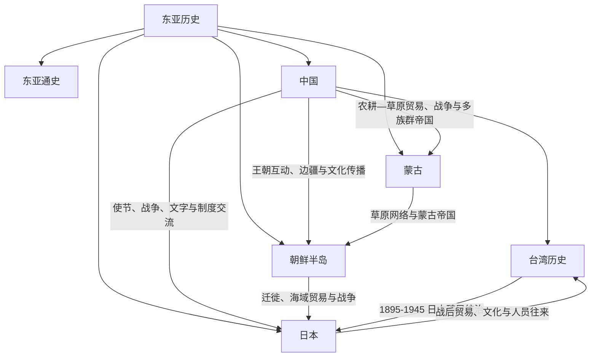

# 东亚历史

## 范围与概括

本目录整理中国、日本、朝鲜半岛、蒙古及其区域互动。东亚不是单一文明圈：农耕帝国、草原政权、半岛王国、海岛国家和海域网络长期通过战争、使节、贸易、宗教、文字与人口迁徙相互塑造。

## 区域框架

## 文明与历史空间入口

| 对象 | 类型 | 入口 | 阅读范围 |
|---|---|---|---|
| 中国 | 文明与国家长时段 | [中国](/%E4%BA%BA%E6%96%87%E7%A7%91%E5%AD%A6/%E5%8E%86%E5%8F%B2/%E4%B8%9C%E4%BA%9A/%E4%B8%AD%E5%9B%BD/README.md) | 史前区域社会、历代政权、制度、民族 / 族群及现代中国。 |
| 日本列岛 | 历史区域与国家史 | [日本](/%E4%BA%BA%E6%96%87%E7%A7%91%E5%AD%A6/%E5%8E%86%E5%8F%B2/%E4%B8%9C%E4%BA%9A/%E6%97%A5%E6%9C%AC/README.md) | 从史前列岛、律令国家、幕府到帝国扩张和战后日本。 |
| 朝鲜半岛 | 跨现代边界历史空间 | [朝鲜半岛](/%E4%BA%BA%E6%96%87%E7%A7%91%E5%AD%A6/%E5%8E%86%E5%8F%B2/%E4%B8%9C%E4%BA%9A/%E6%9C%9D%E9%B2%9C%E5%8D%8A%E5%B2%9B/README.md) | 古朝鲜、半岛诸国、高丽、朝鲜王朝、殖民与南北分裂。 |
| 蒙古高原 | 草原历史空间与国家史 | [蒙古](/%E4%BA%BA%E6%96%87%E7%A7%91%E5%AD%A6/%E5%8E%86%E5%8F%B2/%E4%B8%9C%E4%BA%9A/%E8%92%99%E5%8F%A4/README.md) | 草原诸政权、蒙古帝国、北元、清代蒙古和现代蒙古国。 |
| 台湾 | 岛屿与海域历史 | [台湾历史](/%E4%BA%BA%E6%96%87%E7%A7%91%E5%AD%A6/%E5%8E%86%E5%8F%B2/%E4%B8%9C%E4%BA%9A/%E4%B8%AD%E5%9B%BD/%E5%8F%B0%E6%B9%BE/README.md) | 原住民族、海域网络、殖民与清代治理、日本统治、战后治理和民主化。 |

## 现代国家与政治实体入口

| 现代国家 / 政治实体 | 入口 | 与共同前史的关系 |
|---|---|---|
| 中华人民共和国 | [中华人民共和国](/%E4%BA%BA%E6%96%87%E7%A7%91%E5%AD%A6/%E5%8E%86%E5%8F%B2/%E4%B8%9C%E4%BA%9A/%E4%B8%AD%E5%9B%BD/%E4%B8%AD%E5%8D%8E%E4%BA%BA%E6%B0%91%E5%85%B1%E5%92%8C%E5%9B%BD/README.md) | 承接中国近现代革命、国家建设和大陆治理主线；中国文明史不等同于单一现代政体史。 |
| 日本 | [日本](/%E4%BA%BA%E6%96%87%E7%A7%91%E5%AD%A6/%E5%8E%86%E5%8F%B2/%E4%B8%9C%E4%BA%9A/%E6%97%A5%E6%9C%AC/README.md) | 国家史与列岛前史放在同一总览，并与东亚共同史互引。 |
| 大韩民国 | [大韩民国](/%E4%BA%BA%E6%96%87%E7%A7%91%E5%AD%A6/%E5%8E%86%E5%8F%B2/%E4%B8%9C%E4%BA%9A/%E6%9C%9D%E9%B2%9C%E5%8D%8A%E5%B2%9B/%E5%A4%A7%E9%9F%A9%E6%B0%91%E5%9B%BD.md) | 1945年后半岛南部的国家史，前史由朝鲜半岛总览共同维护。 |
| 朝鲜民主主义人民共和国 | [朝鲜民主主义人民共和国](/%E4%BA%BA%E6%96%87%E7%A7%91%E5%AD%A6/%E5%8E%86%E5%8F%B2/%E4%B8%9C%E4%BA%9A/%E6%9C%9D%E9%B2%9C%E5%8D%8A%E5%B2%9B/%E6%9C%9D%E9%B2%9C%E6%B0%91%E4%B8%BB%E4%B8%BB%E4%B9%89%E4%BA%BA%E6%B0%91%E5%85%B1%E5%92%8C%E5%9B%BD.md) | 1945年后半岛北部的国家史，前史由朝鲜半岛总览共同维护。 |
| 现代蒙古 | [博克多汗国、蒙古人民共和国与现代蒙古](/%E4%BA%BA%E6%96%87%E7%A7%91%E5%AD%A6/%E5%8E%86%E5%8F%B2/%E4%B8%9C%E4%BA%9A/%E8%92%99%E5%8F%A4/%E5%8D%9A%E5%85%8B%E5%A4%9A%E6%B1%97%E5%9B%BD%E3%80%81%E8%92%99%E5%8F%A4%E4%BA%BA%E6%B0%91%E5%85%B1%E5%92%8C%E5%9B%BD%E4%B8%8E%E7%8E%B0%E4%BB%A3%E8%92%99%E5%8F%A4.md) | 现代国家形成不等同于所有古代草原政权的单线继承。 |
| 战后台湾 | [台湾历史](/%E4%BA%BA%E6%96%87%E7%A7%91%E5%AD%A6/%E5%8E%86%E5%8F%B2/%E4%B8%9C%E4%BA%9A/%E4%B8%AD%E5%9B%BD/%E5%8F%B0%E6%B9%BE/README.md) | 1945年后的治理、制度和身份认同放回跨时期台湾史理解。 |

## 区域共同史与跨境专题

[东亚通史](/%E4%BA%BA%E6%96%87%E7%A7%91%E5%AD%A6/%E5%8E%86%E5%8F%B2/%E4%B8%9C%E4%BA%9A/_%E9%80%9A%E5%8F%B2/README.md)集中维护汉字与宗教传播、农耕—草原互动、海域网络、帝国主义、战争和冷战等跨越现代国界的共同过程；各国家与历史空间笔记只保留本地视角并回链规范专题。

## 与中国朝代和民族史的互引

- 朝鲜半岛早期的扶余、高句丽和渤海等线索与[东北濊貊与朝鲜](/%E4%BA%BA%E6%96%87%E7%A7%91%E5%AD%A6/%E5%8E%86%E5%8F%B2/%E4%B8%9C%E4%BA%9A/%E4%B8%AD%E5%9B%BD/_%E6%B0%91%E6%97%8F/%E4%B8%9C%E5%8C%97%E6%BF%8A%E8%B2%8A%E4%B8%8E%E6%9C%9D%E9%B2%9C/README.md)存在交叉，应通过链接处理而非重复维护。
- 日本古代律令、遣隋使、遣唐使、日明贸易和近代战争应分别与[隋](/%E4%BA%BA%E6%96%87%E7%A7%91%E5%AD%A6/%E5%8E%86%E5%8F%B2/%E4%B8%9C%E4%BA%9A/%E4%B8%AD%E5%9B%BD/%E9%9A%8B/README.md)、[唐](/%E4%BA%BA%E6%96%87%E7%A7%91%E5%AD%A6/%E5%8E%86%E5%8F%B2/%E4%B8%9C%E4%BA%9A/%E4%B8%AD%E5%9B%BD/%E5%94%90/README.md)、[明](/%E4%BA%BA%E6%96%87%E7%A7%91%E5%AD%A6/%E5%8E%86%E5%8F%B2/%E4%B8%9C%E4%BA%9A/%E4%B8%AD%E5%9B%BD/%E6%98%8E/README.md)、[清](/%E4%BA%BA%E6%96%87%E7%A7%91%E5%AD%A6/%E5%8E%86%E5%8F%B2/%E4%B8%9C%E4%BA%9A/%E4%B8%AD%E5%9B%BD/%E6%B8%85/README.md)互引。
- 蒙古帝国、北元和清代蒙古与[元](/%E4%BA%BA%E6%96%87%E7%A7%91%E5%AD%A6/%E5%8E%86%E5%8F%B2/%E4%B8%9C%E4%BA%9A/%E4%B8%AD%E5%9B%BD/%E5%85%83/README.md)、[中国民族史](/%E4%BA%BA%E6%96%87%E7%A7%91%E5%AD%A6/%E5%8E%86%E5%8F%B2/%E4%B8%9C%E4%BA%9A/%E4%B8%AD%E5%9B%BD/_%E6%B0%91%E6%97%8F/README.md)及[中亚草原汗国](/%E4%BA%BA%E6%96%87%E7%A7%91%E5%AD%A6/%E5%8E%86%E5%8F%B2/%E4%B8%AD%E4%BA%9A/%E8%8D%89%E5%8E%9F%E6%B1%97%E5%9B%BD/README.md)互引。
- 古代草原政权是区域政治共同体，不能机械排列成现代蒙古民族的直系谱系。

## 上级与相邻区域

- [历史总览](/%E4%BA%BA%E6%96%87%E7%A7%91%E5%AD%A6/%E5%8E%86%E5%8F%B2/README.md)
- [世界历史通史](/%E4%BA%BA%E6%96%87%E7%A7%91%E5%AD%A6/%E5%8E%86%E5%8F%B2/_%E9%80%9A%E5%8F%B2/README.md)
- [东南亚历史](/%E4%BA%BA%E6%96%87%E7%A7%91%E5%AD%A6/%E5%8E%86%E5%8F%B2/%E4%B8%9C%E5%8D%97%E4%BA%9A/README.md)
- [中亚历史](/%E4%BA%BA%E6%96%87%E7%A7%91%E5%AD%A6/%E5%8E%86%E5%8F%B2/%E4%B8%AD%E4%BA%9A/README.md)
- [北亚历史](/%E4%BA%BA%E6%96%87%E7%A7%91%E5%AD%A6/%E5%8E%86%E5%8F%B2/%E5%8C%97%E4%BA%9A/README.md)
