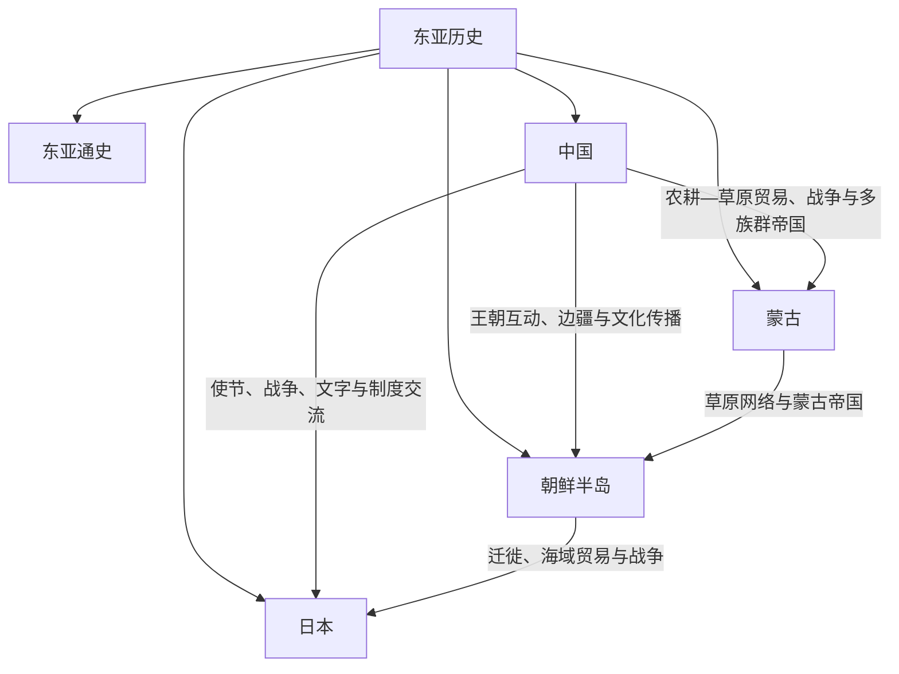

# 东亚历史

## 概括

本目录整理中国、日本、朝鲜半岛、蒙古及其区域互动。东亚不是单一文明圈：农耕帝国、草原政权、半岛王国、海岛国家和海域网络长期通过战争、使节、贸易、宗教、文字与人口迁徙相互塑造。

## 区域框架

## 区域与国家入口

| 区域 / 国家 | 入口 | 主线提示 |
|---|---|---|
| 东亚通史 | [东亚通史](/%E4%BA%BA%E6%96%87%E7%A7%91%E5%AD%A6/%E5%8E%86%E5%8F%B2/%E4%B8%9C%E4%BA%9A/_%E9%80%9A%E5%8F%B2/README.md) | 文字与宗教传播、草原互动、海域网络、帝国主义、战争与冷战。 |
| 中国 | [中国](/%E4%BA%BA%E6%96%87%E7%A7%91%E5%AD%A6/%E5%8E%86%E5%8F%B2/%E4%B8%9C%E4%BA%9A/%E4%B8%AD%E5%9B%BD/README.md) | 中国历史时期、政权演变、制度和民族线索。 |
| 日本 | [日本](/%E4%BA%BA%E6%96%87%E7%A7%91%E5%AD%A6/%E5%8E%86%E5%8F%B2/%E4%B8%9C%E4%BA%9A/%E6%97%A5%E6%9C%AC/README.md) | 从史前、律令国家、幕府到帝国扩张和战后日本。 |
| 朝鲜半岛 | [朝鲜半岛](/%E4%BA%BA%E6%96%87%E7%A7%91%E5%AD%A6/%E5%8E%86%E5%8F%B2/%E4%B8%9C%E4%BA%9A/%E6%9C%9D%E9%B2%9C%E5%8D%8A%E5%B2%9B/README.md) | 从古朝鲜、三国、统一新罗、高丽、朝鲜王朝到南北分裂。 |
| 蒙古 | [蒙古](/%E4%BA%BA%E6%96%87%E7%A7%91%E5%AD%A6/%E5%8E%86%E5%8F%B2/%E4%B8%9C%E4%BA%9A/%E8%92%99%E5%8F%A4/README.md) | 蒙古高原诸政权、蒙古帝国、北元、清代蒙古和现代蒙古国。 |

## 与中国朝代和民族史的互引

- 朝鲜半岛早期的扶余、高句丽和渤海等线索与[东北濊貊与朝鲜](/%E4%BA%BA%E6%96%87%E7%A7%91%E5%AD%A6/%E5%8E%86%E5%8F%B2/%E4%B8%9C%E4%BA%9A/%E4%B8%AD%E5%9B%BD/_%E6%B0%91%E6%97%8F/%E4%B8%9C%E5%8C%97%E6%BF%8A%E8%B2%8A%E4%B8%8E%E6%9C%9D%E9%B2%9C/README.md)存在交叉，应通过链接处理而非重复维护。
- 日本古代律令、遣隋使、遣唐使、日明贸易和近代战争应分别与[隋](/%E4%BA%BA%E6%96%87%E7%A7%91%E5%AD%A6/%E5%8E%86%E5%8F%B2/%E4%B8%9C%E4%BA%9A/%E4%B8%AD%E5%9B%BD/%E9%9A%8B/README.md)、[唐](/%E4%BA%BA%E6%96%87%E7%A7%91%E5%AD%A6/%E5%8E%86%E5%8F%B2/%E4%B8%9C%E4%BA%9A/%E4%B8%AD%E5%9B%BD/%E5%94%90/README.md)、[明](/%E4%BA%BA%E6%96%87%E7%A7%91%E5%AD%A6/%E5%8E%86%E5%8F%B2/%E4%B8%9C%E4%BA%9A/%E4%B8%AD%E5%9B%BD/%E6%98%8E/README.md)、[清](/%E4%BA%BA%E6%96%87%E7%A7%91%E5%AD%A6/%E5%8E%86%E5%8F%B2/%E4%B8%9C%E4%BA%9A/%E4%B8%AD%E5%9B%BD/%E6%B8%85/README.md)互引。
- 蒙古帝国、北元和清代蒙古与[元](/%E4%BA%BA%E6%96%87%E7%A7%91%E5%AD%A6/%E5%8E%86%E5%8F%B2/%E4%B8%9C%E4%BA%9A/%E4%B8%AD%E5%9B%BD/%E5%85%83/README.md)、[中国民族史](/%E4%BA%BA%E6%96%87%E7%A7%91%E5%AD%A6/%E5%8E%86%E5%8F%B2/%E4%B8%9C%E4%BA%9A/%E4%B8%AD%E5%9B%BD/_%E6%B0%91%E6%97%8F/README.md)及[中亚草原汗国](/%E4%BA%BA%E6%96%87%E7%A7%91%E5%AD%A6/%E5%8E%86%E5%8F%B2/%E4%B8%AD%E4%BA%9A/%E8%8D%89%E5%8E%9F%E6%B1%97%E5%9B%BD/README.md)互引。
- 古代草原政权是区域政治共同体，不能机械排列成现代蒙古民族的直系谱系。

## 相关入口

- [世界历史通史](/%E4%BA%BA%E6%96%87%E7%A7%91%E5%AD%A6/%E5%8E%86%E5%8F%B2/_%E9%80%9A%E5%8F%B2/README.md)
- [东南亚历史](/%E4%BA%BA%E6%96%87%E7%A7%91%E5%AD%A6/%E5%8E%86%E5%8F%B2/%E4%B8%9C%E5%8D%97%E4%BA%9A/README.md)
- [中亚历史](/%E4%BA%BA%E6%96%87%E7%A7%91%E5%AD%A6/%E5%8E%86%E5%8F%B2/%E4%B8%AD%E4%BA%9A/README.md)
