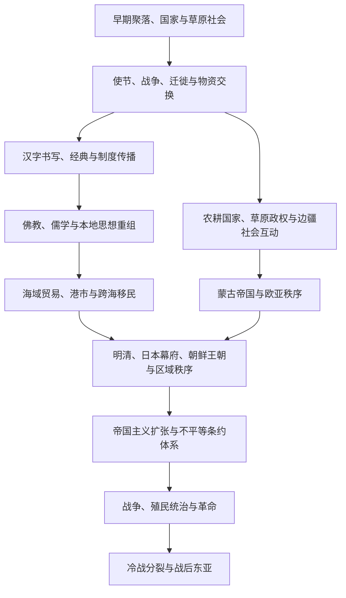

# 东亚通史

## 概括

本目录整理跨越中国、日本、朝鲜半岛和蒙古现代边界的东亚共同历史。横向主线包括汉字与佛教传播、制度与知识转译、农耕—草原互动、海域贸易、跨海移民，以及19—20世纪的帝国主义、战争、革命和冷战分裂。具体国家通史仍放入各自目录。

## 区域互动主线

## 专题导航

| 主题 | 入口 | 整理重点 |
|---|---|---|
| 区域秩序 | [东亚交流与区域秩序](/%E4%BA%BA%E6%96%87%E7%A7%91%E5%AD%A6/%E5%8E%86%E5%8F%B2/%E4%B8%9C%E4%BA%9A/_%E9%80%9A%E5%8F%B2/%E4%B8%9C%E4%BA%9A%E4%BA%A4%E6%B5%81%E4%B8%8E%E5%8C%BA%E5%9F%9F%E7%A7%A9%E5%BA%8F.md) | 使节、册封朝贡、战争、条约和多中心政治关系。 |
| 文字、宗教与制度 | [汉字、佛教与制度传播](/%E4%BA%BA%E6%96%87%E7%A7%91%E5%AD%A6/%E5%8E%86%E5%8F%B2/%E4%B8%9C%E4%BA%9A/_%E9%80%9A%E5%8F%B2/%E6%B1%89%E5%AD%97%E3%80%81%E4%BD%9B%E6%95%99%E4%B8%8E%E5%88%B6%E5%BA%A6%E4%BC%A0%E6%92%AD.md) | 书写、经典、律令、儒学与佛教的传播和本地重组。 |
| 草原与边疆 | [农耕、草原与边疆互动](/%E4%BA%BA%E6%96%87%E7%A7%91%E5%AD%A6/%E5%8E%86%E5%8F%B2/%E4%B8%9C%E4%BA%9A/_%E9%80%9A%E5%8F%B2/%E5%86%9C%E8%80%95%E3%80%81%E8%8D%89%E5%8E%9F%E4%B8%8E%E8%BE%B9%E7%96%86%E4%BA%92%E5%8A%A8.md) | 中国北方、蒙古高原、东北亚和中亚之间的战争、贸易与迁徙。 |
| 海域网络 | [海域贸易、朝贡与跨海移民](/%E4%BA%BA%E6%96%87%E7%A7%91%E5%AD%A6/%E5%8E%86%E5%8F%B2/%E4%B8%9C%E4%BA%9A/_%E9%80%9A%E5%8F%B2/%E6%B5%B7%E5%9F%9F%E8%B4%B8%E6%98%93%E3%80%81%E6%9C%9D%E8%B4%A1%E4%B8%8E%E8%B7%A8%E6%B5%B7%E7%A7%BB%E6%B0%91.md) | 黄海、东海、日本海及南海北部的港市、航路和人口流动。 |
| 近现代东亚 | [帝国主义、战争与冷战东亚](/%E4%BA%BA%E6%96%87%E7%A7%91%E5%AD%A6/%E5%8E%86%E5%8F%B2/%E4%B8%9C%E4%BA%9A/_%E9%80%9A%E5%8F%B2/%E5%B8%9D%E5%9B%BD%E4%B8%BB%E4%B9%89%E3%80%81%E6%88%98%E4%BA%89%E4%B8%8E%E5%86%B7%E6%88%98%E4%B8%9C%E4%BA%9A.md) | 帝国扩张、殖民统治、战争、革命、分裂和战后秩序。 |

## 国家与区域入口

- [中国](/%E4%BA%BA%E6%96%87%E7%A7%91%E5%AD%A6/%E5%8E%86%E5%8F%B2/%E4%B8%9C%E4%BA%9A/%E4%B8%AD%E5%9B%BD/README.md)
- [日本](/%E4%BA%BA%E6%96%87%E7%A7%91%E5%AD%A6/%E5%8E%86%E5%8F%B2/%E4%B8%9C%E4%BA%9A/%E6%97%A5%E6%9C%AC/README.md)
- [朝鲜半岛](/%E4%BA%BA%E6%96%87%E7%A7%91%E5%AD%A6/%E5%8E%86%E5%8F%B2/%E4%B8%9C%E4%BA%9A/%E6%9C%9D%E9%B2%9C%E5%8D%8A%E5%B2%9B/README.md)
- [蒙古](/%E4%BA%BA%E6%96%87%E7%A7%91%E5%AD%A6/%E5%8E%86%E5%8F%B2/%E4%B8%9C%E4%BA%9A/%E8%92%99%E5%8F%A4/README.md)

## 关键辨析

- “东亚”是分析区域，不是边界固定、内部同质的单一文明。
- 册封、朝贡、互市、战争和外交条约长期并存，不能把区域关系概括为单向服从。
- 汉字、佛教、儒学和制度传播都经过翻译、选择和重构，不是原样复制。
- 东亚历史持续与中亚、东南亚、西亚、欧洲和太平洋世界相连。
