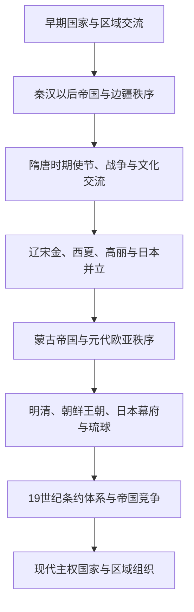

# 东亚交流与区域秩序

## 概括

东亚区域秩序由王朝国家、草原政权、半岛王国、海岛政权、港市与边疆共同体共同塑造。中国王朝的册封与朝贡制度是其中一套重要政治语言，但实际关系还包括战争、互市、婚姻联盟、使节往来、平等条约和地方贸易。

## 关系演变

## 主要机制

| 机制 | 含义 | 注意事项 |
|---|---|---|
| 册封 | 授予名号、印绶或承认统治者地位 | 册封关系不必然等于直接行政统治。 |
| 朝贡 | 使节携带礼物并参与礼仪、贸易与外交 | 朝贡可兼具政治象征和经济交换功能。 |
| 互市与边贸 | 在边境、港口或指定市场交换物资 | 官方限制之外长期存在民间和走私贸易。 |
| 战争与联盟 | 征服、防御、婚姻、共同作战和缓冲关系 | 同一国家在不同时期可能既冲突又合作。 |
| 条约体系 | 近代以后以国际法、领事权和边界条约调整关系 | 不平等条约与殖民扩张改变传统外交框架。 |

## 关键辨析

- “朝贡体系”是概括性分析工具，不能解释所有时期、所有国家和全部外交行为。
- 中国王朝并非始终能够支配周边政权；辽、金、蒙古、日本等都曾建立不同中心的区域秩序。
- 高句丽、渤海、琉球等历史政治体跨越或不对应现代国界，需避免民族国家式倒推。
- 区域秩序既由中央政权塑造，也受边疆社会、商人、海盗、移民和地方官员影响。

## 相关入口

- [中国](/%E4%BA%BA%E6%96%87%E7%A7%91%E5%AD%A6/%E5%8E%86%E5%8F%B2/%E4%B8%9C%E4%BA%9A/%E4%B8%AD%E5%9B%BD/README.md)
- [日本](/%E4%BA%BA%E6%96%87%E7%A7%91%E5%AD%A6/%E5%8E%86%E5%8F%B2/%E4%B8%9C%E4%BA%9A/%E6%97%A5%E6%9C%AC/README.md)
- [朝鲜半岛](/%E4%BA%BA%E6%96%87%E7%A7%91%E5%AD%A6/%E5%8E%86%E5%8F%B2/%E4%B8%9C%E4%BA%9A/%E6%9C%9D%E9%B2%9C%E5%8D%8A%E5%B2%9B/README.md)
- [蒙古](/%E4%BA%BA%E6%96%87%E7%A7%91%E5%AD%A6/%E5%8E%86%E5%8F%B2/%E4%B8%9C%E4%BA%9A/%E8%92%99%E5%8F%A4/README.md)
