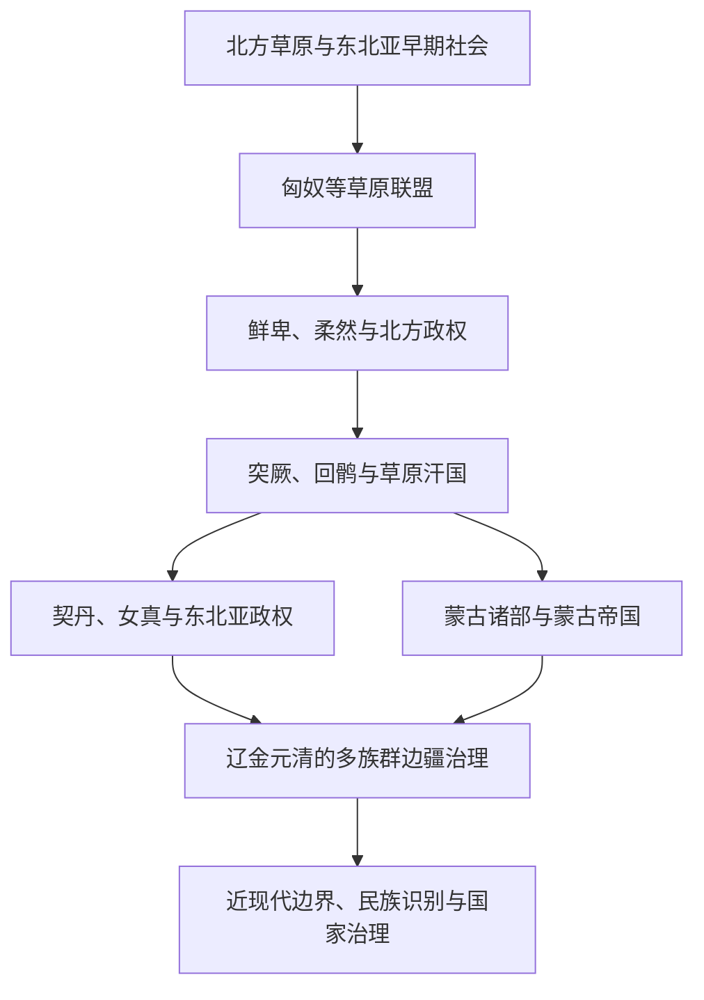

# 农耕、草原与边疆互动

## 概括

东亚北部并非农耕中国与“外部游牧民族”的简单对立。蒙古高原、东北、河西走廊、青藏高原和中亚之间长期存在牧业、农耕、狩猎、城镇和商路交错的边疆社会。战争、贡赐、互市、迁徙、婚姻和军政制度共同塑造双方。

## 演进关系

## 互动机制

- 草原需要谷物、手工业品和市场，农耕国家需要马匹、牲畜、皮毛和边境安全，双方存在结构性互赖。
- 互市、贡赐和走私常与军事冲突并存，不能把和平贸易与战争分成互不相干的时期。
- 边疆政权会同时使用草原联盟、汉地官僚、宗教权威和地方领主等多套制度。
- 人口迁徙包含主动迁徙、征服移民、俘虏、军屯、流亡和国家安置等不同形式。
- 辽、金、元、清等政权不能只用“外族入侵”解释，它们都是统治多地区、多族群的国家体系。

## 关键辨析

- 匈奴、鲜卑、柔然、突厥、契丹和蒙古之间存在空间、政治和文化联系，但不能写成现代蒙古民族的直系单线谱系。
- “游牧”不等于没有城市、农业、文字和行政；许多草原帝国依赖多种生产方式。
- 现代国界与民族分类形成较晚，不能直接套用于古代草原联盟。
- 中国北方民族史、蒙古国家史和中亚草原史应互链，但不重复维护同一内容。

## 相关入口

- [蒙古历史](/%E4%BA%BA%E6%96%87%E7%A7%91%E5%AD%A6/%E5%8E%86%E5%8F%B2/%E4%B8%9C%E4%BA%9A/%E8%92%99%E5%8F%A4/README.md)
- [中国民族史](/%E4%BA%BA%E6%96%87%E7%A7%91%E5%AD%A6/%E5%8E%86%E5%8F%B2/%E4%B8%9C%E4%BA%9A/%E4%B8%AD%E5%9B%BD/_%E6%B0%91%E6%97%8F/README.md)
- [中亚草原汗国](/%E4%BA%BA%E6%96%87%E7%A7%91%E5%AD%A6/%E5%8E%86%E5%8F%B2/%E4%B8%AD%E4%BA%9A/%E8%8D%89%E5%8E%9F%E6%B1%97%E5%9B%BD/README.md)
- [蒙古帝国](/%E4%BA%BA%E6%96%87%E7%A7%91%E5%AD%A6/%E5%8E%86%E5%8F%B2/%E4%B8%9C%E4%BA%9A/%E4%B8%AD%E5%9B%BD/%E5%85%83/%E8%92%99%E5%8F%A4%E5%B8%9D%E5%9B%BD.md)
