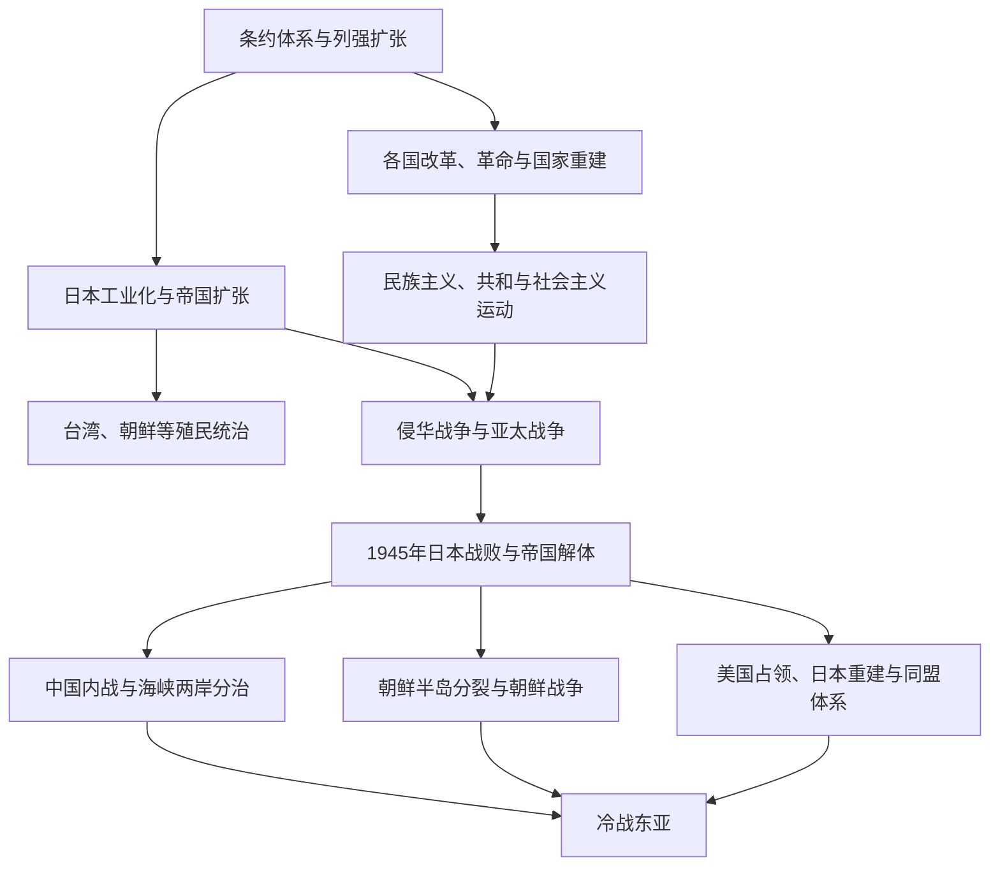

# 帝国主义、战争与冷战东亚

## 概括

19世纪中期以后，西方列强和日本帝国扩张改变东亚传统政治关系。条约港、殖民统治、民族主义、革命与全面战争交织；1945年后日本帝国解体，但中国内战、朝鲜半岛分裂、冷战联盟和海峡两岸对峙形成新的区域秩序。

## 演进关系

## 主要阶段

| 阶段 | 主线 |
|---|---|
| 条约体系形成 | 鸦片战争以后列强取得通商、领事裁判、租界和其他特权，传统外交秩序受到冲击。 |
| 改革与革命 | 清末改革、日本明治维新、朝鲜开化与各地民族主义探索不同国家重建道路。 |
| 日本帝国扩张 | 日本吞并琉球、殖民台湾与朝鲜，并向中国大陆和太平洋扩张。 |
| 全面战争 | 中国抗日战争与第二次世界大战亚洲战场造成占领、屠杀、强制劳工和大规模人口流离。 |
| 战后分裂 | 中国内战、朝鲜半岛分裂和朝鲜战争将东亚纳入冷战阵营。 |
| 战后发展 | 日本、韩国等经历经济重建与政治变化，中国大陆和蒙古走社会主义道路，区域经济联系后来重新扩大。 |

## 关键辨析

- 日本现代化不是单纯“学习西方”的成功故事，也与殖民统治和帝国战争相连。
- 东亚战争不能只从1941年太平洋战争开始；1931年和1937年是中国与区域战争升级的重要节点。
- 1945年终结日本殖民帝国，却未解决所有边界、记忆、赔偿和国家分裂问题。
- 冷战冲突具有本地革命、内战和殖民遗产根源，不是外部大国竞争的简单投射。
- 战争记忆应同时保留受害者、占领社会、殖民地动员、抵抗和战后政治差异。

## 相关入口

- [两次世界大战](/%E4%BA%BA%E6%96%87%E7%A7%91%E5%AD%A6/%E5%8E%86%E5%8F%B2/_%E9%80%9A%E5%8F%B2/%E4%B8%A4%E6%AC%A1%E4%B8%96%E7%95%8C%E5%A4%A7%E6%88%98.md)
- [冷战、非殖民化与全球化](/%E4%BA%BA%E6%96%87%E7%A7%91%E5%AD%A6/%E5%8E%86%E5%8F%B2/_%E9%80%9A%E5%8F%B2/%E5%86%B7%E6%88%98%E3%80%81%E9%9D%9E%E6%AE%96%E6%B0%91%E5%8C%96%E4%B8%8E%E5%85%A8%E7%90%83%E5%8C%96.md)
- [中国民国](/%E4%BA%BA%E6%96%87%E7%A7%91%E5%AD%A6/%E5%8E%86%E5%8F%B2/%E4%B8%9C%E4%BA%9A/%E4%B8%AD%E5%9B%BD/%E6%B0%91%E5%9B%BD/README.md)
- [日本](/%E4%BA%BA%E6%96%87%E7%A7%91%E5%AD%A6/%E5%8E%86%E5%8F%B2/%E4%B8%9C%E4%BA%9A/%E6%97%A5%E6%9C%AC/README.md)
- [朝鲜半岛](/%E4%BA%BA%E6%96%87%E7%A7%91%E5%AD%A6/%E5%8E%86%E5%8F%B2/%E4%B8%9C%E4%BA%9A/%E6%9C%9D%E9%B2%9C%E5%8D%8A%E5%B2%9B/README.md)
- [蒙古](/%E4%BA%BA%E6%96%87%E7%A7%91%E5%AD%A6/%E5%8E%86%E5%8F%B2/%E4%B8%9C%E4%BA%9A/%E8%92%99%E5%8F%A4/README.md)
