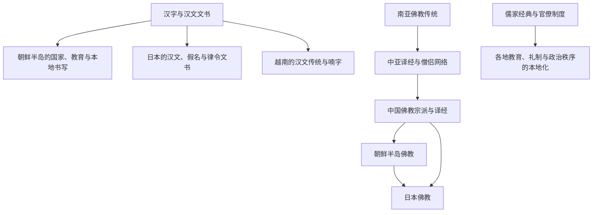

# 汉字、佛教与制度传播

## 概括

汉字书写、汉文经典、佛教、儒学和国家制度在东亚长期传播，但传播不是单向复制。朝鲜半岛、日本、越南和草原政权通过翻译、选择、改造与本地传统结合，形成不同书写体系、宗教组织和政治制度。

## 传播关系

## 主要领域

| 领域 | 传播内容 | 本地化表现 |
|---|---|---|
| 书写 | 汉字、汉文、印刷与文书行政 | 日语假名、朝鲜语训读与谚文、越南喃字等形成不同书写实践。 |
| 佛教 | 经律论、僧团、寺院、造像与仪式 | 各地形成不同宗派、国家护持方式和本土信仰结合。 |
| 儒学 | 经典、礼制、教育、科举与家族伦理 | 中国、朝鲜、日本和越南形成不同的政治与社会解释。 |
| 律令与官制 | 法典、品秩、中央机构和地方行政 | 日本律令国家、朝鲜官僚制度等并非中国制度的完整复制。 |
| 技术与知识 | 纸张、印刷、历法、医学和工艺 | 通过使节、僧侣、工匠、战俘和商人传播。 |

## 关键辨析

- 汉字文化圈是历史交流概念，不代表各地语言、民族和政治制度相同。
- 佛教从南亚经中亚、海路和中国等多条路径传播，不能只写成“中国向周边输出”。
- 采用汉文不等于放弃本地语言；汉文长期承担跨地区精英书写和外交功能。
- 制度名称相似不代表权力结构相同，必须比较实际运行方式。

## 相关入口

- [文字](/%E4%BA%BA%E6%96%87%E7%A7%91%E5%AD%A6/%E6%96%87%E5%AD%97/README.md)
- [宗教](/%E4%BA%BA%E6%96%87%E7%A7%91%E5%AD%A6/%E5%AE%97%E6%95%99/README.md)
- [中国](/%E4%BA%BA%E6%96%87%E7%A7%91%E5%AD%A6/%E5%8E%86%E5%8F%B2/%E4%B8%9C%E4%BA%9A/%E4%B8%AD%E5%9B%BD/README.md)
- [日本](/%E4%BA%BA%E6%96%87%E7%A7%91%E5%AD%A6/%E5%8E%86%E5%8F%B2/%E4%B8%9C%E4%BA%9A/%E6%97%A5%E6%9C%AC/README.md)
- [朝鲜半岛](/%E4%BA%BA%E6%96%87%E7%A7%91%E5%AD%A6/%E5%8E%86%E5%8F%B2/%E4%B8%9C%E4%BA%9A/%E6%9C%9D%E9%B2%9C%E5%8D%8A%E5%B2%9B/README.md)
