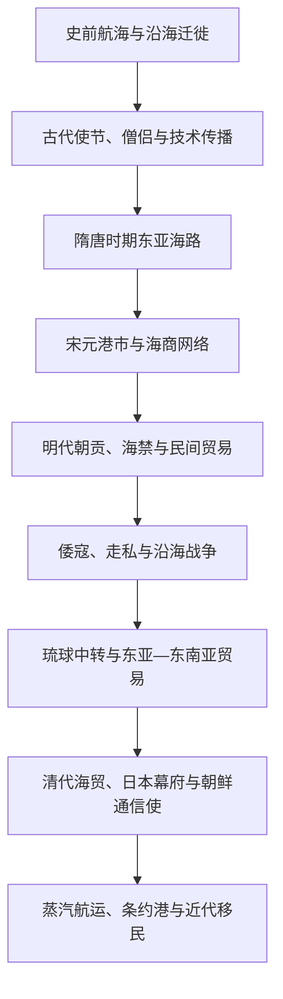

# 海域贸易、朝贡与跨海移民

## 概括

黄海、东海、日本海及南海北部把中国沿海、朝鲜半岛、日本列岛、琉球群岛和东南亚港市连接起来。官方使节、朝贡贸易、民间商船、僧侣、渔民、海盗、战争与移民共同构成海域历史。

## 网络演变

## 参与者与机制

| 类型 | 作用 |
|---|---|
| 官方使节 | 传递国书、礼物、制度知识和政治承认。 |
| 僧侣与学者 | 携带经典、语言、艺术、医学和教育传统。 |
| 海商与港市 | 连接陶瓷、丝绸、金属、药材、硫磺、香料和粮食贸易。 |
| 海盗与武装商团 | 在国家管制、走私和地方保护之间活动；“倭寇”成员并不只有日本人。 |
| 移民与侨民 | 形成跨海社区，参与商业、手工业、农业和殖民开拓。 |
| 海军与帝国 | 通过港口、封锁、殖民据点和航运制度重塑区域秩序。 |

## 关键辨析

- “海禁”通常是国家对航海和贸易的选择性管制，不等于海上活动完全停止。
- 朝贡贸易和民间贸易相互交织，不应把官方外交当作全部海域交流。
- 琉球、对马、济州和沿海岛屿常是中转与边界协商空间，不只是大国附属边缘。
- 近代跨海移民包括自愿谋生、契约劳工、殖民迁移和战争难民等不同类型。

## 相关入口

- [东南亚历史](/%E4%BA%BA%E6%96%87%E7%A7%91%E5%AD%A6/%E5%8E%86%E5%8F%B2/%E4%B8%9C%E5%8D%97%E4%BA%9A/README.md)
- [日本](/%E4%BA%BA%E6%96%87%E7%A7%91%E5%AD%A6/%E5%8E%86%E5%8F%B2/%E4%B8%9C%E4%BA%9A/%E6%97%A5%E6%9C%AC/README.md)
- [朝鲜半岛](/%E4%BA%BA%E6%96%87%E7%A7%91%E5%AD%A6/%E5%8E%86%E5%8F%B2/%E4%B8%9C%E4%BA%9A/%E6%9C%9D%E9%B2%9C%E5%8D%8A%E5%B2%9B/README.md)
- [中国](/%E4%BA%BA%E6%96%87%E7%A7%91%E5%AD%A6/%E5%8E%86%E5%8F%B2/%E4%B8%9C%E4%BA%9A/%E4%B8%AD%E5%9B%BD/README.md)
