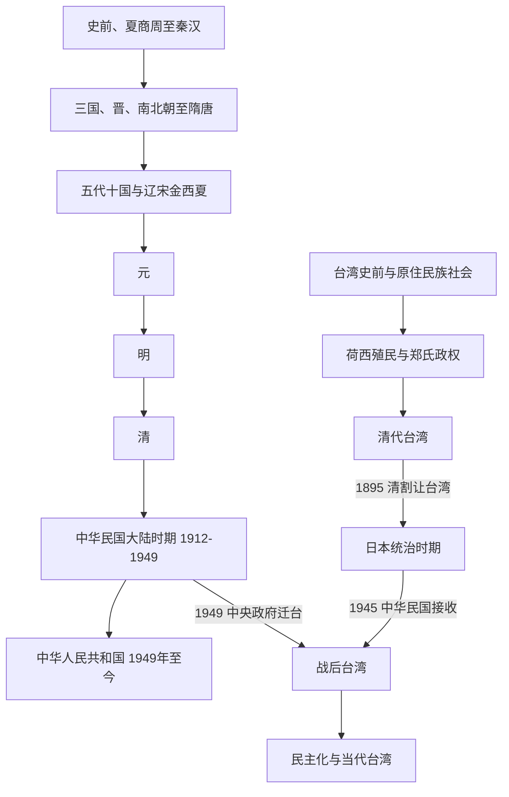

# 中国

## 范围与对象

本目录以“中国”这一跨长时段历史空间为入口，同时处理文明传统、历代政权与现代国家，不能把三者机械视为同一对象。史前区域社会、华夏共同体、统一与分裂时期、多族群帝国、共和国和现代政体之间既有延续，也经历疆域、人口、制度与认同的多次重构。

朝代与政权时期直接放在本目录下；制度史和民族 / 族群史分别收束在 `_制度` 与 `_民族`，并与政权更替共同构成文明主线，而不是附属背景。时间线延伸到中华人民共和国；台湾以独立子目录整理原住民族社会、海域网络、殖民统治、清代、战后治理与民主化。

## 一句话全史

中国历史从多中心史前社会和早期王朝形成，经秦汉帝国制度化、长期统一与分裂循环、农耕—草原及海陆网络重组、多族群帝国扩展，进入19—20世纪的主权危机、革命和现代国家建设。现代政体继承并改造部分历史制度、疆域和文化资源，但不等于对全部古代文明、族群和区域历史的简单直系占有。

## 全史主线

> 图中1949年后的两条线表示不同政权、治理范围与制度阶段并行，不表示简单的单线继承关系。

## 政治、制度与共同体入口

| 分支 | 入口 | 整理重点 |
|---|---|---|
| 朝代与政权 | 本目录下的各时期目录 | 从史前、夏商周、秦汉到明清、民国的政权演变和时期导航。 |
| 制度 | [中国制度史](/%E4%BA%BA%E6%96%87%E7%A7%91%E5%AD%A6/%E5%8E%86%E5%8F%B2/%E4%B8%9C%E4%BA%9A/%E4%B8%AD%E5%9B%BD/_%E5%88%B6%E5%BA%A6/README.md) | 中枢职官、地方行政区划、政治制度等制度线索。 |
| 民族 | [华夏周边民族](/%E4%BA%BA%E6%96%87%E7%A7%91%E5%AD%A6/%E5%8E%86%E5%8F%B2/%E4%B8%9C%E4%BA%9A/%E4%B8%AD%E5%9B%BD/_%E6%B0%91%E6%97%8F/README.md) | 北方草原、东北、南方、西域、青藏等族群和政权演变。 |
| 朝代变迁资料 | [中国朝代变迁](/%E4%BA%BA%E6%96%87%E7%A7%91%E5%AD%A6/%E5%8E%86%E5%8F%B2/%E4%B8%9C%E4%BA%9A/%E4%B8%AD%E5%9B%BD/_%E6%9C%9D%E4%BB%A3%E5%8F%98%E8%BF%81/README.md) | 王朝并立、更替、历史时空图和二十四史等辅助资料。 |
| 现代中国 | [中华人民共和国](/%E4%BA%BA%E6%96%87%E7%A7%91%E5%AD%A6/%E5%8E%86%E5%8F%B2/%E4%B8%9C%E4%BA%9A/%E4%B8%AD%E5%9B%BD/%E4%B8%AD%E5%8D%8E%E4%BA%BA%E6%B0%91%E5%85%B1%E5%92%8C%E5%9B%BD/README.md) | 1949年以来的国家建设、社会主义建设、改革开放与当代发展。 |
| 台湾历史 | [台湾](/%E4%BA%BA%E6%96%87%E7%A7%91%E5%AD%A6/%E5%8E%86%E5%8F%B2/%E4%B8%9C%E4%BA%9A/%E4%B8%AD%E5%9B%BD/%E5%8F%B0%E6%B9%BE/README.md) | 原住民族、海域网络、殖民与清代治理、日本统治、战后威权和民主化。 |

## 朝代与政权时间顺序

| 顺序 | 目录 | 时间 | 导览 |
|---:|---|---|---|
| 1 | [史前时期](/%E4%BA%BA%E6%96%87%E7%A7%91%E5%AD%A6/%E5%8E%86%E5%8F%B2/%E4%B8%9C%E4%BA%9A/%E4%B8%AD%E5%9B%BD/%E5%8F%B2%E5%89%8D%E6%97%B6%E6%9C%9F/README.md) | 旧石器时代-约前2070年 | 从人类活动、农业起源、聚落、早期复杂社会到传说时代。 |
| 2 | [夏](/%E4%BA%BA%E6%96%87%E7%A7%91%E5%AD%A6/%E5%8E%86%E5%8F%B2/%E4%B8%9C%E4%BA%9A/%E4%B8%AD%E5%9B%BD/%E5%A4%8F/README.md) | 约前2070年-约前1600年 | 传统史书中的第一个世袭王朝，处在传说、文献和二里头考古讨论之间。 |
| 3 | [商](/%E4%BA%BA%E6%96%87%E7%A7%91%E5%AD%A6/%E5%8E%86%E5%8F%B2/%E4%B8%9C%E4%BA%9A/%E4%B8%AD%E5%9B%BD/%E5%95%86/README.md) | 约前1600年-前1046年 | 以甲骨文、青铜礼器和王畿方国体系为代表的早期王朝。 |
| 4 | [周](/%E4%BA%BA%E6%96%87%E7%A7%91%E5%AD%A6/%E5%8E%86%E5%8F%B2/%E4%B8%9C%E4%BA%9A/%E4%B8%AD%E5%9B%BD/%E5%91%A8/README.md) | 前1046年-前256年 | 西周建立封建宗法秩序；东周分为春秋、战国，诸侯竞争最终走向秦统一。 |
| 5 | [秦](/%E4%BA%BA%E6%96%87%E7%A7%91%E5%AD%A6/%E5%8E%86%E5%8F%B2/%E4%B8%9C%E4%BA%9A/%E4%B8%AD%E5%9B%BD/%E7%A7%A6/README.md) | 前221年-前207年 | 首次完成大一统，建立皇帝制度、郡县制和统一文字、度量衡等制度。 |
| 6 | [汉](/%E4%BA%BA%E6%96%87%E7%A7%91%E5%AD%A6/%E5%8E%86%E5%8F%B2/%E4%B8%9C%E4%BA%9A/%E4%B8%AD%E5%9B%BD/%E6%B1%89/README.md) | 前202年-220年 | 西汉、新朝、东汉和两汉交替，形成长期统一王朝与儒学国家秩序。 |
| 7 | [三国](/%E4%BA%BA%E6%96%87%E7%A7%91%E5%AD%A6/%E5%8E%86%E5%8F%B2/%E4%B8%9C%E4%BA%9A/%E4%B8%AD%E5%9B%BD/%E4%B8%89%E5%9B%BD/README.md) | 220年-280年 | 魏、蜀汉、吴三方并立，承接东汉崩溃后的地方割据。 |
| 8 | [晋](/%E4%BA%BA%E6%96%87%E7%A7%91%E5%AD%A6/%E5%8E%86%E5%8F%B2/%E4%B8%9C%E4%BA%9A/%E4%B8%AD%E5%9B%BD/%E6%99%8B/README.md) | 266年-420年 | 西晋短暂统一，八王之乱和永嘉之乱后进入东晋与十六国并立。 |
| 9 | [南北朝](/%E4%BA%BA%E6%96%87%E7%A7%91%E5%AD%A6/%E5%8E%86%E5%8F%B2/%E4%B8%9C%E4%BA%9A/%E4%B8%AD%E5%9B%BD/%E5%8D%97%E5%8C%97%E6%9C%9D/README.md) | 420年-589年 | 南朝与北朝长期并立，民族融合、门阀政治和制度重组明显。 |
| 10 | [隋](/%E4%BA%BA%E6%96%87%E7%A7%91%E5%AD%A6/%E5%8E%86%E5%8F%B2/%E4%B8%9C%E4%BA%9A/%E4%B8%AD%E5%9B%BD/%E9%9A%8B/README.md) | 581年-618年 | 结束南北分裂，重建统一帝国，开创科举、三省六部和大运河等制度遗产。 |
| 11 | [唐](/%E4%BA%BA%E6%96%87%E7%A7%91%E5%AD%A6/%E5%8E%86%E5%8F%B2/%E4%B8%9C%E4%BA%9A/%E4%B8%AD%E5%9B%BD/%E5%94%90/README.md) | 618年-907年 | 前期强盛开放，安史之乱后藩镇、宦官和财政问题推动王朝衰落。 |
| 12 | [五代](/%E4%BA%BA%E6%96%87%E7%A7%91%E5%AD%A6/%E5%8E%86%E5%8F%B2/%E4%B8%9C%E4%BA%9A/%E4%B8%AD%E5%9B%BD/%E4%BA%94%E4%BB%A3/README.md) | 907年-960年 | 中原五代更替与南方十国并立，是唐末藩镇割据后的重组阶段。 |
| 13 | [辽宋金西夏](/%E4%BA%BA%E6%96%87%E7%A7%91%E5%AD%A6/%E5%8E%86%E5%8F%B2/%E4%B8%9C%E4%BA%9A/%E4%B8%AD%E5%9B%BD/%E8%BE%BD%E5%AE%8B%E9%87%91%E8%A5%BF%E5%A4%8F/README.md) | 916年-1279年 | 辽、宋、西夏、金等多政权长期并立，最终由蒙古和元完成统一。 |
| 14 | [元](/%E4%BA%BA%E6%96%87%E7%A7%91%E5%AD%A6/%E5%8E%86%E5%8F%B2/%E4%B8%9C%E4%BA%9A/%E4%B8%AD%E5%9B%BD/%E5%85%83/README.md) | 1271年-1368年 | 蒙古帝国基础上建立的大一统王朝，实行行省制并统合多族群帝国。 |
| 15 | [明](/%E4%BA%BA%E6%96%87%E7%A7%91%E5%AD%A6/%E5%8E%86%E5%8F%B2/%E4%B8%9C%E4%BA%9A/%E4%B8%AD%E5%9B%BD/%E6%98%8E/README.md) | 1368年-1644年 | 朱元璋建立，永乐迁都北京，后期因财政、边防、党争和农民起义崩溃。 |
| 16 | [清](/%E4%BA%BA%E6%96%87%E7%A7%91%E5%AD%A6/%E5%8E%86%E5%8F%B2/%E4%B8%9C%E4%BA%9A/%E4%B8%AD%E5%9B%BD/%E6%B8%85/README.md) | 1616年-1912年 | 从后金到大清，入关后完成统一，晚清在内外危机中走向辛亥革命。 |
| 17 | [民国](/%E4%BA%BA%E6%96%87%E7%A7%91%E5%AD%A6/%E5%8E%86%E5%8F%B2/%E4%B8%9C%E4%BA%9A/%E4%B8%AD%E5%9B%BD/%E6%B0%91%E5%9B%BD/README.md) | 1912年-1949年 | 中华民国在大陆时期，经历临时政府、北洋政府、国民政府、抗日战争和国共内战。 |
| 18 | [中华人民共和国](/%E4%BA%BA%E6%96%87%E7%A7%91%E5%AD%A6/%E5%8E%86%E5%8F%B2/%E4%B8%9C%E4%BA%9A/%E4%B8%AD%E5%9B%BD/%E4%B8%AD%E5%8D%8E%E4%BA%BA%E6%B0%91%E5%85%B1%E5%92%8C%E5%9B%BD/README.md) | 1949年至今 | 国家政权与制度建设、社会主义建设、改革开放和当代转型。 |

## 台湾跨时期主线

| 阶段 | 时间 | 入口 |
|---|---|---|
| 史前与原住民族社会 | 史前至17世纪，民族社会延续至今 | [台湾历史](/%E4%BA%BA%E6%96%87%E7%A7%91%E5%AD%A6/%E5%8E%86%E5%8F%B2/%E4%B8%9C%E4%BA%9A/%E4%B8%AD%E5%9B%BD/%E5%8F%B0%E6%B9%BE/README.md) |
| 荷西殖民与郑氏政权 | 1624-1683年 | [荷西殖民与郑氏政权](/%E4%BA%BA%E6%96%87%E7%A7%91%E5%AD%A6/%E5%8E%86%E5%8F%B2/%E4%B8%9C%E4%BA%9A/%E4%B8%AD%E5%9B%BD/%E5%8F%B0%E6%B9%BE/%E8%8D%B7%E8%A5%BF%E6%AE%96%E6%B0%91%E4%B8%8E%E9%83%91%E6%B0%8F%E6%94%BF%E6%9D%83.md) |
| 清代、日本统治与战后台湾 | 1683年至今 | [台湾历史](/%E4%BA%BA%E6%96%87%E7%A7%91%E5%AD%A6/%E5%8E%86%E5%8F%B2/%E4%B8%9C%E4%BA%9A/%E4%B8%AD%E5%9B%BD/%E5%8F%B0%E6%B9%BE/README.md) |

## 文明连续性

| 连续性轴 | 长时段主线 | 关键重构与入口 |
|---|---|---|
| 语言文字与知识 | 从甲骨文、金文、篆隶到成熟汉字书写，经典、史书、印刷、科举与现代教育持续重塑知识共同体。 | 书写体系有延续，但口语、文体、教育对象与传播技术不断变化；另见[甲骨文](/%E4%BA%BA%E6%96%87%E7%A7%91%E5%AD%A6/%E6%96%87%E5%AD%97/%E7%94%B2%E9%AA%A8%E6%96%87/README.md)、[汉语族](/%E4%BA%BA%E6%96%87%E7%A7%91%E5%AD%A6/%E8%AF%AD%E8%A8%80/%E6%B1%89%E8%97%8F%E8%AF%AD%E7%B3%BB/%E6%B1%89%E8%AF%AD%E6%97%8F/README.md)。 |
| 宗教思想 | 礼制、儒家、法家、道家 / 道教、佛教及地方信仰在不同时期竞争、融合并制度化。 | 佛教传入、宋明理学、近代思想转型和现代意识形态都不是简单替代，而是选择性继承与重组；另见[东亚文字、宗教与制度传播](/%E4%BA%BA%E6%96%87%E7%A7%91%E5%AD%A6/%E5%8E%86%E5%8F%B2/%E4%B8%9C%E4%BA%9A/_%E9%80%9A%E5%8F%B2/%E6%B1%89%E5%AD%97%E3%80%81%E4%BD%9B%E6%95%99%E4%B8%8E%E5%88%B6%E5%BA%A6%E4%BC%A0%E6%92%AD.md)。 |
| 制度法律 | 王朝国家、郡县、官僚、财政、法律和地方治理形成可重复调用的制度资源。 | 分裂时期、草原王朝、元清多族群治理和近现代共和国均改变制度结构；详见[中国制度史](/%E4%BA%BA%E6%96%87%E7%A7%91%E5%AD%A6/%E5%8E%86%E5%8F%B2/%E4%B8%9C%E4%BA%9A/%E4%B8%AD%E5%9B%BD/_%E5%88%B6%E5%BA%A6/README.md)。 |
| 人口族群 | 华夏共同体、历次迁徙、边疆社会和多族群政权共同塑造人口与身份。 | 古代族名、语言共同体、政权成员与现代民族不能一一对应；详见[华夏周边民族](/%E4%BA%BA%E6%96%87%E7%A7%91%E5%AD%A6/%E5%8E%86%E5%8F%B2/%E4%B8%9C%E4%BA%9A/%E4%B8%AD%E5%9B%BD/_%E6%B0%91%E6%97%8F/README.md)。 |
| 经济网络 | 黄河与长江农业区、运河、草原互市、丝绸之路、海上贸易、工业化与全球市场先后改变经济重心。 | 经济中心南移、宋元明清商业化、条约港体系和工业化构成长时段转折；应与东亚、东南亚、中亚及世界通史对读。 |
| 空间中心与疆域 | 早期核心从黄河中下游扩展到长江、岭南、东北、西北、高原和海疆，多种政治中心长期并存。 | 历代有效统治范围不断变化，现代国界不能倒投为所有古代政权的固定边界；台湾、草原、西域、青藏和东北均需独立观察。 |

## 关键断裂与现代承接

- **秦汉帝国化**：统一文字、郡县与皇帝制度形成长期制度参照，但此后统一与分裂、中央与地方始终反复重组。
- **魏晋南北朝与人口迁徙**：北方多族群政权、人口南迁和江南开发改变政治、语言、宗教与经济格局。
- **唐宋转型**：城市、财政、科举、印刷和海陆贸易扩张，政治中心与社会结构发生深层变化。
- **辽宋金西夏、元与清**：不能只按中原王朝单线理解；草原、东北、西北和高原政治共同参与制度与疆域重构。
- **1912年制度断裂**：君主制终结后进入共和国、政党政治、民族国家和现代主权体系。
- **1949年后的并行主线**：中华人民共和国在大陆建立政权，中华民国政府迁台并继续演变；二者与台湾本地长时段历史需要分别观察。
- 现代国家继承部分历史疆域、人口、制度记忆与文化资源，但古代文明和历代政权不是任何单一现代政体的简单等同物。

## 跨区域转折

| 过程 | 对读入口 | 在中国历史中的作用 |
|---|---|---|
| 东亚文字、宗教与制度传播 | [东亚通史](/%E4%BA%BA%E6%96%87%E7%A7%91%E5%AD%A6/%E5%8E%86%E5%8F%B2/%E4%B8%9C%E4%BA%9A/_%E9%80%9A%E5%8F%B2/README.md) | 汉字、佛教、儒学、律令、战争和外交在传播中被各地重新解释。 |
| 草原、绿洲与丝绸之路 | [中亚历史](/%E4%BA%BA%E6%96%87%E7%A7%91%E5%AD%A6/%E5%8E%86%E5%8F%B2/%E4%B8%AD%E4%BA%9A/README.md)；[蒙古](/%E4%BA%BA%E6%96%87%E7%A7%91%E5%AD%A6/%E5%8E%86%E5%8F%B2/%E4%B8%9C%E4%BA%9A/%E8%92%99%E5%8F%A4/README.md) | 贸易、征服、迁徙、宗教和技术长期改变北方与西域格局。 |
| 南方与海域网络 | [东南亚历史](/%E4%BA%BA%E6%96%87%E7%A7%91%E5%AD%A6/%E5%8E%86%E5%8F%B2/%E4%B8%9C%E5%8D%97%E4%BA%9A/README.md)；[海域贸易与跨海移民](/%E4%BA%BA%E6%96%87%E7%A7%91%E5%AD%A6/%E5%8E%86%E5%8F%B2/%E4%B8%9C%E4%BA%9A/_%E9%80%9A%E5%8F%B2/%E6%B5%B7%E5%9F%9F%E8%B4%B8%E6%98%93%E3%80%81%E6%9C%9D%E8%B4%A1%E4%B8%8E%E8%B7%A8%E6%B5%B7%E7%A7%BB%E6%B0%91.md) | 岭南、台湾、南海和海外侨民不能只作为中原王朝附属线索。 |
| 帝国主义、战争与全球体系 | [世界历史通史](/%E4%BA%BA%E6%96%87%E7%A7%91%E5%AD%A6/%E5%8E%86%E5%8F%B2/_%E9%80%9A%E5%8F%B2/README.md) | 19世纪以来的条约、殖民体系、工业化、世界大战和冷战重塑国家与社会。 |

## 读图提示

- 夏、商、周、秦、汉、隋、唐、元、明、清等可作为大一统或主要王朝主线阅读。
- 三国、晋以后到隋统一前，是长期分裂与南北互动阶段。
- 五代十国和辽宋金西夏时期，不能只看中原王朝；北方、东北、西北和江南政权共同构成时代格局。
- 民国以后进入现代国家与政党政治阶段，不再是传统王朝体制。
- 1949年以后需分别观察中华人民共和国历史和中华民国政府迁台后的台湾历史，不能继续套用王朝单线更替模型。
- 台湾目录放在中国目录内用于导航；具体笔记仍分别说明历史治理范围、制度变迁、身份认同与法理争议。

## 相关目录

- [中国朝代变迁](/%E4%BA%BA%E6%96%87%E7%A7%91%E5%AD%A6/%E5%8E%86%E5%8F%B2/%E4%B8%9C%E4%BA%9A/%E4%B8%AD%E5%9B%BD/_%E6%9C%9D%E4%BB%A3%E5%8F%98%E8%BF%81/README.md)

## 与民族和东亚史的互引

- 朝代史中的边疆、册封、战争、迁徙和制度整合，应与[华夏周边民族](/%E4%BA%BA%E6%96%87%E7%A7%91%E5%AD%A6/%E5%8E%86%E5%8F%B2/%E4%B8%9C%E4%BA%9A/%E4%B8%AD%E5%9B%BD/_%E6%B0%91%E6%97%8F/README.md)互参，避免把匈奴、鲜卑、突厥、契丹、女真、蒙古、满洲、濊貊等只当作朝代附属背景。
- 与中国王朝长期互动的日本、朝鲜半岛主线，放在[东亚历史](/%E4%BA%BA%E6%96%87%E7%A7%91%E5%AD%A6/%E5%8E%86%E5%8F%B2/%E4%B8%9C%E4%BA%9A/README.md)；汉四郡、唐与新罗 / 高句丽、元日战争、明代壬辰战争、清末甲午战争等节点应互相引用。
- 典型交叉：[汉](/%E4%BA%BA%E6%96%87%E7%A7%91%E5%AD%A6/%E5%8E%86%E5%8F%B2/%E4%B8%9C%E4%BA%9A/%E4%B8%AD%E5%9B%BD/%E6%B1%89/README.md)—[汉四郡时期](/%E4%BA%BA%E6%96%87%E7%A7%91%E5%AD%A6/%E5%8E%86%E5%8F%B2/%E4%B8%9C%E4%BA%9A/%E6%9C%9D%E9%B2%9C%E5%8D%8A%E5%B2%9B/%E6%B1%89%E5%9B%9B%E9%83%A1%E6%97%B6%E6%9C%9F.md)，[唐](/%E4%BA%BA%E6%96%87%E7%A7%91%E5%AD%A6/%E5%8E%86%E5%8F%B2/%E4%B8%9C%E4%BA%9A/%E4%B8%AD%E5%9B%BD/%E5%94%90/README.md)—[新罗王国](/%E4%BA%BA%E6%96%87%E7%A7%91%E5%AD%A6/%E5%8E%86%E5%8F%B2/%E4%B8%9C%E4%BA%9A/%E6%9C%9D%E9%B2%9C%E5%8D%8A%E5%B2%9B/%E6%96%B0%E7%BD%97%E7%8E%8B%E5%9B%BD.md) / [奈良时代](/%E4%BA%BA%E6%96%87%E7%A7%91%E5%AD%A6/%E5%8E%86%E5%8F%B2/%E4%B8%9C%E4%BA%9A/%E6%97%A5%E6%9C%AC/%E5%A5%88%E8%89%AF%E6%97%B6%E4%BB%A3.md)，[元](/%E4%BA%BA%E6%96%87%E7%A7%91%E5%AD%A6/%E5%8E%86%E5%8F%B2/%E4%B8%9C%E4%BA%9A/%E4%B8%AD%E5%9B%BD/%E5%85%83/README.md)—[镰仓时代](/%E4%BA%BA%E6%96%87%E7%A7%91%E5%AD%A6/%E5%8E%86%E5%8F%B2/%E4%B8%9C%E4%BA%9A/%E6%97%A5%E6%9C%AC/%E9%95%B0%E4%BB%93%E6%97%B6%E4%BB%A3.md)，[明](/%E4%BA%BA%E6%96%87%E7%A7%91%E5%AD%A6/%E5%8E%86%E5%8F%B2/%E4%B8%9C%E4%BA%9A/%E4%B8%AD%E5%9B%BD/%E6%98%8E/README.md)—[安土桃山时代](/%E4%BA%BA%E6%96%87%E7%A7%91%E5%AD%A6/%E5%8E%86%E5%8F%B2/%E4%B8%9C%E4%BA%9A/%E6%97%A5%E6%9C%AC/%E5%AE%89%E5%9C%9F%E6%A1%83%E5%B1%B1%E6%97%B6%E4%BB%A3.md) / [朝鲜王朝](/%E4%BA%BA%E6%96%87%E7%A7%91%E5%AD%A6/%E5%8E%86%E5%8F%B2/%E4%B8%9C%E4%BA%9A/%E6%9C%9D%E9%B2%9C%E5%8D%8A%E5%B2%9B/%E6%9C%9D%E9%B2%9C%E7%8E%8B%E6%9C%9D.md)，[清](/%E4%BA%BA%E6%96%87%E7%A7%91%E5%AD%A6/%E5%8E%86%E5%8F%B2/%E4%B8%9C%E4%BA%9A/%E4%B8%AD%E5%9B%BD/%E6%B8%85/README.md)—近代东亚格局。

## 相关入口

- 上级目录：[东亚历史](/%E4%BA%BA%E6%96%87%E7%A7%91%E5%AD%A6/%E5%8E%86%E5%8F%B2/%E4%B8%9C%E4%BA%9A/README.md)。
- 外国历史总览：[历史](/%E4%BA%BA%E6%96%87%E7%A7%91%E5%AD%A6/%E5%8E%86%E5%8F%B2/README.md)。
- 人文科学总览：[人文科学](/%E4%BA%BA%E6%96%87%E7%A7%91%E5%AD%A6/README.md)。
