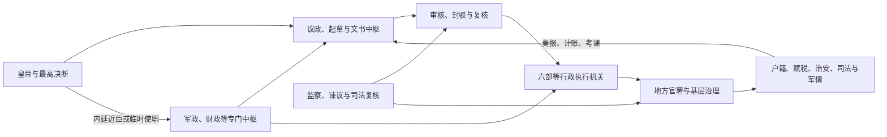

# 中国古代制度

本目录整理中国古代政治制度、中央职官和地方治理。制度史不只是官名沿革：同名机构在不同时代可能拥有不同权力，法定层级也未必等于实际决策链。阅读时应同时追踪皇帝与官僚、中枢与地方、常设机关与临时使职、正式制度与政治惯例。

## 目录

| 分类 | 核心问题 | 入口 |
| --- | --- | --- |
| 政治制度 | 最高权力如何形成、受到何种程序与政治力量约束，中央怎样控制地方。 | [政治制度](/%E4%BA%BA%E6%96%87%E7%A7%91%E5%AD%A6/%E5%8E%86%E5%8F%B2/%E4%B8%9C%E4%BA%9A/%E4%B8%AD%E5%9B%BD/_%E5%88%B6%E5%BA%A6/%E6%94%BF%E6%B2%BB%E5%88%B6%E5%BA%A6/README.md) |
| 中枢与职官 | 政令由谁议决、起草、审核、执行，军政、财政和监察怎样分工。 | [中枢与职官](/%E4%BA%BA%E6%96%87%E7%A7%91%E5%AD%A6/%E5%8E%86%E5%8F%B2/%E4%B8%9C%E4%BA%9A/%E4%B8%AD%E5%9B%BD/_%E5%88%B6%E5%BA%A6/%E4%B8%AD%E6%9E%A2%E4%B8%8E%E8%81%8C%E5%AE%98/README.md) |
| 地方行政区划 | 行政区、监察区、军区和特殊辖区如何叠合，地方官怎样治理基层。 | [地方行政区划](/%E4%BA%BA%E6%96%87%E7%A7%91%E5%AD%A6/%E5%8E%86%E5%8F%B2/%E4%B8%9C%E4%BA%9A/%E4%B8%AD%E5%9B%BD/_%E5%88%B6%E5%BA%A6/%E5%9C%B0%E6%96%B9%E8%A1%8C%E6%94%BF%E5%8C%BA%E5%88%92/README.md) |

## 四个观察维度

| 维度 | 需要辨别的内容 |
| --- | --- |
| 决策与执行 | 皇帝、宰辅、近臣、六部及专门机关分别处于哪一环节；诏令是否经过议论、封驳和复核。 |
| 中央与地方 | 人事任免、财政上供、军队调动、司法复核和信息奏报如何把地方纳入中央体系。 |
| 常制与权宜 | 三公、三省、六部等常设官署之外，内朝、政事堂、使职、内阁、军机处等为何兴起。 |
| 名义与实际 | 尊官可能无实权，低品近臣可能因接近君主而掌机要；地方层级也可能被监察区或军区覆盖。 |

## 制度运行机制

这套结构并非各朝固定不变：当常设机关处理缓慢、权力过重或无法满足战争和财政需要时，君主往往另设近臣或专门机构；新机构成熟后又可能官僚化，形成新的分权与协调问题。

## 阅读提示

- “皇权加强”“中央集权加强”不是同一命题：前者讨论皇帝与中枢官僚，后者讨论中央与地方。
- “分权”既可能是程序性制衡，也可能只是君主把职能拆给若干相互牵制的代理人。
- 行政区、监察区、军区、封国和民族地区管理制度不能机械排成一条统一层级。
- 制度效果取决于财政能力、交通信息、官僚规模、军事压力和具体政治联盟，不能只由官署名称推断。

## 图示

## 直接上级

- [中国](/%E4%BA%BA%E6%96%87%E7%A7%91%E5%AD%A6/%E5%8E%86%E5%8F%B2/%E4%B8%9C%E4%BA%9A/%E4%B8%AD%E5%9B%BD/README.md)
