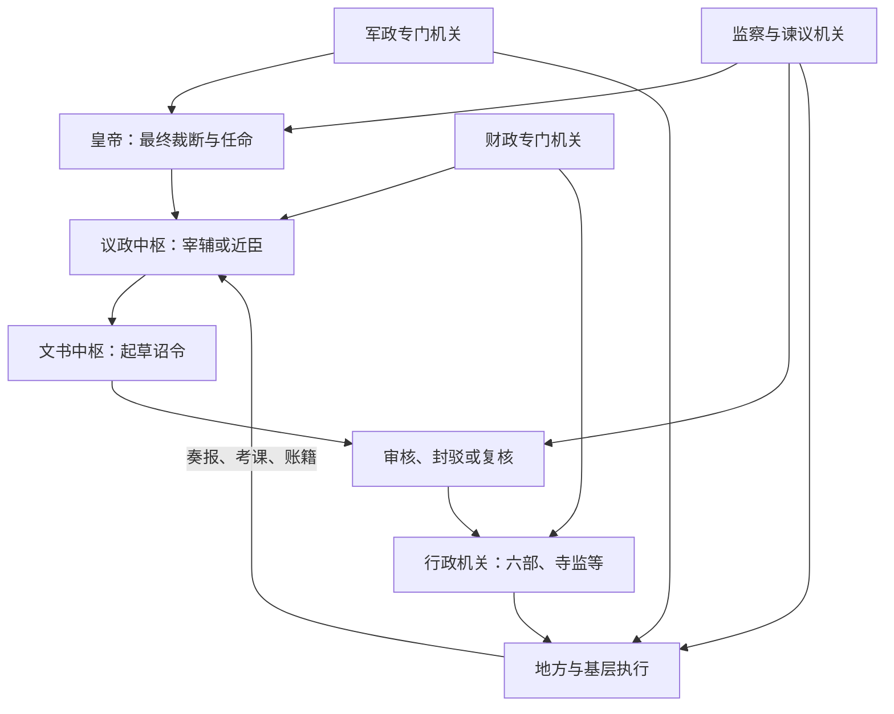

# 中枢与职官

本目录整理中国古代中央官署、官职及其实际权力关系。“中枢”不是一个固定机构，而是处理最高决策、诏令文书、人事、财政、军政与监察的机关组合；机构是否接近皇帝、能否控制文书和任免，往往比品秩高低更能说明其权力。

## 专题笔记

| 专题 | 重点 |
| --- | --- |
| [三省](/%E4%BA%BA%E6%96%87%E7%A7%91%E5%AD%A6/%E5%8E%86%E5%8F%B2/%E4%B8%9C%E4%BA%9A/%E4%B8%AD%E5%9B%BD/_%E5%88%B6%E5%BA%A6/%E4%B8%AD%E6%9E%A2%E4%B8%8E%E8%81%8C%E5%AE%98/%E4%B8%89%E7%9C%81.md) | 诏令起草、审议封驳与行政执行的分工，以及政事堂等实际议政机制。 |
| [六部](/%E4%BA%BA%E6%96%87%E7%A7%91%E5%AD%A6/%E5%8E%86%E5%8F%B2/%E4%B8%9C%E4%BA%9A/%E4%B8%AD%E5%9B%BD/_%E5%88%B6%E5%BA%A6/%E4%B8%AD%E6%9E%A2%E4%B8%8E%E8%81%8C%E5%AE%98/%E5%85%AD%E9%83%A8.md) | 人事、财政、礼教、军政、司法、工程六类政务的常设分工。 |
| [枢密院](/%E4%BA%BA%E6%96%87%E7%A7%91%E5%AD%A6/%E5%8E%86%E5%8F%B2/%E4%B8%9C%E4%BA%9A/%E4%B8%AD%E5%9B%BD/_%E5%88%B6%E5%BA%A6/%E4%B8%AD%E6%9E%A2%E4%B8%8E%E8%81%8C%E5%AE%98/%E6%9E%A2%E5%AF%86%E9%99%A2.md) | 从唐末机要传宣到宋元最高军政机关的职能变化。 |
| [历代中枢机构总览](/%E4%BA%BA%E6%96%87%E7%A7%91%E5%AD%A6/%E5%8E%86%E5%8F%B2/%E4%B8%9C%E4%BA%9A/%E4%B8%AD%E5%9B%BD/_%E5%88%B6%E5%BA%A6/%E4%B8%AD%E6%9E%A2%E4%B8%8E%E8%81%8C%E5%AE%98/%E5%8E%86%E4%BB%A3%E4%B8%AD%E6%9E%A2%E6%9C%BA%E6%9E%84/README.md) | 按朝代比较中枢的法定结构、实际运行与重大转折。 |

## 中枢怎样运转

实际运行有三种反复出现的现象：

1. **内外中枢更替**：秦汉九卿、三公等高官之外，尚书、侍中等近臣因接近皇帝而掌握文书，后来又发展为正式中枢。
2. **决策与行政分合**：三省强调程序分工，宋代把政务、军政、财政分给二府三司，元代则由中书省统领六部；分合取决于当时的控制需求。
3. **常设机关与临时使职并存**：战争、财政或机密事务常催生节度使、三司使、内阁、军机处等新渠道；其权力来自具体授权，不宜仅凭名称类比宰相。

## 判断官职权力的线索

- 能否面见君主并参与议政；
- 能否草拟、封驳、封还或传达诏令；
- 能否任免官员、调兵、支配财政；
- 能否直接指挥地方官署；
- 职权是法定常制、临时差遣，还是依赖皇帝个人信任。

## 直接上级

- [中国古代制度](/%E4%BA%BA%E6%96%87%E7%A7%91%E5%AD%A6/%E5%8E%86%E5%8F%B2/%E4%B8%9C%E4%BA%9A/%E4%B8%AD%E5%9B%BD/_%E5%88%B6%E5%BA%A6/README.md)
