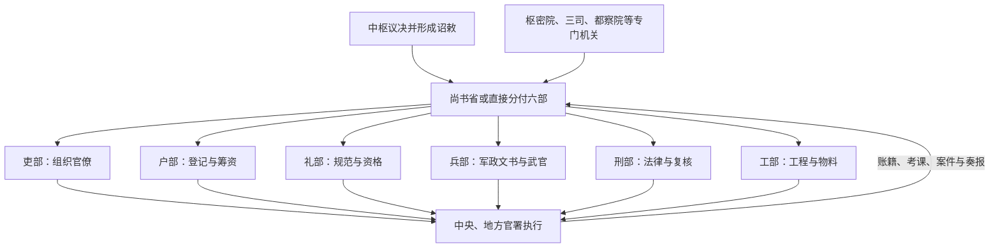

# 六部

六部是中央行政体系中负责吏、户、礼、兵、刑、工六类政务的常设部门。它们由汉魏尚书台分曹逐步发展，隋代整合为六部，唐代随三省六部体制趋于稳定；此后虽隶属关系和实际权限不断变化，“六部”仍长期构成中央行政分工的基本骨架。

正长官通常称**尚书**，副长官称**侍郎**；各部再分若干司，由郎中、员外郎等承办。官名、司数和具体职掌随朝代调整。

## 职掌

| 部门 | 主要职掌 | 需要注意 |
| --- | --- | --- |
| **吏部** | 文官铨选、任免、考课、升降、调动。 | 高级官员仍可能由皇帝、宰辅或其他选授机关决定。 |
| **户部** | 户籍、土地、赋役、财政收支、仓储。 | 盐铁、转运、国库或内廷财政常由另设机构掌管，户部未必垄断全部财权。 |
| **礼部** | 礼制、祭祀、学校、科举、朝会和对外礼仪。 | 礼仪也是确认政治等级与对外关系的制度工具。 |
| **兵部** | 武官选授、兵籍、军令文书、军械和驿传等。 | 实际调兵统军常归皇帝、枢密院、都督府、军机处或前线统帅，兵部不等于现代国防部。 |
| **刑部** | 法律、刑狱和案件复核。 | 明清重大案件常由刑部、大理寺、都察院会审，地方也有逐级审转。 |
| **工部** | 工程营造、水利、交通、屯田、工匠与官府制造。 | 大型宫室、河工或军需工程可能另设专官和临时机构。 |

## 政务怎样进入六部

六部的核心价值不是把国家事务截然分成六块，而是提供稳定的文书流程、专业人员和责任归属。一个事项往往跨部：赈灾涉及户部筹粮、吏部考核地方官、工部修堤、刑部追责；战争同时牵动兵部、户部、工部和专门军事中枢。

## 历代变化

| 时期 | 组织关系 |
| --- | --- |
| 隋唐 | 六部隶尚书省。尚书省承接中书、门下通过的政令，再由各部与寺监执行；六部与九寺五监并非所有事务上的简单上下级。 |
| 宋 | 前期许多实际职能由差遣和三司等机构承担；元丰改制曾按《唐六典》重整三省六部，但运行仍受宋代既有官职、差遣体系影响。 |
| 元 | 六部主要隶中书省；尚书省数次设置又撤销，财政改革时期尤其可能分走中书省职权。 |
| 明 | 1380 年废中书省和丞相后，六部直接承皇帝旨意；内阁票拟提供协调，但不是六部的法定上级。 |
| 清 | 内阁、军机处处理不同层次的文书和机务，六部承办常规行政；晚清新政中陆续改组为近代部制。 |

## 权力边界与结构成本

- 六部掌握日常治理能力，却通常不独占最高政策、军队指挥、全部财政或终审裁断。
- 机构稳定有利于档案、专业和责任传承，也容易形成繁复文书、部门边界争议与办事迟缓。
- 皇帝或宰辅另设使职可以应急，但会造成常设部门与临时机构相互推诿。
- 比较各朝时，应分别看“名义隶属”“实际发令权”和“资金、人员、信息控制权”。
