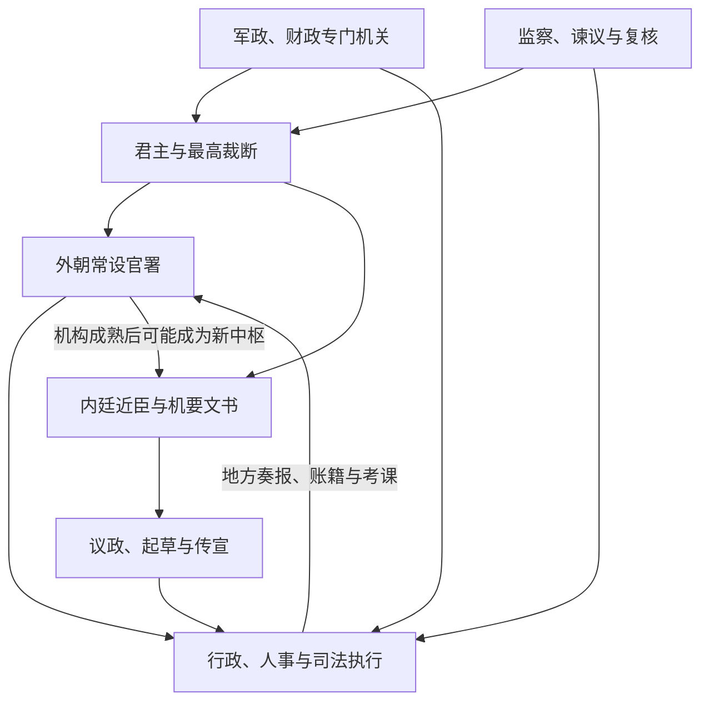

# 历代中枢机构总览

本目录按朝代整理最高决策、政务执行、军政财政和监察体系。官署沿革不能只读成“皇权不断加强”的单线故事：常设机关官僚化后，皇帝常以近臣或使职处理机密；新中枢一旦制度化，又会形成自己的程序、专业和利益。

地方区划另见[历代地方区划](/%E4%BA%BA%E6%96%87%E7%A7%91%E5%AD%A6/%E5%8E%86%E5%8F%B2/%E4%B8%9C%E4%BA%9A/%E4%B8%AD%E5%9B%BD/_%E5%88%B6%E5%BA%A6/%E5%9C%B0%E6%96%B9%E8%A1%8C%E6%94%BF%E5%8C%BA%E5%88%92/%E5%8E%86%E4%BB%A3%E5%9C%B0%E6%96%B9%E5%8C%BA%E5%88%92/README.md)。

## 比较框架

阅读各朝笔记时，可依次判断：

1. 谁能参与最高议政，谁只负责文书或执行；
2. 皇帝是否通过近臣、宦官、外戚、内阁或军机机构绕过常设官署；
3. 政务、军政、财政和监察是集中还是分设；
4. 法定官职、临时差遣和实际政治权力是否一致；
5. 战争、财政危机、继承与派系冲突如何改变制度运作。

## 朝代顺序

| 顺序 | 朝代 / 时期 | 入口 | 中枢机制概括 |
| ---: | --- | --- | --- |
| 1 | 先秦 | [先秦中枢与政治结构](/%E4%BA%BA%E6%96%87%E7%A7%91%E5%AD%A6/%E5%8E%86%E5%8F%B2/%E4%B8%9C%E4%BA%9A/%E4%B8%AD%E5%9B%BD/_%E5%88%B6%E5%BA%A6/%E4%B8%AD%E6%9E%A2%E4%B8%8E%E8%81%8C%E5%AE%98/%E5%8E%86%E4%BB%A3%E4%B8%AD%E6%9E%A2%E6%9C%BA%E6%9E%84/%E5%85%88%E7%A7%A6.md) | 从商周复合统治、贵族政治走向战国君主直属官僚与文书财政体系。 |
| 2 | 秦 | [秦代中枢机构](/%E4%BA%BA%E6%96%87%E7%A7%91%E5%AD%A6/%E5%8E%86%E5%8F%B2/%E4%B8%9C%E4%BA%9A/%E4%B8%AD%E5%9B%BD/_%E5%88%B6%E5%BA%A6/%E4%B8%AD%E6%9E%A2%E4%B8%8E%E8%81%8C%E5%AE%98/%E5%8E%86%E4%BB%A3%E4%B8%AD%E6%9E%A2%E6%9C%BA%E6%9E%84/%E7%A7%A6.md) | 皇帝居最高裁断，丞相、御史及诸卿分掌政务，宫廷与国家事务尚有交叠。 |
| 3 | 西汉 | [西汉中枢机构](/%E4%BA%BA%E6%96%87%E7%A7%91%E5%AD%A6/%E5%8E%86%E5%8F%B2/%E4%B8%9C%E4%BA%9A/%E4%B8%AD%E5%9B%BD/_%E5%88%B6%E5%BA%A6/%E4%B8%AD%E6%9E%A2%E4%B8%8E%E8%81%8C%E5%AE%98/%E5%8E%86%E4%BB%A3%E4%B8%AD%E6%9E%A2%E6%9C%BA%E6%9E%84/%E8%A5%BF%E6%B1%89.md) | 外朝三公九卿延续，尚书、侍中等中朝近臣逐渐参与决策。 |
| 4 | 东汉 | [东汉中枢机构](/%E4%BA%BA%E6%96%87%E7%A7%91%E5%AD%A6/%E5%8E%86%E5%8F%B2/%E4%B8%9C%E4%BA%9A/%E4%B8%AD%E5%9B%BD/_%E5%88%B6%E5%BA%A6/%E4%B8%AD%E6%9E%A2%E4%B8%8E%E8%81%8C%E5%AE%98/%E5%8E%86%E4%BB%A3%E4%B8%AD%E6%9E%A2%E6%9C%BA%E6%9E%84/%E4%B8%9C%E6%B1%89.md) | 尚书台成为日常政务枢纽，三公尊位与实权分离，宫廷势力影响加深。 |
| 5 | 两晋 | [两晋中枢机构](/%E4%BA%BA%E6%96%87%E7%A7%91%E5%AD%A6/%E5%8E%86%E5%8F%B2/%E4%B8%9C%E4%BA%9A/%E4%B8%AD%E5%9B%BD/_%E5%88%B6%E5%BA%A6/%E4%B8%AD%E6%9E%A2%E4%B8%8E%E8%81%8C%E5%AE%98/%E5%8E%86%E4%BB%A3%E4%B8%AD%E6%9E%A2%E6%9C%BA%E6%9E%84/%E6%99%8B.md) | 尚书、中书、门下体系继续成形，门阀、权臣与军府深刻影响实际权力。 |
| 6 | 隋 | [隋代中枢机构](/%E4%BA%BA%E6%96%87%E7%A7%91%E5%AD%A6/%E5%8E%86%E5%8F%B2/%E4%B8%9C%E4%BA%9A/%E4%B8%AD%E5%9B%BD/_%E5%88%B6%E5%BA%A6/%E4%B8%AD%E6%9E%A2%E4%B8%8E%E8%81%8C%E5%AE%98/%E5%8E%86%E4%BB%A3%E4%B8%AD%E6%9E%A2%E6%9C%BA%E6%9E%84/%E9%9A%8B.md) | 三省分理诏令与行政，六部承担常务，统一王朝重整官制。 |
| 7 | 唐 | [唐代中枢机构](/%E4%BA%BA%E6%96%87%E7%A7%91%E5%AD%A6/%E5%8E%86%E5%8F%B2/%E4%B8%9C%E4%BA%9A/%E4%B8%AD%E5%9B%BD/_%E5%88%B6%E5%BA%A6/%E4%B8%AD%E6%9E%A2%E4%B8%8E%E8%81%8C%E5%AE%98/%E5%8E%86%E4%BB%A3%E4%B8%AD%E6%9E%A2%E6%9C%BA%E6%9E%84/%E5%94%90.md) | 三省六部与政事堂运行，后期翰林、内枢密使和诸使分走机要与专门事务。 |
| 8 | 宋 | [宋代中枢机构](/%E4%BA%BA%E6%96%87%E7%A7%91%E5%AD%A6/%E5%8E%86%E5%8F%B2/%E4%B8%9C%E4%BA%9A/%E4%B8%AD%E5%9B%BD/_%E5%88%B6%E5%BA%A6/%E4%B8%AD%E6%9E%A2%E4%B8%8E%E8%81%8C%E5%AE%98/%E5%8E%86%E4%BB%A3%E4%B8%AD%E6%9E%A2%E6%9C%BA%E6%9E%84/%E5%AE%8B.md) | 二府三司分理政、军、财，元丰改制后名制复古而运行继续调整。 |
| 9 | 元 | [元代中枢机构](/%E4%BA%BA%E6%96%87%E7%A7%91%E5%AD%A6/%E5%8E%86%E5%8F%B2/%E4%B8%9C%E4%BA%9A/%E4%B8%AD%E5%9B%BD/_%E5%88%B6%E5%BA%A6/%E4%B8%AD%E6%9E%A2%E4%B8%8E%E8%81%8C%E5%AE%98/%E5%8E%86%E4%BB%A3%E4%B8%AD%E6%9E%A2%E6%9C%BA%E6%9E%84/%E5%85%83.md) | 中书省、枢密院、御史台分掌政务、军政与监察，并与宫廷、诸王体系并存。 |
| 10 | 明 | [明代中枢机构](/%E4%BA%BA%E6%96%87%E7%A7%91%E5%AD%A6/%E5%8E%86%E5%8F%B2/%E4%B8%9C%E4%BA%9A/%E4%B8%AD%E5%9B%BD/_%E5%88%B6%E5%BA%A6/%E4%B8%AD%E6%9E%A2%E4%B8%8E%E8%81%8C%E5%AE%98/%E5%8E%86%E4%BB%A3%E4%B8%AD%E6%9E%A2%E6%9C%BA%E6%9E%84/%E6%98%8E.md) | 废丞相后皇帝直辖六部，内阁票拟与宦官批红成为重要运行环节。 |
| 11 | 清 | [清代中枢机构](/%E4%BA%BA%E6%96%87%E7%A7%91%E5%AD%A6/%E5%8E%86%E5%8F%B2/%E4%B8%9C%E4%BA%9A/%E4%B8%AD%E5%9B%BD/_%E5%88%B6%E5%BA%A6/%E4%B8%AD%E6%9E%A2%E4%B8%8E%E8%81%8C%E5%AE%98/%E5%8E%86%E4%BB%A3%E4%B8%AD%E6%9E%A2%E6%9C%BA%E6%9E%84/%E6%B8%85.md) | 议政王大臣会议、内阁、军机处前后消长，六部承办常务，奏折强化机密信息链。 |

## 关键转折

| 转折 | 制度意义 |
| --- | --- |
| 战国官僚化 | 君主任免的官吏、郡县、户籍和财政体系取代部分世袭贵族职能。 |
| 汉代内外朝 | 低品近臣因控制文书与接近皇帝而进入中枢，成为后世内廷转外朝的典型。 |
| 隋唐三省六部 | 决策、审核、执行更程序化，但政事堂等协调机制同样重要。 |
| 唐宋使职化 | 战争和财政促成专门使职，宋代又把其中部分制度化为二府三司。 |
| 明代废相 | 皇帝承担更重的综合裁决，内阁以票拟弥补协调需求，却无独立法定决策权。 |
| 清代军机处 | 以小规模机要班子承旨，提高保密和速度，同时使权力更依赖皇帝个人运作。 |

## 上级

- [中枢与职官](/%E4%BA%BA%E6%96%87%E7%A7%91%E5%AD%A6/%E5%8E%86%E5%8F%B2/%E4%B8%9C%E4%BA%9A/%E4%B8%AD%E5%9B%BD/_%E5%88%B6%E5%BA%A6/%E4%B8%AD%E6%9E%A2%E4%B8%8E%E8%81%8C%E5%AE%98/README.md)
- [中国古代制度](/%E4%BA%BA%E6%96%87%E7%A7%91%E5%AD%A6/%E5%8E%86%E5%8F%B2/%E4%B8%9C%E4%BA%9A/%E4%B8%AD%E5%9B%BD/_%E5%88%B6%E5%BA%A6/README.md)
