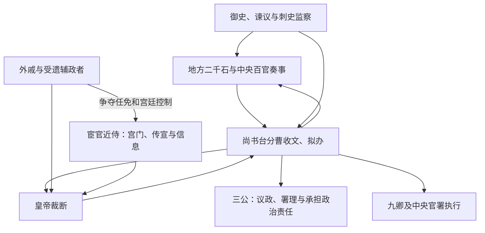

# 东汉中枢机构

东汉恢复汉制后，三公九卿仍是法定高层，但尚书台成为处理奏章、起草诏令和分付百官的实际政务枢纽。三公拥有高位、议政和问责功能，日常行政却越来越通过尚书台运行。宫廷近侍、外戚和宦官能够凭借接近皇帝及控制文书进入中枢，这既强化了皇帝对外朝的控制，也使幼主继承时的宫廷斗争更尖锐。

## 机构与职能

| 机构 / 官职 | 主要职能 | 实际地位 |
| --- | --- | --- |
| 太傅 | 位尊，常在重大辅政时设置。 | 可因受遗、外戚或个人威望掌权，不是常规日常行政首长。 |
| 太尉、司徒、司空 | 分掌军政名义、教化民政和水土营建等，并议论国政。 | 常被灾异策免，政治责任重；具体行政权不及尚书台集中。 |
| 九卿 | 礼仪、宿卫、司法、财政、宗室和属国等常务。 | 各卿机关仍运行，但奏事与诏令多经尚书台。 |
| 尚书台 | 收受章奏、起草传达诏令、分曹处理政务。 | 名义上与宫廷关系密切，实际上成为全国行政文书中心。 |
| 御史台 | 纠察官吏与监察。 | 与谏议、尚书考课及地方刺史共同构成监督网络。 |
| 侍中、中常侍等 | 宫廷侍从、顾问与传宣。 | 因能接近皇帝而可能介入决策；中常侍由宦官担任。 |

## 尚书台运行

尚书令统台事，仆射协助，下设诸曹。东汉尚书六曹常概括为三公曹、吏曹、民曹、客曹及二千石曹等，具体名称与分合有时期差异。它们按事务承接奏章，把皇帝裁断转成可执行文书，再送交三公、九卿和地方官署。

## 发展阶段

- **光武、明章时期**：重建中央秩序，尚书台承担大量实际政务，皇帝以近臣文书系统驾驭三公。
- **和帝以后**：多位皇帝幼年即位，皇太后临朝与外戚辅政反复出现；皇帝亲政时又常借宦官清除外戚。
- **桓灵时期**：宦官集团、士大夫官僚和外戚冲突加剧，党锢之祸破坏政治信任与人才网络。
- **末期危机**：黄巾起义后地方军政授权扩大，188 年重置州牧加深地方实力，董卓入京及军阀割据使中央官制失去统一执行基础。

## 权力关系与结构代价

尚书台提高了政令处理和皇帝控制效率，却没有解决继承与摄政问题。幼主无法亲裁时，谁控制宫禁、尚书文书和人事任免，谁就可能掌握实际中枢。三公频繁因灾异或政治责任被罢免，强化问责表象，却也使高官难以形成稳定政策能力。东汉末的崩溃不能只归因于宦官或外戚，财政军事压力、地方豪强、继承结构和授权地方武力共同作用。

## 图示

