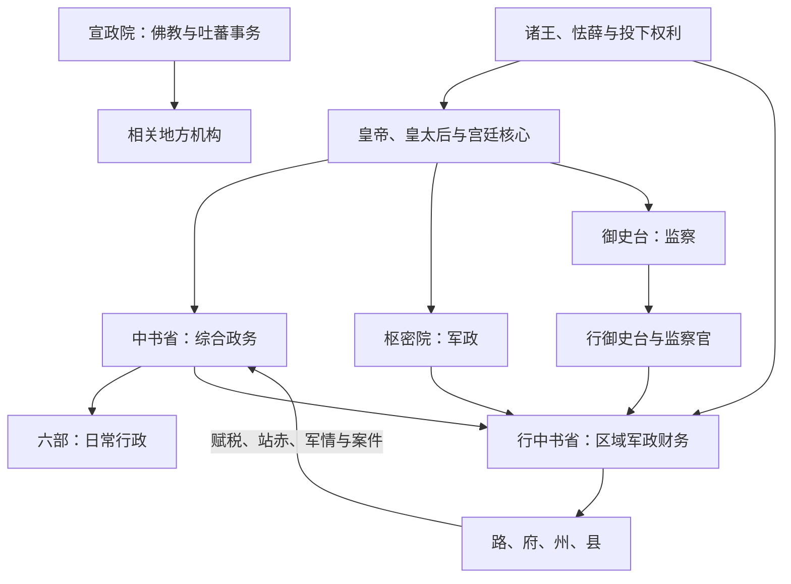

# 元代中枢机构

元代以中书省、枢密院、御史台分掌政务、军政与监察，六部隶中书省，是对宋金制度和蒙古帝国统治传统的重新组合。宫廷怯薛、诸王封地、宣政院等系统与汉地官僚并存，实际权力受皇帝、皇太后、皇族、近臣和丞相政治影响，不能只按“三大中央机关”理解。

## 核心机关

| 机构 | 主要职掌 | 实际边界 |
| --- | --- | --- |
| 中书省 | 总理全国行政，统领吏、户、礼、兵、刑、工六部。 | 中书令常由皇太子兼领或虚位，右、左丞相及平章政事等处理实际政务；中央直辖腹里，也节制行中书省。 |
| 枢密院 | 掌军政、军令与军籍。 | 与蒙古军队、诸王军府、行枢密院等互动，未必能完全统一所有军事力量。 |
| 御史台 | 监察百官，设行御史台扩大区域监察。 | 可纠察中书与地方官，但独立性仍取决于皇帝支持和政治派系。 |
| 六部 | 分掌常规行政。 | 主要隶中书省；尚书省设置时期，部分职权会转移。 |
| 宣政院 | 管理全国佛教事务，并统辖吐蕃地区相关军民政务。 | 是针对宗教与边疆的特殊中枢，不能当作普通六部之一。 |
| 怯薛与宫廷近臣 | 皇帝宿卫、侍从和内廷服务。 | 部分成员凭亲近关系进入中书、枢密等高位，宫廷与官僚系统相互渗透。 |

## 中央与行省的权力链

行省最初具有中书省派出机关性质，后来成为相对稳定的高层区域政府。其长官由中央任命、多人共署，军政财权较广，却仍受中央命令、枢密军事体系和监察机关约束。它不是现代联邦成员，也不是完全自主的地方政权。

## 制度形成与调整

- **世祖时期**：忽必烈建立元朝后，在蒙古帝国制度上采用中书、枢密、御史等官署；1260—1270 年代逐步完善中央与行省体系。
- **尚书省反复设置**：财政改革或权臣主政时曾另设尚书省，试图分理或接管中书省事务，旋因政治斗争撤销，显示一省制并非始终不变。
- **族群与任官**：蒙古、色目、汉人、南人等法律与政治分类影响任官和社会机会，但具体职位也受怯薛出身、科举、荐举、吏员、军功和家族关系影响。
- **科举恢复**：1315 年正式举行元代科举，扩大儒士入仕渠道，但录取规模有限，不能代表全部官僚来源。
- **财政军政压力**：纸币、盐课、漕运、站赤和军费是中枢重点；改革常因通货、赋役与利益冲突反复。

## 实际运作与结构成本

中书省集中政务，便于跨广大疆域统一文书与财政；行省则给区域长官处理军情、运输和民族事务的空间。多人共署、监察和中央派员旨在防止地方专权，却可能造成责任不清。诸王封地、寺院权益、军户民户差异和各类投下税收，使同一地域上存在重叠权利，增加基层负担与行政复杂度。

## 衰落因素

元末危机由多重因素叠加：皇位继承频繁、宫廷与丞相派系争斗削弱政策连续性；黄河水患与治河征发触发社会压力；货币贬值、财政失衡和差役不均损害统治信用；红巾军等反抗扩展后，地方武装和行省将领的自主性上升。行省制本身既提供了危机处置能力，也让掌握区域军政者在中央衰弱时拥有独立行动条件。

## 图示

