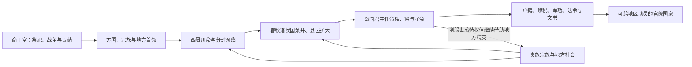

# 先秦中枢与政治结构

先秦横跨早期王朝、商周复合统治和春秋战国国家转型，不能用一套固定“中央官制”概括。传统文献关于夏及更早禅让、世袭的记载带有后世政治叙事色彩；商代甲骨、金文与考古材料能够更具体地显示王室、贵族、方国、祭祀和战争网络。战国时期，各国为持续战争与资源动员，发展出君主任免的官僚、郡县、户籍、赋税和成文法，成为秦汉帝国制度的重要来源。

## 主要阶段

| 时期 | 权力结构 | 运行方式 |
| --- | --- | --- |
| 夏及传统早期王朝叙事 | 王位世袭逐渐取代联盟推举。 | 父子相传与兄终弟及并见；具体制度和年代仍有争议，不宜把后世官名直接套入。 |
| 商 | 商王、王族贵族与方国构成内外有别的统治网络。 | 王室通过祭祀、征伐、贡纳、婚姻和册命联系方国；“内外服”是后世概括，不等于边界清晰的两级行政制。 |
| 西周 | 王室、宗法贵族和受封诸侯组成多层政治秩序。 | 册命、宗庙礼制、朝觐贡赋与军事义务维系关系；卿士、太史、司徒、司马、司空等官职兼有家臣与公共职务色彩。 |
| 春秋 | 周王室权威下降，诸侯国内卿族和新兴官僚并存。 | 大国扩张、兼并和县邑设置改变旧封建网络，执政卿族有时压过国君。 |
| 战国 | 君主直属官僚制、郡县制和军功爵制发展。 | 相、将分职，中央官署、地方守令、户籍税役和法令文书加强，官位日益依任命和考核而非单纯世袭。 |

## 从复合统治到官僚国家

这一转型并不是“分封一夜之间被郡县取代”。许多国家长期让封君、贵族食邑与郡县并存；县的起源、郡县先后关系也因国家和地区而异。决定性变化是君主能够跨越世袭中间层，任免官员、登记人口、征发兵役并直接取得财政资源。

## 中枢职能的形成

- **议政与行政**：相或相邦等官逐渐统筹百官，但权力取决于君主任命和具体政治格局。
- **军事**：将、尉及军功爵体系把作战、征兵和奖惩纳入国家管理，长期战争推动行政扩张。
- **财政与文书**：户籍、田制、税役、仓储、符节和文书传递使政令能够跨地域执行。
- **司法与监察**：成文法、官吏考核和上计制度逐渐发展，地方官需向中央报告人口、赋税和治安。
- **人才来源**：游士、客卿和受教育的文吏跨国流动，扩大了统治集团，但宗族和门第仍未消失。

## 改革、成效与代价

战国变法常把县制、军功爵、编户、连坐、统一度量和官吏考核结合起来，增强了征税、征兵和后勤能力，也加重了国家对家庭与基层社会的渗透。高强度动员有利于兼并战争，却可能造成徭役、刑罚和军役负担。秦制度并非凭空创造，而是把多个战国国家已有实践重新组合并推向帝国规模。

## 图示

