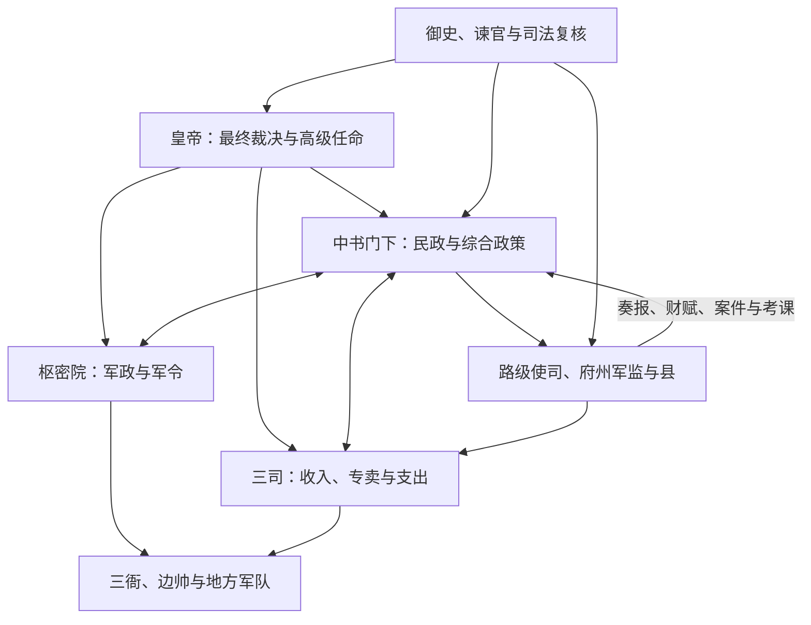

# 宋代中枢机构

宋代在五代军事政权的制度基础上重建中央秩序，形成政务、军政、财政相对分设的“二府三司”。中书门下与枢密院合称二府，三司统理主要财政；皇帝借参知政事、枢密长贰、御史谏官和多条文书渠道协调并牵制各机构。1080 年代元丰改制恢复三省六部名制，但实际运行继续变化，不能把整个宋代固定为一张组织图。

## 北宋前期的二府三司

| 机构 | 职掌 | 运行特点 |
| --- | --- | --- |
| 中书门下 | 处理政务，长官通常为同中书门下平章事。 | 宰相与参知政事合议；堂后官、文书机构和皇帝批答共同决定行政节奏。 |
| 枢密院 | 处理军政、军令、武官和边防机务。 | 与中书门下并列；发令、统兵和筹饷分别由不同机构承担。 |
| 三司 | 盐铁、度支、户部三部合成的中央财政机构。 | 三司使号称“计相”但不是宰相；掌税赋、专卖、转运和支出等，具体分工多次调整。 |
| 参知政事 | 宰相副职或执政官。 | 太祖时设置，后来参与都堂议政、押班和知印，实际权力因时期与人事而异。 |
| 御史台、谏院 | 监察和谏议。 | 台谏可论列宰执与政策，既是监督机制，也会成为派系政治的重要场域。 |

“宰执”泛指宰相、参知政事以及枢密院长贰等高级执政官，反映军政与民政虽分署，仍需共同议决。

## 政、军、财的协调

分设的目标不是让三者互不往来，而是避免宰相或将领独占政、军、财。战争或改革事项仍需二府与财政机关协调，皇帝经常主持或裁定分歧。

## 官、职、差遣

宋代官名、品秩、职名与实际差遣长期分离：一个人可能拥有表示俸禄品级的寄禄官、表示文学荣誉的馆职，再以“知州”“转运使”等差遣实际任事。这样便于调动和防止地方职位世袭化，却使任官体系复杂，产生候阙、迁转和名实难辨等成本。科举扩大了文官来源，但荫补仍让大量官员入仕，军职也有自己的等级和任用系统。

## 重大调整

| 时期 | 调整 |
| --- | --- |
| 太祖、太宗时期 | 收藩镇兵权、财权与任官权，派文臣知州并设通判监督；禁军和中央财政扩大。 |
| 真宗、仁宗时期 | 二府三司与台谏运行趋于制度化，官僚规模、财政事务和边防负担同时增长。 |
| 神宗元丰改制 | 1080 年代按三省六部名制重整中央官署，以尚书左右仆射兼门下、中书侍郎为宰相，三司主要职能归户部等；旧有差遣逻辑并未完全消失。 |
| 北宋末至南宋 | 战争、和战决策与财政动员改变二府关系；1129 年以后宰相官名再调，南宋又形成左右丞相、参知政事等配置。 |

## 制度能力与结构成本

宋代拥有高度发达的文书、财政、司法和考试体系，中央能从盐茶专卖、商税和农业税取得庞大收入，并通过路级使司管理地方。相应代价是官僚与军费负担沉重、机构交叉和决策链较长。把宋代军事困境单纯归因于“重文轻武”或“分权过度”并不充分；北方强敌、兵源训练、后勤、财政、战略和不同阶段的军制变化都应纳入分析。

## 改革与危机

王安石变法试图以青苗、免役、市易、保甲等措施增强财政军事能力，引发对国家介入程度、政策执行和地方负担的激烈争论。新旧党争既有理念差异，也涉及人事和政策网络。靖康之变直接暴露边防决策、联盟战略与军事组织问题；南宋迁都后仍凭财政、海运和官僚体系维持一个半世纪，说明制度既有脆弱处也具韧性。

## 图示

