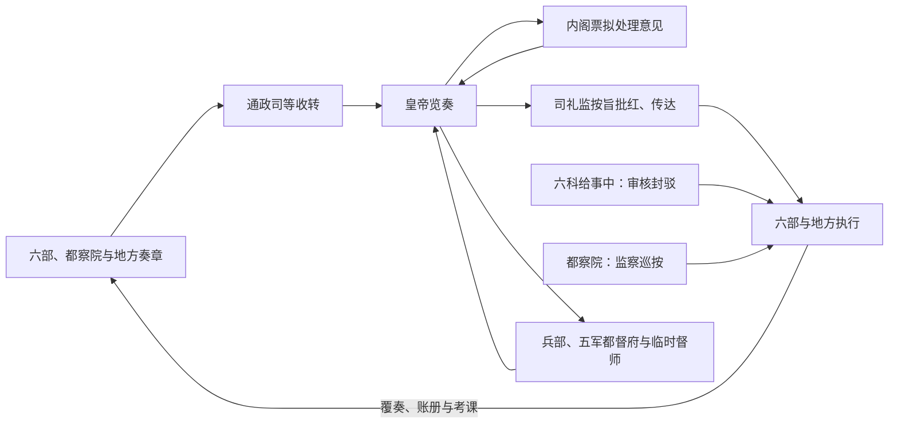

# 明代中枢机构

明初沿用中书省和丞相，总领六部。洪武十三年（1380 年）胡惟庸案后，朱元璋废中书省、罢丞相，六部直接向皇帝负责。此后内阁以顾问和票拟补充综合协调，司礼监等宦官机构掌握文书批红与传达；明代中枢因而不是“六部制取代三省六部制”，而是皇帝、内阁、六部、都察院、军事机关和内廷文书系统的组合。

## 主要机构

| 机构 | 职掌 | 权力边界 |
| --- | --- | --- |
| 皇帝 | 最终决策、任免、军令、司法与批答。 | 废相后需直接面对大量奏章；是否勤政、授权方式及宫廷信息渠道显著影响运作。 |
| 内阁 | 大学士入值文渊阁等处，顾问、草诏，后形成票拟。 | 不是法定宰相机关，无独立发令权；首辅权势来自皇帝信任、票拟、人事网络和与司礼监关系。 |
| 六部 | 吏、户、礼、兵、刑、工分掌常务，直接承旨。 | 各部尚书可独立奏事；内阁通常协调而非正式统辖六部。 |
| 都察院与六科 | 监察百官、巡按地方；六科给事中审核与封驳部院文书。 | 可监督执行并参与政治争论，也受皇权和派系影响。 |
| 五军都督府、兵部 | 都督府偏军籍与统军体系，兵部偏军政文书、武官和调发。 | 出征仍由皇帝临时任命总兵、督师等，军令与统兵分离而多头。 |
| 司礼监 | 宫廷宦官机构，掌奏章传递、批红等。 | 批红原则上代皇帝执行；皇帝怠政或高度信任宦官时，掌印、秉笔太监影响显著扩大。 |

## 奏章与诏令流程

票拟是内阁提出的批答草案，批红是以朱笔写定皇帝旨意。二者使废相后的庞大文书能够分流，但最终法理权力仍在皇帝。实际中，票拟是否采纳、奏章是否如实到达以及谁掌批红，决定了内阁、宦官和部院的相对影响。

## 形成与阶段变化

- **洪武时期**：1380 年以前中书省总政；废相后设殿阁大学士备顾问，品秩与权力起初有限，皇帝亲自裁决。
- **永乐至宣德**：大学士入内阁参与机密，皇帝又倚重宦官处理传宣；内阁和司礼监的互补结构逐渐形成。
- **正统以后**：票拟制度趋于成熟，首辅可能协调六部和人事，但没有稳定的法定宰相权。土木之变显示军事决策、亲征和内廷影响的风险。
- **嘉靖至万历**：严嵩、张居正等首辅凭皇帝授权拥有强大协调能力；张居正整顿考成与财政，死后政策迅速反转，显示权力的个人依附。
- **晚明**：皇帝、内阁、言官、宦官与地方督抚冲突加剧；辽东军费、财政短缺、灾荒和农民战争使常规行政承压。

## 中央与社会权力

科举是文官主要来源，但举业网络、座主门生、乡绅和家族资源影响仕途。内阁没有自己的完整行政属官，必须借六部、科道和私人政治网络落实政策。宦官则可通过宫廷、厂卫与镇守系统获取信息和执行任务。两者都填补皇帝直接统辖百官的协调缺口，也可能造成信息垄断与派系冲突。

## 制度成效与结构成本

废相减少了法定宰相集权和篡夺风险，却把综合决策负担集中于皇帝；内阁虽恢复政策整合，却权责不完全对称。科道监督提高纠错能力，也可能把政策争议道德化、派系化。军政上分割兵部、都督府、总兵和督抚有助防止武将专权，战时则需反复协调。明亡由财政税制、气候灾害、边疆战争、军队供饷、农民起义、继承与党争等共同造成，不能只用“废丞相”解释。

## 图示

