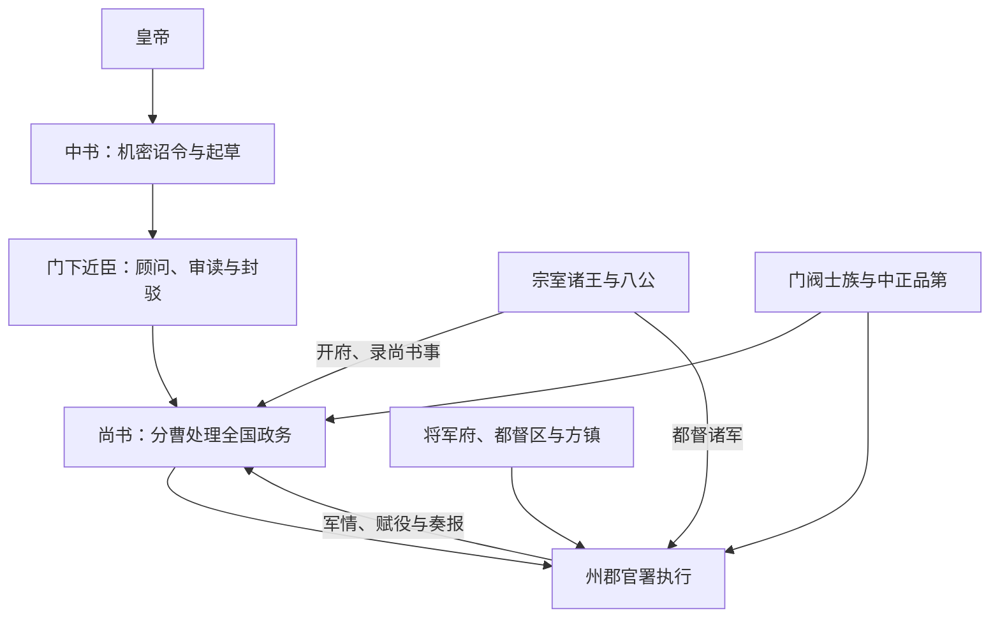

# 两晋中枢机构

两晋承接曹魏以来的尚书、中书和门下近侍体系，但“三省制”尚在形成，并非隋唐式固定分工的简单前身。西晋的宗室诸王、八公等高位官，东晋的门阀士族、录尚书事与都督军府，都可能比法定官署更有实际权力。理解两晋中枢，需要把官制、选官、宗室与军事授权放在一起。

## 中央机构

| 机构 / 官职 | 职掌与地位 |
| --- | --- |
| 八公 | 太宰、太傅、太保、太尉、司徒、司空、大司马、大将军。多为尊官或加给权臣、宗王的高位，实权取决于是否开府、录尚书事、都督军事等附加授权。 |
| 尚书台 / 尚书省 | 汇集中央与地方日常政务，分曹处理人事、财政、军事、民政与礼仪；尚书令、仆射及录尚书事者地位重要。 |
| 中书省 | 曹魏以来掌机密诏令、文书起草并参与议政；西晋延续，常成为皇帝或权臣控制决策的通道。 |
| 门下机构 | 侍中、给事黄门等近臣掌顾问、审读和封驳；东晋时期“门下省”名称与组织逐渐明确，不能把全晋都按唐制理解。 |
| 御史台 | 纠察百官、维护朝廷秩序，也服务于君主和权臣的政治控制。 |
| 九卿 | 继续掌礼仪、宗室、司法、财政等事务，但在综合政务中的地位低于尚书系统。 |

## 名义官制与实际权力

“录尚书事”使受任者总领尚书政务，“都督诸军事”使其控制跨州军事；二者常与太傅、大司马、大将军等尊号结合。因此只看八公或三省名册，无法判断谁在掌权。

## 阶段变化

| 阶段 | 运行特征 |
| --- | --- |
| 西晋建立与统一 | 司马氏以宗室封王和军事授权巩固政权，同时沿用曹魏官僚；280 年统一后中枢需处理全国整合。 |
| 八王之乱 | 惠帝时期皇后、外戚和诸王轮流控制皇帝、尚书与军队。宗室分封本意是屏藩，却因都督兵权和继承危机演变为内战。 |
| 永嘉乱后 | 中央军事与财政基础崩解，北方政权并起；晋室南渡后依赖江南地方与侨姓士族。 |
| 东晋门阀政治 | 王导、庾亮、桓温、谢安等家族或权臣借录尚书事、都督和军府掌权，皇帝、士族与方镇维持不稳定平衡。 |

## 选官与社会权力

九品中正制由地方中正品评人才，原意包含整合官员资格，长期运行中门第、乡品与官位紧密相连。高门士族凭婚姻、文化资本和仕宦网络控制中高级职位，寒门仍可通过军功、文吏和皇权提拔上升，但机会不均。东晋朝廷还需借侨州郡县与土断处理南渡人口，制度运行深受户籍和地方利益牵动。

## 成效、危机与认识

三套文书行政机关逐渐分工，为隋唐制度提供重要遗产；但两晋并未形成稳定的程序制衡。宗室军事化、门阀垄断、方镇坐大、财政人口流失和外部战争相互作用。将西晋灭亡简单归因于“分封”或把东晋概括为“三省八公制”，都会遮蔽实际权力依附于军队、家族和具体授权的事实。

## 图示

