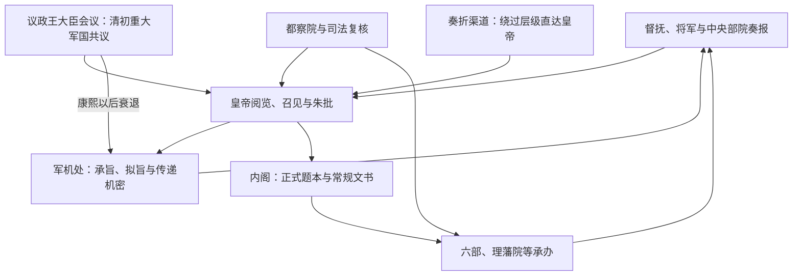

# 清代中枢机构

清代中枢由满洲军事贵族议政传统、明制内阁六部和皇帝近臣机要机构叠合而成。清初议政王大臣会议参与重大军国事务，内阁处理正式题本与日常政务；雍正年间军机处兴起后，机要军政与奏折处理更多集中到皇帝和少数军机大臣。六部、都察院、理藩院等仍承担大量行政，不能把军机处理解为取代全部政府的“新宰相府”。

## 主要机构

| 机构 | 主要职掌 | 实际运行 |
| --- | --- | --- |
| 皇帝 | 最高决策、任免、军令、司法复核和礼制中心。 | 通过召见、奏折、朱批、军机处和内阁等多条渠道掌握信息；个人工作方式影响尤其显著。 |
| 议政王大臣会议 | 清初由宗室、旗主与重臣参与重大军政。 | 延续满洲贵族共议传统，康熙以后作用下降，乾隆时正式停止。 |
| 内阁 | 大学士处理正式文书、票拟及典章事务。 | 大学士位高，但机要决策逐渐转向南书房、军机处等近臣机构；内阁仍维持常规政务。 |
| 军机处 | 承旨办理机要军政、拟写谕旨、传递奏折与记录档案。 | 约 1729 年因西北军务设军机房，1732 年定名办理军机处；军机大臣无独立法定决策权。 |
| 六部 | 吏、户、礼、兵、刑、工承办常务。 | 堂官常有满汉复职，实际并非所有层级完全平权；部务受军机、内阁和皇帝批示协调。 |
| 理藩院 | 管理蒙古、西藏等藩部事务及相关制度。 | 与地方驻扎大臣、盟旗和宗教政治机构共同运作，不能视作普通外交部。 |
| 都察院、大理寺等 | 监察、司法复核与重大案件会审。 | 地方案件逐级审转，死刑等重大裁判由中央和皇帝复核。 |

## 机要与常规双轨

密折与朱批使皇帝能绕过一般题本层级获取地方信息，并比较不同官员报告；它提高保密和监督能力，也可能造成信息过度集中、官员揣摩上意和正式机关事后奉行。

## 形成过程

- **入关前后**：八旗制度兼具军事、社会与政治功能，议政王大臣会议体现宗室旗主共议；内三院等文书机构吸收汉地官僚经验。
- **顺治、康熙时期**：内三院改组为内阁，六部与都察院依明制调整；康熙使用南书房近臣起草机密文书，逐步削弱议政会议。
- **雍正时期**：养心殿近臣、密折和军机处结合，缩短西北军情传递并加强皇帝对督抚、部院的直接控制。
- **乾隆以后**：军机处成为常设机要中枢，议政王大臣会议退出；军机大臣来源和权势仍随皇帝信任变化。
- **晚清新政**：总理各国事务衙门、外务部、巡警部等近代机构陆续设立；1906 年官制改革与 1911 年责任内阁尝试改变旧中枢，但未能在清亡前完成稳定转型。

## 满汉、旗民与边疆治理

中央高官常设满汉复职或兼用，但旗人特权、语言和宫廷网络使机会并非对称。八旗、绿营及后来新军分属不同军制；军机处处理战略，兵部管常规军政，实际统兵在将军、都统、督抚和前线统帅。省制主要适用于内地，蒙古盟旗、西藏驻藏大臣体系、新疆军府后改省等各有制度，中央集权并不等于全国治理完全同质化。

## 制度能力与成本

军机处规模小、保密强、传递快，配合奏折可形成高效的信息—决策链；六部和地方官僚则提供常规执行与档案能力。代价是军机大臣权力依赖个人信任、正式责任边界不清，复杂政策容易集中到皇帝一人。多元边疆制度具有适应性，也造成法律、财政和行政差异。

## 衰落与转型

十九世纪内外战争、赔款军费、财政分散和地方练军改变中央—地方关系；太平天国战争后督抚与地方税源、军队联系加强。洋务与新政增设机构，却使旧衙门、新部门、地方督抚和列强条约权利交错。清亡不能简单归因于“军机处强化专制”，还包括全球军事技术差距、财政制度、地方军事化、民族政治、改革失序和革命动员等因素。

## 图示

